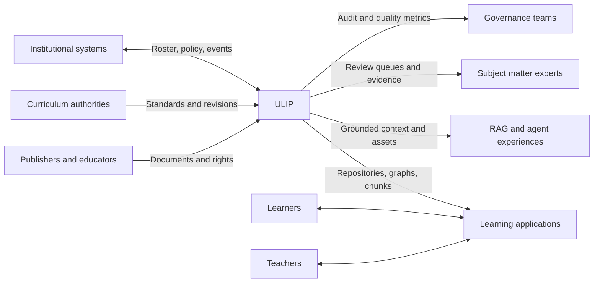
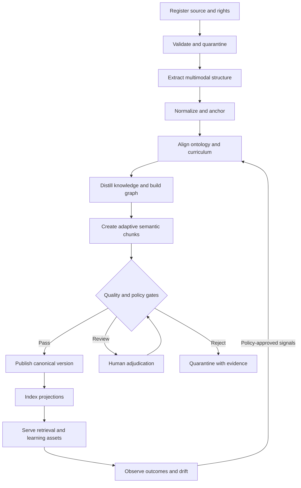

# ULIP System Vision

## 1. Purpose

The Universal Learning Intelligence Platform (ULIP) converts educational source material into governed, traceable, machine-actionable learning intelligence. It accepts PDF, EPUB, DOCX, PPT/PPTX, TXT, Markdown, and HTML, then produces:

- canonical knowledge repositories;
- educational ontologies and typed knowledge graphs;
- concept-complete semantic chunks and vector indexes;
- learning objectives, competencies, misconceptions, and assessment assets;
- adaptive learning and learning-path inputs;
- grounded retrieval-augmented generation (RAG) context.

ULIP serves formal and informal learning across Class 1-12, CBSE, ICSE, State Boards, JEE, NEET, UPSC, higher education, professional domains, languages, life skills, DIY, creativity, and experiential learning.

This document establishes product intent, system boundaries, architectural principles, success measures, and trust requirements. Component decomposition is specified in [Platform Architecture](02_platform_architecture.md).

## 2. Product Outcomes

ULIP exists to make heterogeneous educational content:

1. **Discoverable:** learners and applications can find content by concept, outcome, level, curriculum, language, and modality.
2. **Interoperable:** every asset has a stable identity, explicit schema, version, provenance, and machine-readable relationships.
3. **Instructionally useful:** outputs preserve prerequisite structure, pedagogical intent, misconceptions, examples, and assessment opportunities.
4. **Grounded:** generated material can be traced to source evidence and transformation history.
5. **Adaptive:** content can be selected using learner state, mastery evidence, accessibility needs, and instructional goals.
6. **Safe and governable:** privacy, licensing, safety, and quality controls apply throughout ingestion and serving.

ULIP is not merely a document search engine. Its unit of value is a verified learning asset linked to evidence, curriculum meaning, and learner purpose.

## 3. Stakeholders

| Stakeholder | Primary need | ULIP obligation |
|---|---|---|
| Learner | Accurate, accessible, level-appropriate learning | Grounded responses, clear uncertainty, safe adaptation |
| Teacher or faculty | Trustworthy material aligned to instruction | Inspectable sources, editable mappings, quality indicators |
| Curriculum expert | Consistent standards and competency mapping | Versioned ontology, review workflows, impact analysis |
| Assessment designer | Valid items tied to outcomes and evidence | Blueprint coverage, difficulty evidence, misconception links |
| Content owner or publisher | Controlled use of licensed content | Rights metadata, tenant isolation, revocation, auditability |
| Institution | Reliable operation and measurable outcomes | Availability, governance, integrations, observability |
| Application developer | Stable APIs and predictable contracts | Versioned schemas, idempotency, compatibility guarantees |
| Platform operator | Safe, efficient, supportable services | SLOs, capacity controls, diagnostics, replay and recovery |
| Auditor or regulator | Evidence of compliance and decisions | Immutable lineage, access history, policy versions |

## 4. Scope

### 4.1 In scope

- Binary and text document intake, validation, malware scanning, rights capture, and immutable source storage.
- Layout, text, table, image, equation, diagram, and structural extraction.
- Language identification, OCR, normalization, segmentation, and source anchoring.
- Subject, curriculum, grade, examination, domain, and educational-level classification.
- Concept extraction, normalization, disambiguation, ontology alignment, and graph construction.
- Knowledge distillation into definitions, principles, examples, procedures, formulae, cases, facts, and misconceptions.
- Learning objective, competency, assessment-suitability, and prerequisite mapping.
- Semantic chunking, embedding preparation, vector indexing, and hybrid retrieval.
- Adaptive asset assembly and grounded generation for quizzes, explanations, and learning paths.
- Human review, policy enforcement, quality gates, monitoring, export, deletion, and reprocessing.

### 4.2 Outside the core boundary

- Authoritative student information systems and institutional identity mastering.
- High-stakes examination delivery, remote proctoring, and final grade certification.
- Clinical, legal, or professional advice derived solely from generated output.
- Copyright ownership determination where rights metadata is absent or disputed.
- Replacement of educators' professional judgment.

ULIP may integrate with systems that provide these functions, but does not silently assume their responsibilities.

## 5. System Context



The system maintains a strict distinction between content-plane data, learner-plane data, and control-plane policy. Content can be reused across permitted audiences. Learner state remains purpose-bound and cannot be copied into general content repositories or model training datasets without explicit authorization.

## 6. Core Architectural Principles

### 6.1 Evidence before inference

Every derived claim must link to one or more immutable source anchors or be labeled as an inference. Source anchors include source version, page or location, region coordinates where available, extractor version, and content hash. Generated assets without adequate evidence cannot enter trusted serving tiers.

### 6.2 Canonical assets, specialized projections

ULIP stores canonical content and relationship records once, then produces projections for graphs, relational repositories, search indexes, vector stores, assessment systems, and exports. Projection failure never mutates canonical truth.

### 6.3 Semantics before token count

Document boundaries and token windows are not pedagogical boundaries. Concepts, propositions, examples, procedures, equations, and prerequisite context govern chunk formation. Token limits constrain packaging only after semantic completeness is evaluated.

### 6.4 Explicit uncertainty

Confidence is stored with its method, calibration population, and model or rule version. Missing evidence is represented as missing, not inferred as certainty. Difficulty and curriculum alignment remain `unrated` or `unmapped` when trustworthy classification is unavailable.

### 6.5 Human authority over consequential mappings

Automated mappings can propose curriculum alignment, prerequisite edges, competency levels, and high-stakes assessment use. Publication into authoritative tiers requires configured review based on risk, confidence, and domain.

### 6.6 Version everything that affects meaning

Documents, extracted blocks, ontology terms, mappings, prompts, models, rules, schemas, embeddings, indexes, quality policies, and generated assets are immutable by version. Current state is an explicit pointer, never an in-place rewrite.

### 6.7 Reproducible and idempotent processing

The same source version, configuration snapshot, and component versions produce the same deterministic identifiers and equivalent outputs within declared tolerance. Every command accepts an idempotency key and supports safe retry.

### 6.8 Least privilege and data minimization

Services receive only the source, tenant, learner attributes, and credentials needed for their operation. Sensitive data is separated from reusable educational content. Logs never contain full document text, learner responses, secrets, or unredacted personal data.

### 6.9 Degrade safely

Optional AI enrichment can fail without corrupting deterministic extraction. ULIP marks reduced capability, withholds unsupported classifications, and continues only where quality policy permits.

### 6.10 Open contracts over vendor coupling

Canonical contracts use portable JSON, relational, graph, and vector representations. Model, OCR, storage, and queue providers are adapters behind capability contracts.

## 7. End-to-End Value Stream



### 7.1 State model

A source version moves through `REGISTERED`, `QUARANTINED`, `EXTRACTING`, `NORMALIZED`, `ENRICHED`, `VALIDATING`, `REVIEW_REQUIRED`, `PUBLISHED`, `SUPERSEDED`, `REVOKED`, or `FAILED`.

Allowed transitions are append-only workflow events. `PUBLISHED` requires all mandatory artifacts and gates. `REVOKED` removes the source from new retrieval and triggers projection deletion; evidence needed for legal audit remains sealed according to retention policy.

## 8. Primary Domain Objects

| Object | Meaning | Identity rule |
|---|---|---|
| `SourceDocument` | Logical publication or user submission | Tenant-scoped stable identifier |
| `SourceVersion` | Immutable bytes plus declared metadata | Content digest plus tenant namespace |
| `EvidenceAnchor` | Exact origin of extracted or inferred content | Source version plus locator and region |
| `ContentBlock` | Ordered structural unit such as paragraph, table, equation, or figure | Deterministic from anchor and extractor contract |
| `Concept` | Canonical educational idea in an ontology version | Persistent URI independent of labels |
| `KnowledgeAsset` | Definition, example, procedure, formula, case, fact, or misconception | Stable logical ID with immutable revisions |
| `LearningObjective` | Observable intended learner performance | Versioned verb, conditions, criteria, and concept links |
| `Competency` | Demonstrable capability and proficiency model | Authority namespace plus version |
| `KnowledgeEdge` | Typed, evidenced relationship | Endpoints, relation type, context, and revision |
| `SemanticChunk` | Retrieval unit preserving a learning purpose | Derived from ordered asset identities and policy version |
| `AssessmentAsset` | Item, rubric, distractor, worked solution, or blueprint mapping | Immutable item revision with evidence and review state |
| `LearnerState` | Purpose-bound mastery and preference evidence | Tenant and learner subject key, separately encrypted |
| `PublicationManifest` | Complete bill of materials for a released corpus | Hash of ordered artifact and version references |

All identifiers are opaque or URI-shaped. Human-readable labels are not identifiers.

## 9. Trust and Quality Model

### 9.1 Publication tiers

| Tier | Meaning | Permitted use |
|---|---|---|
| Experimental | Automated output not fully reviewed | Internal evaluation only |
| Assisted | Automated output passes policy and confidence gates | Low-risk learning support with source visibility |
| Verified | Human-reviewed or authority-supplied | Curriculum delivery and educator workflows |
| Controlled | Verified plus high-stakes governance | Configured assessment and regulated domains |

Applications must request a minimum trust tier. Retrieval cannot silently substitute a lower tier.

### 9.2 Cross-platform quality invariants

1. Every published asset has a tenant, schema version, provenance, trust tier, language, and lifecycle state.
2. Every published textual claim has at least one resolvable evidence anchor unless explicitly marked `synthesized`.
3. No revoked source contributes to a newly served answer or assessment.
4. Published graph edges identify their relation vocabulary and ontology version.
5. Chunk text is reconstructible from versioned canonical assets and assembly policy.
6. Learner-specific data is absent from reusable content assets and embeddings.
7. A generated answer exposes the retrieved evidence set and generation policy version.
8. Quality scores include dimension-level results; a single aggregate score cannot conceal a critical failure.
9. Accessibility-critical metadata is preserved when the source provides it and reviewed when it is generated.

### 9.3 Quality dimensions

- extraction fidelity and reading-order correctness;
- semantic completeness and factual consistency;
- source coverage and anchor precision;
- ontology and curriculum alignment;
- pedagogical coherence and age appropriateness;
- language quality and translation fidelity;
- assessment validity and bias risk;
- retrieval usefulness and grounding;
- accessibility and media equivalence;
- licensing, privacy, and safety compliance.

Thresholds are policy-driven by tenant, domain, age group, trust tier, and intended use.

## 10. Security, Privacy, Safety, and Rights

### 10.1 Security baseline

- Authenticate users and workloads using federation and short-lived credentials.
- Authorize with tenant, role, resource, purpose, trust tier, and document policy attributes.
- Encrypt data in transit and at rest with managed key rotation.
- Isolate tenant object prefixes, encryption context, indexes, queues, caches, and database policies.
- Scan all uploads before parser access; execute parsers in network-restricted, resource-limited sandboxes.
- Sign publication manifests and verify them before indexing or export.
- Maintain tamper-evident administrative and data-access audit records.
- Apply dependency provenance, signed artifacts, image scanning, and controlled deployment promotion.

### 10.2 Privacy

Content ingestion is designed not to require learner personal data. If documents contain personal data, detection and configured redaction occur before reusable publication. Learner adaptation uses pseudonymous keys and separates identity resolution from mastery state. Data-subject access, correction, export, and deletion propagate to relational, object, graph, vector, cache, and backup workflows.

### 10.3 Child safety

Age band, jurisdiction, institutional policy, and guardian or school authorization govern learner features. The platform prevents direct exposure of unsafe source material, disables disallowed personalization, and applies stricter human review to sensitive topics and generated interactions for minors.

### 10.4 Intellectual property

Every source records licensor, license terms, territory, allowed purposes, audience, retention, derivation rights, and expiration. The policy engine applies these constraints during extraction, publication, retrieval, generation, export, and deletion. Rights expiry or revocation immediately blocks new use and starts index invalidation.

## 11. Non-Functional Requirements

Targets apply to production multi-zone deployment unless a tenant contract overrides them.

| Quality | Initial target |
|---|---|
| Serving availability | 99.95% monthly for retrieval APIs |
| Control-plane availability | 99.9% monthly |
| Retrieval latency | p95 under 700 ms and p99 under 1.5 s, excluding generation |
| Evidence resolution | p95 under 250 ms |
| Ingestion durability | No acknowledged source loss; replicated immutable object storage |
| Processing recovery | Resume from last committed stage after worker or zone failure |
| RPO | Under 5 minutes for metadata; zero for acknowledged source objects |
| RTO | Under 60 minutes for regional control-plane recovery |
| Scale | At least 10 million source pages per day per region through horizontal workers |
| Corpus size | Billions of chunks with tenant and policy filtering |
| Accessibility | WCAG 2.2 AA for platform user interfaces and exported interactive assets |
| Compatibility | One major API version and previous major version concurrently |
| Audit retention | Configurable by jurisdiction and contract, with legal hold support |

Capacity is protected with per-tenant quotas, admission control, fair scheduling, bounded retries, and generation budgets.

## 12. Failure and Recovery Principles

- Reject unsupported or malformed inputs before expensive work, with a stable error code and remediation detail.
- Quarantine suspicious files and parser crashes without exposing their bytes to other services.
- Commit each stage only after artifacts and lineage are durable; publish stage completion atomically.
- Retry transient faults with exponential backoff, jitter, and a retry budget. Permanent schema, policy, or content failures do not retry automatically.
- Route exhausted work to a dead-letter queue carrying source version, stage, error taxonomy, and replay token.
- Use compensating projection operations rather than rolling back canonical publication.
- Make partial capability visible. For example, OCR success with failed equation extraction must not appear as complete extraction.
- Reconcile manifests against all projections and repair missing or stale indexes from canonical state.

## 13. Observability and Auditability

Every request and workflow carries `trace_id`, `tenant_id`, `source_version_id` where relevant, `workflow_run_id`, component version, policy version, and deployment region.

### 13.1 Required telemetry

- Stage throughput, latency, queue age, retries, failures, and quarantine counts.
- Extraction quality by format, language, parser, OCR engine, and document complexity.
- Publication gate failures by dimension and policy.
- Retrieval recall proxies, no-result rate, filter selectivity, grounding coverage, and stale-index detections.
- Model latency, token or compute consumption, refusal rate, fallback rate, and quality drift.
- Rights, privacy, and authorization denials.
- Learner-facing SLOs segmented without exposing learner identity.

Metrics use bounded labels. Logs are structured, sampled, redacted, and linked to traces. Audit events are complete rather than sampled.

## 14. Versioning and Change Management

- APIs use semantic major versions in routes or media types.
- Event schemas use a registry with backward-compatibility checks.
- Domain schemas allow additive fields within a major version; removals or semantic changes require a new major version.
- Ontology changes create immutable releases with replacement, split, merge, and deprecation mappings.
- A source reprocessing run pins its entire bill of materials: parser, OCR, model, prompt, ontology, policy, chunker, embedding model, and schema versions.
- Embedding model or normalization changes create a new vector space and index alias. Mixed vectors never share an index.
- Publication uses canary validation and atomic alias switching. Rollback points to the prior manifest.

## 15. Traceability Requirements

A served chunk, generated explanation, or assessment item must support traversal:

```text
served output
  -> retrieval/generation run
  -> chunk or knowledge asset revisions
  -> concept and curriculum mappings
  -> evidence anchors
  -> immutable source version
  -> declared rights and processing policy
```

The reverse traversal is also required. From a source version, operators must enumerate all affected assets, graph edges, chunks, embeddings, assessments, and served caches for correction or revocation.

## 16. Success Measures

### 16.1 Platform measures

- Percentage of acknowledged sources reaching a terminal state within the processing SLO.
- Percentage of published assets with complete, resolvable provenance.
- Projection consistency and revocation propagation time.
- Retrieval success at the requested trust tier and language.
- Cost per accepted page, concept, and served grounded interaction.

### 16.2 Educational measures

- Expert-rated correctness and pedagogical coherence.
- Curriculum and competency mapping precision and coverage.
- Prerequisite edge validity.
- Assessment blueprint coverage, item validity, and bias review outcomes.
- Learner mastery gain and time-to-mastery, measured only under approved evaluation designs.

Operational convenience, engagement, or model fluency never substitutes for educational validity.

## 17. Related Architecture

- [Platform Architecture](02_platform_architecture.md)
- [Document Intelligence](03_document_intelligence.md)
- [Educational Ontology](04_educational_ontology.md)
- [Knowledge Intelligence](05_knowledge_intelligence.md)
- [Adaptive Chunking Engine](06_adaptive_chunking_engine.md)
