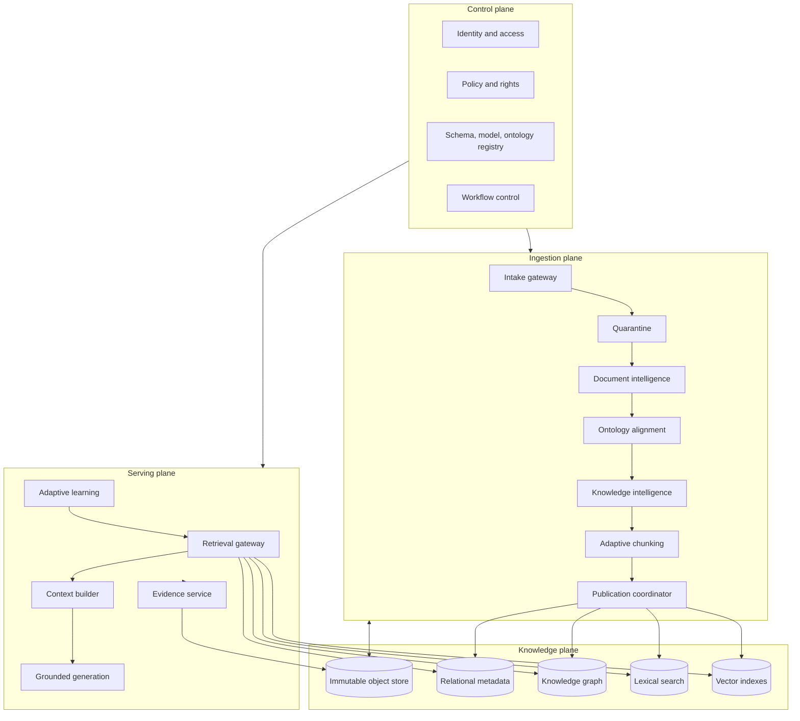
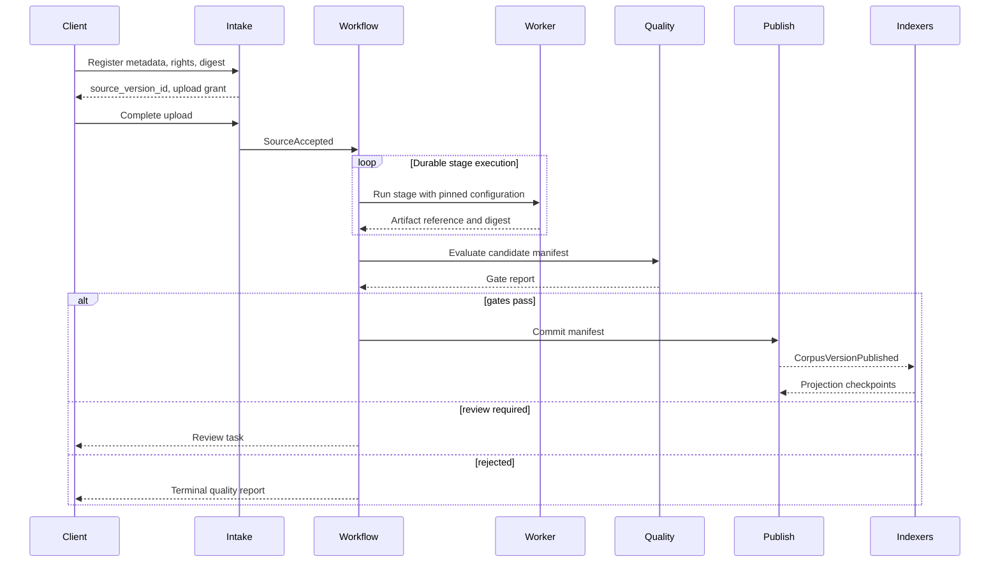

# ULIP Platform Architecture

## 1. Purpose and Scope

This document defines the production architecture for the Universal Learning Intelligence Platform (ULIP): service boundaries, data planes, deployment topology, contracts, workflow semantics, storage responsibilities, reliability, security, and operations.

The platform implements the goals and invariants in [System Vision](01_system_vision.md). Detailed extraction, ontology, knowledge construction, and chunking designs are defined in the linked topic documents.

## 2. Architecture Overview

ULIP separates four planes:

1. **Control plane:** tenant configuration, identity, policy, schemas, workflow definitions, model registry, and release management.
2. **Ingestion plane:** source registration, quarantine, extraction, normalization, enrichment, quality validation, and publication.
3. **Knowledge plane:** canonical repositories, ontology, graph, semantic chunks, relational metadata, vector indexes, and search projections.
4. **Serving plane:** authorized retrieval, evidence resolution, RAG context assembly, adaptive asset selection, assessment delivery integrations, and feedback capture.



## 3. Service Decomposition

### 3.1 Edge and control services

| Service | Responsibilities | Explicit boundary |
|---|---|---|
| API Gateway | TLS termination, request authentication, quotas, request IDs, routing | Does not contain domain policy or persist payloads |
| Identity Service | User and workload federation, tenant membership, service identities | Does not own educational profiles |
| Authorization Service | Attribute-based decisions using tenant, purpose, trust tier, rights, and age policy | Returns decisions and obligations, not content |
| Tenant Configuration Service | Regional placement, quotas, approved providers, retention, feature policy | Does not orchestrate individual runs |
| Registry Service | Schema, ontology, model, prompt, rule, and workflow release metadata | Stores immutable releases and lifecycle pointers |
| Workflow Service | Durable state machines, schedules, retries, cancellation, and compensation | Does not execute untrusted parser or model work |
| Audit Service | Append-only administrative, policy, access, and publication events | Separate write path and retention from application logs |

### 3.2 Ingestion services

| Service | Responsibilities | Output |
|---|---|---|
| Intake Service | Register logical source, upload session, metadata, license, checksum, idempotency | `SourceRegistered` |
| Content Security Service | Malware scan, archive-bomb detection, MIME verification, parser risk classification | quarantine decision |
| Source Store | Immutable encrypted source objects and normalized renditions | content-addressed object reference |
| Document Intelligence Service | Format parsing, OCR, layout, reading order, tables, figures, equations, anchors | document intermediate representation |
| Classification Service | Language, subject, domain, grade, curriculum, exam, and sensitivity proposals | versioned classifications |
| Ontology Service | Concept resolution, vocabulary management, curriculum alignment, migration mappings | canonical concept references |
| Knowledge Intelligence Service | Knowledge assets, objectives, competencies, misconceptions, graph edges, quality evidence | canonical asset bundle |
| Chunking Service | Learning-purpose chunk families, context envelopes, embedding records | chunk bundle |
| Quality Service | Contract, fidelity, semantic, pedagogical, safety, rights, and publication gates | signed gate report |
| Publication Coordinator | Atomic manifest, canonical commit, outbox events, current-version pointer | `CorpusVersionPublished` |

### 3.3 Serving services

| Service | Responsibilities | Boundary |
|---|---|---|
| Retrieval Gateway | Query understanding, authorization filters, hybrid retrieval, reranking, diversity | Never bypasses policy filters |
| Evidence Service | Resolve citations to source rendition and permitted excerpt | Never reveals inaccessible surrounding content |
| Graph Query Service | Prerequisites, related concepts, curriculum coverage, paths | Read-only published graph projections |
| Context Builder | Assemble bounded, deduplicated, attributed context | Does not generate unsupported claims |
| Adaptive Learning Service | Select assets using learner goals and approved state features | Does not own identity or source content |
| Assessment Service | Retrieve validated items, blueprint selection, scoring integration | High-stakes mode requires controlled assets |
| Generation Orchestrator | Provider selection, prompt policy, grounding, output validation | Providers never receive unapproved data |
| Feedback Service | Collect correction, relevance, and learning event signals | Signals remain untrusted until validated |

## 4. Data Ownership and Storage

### 4.1 Storage responsibilities

| Store | System of record for | Not authoritative for |
|---|---|---|
| Immutable object storage | Source bytes, renditions, intermediate representations, artifact bundles, manifests | Current workflow state |
| Relational metadata store | Tenants, sources, versions, workflow state, asset metadata, rights, publication pointers | Full-text retrieval ranking |
| Ontology repository | Term releases, relations, mappings, constraints, migration sets | Learner state |
| Graph store or graph projection | Traversal-optimized concept and knowledge relationships | Original evidence text |
| Lexical search index | Keyword, fielded, language-aware search | Canonical records |
| Vector database | Embeddings and filter metadata within one model space | Asset lifecycle truth |
| Learner state store | Pseudonymous mastery, preferences, accommodations, event-derived features | Content or identity master data |
| Cache | Short-lived authorized response and metadata acceleration | Durable state |
| Audit ledger | Tamper-evident audit events | Operational debugging payloads |

Canonical records live in object and relational stores. Graph, lexical, and vector stores are rebuildable projections.

### 4.2 Storage key rules

- Every object key begins with a non-guessable tenant partition and data classification.
- Source and artifact objects are immutable. A corrected artifact receives a new key and version.
- Relational rows carry `tenant_id`; database row-level policy is defense in depth, not the sole authorization control.
- Graph nodes and edges carry tenant visibility, trust tier, lifecycle state, ontology version, and rights policy reference.
- Vector payloads contain only filterable identifiers and low-sensitivity metadata. Full learner responses and unredacted personal data are prohibited.
- Cache keys include tenant, principal policy fingerprint, locale, trust tier, corpus manifest, and query version.

## 5. Contract Model

### 5.1 Common envelope

All commands, events, and persisted artifacts include:

```json
{
  "schema": "ulip.<domain>.<type>",
  "schema_version": "1.0.0",
  "event_id": "opaque-id",
  "tenant_id": "opaque-id",
  "occurred_at": "RFC-3339 timestamp",
  "trace_id": "W3C trace identifier",
  "actor": {"type": "workload", "id": "opaque-id"},
  "subject": {"type": "source_version", "id": "opaque-id"},
  "policy_version": "immutable-policy-id",
  "data_classification": "restricted",
  "payload": {}
}
```

Persisted assets add `created_by_run`, `provenance`, `content_digest`, `lifecycle_state`, and `revision`.

### 5.2 API conventions

- REST or gRPC endpoints are contract-first and publish machine-readable schemas.
- Mutation requests require `Idempotency-Key`, expected resource revision, and tenant context.
- Success returns a stable operation or resource identifier. Long-running work returns `202 Accepted`.
- Error bodies contain `code`, `category`, `retryable`, `message`, `correlation_id`, and safe field-level details.
- Pagination uses opaque cursors with deterministic sort order.
- Date-time values are UTC RFC 3339; language uses BCP 47; curriculum and concept references use authority-scoped URIs.
- Clients must ignore additive fields and reject unsupported major versions.

### 5.3 Event delivery

The transactional outbox pattern couples state commits with emitted events. Events are at-least-once and may be delayed or reordered across subjects. Consumers must:

1. deduplicate on `event_id`;
2. enforce per-subject revision monotonicity;
3. tolerate additive fields;
4. persist consumption outcome before acknowledgment;
5. route poison events to a dead-letter queue without blocking unrelated partitions.

Events describe completed facts. Commands remain explicit requests and are never represented as facts.

## 6. Ingestion Orchestration



### 6.1 Stage transaction

A stage:

1. leases a work item with a fencing token;
2. loads only immutable inputs named in the run manifest;
3. writes candidate artifacts to a run-scoped prefix;
4. validates schema and digest;
5. atomically commits artifact metadata and an outbox event;
6. releases the lease.

Another worker may safely repeat steps 2 through 4. Only the current fencing token can commit.

### 6.2 Publication transaction

Publication locks the logical source or corpus release, verifies gate signatures and dependency versions, writes a complete manifest, advances the current-version pointer with compare-and-swap, and emits one publication event in the same database transaction. Indexers checkpoint against the publication sequence. Serving can require a minimum projection watermark.

## 7. Retrieval and RAG Architecture

### 7.1 Retrieval flow

1. Authenticate the caller and establish tenant, purpose, audience, age policy, and requested trust tier.
2. Normalize language and query without removing educationally meaningful symbols.
3. Resolve curriculum, concept, and learner-goal hints.
4. Construct mandatory policy filters before accessing any search backend.
5. Retrieve lexical, vector, and graph candidates in parallel.
6. Fuse scores using a versioned policy and remove duplicates or superseded assets.
7. Rerank for semantic relevance, pedagogical fit, evidence strength, diversity, and source quality.
8. Build a token-bounded context with source attribution and explicit conflicts.
9. Generate only when requested, then validate citation coverage, safety, and output schema.
10. Record a privacy-safe retrieval receipt containing candidate IDs, policy, versions, and timing.

### 7.2 Serving invariants

- Authorization filters are pushed into every backend query and rechecked after retrieval.
- An empty authorized result remains empty. The platform does not broaden tenant, rights, age, or trust constraints.
- Retrieved records must match the active corpus and embedding-space aliases.
- RAG output identifies claims not supported by retrieved evidence or rejects the response according to policy.
- Conflicting authoritative sources are surfaced, not silently reconciled.
- Learner adaptation can rerank authorized content but cannot make inaccessible content visible.

## 8. Deployment Topology

### 8.1 Regional cell

ULIP is deployed as independently scalable regional cells. A cell contains stateless APIs, workflow workers, queues, tenant-partitioned data services, caches, and observability collectors across at least three availability zones.

Global services contain only tenant routing, release metadata, public ontology catalogs, and disaster-recovery coordination. Content and learner data remain within configured residency boundaries.

### 8.2 Workload isolation

- Intake and serving workloads use separate compute pools and quotas.
- Parsers and converters run in ephemeral sandbox pools with no ambient cloud credentials and no unrestricted network.
- Model calls use an egress gateway that enforces approved provider, region, data class, request limits, and redaction.
- High-cost OCR, embedding, and generation use dedicated queues with per-tenant fair scheduling.
- Controlled assessment assets may use separate encryption keys and serving pools.

### 8.3 Scaling signals

| Workload | Primary signals |
|---|---|
| Intake API | request rate and upload sessions |
| Parsing | queue age, pages pending, document complexity |
| OCR | image pixels pending and accelerator occupancy |
| Enrichment | token budget, model concurrency, queue age |
| Chunk embedding | chunk count and batch latency |
| Retrieval | query rate, backend p95, CPU |
| Generation | concurrent requests, provider quota, deadline slack |

Autoscaling has minimum warm capacity and maximum cost guardrails. Queue age, not CPU alone, drives asynchronous workers.

## 9. Reliability and Failure Handling

### 9.1 Failure taxonomy

| Category | Examples | Treatment |
|---|---|---|
| Invalid input | digest mismatch, unsupported encryption, malformed contract | reject without retry |
| Unsafe input | malware, archive bomb, parser exploit signal | quarantine and security event |
| Transient dependency | timeout, throttling, unavailable store | bounded retry with jitter |
| Deterministic processing | parser crash on specific structure, schema violation | capture diagnostic, fallback if approved, then review |
| Quality failure | low OCR confidence, unsupported mapping, inadequate evidence | review or reject |
| Policy failure | expired license, forbidden region, denied purpose | stop and audit |
| Projection failure | vector or search indexing failure | retry independently; canonical publication remains valid |
| Consistency fault | digest or manifest mismatch | isolate, page operator, prohibit serving affected release |

### 9.2 Resilience patterns

- Deadlines propagate through synchronous calls; downstream timeouts are shorter than caller deadlines.
- Circuit breakers isolate unhealthy model and storage providers.
- Retries have budgets and never multiply across layers.
- Bulkheads separate tenants, stages, providers, and online from batch workloads.
- Backpressure pauses intake before queues exceed recovery objectives.
- Reconciliation compares manifests, outbox sequences, and projection watermarks.
- Disaster recovery restores canonical stores first, then rebuilds all projections.

## 10. Security and Privacy Architecture

### 10.1 Trust zones

Uploads begin in an untrusted zone. Content moves to a restricted processing zone only after security checks, and to the published zone only after quality and policy gates. Serving never reads directly from quarantine or run-scoped candidate storage.

### 10.2 Access control

Authorization evaluates:

- principal and workload identity;
- tenant and delegated institution;
- resource classification and lifecycle;
- requested action and declared purpose;
- rights territory, audience, and expiration;
- learner age and safeguarding policy;
- trust tier and assessment mode;
- data residency and export policy.

Decisions return obligations such as redact, watermark, suppress excerpt, require citation, or prohibit provider egress.

### 10.3 Secrets and keys

Secrets reside in a managed vault and are delivered as short-lived workload credentials. Envelope encryption uses tenant-aware key context. Key rotation does not require source reprocessing. Break-glass access is time-bound, approved, and audited.

### 10.4 Privacy boundaries

Identity mapping, learner state, source content, and analytics identifiers use separate stores and keys. Event streams prohibit direct identifiers unless specifically classified. Privacy-preserving aggregation thresholds apply to educational analytics. Model providers receive no learner identity and no reusable training permission by default.

## 11. Observability and SLO Management

### 11.1 Signals

All services emit OpenTelemetry traces, RED metrics for synchronous APIs, USE metrics for resources, and domain metrics. Required common fields are `service`, `version`, `region`, `tenant_class`, `trace_id`, `workflow_run_id`, `source_version_id`, `policy_version`, and `outcome`. High-cardinality identifiers remain in traces or logs, not metric labels.

### 11.2 Key service-level indicators

- Retrieval availability and latency for authorized requests.
- Evidence resolution success.
- Ingestion completion latency by page complexity and format.
- Queue age and oldest-item age.
- Publication-to-index convergence time.
- Stale or revoked result rate.
- Projection parity against manifests.
- Quality-gate pass, review, and rejection rates.
- Provider fallback and grounded-output validation rates.

Error budgets govern release velocity. Security or rights violations have zero acceptable budget and trigger incident response independent of general availability.

## 12. Versioning and Release Strategy

- Service APIs and events follow the compatibility rules in the [System Vision](01_system_vision.md).
- Deployments use immutable images, signed provenance, staged promotion, canaries, and automated rollback.
- Database changes use expand, migrate, contract. Older service versions remain functional during expansion.
- Worker runs pin component and configuration versions. A rolling deploy never changes an active run's semantics.
- Projection releases use versioned physical indexes and atomic logical aliases.
- Feature flags have an owner, expiry, safe default, tenant scope, and audit history.
- Breaking ontology, chunk, or embedding changes require explicit migration or parallel rebuild, never implicit reinterpretation.

## 13. Operational Quality Gates

Before production promotion:

1. contract compatibility and schema registry checks pass;
2. unit, integration, workflow replay, and migration tests pass;
3. load tests meet latency and saturation targets;
4. tenant-isolation and authorization tests pass;
5. malformed-document and parser-sandbox security tests pass;
6. backup restore and projection rebuild are demonstrated;
7. observability dashboards and alerts are verified;
8. runbooks name owners, diagnostic queries, mitigation, and rollback;
9. data protection and model-provider reviews match the deployment region;
10. canary quality metrics show no material educational regression.

## 14. Traceability

Every workflow stage records input artifact digests, output artifact digests, executable image digest, schema versions, model and prompt versions, ontology release, policy snapshot, timestamps, and actor. Publication manifests form a Merkle-addressable bill of materials. A serving receipt references publication manifests and retrieval policy, enabling exact impact analysis and replay without storing sensitive query text.

## 15. Related Architecture

- [System Vision](01_system_vision.md)
- [Document Intelligence](03_document_intelligence.md)
- [Educational Ontology](04_educational_ontology.md)
- [Knowledge Intelligence](05_knowledge_intelligence.md)
- [Adaptive Chunking Engine](06_adaptive_chunking_engine.md)
