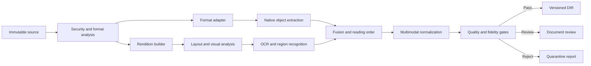

# ULIP Document Intelligence

## 1. Purpose

Document Intelligence transforms untrusted educational files into a format-neutral, evidence-preserving Document Intermediate Representation (DIR). The DIR is the authoritative handoff from physical document decoding to semantic and educational processing.

The subsystem accepts PDF, EPUB, DOCX, PPT/PPTX, TXT, Markdown, and HTML. It preserves text, layout, hierarchy, tables, equations, figures, diagrams, speaker notes, links, language, and exact source anchors where the format allows.

Document Intelligence does not decide canonical concept identity, curriculum alignment, pedagogical validity, or chunk boundaries. Those responsibilities belong to [Educational Ontology](04_educational_ontology.md), [Knowledge Intelligence](05_knowledge_intelligence.md), and [Adaptive Chunking Engine](06_adaptive_chunking_engine.md).

## 2. Goals

- Produce a common representation without erasing format-specific evidence.
- Recover intended reading and instructional order.
- Distinguish authored content from headers, footers, navigation, references, marketing, and extraction artifacts.
- Extract multimodal educational meaning, including tables, formulae, diagrams, captions, and alternative text.
- Make every output span traceable to immutable source bytes and a precise locator.
- Quantify extraction uncertainty by modality and region.
- Support deterministic replay, parser replacement, and selective reprocessing.
- Contain malicious or pathological files within a restricted execution boundary.

## 3. Responsibilities and Boundaries

### 3.1 Responsibilities

1. Validate declared type against file signatures and structure.
2. Detect encryption, corruption, active content, embedded objects, and parser risk.
3. Create safe, stable renditions for visual comparison.
4. Select native extraction, OCR, or hybrid processing per page or region.
5. Detect layout, reading order, and hierarchical structure.
6. Extract and normalize text while retaining raw forms and offsets.
7. Extract tables, equations, lists, images, diagrams, captions, footnotes, citations, and links.
8. Detect language and script at document and block level.
9. Create source anchors, confidence measurements, and quality reports.
10. Emit a schema-valid DIR and a reproducible extraction manifest.

### 3.2 Non-responsibilities

- Factual correction or rewriting of source claims.
- Assigning final ontology identifiers.
- Inferring learner mastery.
- Creating assessment items.
- Embedding or vector indexing.
- Silently removing content based only on low confidence.

Potential noise is labeled and preserved in the DIR unless explicit content-security or rights policy requires suppression.

## 4. Processing Architecture



### 4.1 Components

| Component | Responsibility |
|---|---|
| Format Profiler | MIME verification, structural checks, encryption, page or slide count, complexity and risk profile |
| Sandbox Controller | Ephemeral parser execution, CPU/memory/time limits, read-only source mount, network denial |
| Rendition Builder | Canonical page or slide images, thumbnails, coordinate normalization, visual digest |
| Format Adapter | Native structure and object extraction using a common adapter contract |
| OCR Router | Region-level engine and language selection, handwriting or print mode, fallback policy |
| Layout Analyzer | Regions, columns, hierarchy, lists, captions, headers, footers, reading order |
| Table Extractor | Grid and non-grid tables, merged cells, headers, spans, cell anchors |
| Math Extractor | Formula regions, token structure, MathML/LaTeX representation, visual anchor |
| Media Analyzer | Images, diagrams, charts, labels, captions, source alt text, generated descriptions |
| Fusion Engine | Reconcile native, visual, OCR, and structural candidates |
| Normalizer | Unicode, whitespace, line-break, hyphenation, locale, and offset mapping |
| Quality Evaluator | Coverage, confidence, fidelity, anomaly, and review decisions |
| DIR Writer | Schema validation, deterministic identity, artifact packaging, manifest and digests |

## 5. Format Adapter Contract

Every adapter receives an immutable source reference, source digest, tenant policy, resource limits, and requested DIR schema version. It returns:

- format identity and version evidence;
- logical containers such as pages, chapters, sections, slides, or sheets;
- native text runs with style and native locators;
- embedded media and object relationships;
- hyperlinks, bookmarks, notes, comments, and accessibility metadata when permitted;
- warnings and capability declarations;
- parser name, version, image digest, execution duration, and deterministic settings.

An adapter never writes canonical records directly. It writes a candidate artifact into run-scoped storage. The orchestrator validates and commits it.

### 5.1 Format-specific behavior

| Format | Primary evidence | Required handling |
|---|---|---|
| PDF | page objects plus rendered pages | reconcile text layer with visual order; detect scanned and mixed pages |
| EPUB | package manifest, spine, XHTML, CSS | preserve spine order, landmarks, semantic roles, media overlays |
| DOCX | Open XML body, styles, relations | resolve headings, lists, tables, footnotes, equations, images, tracked-content policy |
| PPT/PPTX | slide tree, z-order, notes, groups | preserve slide order, object geometry, speaker notes, animation sequence when meaningful |
| TXT | bytes and line structure | detect encoding, line endings, heading patterns, and language |
| Markdown | source text and parsed syntax tree | retain code, math, tables, links, front matter, and source offsets |
| HTML | sanitized DOM and computed structural semantics | remove executable behavior, resolve headings, lists, tables, figures, and canonical URL metadata |

Legacy PPT conversion occurs only in a sandboxed converter. Conversion output and converter version are retained as a derived rendition, never as a replacement source.

## 6. Document Intermediate Representation

### 6.1 Root structure

The DIR contains:

```json
{
  "schema": "ulip.document.dir",
  "schema_version": "1.0.0",
  "source_version_id": "opaque-id",
  "source_digest": "sha256:...",
  "format": {"media_type": "application/pdf", "profile": "pdf-1.7"},
  "languages": [{"tag": "en-IN", "confidence": 0.98}],
  "containers": [],
  "blocks": [],
  "resources": [],
  "relations": [],
  "quality": {},
  "provenance": {},
  "content_digest": "sha256:..."
}
```

### 6.2 Content block

A block has:

- deterministic `block_id`;
- `kind`, selected from a versioned vocabulary such as heading, paragraph, list, list item, table, equation, figure, caption, code, quote, footnote, callout, exercise, solution, or page furniture;
- parent container and ordered child references;
- raw text, normalized text, and an offset map between them;
- style, role, language, direction, and hierarchy level;
- source anchors and optional bounding geometry;
- confidence dimensions rather than one opaque confidence;
- content flags such as inferred, decorative, repeated, personally identifying, or review-required;
- relationships such as caption-of, footnote-for, continued-from, label-of, or reading-next.

### 6.3 Source anchor

```json
{
  "source_version_id": "opaque-id",
  "container": {"kind": "page", "index": 41, "native_id": "p42"},
  "locator": {"scheme": "pdf-object", "value": "83:0"},
  "region": {"space": "normalized-page", "polygon": [[0.1, 0.2], [0.8, 0.2], [0.8, 0.3], [0.1, 0.3]]},
  "raw_char_range": {"start": 120, "end": 287},
  "visual_rendition_digest": "sha256:..."
}
```

Coordinates use a top-left origin and normalized `[0,1]` dimensions. Geometry is a polygon, not only a rectangle, to represent rotated or irregular regions. Text-only formats use source character or syntax-node ranges and omit geometry.

### 6.4 Confidence model

Confidence is recorded separately for:

- character recognition;
- block classification;
- reading-order placement;
- table structure;
- equation recognition;
- language identification;
- media-to-caption association;
- source-anchor precision.

Each score includes method, engine version, calibration version, and applicable population. `not_measured` is distinct from zero.

## 7. Detailed Workflow

### 7.1 Intake profiling

The profiler verifies content digest, signature, internal structure, declared MIME, archive expansion ratio, entry count, encryption, macros, scripts, external references, embedded files, dimensions, and parser limits. Password-protected sources enter `REVIEW_REQUIRED` unless a tenant-approved secret delivery mechanism supplies the password.

### 7.2 Rendition

For paginated or visual formats, the system creates a canonical lossless or policy-approved high-fidelity rendition at a fixed color space and resolution. The rendition establishes visual truth for regression comparison and region coordinates. Very large pages are tiled with deterministic overlap.

### 7.3 Native extraction and OCR routing

Native text is preferred when it has valid Unicode, plausible glyph mapping, coherent order, and adequate visual coverage. OCR is used for scanned regions, broken fonts, image-only text, handwriting where supported, and labels inside diagrams.

Routing is region-based. A page can combine native paragraphs, OCR diagram labels, and math recognition. Full-page OCR is not allowed to duplicate valid native text without fusion.

### 7.4 Layout and reading order

The layout analyzer identifies:

- page or slide furniture;
- title and heading hierarchy;
- columns and sidebars;
- paragraphs and lists;
- figures, captions, tables, equations, and callouts;
- exercise and answer structures;
- footnotes and references;
- continuation across pages or slides.

Reading order forms a directed acyclic graph. The final linear order is one stable topological order, but alternative edges and confidence are retained where ambiguity matters.

### 7.5 Fusion

Fusion aligns candidates by region, character similarity, style, and object identity. Selection favors:

1. trustworthy native structure;
2. visually consistent native text;
3. calibrated OCR;
4. explicit unresolved alternatives.

Conflicting candidates are not concatenated. The selected value references alternatives and reason codes. Material disagreements trigger review.

### 7.6 Normalization

Normalization performs Unicode normalization, control-character handling, ligature expansion, safe whitespace reduction, language-aware dehyphenation, and line-wrap repair. It preserves:

- semantic punctuation;
- case where meaningful;
- mathematical notation and units;
- source spelling;
- code indentation;
- table cell separation;
- reversible offsets.

Normalization never translates, fact-corrects, or simplifies the source.

### 7.7 Multimodal extraction

#### Tables

Tables retain row and column order, cell spans, hierarchical headers, captions, footnotes, units, and cell-level anchors. A linearized text representation is derived, but never replaces the structured table.

#### Equations

Equations retain a visual crop, source text if present, structured representation, display or inline role, labels, and symbol confidence. Symbol ambiguity is represented at token level. Dimensional or mathematical correction is outside this subsystem.

#### Figures and diagrams

Media records retain original resource, rendered crop, caption, labels, surrounding references, authored alternative text, and a generated description only when policy allows. Authored and generated descriptions are separately typed.

#### Presentation content

Slide object z-order is not assumed to be reading order. Spatial groups, connectors, notes, and build sequence are used to infer instructional order. Speaker notes are a distinct block class and keep their visibility policy.

## 8. Invariants

1. Every DIR resolves to one immutable source digest.
2. Every non-inferred block has at least one source anchor.
3. Every normalization has a reversible raw-to-normalized offset map.
4. Container and block order is deterministic for fixed inputs and component versions.
5. No active source content executes outside a restricted sandbox.
6. Native and OCR duplicates do not appear as separate authored blocks.
7. Tables and equations retain structured and visual evidence.
8. Generated descriptions are never represented as authored source text.
9. Repeated headers and footers are labeled, not destructively discarded.
10. A stage cannot report full success if a required modality failed.

## 9. Quality Gates

### 9.1 Contract gate

- DIR validates against the pinned schema.
- All references resolve and no containment cycles exist.
- Digests, identifiers, offset ranges, and coordinates are valid.

### 9.2 Security gate

- Security scan and sandbox execution completed.
- No prohibited active content or unresolved embedded payload is publishable.
- External references were not fetched unless explicitly allowed and recorded.

### 9.3 Fidelity gate

Measured by format and modality:

- native or OCR text visual coverage;
- sampled character and word accuracy;
- block boundary agreement;
- heading hierarchy consistency;
- reading-order consistency;
- table cell and span accuracy;
- formula symbol and structure confidence;
- figure-caption association.

### 9.4 Completeness gate

The block inventory is reconciled with expected pages, slides, spine items, sections, media, and notes. Missing containers, suspicious blank pages, extraction truncation, or anomalous density require review.

### 9.5 Review policy

Review is mandatory when a configured critical threshold fails, source complexity exceeds validated capability, a key region has unresolved alternatives, accessibility meaning may be lost, or extraction affects controlled assessment use. Review decisions include corrected values, reason, reviewer, timestamp, and policy version.

## 10. Failure Handling

| Failure | Action |
|---|---|
| Unsupported format/profile | Reject with detected type and supported profiles |
| Corrupt internal structure | Attempt approved recovery in sandbox; preserve warning; otherwise quarantine |
| Parser timeout or crash | Retry once on clean worker, then approved alternate adapter, then review |
| Excessive resource demand | Abort at hard limit and classify as resource-policy failure |
| Low OCR quality | Try approved alternate engine or language pack, then retain uncertainty and review |
| Table or math extraction failure | Emit anchored visual region and explicit capability failure |
| Partial container failure | Preserve successful artifacts but do not publish complete DIR |
| Artifact digest mismatch | Isolate run, reject commit, and raise integrity alert |

Fallbacks are recorded in provenance. A fallback cannot claim the capability or confidence of the preferred path.

## 11. Security and Privacy

- Parsers run as non-privileged ephemeral workloads with read-only input, bounded scratch space, syscall filtering, and denied outbound network.
- Archives have depth, entry-count, path, expansion, and compression-ratio limits.
- HTML is parsed without browser execution; scripts, forms, tracking resources, and unsafe URLs are inert.
- Macros and active objects are never executed.
- Extracted personal or sensitive data is classified at block and region level. Redacted renditions are separate derived artifacts with their own anchors.
- Debug artifacts containing content inherit source classification and short retention.
- Provider-based OCR or media description is allowed only by tenant egress and data-processing policy.

## 12. Observability

### 12.1 Metrics

- documents, containers, megapixels, and blocks processed;
- processing latency and queue age by format, profile, engine, and complexity band;
- native, OCR, hybrid, and fallback routing;
- OCR confidence distribution and low-confidence area;
- reading-order ambiguity, duplicate fusion, and unresolved candidates;
- table, math, figure, and accessibility extraction coverage;
- security quarantine and parser limit events;
- gate outcomes and human correction rates.

### 12.2 Diagnostics

Each run produces a machine-readable extraction report and, for authorized reviewers, a visual overlay showing blocks, order, confidence, and anchors. Logs contain identifiers and reason codes, not full source text. Traces link adapter, OCR, layout, fusion, normalization, and quality spans.

## 13. Non-Functional Requirements

| Requirement | Target |
|---|---|
| Durability | No loss of acknowledged source or committed DIR |
| Determinism | Stable IDs and order for pinned inputs and versions |
| Throughput | Horizontal scaling by independent document and region work |
| Standard page latency | p95 under 5 seconds excluding queued time and handwriting |
| Resource isolation | One malicious document cannot exhaust a worker pool or affect another tenant |
| Resumability | Restart from last committed stage or container partition |
| Anchor precision | Exact native offset when available; visual region otherwise |
| Accessibility preservation | Authored roles and alternative text retained with provenance |
| Localization | Unicode, bidirectional text, vertical scripts, and locale-aware OCR supported by declared capability |

## 14. Versioning and Reprocessing

- DIR schema changes follow semantic versioning.
- Adapter, renderer, OCR, layout, normalization, and calibration versions are independently pinned.
- A parser or model upgrade runs against a golden corpus before promotion.
- Reprocessing creates a new DIR version linked by `supersedes`; old evidence remains addressable under retention policy.
- Container-level content digests enable selective reprocessing and downstream impact analysis.
- A coordinate-system or normalization semantic change requires a new major DIR version.
- Downstream consumers declare accepted schema and capability versions.

## 15. Traceability

The extraction manifest records source digest, adapter and converter image digests, security result, rendition settings, OCR and model versions, language packs, normalization rules, quality policy, input and output artifact digests, and all fallback decisions.

For any DIR block, ULIP can render its exact source region. For any source region, ULIP can enumerate all blocks and downstream assets that depend on it. This bidirectional relationship is required for corrections and revocations.

## 16. Related Architecture

- [System Vision](01_system_vision.md)
- [Platform Architecture](02_platform_architecture.md)
- [Educational Ontology](04_educational_ontology.md)
- [Knowledge Intelligence](05_knowledge_intelligence.md)
- [Adaptive Chunking Engine](06_adaptive_chunking_engine.md)
