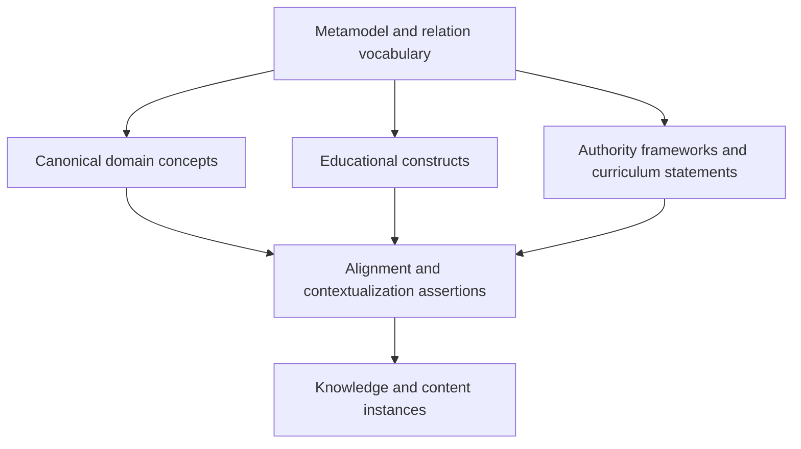
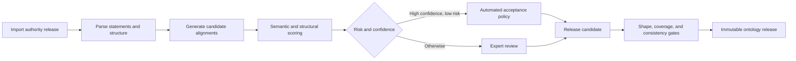

# ULIP Educational Ontology

## 1. Purpose

The ULIP Educational Ontology supplies a stable semantic backbone across curricula, examinations, age bands, institutions, languages, professional domains, and informal learning. It makes concepts, competencies, learning objectives, content, assessments, and evidence interoperable without forcing them into one curriculum-specific hierarchy.

The ontology covers Class 1-12, CBSE, ICSE, State Boards, JEE, NEET, UPSC, higher education, professional learning, languages, life skills, DIY, creativity, and experiential learning. Coverage is extensible through governed authority namespaces.

This document defines the metamodel, identity, relation semantics, alignment, governance, quality, and serving contracts. Knowledge instances constructed from documents are specified in [Knowledge Intelligence](05_knowledge_intelligence.md).

## 2. Design Principles

1. **Concept identity is independent of wording.** Labels, translations, symbols, and curriculum statements can change without changing the underlying concept.
2. **Curriculum is a contextual view, not universal truth.** Each authority defines its own sequences, depth, outcomes, and assessment emphasis.
3. **Level is multidimensional.** Age, grade, cognitive demand, conceptual depth, prerequisite distance, mathematical sophistication, language complexity, and examination demand are separate dimensions.
4. **Relationships are typed and contextual.** `prerequisiteOf`, `broaderThan`, `partOf`, and `causes` are not interchangeable.
5. **Assertions require provenance.** An authority assertion, expert mapping, learned proposal, and source claim have distinct status.
6. **Time is explicit.** Curricula, terminology, professional standards, and scientific consensus evolve.
7. **Multilingual representation preserves meaning.** Translation equivalence is asserted, scoped, and reviewed, not assumed from surface similarity.
8. **Open-world semantics with closed publication shapes.** Unknown facts remain possible, while each released record must satisfy strict validation constraints.

## 3. Ontology Layers



### 3.1 Metamodel layer

Defines entity classes, relation types, cardinality, symmetry, transitivity, allowed endpoints, context fields, and validation shapes.

### 3.2 Canonical domain layer

Contains reusable subject and domain meaning such as photosynthesis, constitutionalism, compound interest, conflict resolution, dovetail joint, or color harmony. Domain modules can be maintained by different expert authorities while following the common metamodel.

### 3.3 Educational construct layer

Contains learning objectives, competencies, skills, practices, misconceptions, representations, pedagogical approaches, assessment forms, proficiency levels, and learner evidence types.

### 3.4 Authority framework layer

Represents curriculum authorities, syllabi, grade or stage structures, examination blueprints, qualification frameworks, occupational standards, and institutional programs as versioned first-class objects.

### 3.5 Alignment layer

Connects canonical meaning to authority-specific statements through scoped assertions with equivalence strength, coverage, depth, confidence, provenance, and review state.

### 3.6 Instance layer

Contains document-derived assets, questions, chunks, learner activities, and observations that refer to ontology entities. Instances live in canonical repositories rather than in the ontology release itself.

## 4. Core Entity Model

| Entity | Definition | Required characteristics |
|---|---|---|
| `Concept` | Stable unit of domain meaning | preferred definition, domain, labels, provenance |
| `ConceptScheme` | Governed collection of concepts | authority, scope, release |
| `Topic` | Navigational or instructional grouping | scheme-specific, not treated as universal concept identity |
| `Representation` | Form that expresses a concept | notation, diagram, model, example pattern, language |
| `Misconception` | Plausible but incorrect or incomplete mental model | correction, trigger context, evidence |
| `LearningObjective` | Intended observable performance | action, object, conditions, criterion |
| `Competency` | Integrated ability to apply knowledge, skill, and disposition | context, proficiency model, evidence rules |
| `Skill` | Repeatable learned capability | action, object, conditions |
| `Practice` | Disciplinary or professional mode of working | domain and participation context |
| `Disposition` | Tendency or attitude relevant to performance | ethical and cultural scope |
| `CurriculumFramework` | Versioned authority structure | jurisdiction, validity period, stages |
| `CurriculumStatement` | Authority-published expectation or content statement | verbatim text, locator, stage, authority |
| `AssessmentForm` | Structure for eliciting evidence | response mode, scoring constraints |
| `ProficiencyLevel` | Ordered description within one competency model | observable descriptor and threshold semantics |
| `LearningExperience` | Designed activity such as experiment, discussion, project, or field task | setting, resources, participation, safety |
| `AudienceProfile` | Educational context, not a person | age band, prior learning, language demand |
| `AlignmentAssertion` | Contextual correspondence between entities | relation strength, scope, evidence, status |

`Topic` and `Concept` remain distinct. A textbook topic may combine concepts, and the same concept may appear under different topics.

## 5. Identity and Naming

### 5.1 Persistent identifiers

Every ontology entity has an immutable URI:

```text
urn:ulip:<authority-or-module>:<entity-type>:<opaque-id>
```

The URI never embeds a mutable label, grade, language, or hierarchy path. Authority-owned external identifiers are stored as mappings with authority and version.

### 5.2 Labels and definitions

Each lexical form includes:

- BCP 47 language tag and script;
- preferred, alternate, abbreviation, symbol, historical, or deprecated role;
- grammatical information where useful;
- authority or contributor;
- validity period;
- audience or regional context;
- review status.

Definitions are language-specific expressions of a shared meaning. Materially different definitions are modeled as scoped notes or distinct concepts, not silently merged.

### 5.3 Change identity rules

- Editorial correction, new translation, or added example creates a revision of the same entity.
- Changed meaning creates a new entity linked with `replaces`.
- Concept split creates new entities with `splitFrom`.
- Concept merge creates a new entity with `mergedFrom`.
- Deprecated entities remain resolvable and identify replacements where available.

## 6. Relationship Vocabulary

### 6.1 Semantic relations

| Relation | Meaning | Characteristics |
|---|---|---|
| `broaderThan` | More general meaning | transitive only within declared scheme closure |
| `partOf` | Constituent of a whole | contextual; not synonymous with broader |
| `instanceOf` | Instance belongs to a class | strict endpoint constraints |
| `equivalentTo` | Same meaning in declared scope | symmetric; requires strong review |
| `closeMatch` | Substantially overlapping meaning | symmetric, non-transitive |
| `contrastsWith` | Meaningful conceptual contrast | symmetric |
| `relatedTo` | Qualified association without stronger relation | symmetric, low reasoning power |
| `causes` | Causal influence under stated conditions | directed, evidenced, non-transitive by default |
| `representedBy` | Concept has a notation, model, or representation | directed |

### 6.2 Educational relations

| Relation | Meaning | Required context |
|---|---|---|
| `prerequisiteOf` | Prior capability materially enables another | learner context, target depth, evidence strength |
| `supportsObjective` | Content or concept supports intended performance | objective and coverage |
| `developsCompetency` | Experience or objective contributes to competency | proficiency band and evidence mode |
| `assessedBy` | Asset can elicit evidence for an objective or competency | validity scope, scoring method |
| `hasMisconception` | Misconception concerns a concept | audience and diagnostic evidence |
| `usesRepresentation` | Learning or assessment depends on representation | modality and accessibility |
| `appropriateFor` | Entity fits an audience or context | policy, not universal classification |
| `exemplifiedBy` | Example instantiates or illustrates meaning | positive, negative, boundary, or counterexample role |
| `transferableTo` | Capability can transfer to another context | transfer distance and evidence |

### 6.3 Curriculum relations

`exactAlignment`, `narrowAlignment`, `broadAlignment`, `partialAlignment`, and `noAlignment` relate canonical entities to curriculum statements. An alignment includes:

- authority framework and release;
- curriculum statement locator;
- target grade, stage, course, or examination;
- coverage fraction;
- conceptual depth;
- cognitive demand;
- required representations and practices;
- jurisdiction and language;
- alignment method, confidence, evidence, and reviewer.

No alignment relation is inferred as transitive across authorities.

## 7. Multidimensional Educational Level

A `LevelProfile` is a contextual assessment rather than an intrinsic label on a concept:

```json
{
  "context": {
    "framework": "authority-release-id",
    "audience": "audience-profile-id",
    "instructional_purpose": "initial_instruction"
  },
  "grade_or_stage": {"min": "8", "typical": "9", "max": "11"},
  "cognitive_process": ["understand", "apply", "analyze"],
  "conceptual_depth": 3,
  "prerequisite_depth": 2,
  "mathematical_sophistication": 2,
  "language_complexity": "B1",
  "independence": "guided",
  "confidence": 0.91,
  "evidence": ["alignment-assertion-id"]
}
```

Numeric dimensions refer to a named, versioned rubric. They are not comparable across rubrics without an explicit crosswalk. Examination labels such as `jee_main` or `upsc_mains` identify demand profiles within an authority release, not universal difficulty.

## 8. Curriculum and Domain Modeling

### 8.1 Formal curricula

CBSE, ICSE, State Boards, university programs, and examination bodies are separate authority namespaces. A framework release includes:

- official title, jurisdiction, language, and validity dates;
- stages, grades, courses, subjects, units, and official sequence;
- verbatim statements and source locators;
- outcomes, competencies, practices, content expectations, and assessment guidance;
- supersession and crosswalk metadata.

Official order is preserved even where ULIP's prerequisite graph recommends a different instructional sequence.

### 8.2 Competitive examinations

JEE, NEET, UPSC, and similar schemes model syllabus scope, assessment form, weighting, expected depth, integrated-concept demand, time pressure, and release year. Examination demand is linked to underlying concepts and competencies rather than encoded as a concept property.

### 8.3 Higher education and professional domains

Modules support course outcomes, credit or qualification levels, laboratory and field competencies, professional standards, licensure constraints, and continuing education. Authority-owned standards retain their exact wording and version.

### 8.4 Languages

Language learning distinguishes linguistic concepts, communicative competencies, scripts, registers, cultural contexts, receptive and productive modes, and proficiency frameworks. The language of an ontology label is independent of the language being learned.

### 8.5 Life skills, DIY, creativity, and experiential learning

These domains use competency, practice, safety, resource, setting, and evidence models rather than artificial subject-grade hierarchies. Experiences can require supervision, physical materials, location, collaboration, reflection, or portfolio evidence. Safety and accessibility constraints are first-class.

## 9. Alignment Workflow



Candidate generation can use lexical, embedding, graph-neighborhood, and model-assisted methods. Candidate scores are not ontology truth. Accepted assertions state method and reviewer or automation policy.

### 9.1 Review decisions

Reviewers may accept, reject, narrow scope, split a mapping, adjust depth, or request a concept change. The system records both candidate and decision to support calibration. Review interfaces show definitions, neighboring concepts, authority text, source location, and consequences of the mapping.

## 10. Publication Contracts

### 10.1 Ontology release

An immutable release contains:

- release ID, module, semantic version, authority, timestamp, and license;
- entity and relation files;
- validation shapes and relation vocabulary versions;
- multilingual lexical package;
- curriculum framework snapshots and alignment assertions;
- deprecation and migration mappings;
- content digests and signed manifest;
- quality report and reviewer attestations.

### 10.2 Query contract

Ontology lookup accepts tenant, release or release alias, language preferences, entity ID or search text, relation expansion, curriculum context, and authorization purpose. Responses identify exact release and separate asserted from inferred relations.

### 10.3 Resolution contract

Clients resolving a deprecated ID receive the original entity, lifecycle status, replacement mappings, migration type, and warnings. Resolution never silently rewrites stored identifiers.

## 11. Invariants and Validation Shapes

1. Every entity belongs to exactly one authority or governed module namespace.
2. Every published entity has at least one definition or authority statement and one preferred label in its module's primary language.
3. Every relation uses a registered type with valid endpoint classes.
4. `equivalentTo` cannot connect entities with unresolved contradictory definitions.
5. A prerequisite cycle is prohibited within the same declared learner context unless explicitly modeled as co-requisite.
6. Proficiency levels are ordered only within their named model.
7. Curriculum statements preserve verbatim text and resolvable source location.
8. Automated alignments expose method, confidence, calibration, and policy.
9. Deprecated entities remain resolvable for the retention lifetime.
10. No draft assertion appears in published query aliases.
11. An ontology release is immutable after signing.
12. All inferred triples identify the rule set and can be excluded by clients.

## 12. Quality Gates

### 12.1 Structural quality

- schema and shape conformance;
- resolvable IDs, references, language tags, and authority releases;
- relation endpoint and cardinality constraints;
- no prohibited cycles or orphaned curriculum statements;
- deterministic release digest.

### 12.2 Semantic quality

- definition distinctness and concept granularity;
- duplicate and near-duplicate analysis;
- hierarchy and partonomy coherence;
- prerequisite plausibility;
- cross-language equivalence;
- relation-specific evidence sufficiency.

### 12.3 Educational quality

- curriculum coverage without forced mappings;
- appropriate objective and competency semantics;
- level-profile rubric conformance;
- examination demand representation;
- inclusion of practice, experiential, accessibility, and safety contexts;
- bias and cultural scope review.

### 12.4 Release thresholds

Critical structural violations block release. Semantic conflicts block affected modules. Coverage gaps can be released only when explicitly reported and not required by a declared completeness claim. High-consequence professional, controlled assessment, and safety mappings require authorized expert approval.

## 13. Governance

### 13.1 Roles

| Role | Authority |
|---|---|
| Module steward | Scope, roadmap, release proposal |
| Domain expert | Meaning, relation, and prerequisite review |
| Curriculum expert | Authority fidelity and alignment review |
| Language reviewer | Terminology and translation equivalence |
| Assessment expert | Objective, competency, and evidence validity |
| Safety or accessibility reviewer | Context-specific constraints |
| Release manager | Gate verification, signing, alias promotion |

No contributor can approve their own high-consequence change without independent review.

### 13.2 Change process

Changes begin with an issue carrying rationale, evidence, affected entities, and intended compatibility. Automated impact analysis identifies content assets, chunks, assessments, curricula, and learner models that reference affected entities. Approved changes produce a release candidate, migration set, quality report, and signed release.

### 13.3 Disputes

ULIP can retain competing authority assertions when no universal consensus exists. Each assertion carries authority, context, and time. The platform does not manufacture agreement by merging materially different positions.

## 14. Security, Privacy, Rights, and Safety

- Public ontology terms and restricted licensed frameworks use separate access policies.
- Authority source documents and quoted statements retain license and territory restrictions.
- Only authorized stewards can change published aliases or approve migrations.
- Release manifests are signed and verified by consumers.
- Sensitive professional or safety guidance carries jurisdiction, validity, and intended-use constraints.
- Ontology records contain no learner personal data.
- Usage analytics are aggregated and cannot autonomously redefine ontology truth.
- Model-assisted proposals are treated as untrusted input and protected against instruction content embedded in imported sources.

## 15. Failure Handling

| Failure | Response |
|---|---|
| Authority import changes structure | Stop import, preserve prior release, require adapter update |
| Unresolvable external identifier | Quarantine affected record; do not mint assumed equivalence |
| Duplicate concept candidate | Route to merge, close-match, or distinctness review |
| Prerequisite cycle | Block release for affected context and show minimal cycle |
| Translation ambiguity | Publish source language if allowed; mark translation unavailable |
| Conflicting authority mapping | Preserve separate assertions with explicit scopes |
| Consumer uses removed release | Continue within support window, return deprecation telemetry |
| Signed manifest mismatch | Reject load and raise integrity incident |

## 16. Observability

- release size, validation results, and promotion status;
- entity and relation coverage by module, language, authority, and stage;
- unresolved, accepted, and rejected mapping queues;
- review turnaround and reviewer agreement;
- duplicate rate, cycle detections, and definition conflicts;
- query latency, cache hit rate, deprecated-ID use, and release adoption;
- downstream impact counts for proposed changes;
- mapping precision and recall from stratified expert samples;
- drift between active curriculum releases and ingested authority versions.

Metrics never treat more mappings as inherently better. Precision, scope correctness, and evidence quality take priority.

## 17. Non-Functional Requirements

| Requirement | Target |
|---|---|
| Identifier persistence | IDs remain resolvable across all supported releases |
| Query availability | 99.95% monthly for published release resolution |
| Lookup latency | p95 under 150 ms for direct ID; p95 under 500 ms for scoped search |
| Release atomicity | Consumers see either complete prior or complete new release |
| Scale | Tens of millions of entities and hundreds of millions of contextual assertions |
| Multilingual support | Full Unicode and BCP 47, including bidirectional scripts |
| Explainability | Every asserted and inferred relationship identifies origin and method |
| Rebuildability | Search and graph projections rebuild from signed release artifacts |

## 18. Versioning and Traceability

Ontology modules use semantic versions. Additive labels and non-breaking annotations increment minor versions. Meaning changes, relation semantic changes, identifier replacement, or validation changes that reject formerly valid records require major versions.

Every downstream asset records the exact ontology release and entity IDs used. The impact service supports both directions:

```text
authority statement -> alignment -> canonical concept -> assets and assessments
asset or served result -> concept revision -> alignment -> authority source and reviewer
```

Crosswalks state source release, target release, mapping operation, confidence, and migration instructions. They never overwrite historical references.

## 19. Related Architecture

- [System Vision](01_system_vision.md)
- [Platform Architecture](02_platform_architecture.md)
- [Document Intelligence](03_document_intelligence.md)
- [Knowledge Intelligence](05_knowledge_intelligence.md)
- [Adaptive Chunking Engine](06_adaptive_chunking_engine.md)
