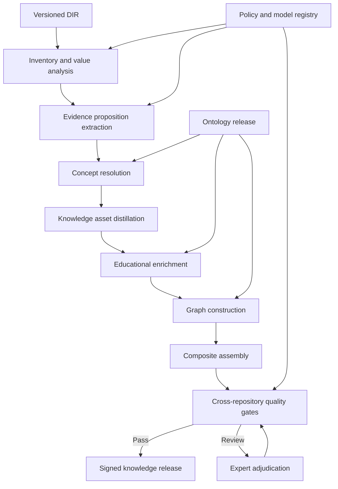

# ULIP Knowledge Intelligence

## 1. Purpose

Knowledge Intelligence converts the evidence-preserving Document Intermediate Representation (DIR) into governed educational knowledge assets. It extracts claims and concepts, aligns them to ontology, distills instructional structures, builds typed graphs, derives learning and assessment mappings, and validates the result for publication.

The subsystem serves diverse educational contexts without treating source phrasing, page order, or one curriculum as universal truth. It preserves disagreement, uncertainty, provenance, and contextual level.

Inputs come from [Document Intelligence](03_document_intelligence.md) and [Educational Ontology](04_educational_ontology.md). Retrieval packaging is handled by [Adaptive Chunking Engine](06_adaptive_chunking_engine.md).

## 2. Outcomes

For each source or corpus release, Knowledge Intelligence produces versioned repositories for:

- inventory and content quality;
- canonical knowledge assets;
- concepts and concept mentions;
- learning objectives;
- misconceptions;
- competencies and skills;
- typed knowledge graph;
- assessment opportunities and validated assessment assets;
- contextual level profiles;
- composite concept bundles;
- quality and traceability evidence.

These repositories support learning-path design, graph traversal, curriculum coverage, assessment authoring, semantic chunking, search, and grounded generation.

## 3. Responsibility Boundary

### 3.1 Responsibilities

- Discover educational structure, scope, audience, and overlap.
- Classify content value and distinguish pedagogical content from noise.
- Extract atomic, evidenced propositions and instructional assets.
- Resolve concept mentions to ontology entities or governed local candidates.
- Infer proposed relationships with explicit method and confidence.
- Construct objectives, competency mappings, misconceptions, and assessment opportunities.
- Compute contextual level and importance evidence.
- Build graph releases and composite learning bundles.
- Detect contradictions, unsupported claims, duplication, gaps, and quality risks.
- Publish complete, traceable repository bundles.

### 3.2 Non-responsibilities

- Physical document parsing and OCR.
- Changing source claims to match presumed truth.
- Owning curriculum vocabulary.
- Learner identity or mastery estimation.
- Final chunk packaging or embedding.
- Delivering high-stakes assessments without assessment governance.

## 4. Architecture



### 4.1 Components

| Component | Function |
|---|---|
| Inventory Analyzer | Subject, domain, hierarchy, language, intended audience, curriculum cues, and corpus overlap |
| Content Value Analyzer | Page or block educational value, noise class, evidence density, extraction risk |
| Proposition Extractor | Atomic claims, conditions, qualifiers, modality, polarity, and anchors |
| Concept Resolver | Mention detection, candidate generation, contextual disambiguation, local concept proposal |
| Asset Distiller | Definitions, principles, facts, examples, procedures, formulae, cases, analogies, and summaries |
| Educational Mapper | Objectives, Bloom process, competency, skill, practice, misconception, and assessment mapping |
| Level Calibrator | Multidimensional contextual demand and prerequisite depth |
| Graph Builder | Node and edge validation, evidence aggregation, contradiction representation, graph metrics |
| Composite Assembler | Coherent multi-concept bundles for transfer and integrated assessment |
| Quality Evaluator | Schema, evidence, consistency, educational, safety, and release gates |
| Repository Publisher | Immutable artifacts, manifest, current alias, projection events |

## 5. Canonical Repository Set

| Repository | Primary records |
|---|---|
| `knowledge_inventory` | document scope, hierarchy, audience, curriculum cues, source overlap |
| `content_quality` | block value, modality quality, noise reason, risk and confidence |
| `proposition_repository` | atomic claims and exact evidence |
| `knowledge_repository` | definitions, facts, principles, examples, frameworks, processes, formulae, cases |
| `concept_repository` | ontology concepts, local candidates, mentions, resolution evidence |
| `learning_objective_repository` | action, concept, conditions, criteria, cognitive process |
| `misconception_repository` | incorrect model, trigger, correction, diagnosis evidence |
| `competency_repository` | competency, skill, outcome, proficiency, evidence mapping |
| `knowledge_graph` | typed nodes and contextual, evidenced edges |
| `assessment_repository` | assessment opportunities, item suitability, blueprints, reviewed items |
| `level_repository` | contextual level profiles and calibration evidence |
| `composite_repository` | multi-concept subgraphs and integrated learning purposes |
| `quality_repository` | dimension results, violations, decisions, reviewers |
| `release_manifest` | complete bill of materials and dependency versions |

Repository names are logical contract names. Physical layout may be object, relational, or graph-oriented as defined in [Platform Architecture](02_platform_architecture.md).

## 6. Common Asset Contract

Every canonical asset includes:

```json
{
  "asset_id": "opaque-stable-id",
  "revision_id": "opaque-immutable-id",
  "asset_type": "definition",
  "tenant_id": "opaque-id",
  "language": "en-IN",
  "content": {},
  "concept_refs": [],
  "evidence": [],
  "provenance": {
    "workflow_run_id": "opaque-id",
    "method": "extractive",
    "component_version": "immutable-version",
    "model_ref": null,
    "prompt_ref": null
  },
  "confidence": {
    "value": 0.96,
    "calibration": "calibration-release-id",
    "method": "evidence-agreement"
  },
  "trust_tier": "assisted",
  "lifecycle_state": "published",
  "schema_version": "1.0.0",
  "content_digest": "sha256:..."
}
```

`content` is type-specific. Asset identity remains stable across editorial revisions when meaning is unchanged. Evidence includes one or more DIR anchors plus relation to the content: supports, states, illustrates, contradicts, or contextualizes.

## 7. Knowledge Representation

### 7.1 Proposition

A proposition is the smallest independently evaluable source claim. It records:

- subject, predicate, object or literal;
- polarity and epistemic modality;
- conditions, scope, quantities, units, and temporal validity;
- attribution and source voice;
- exact evidence anchors;
- extraction method and confidence.

Questions, commands, fictional dialogue, worked steps, and author opinions are classified so they are not mistaken for universal factual assertions.

### 7.2 Knowledge asset types

| Type | Required semantics |
|---|---|
| Definition | term, defining characteristics, scope, exclusions |
| Principle | general statement, conditions, consequences |
| Fact | proposition, temporal and jurisdictional scope where relevant |
| Example | illustrated concept, role, setup, result, boundary conditions |
| Counterexample | rejected generalization and why it fails |
| Procedure | goal, prerequisites, ordered steps, decision points, expected outcome, safety |
| Formula | expression, symbol definitions, units, assumptions, validity domain |
| Framework | components, relationships, application context |
| Case | context, events or evidence, analysis, outcome, limitations |
| Analogy | mapped elements, supported insight, breakdown points |
| Misconception correction | incorrect model, diagnosis, explanation, corrected model |
| Practice task | goal, resources, actions, evidence, safety and accessibility |

Type contracts prevent a fluent paragraph from being accepted as a complete procedure or formula record.

### 7.3 Extractive and synthesized content

`extractive` content remains semantically equivalent to anchored source passages. `synthesized` content combines evidence or transforms presentation. Synthesis requires:

- all supporting evidence and source roles;
- generation method and pinned model or rule;
- claim-level support validation;
- a label that distinguishes it from authored text;
- stricter review for controlled use.

## 8. Workflow

### 8.1 Inventory and overlap

The inventory identifies document hierarchy, subject and domain candidates, language, stated audience, curricula and examinations, learning features, and source recency. Corpus-level overlap compares concept coverage and evidence, not only text similarity. Duplicate versions, derivative publications, answer keys, and translations are represented as source relationships.

### 8.2 Content value and noise

Each DIR block receives dimension scores for educational relevance, evidence density, novelty, structural role, extraction fidelity, and safety or rights risk. Classes include instructional, example, assessment, solution, reference, navigation, legal, promotional, repeated furniture, and unknown.

Noise classification is reversible. Original blocks remain in the DIR, and exclusion decisions state rule, score, policy, and downstream scope.

### 8.3 Proposition and asset extraction

Extraction uses deterministic rules for explicit structures and approved model assistance for semantic interpretation. Inputs are bounded block groups with source instructions isolated from model instructions. Outputs must validate against type schemas and reference only supplied anchors.

Long content is processed using overlapping structural regions. A reconciliation pass merges duplicate candidates and preserves distinct claims with different conditions.

### 8.4 Concept resolution

For each mention:

1. normalize lexical form without losing symbols or language;
2. generate candidates from ontology label, definition, curriculum, graph, and embedding indexes;
3. score local context, domain, neighboring mentions, authority, and expected type;
4. accept only above policy threshold and margin;
5. route ambiguity to review or retain unresolved;
6. propose a local concept when no candidate fits and evidence is sufficient.

Local concepts cannot enter a shared canonical ontology without its governance workflow. They remain tenant or corpus-scoped.

### 8.5 Educational enrichment

#### Learning objectives

Objectives contain an observable action, target knowledge or skill, conditions, expected criteria, cognitive process, intended audience, source or synthesis provenance, and mappings. Vague verbs such as "know" require operationalization before controlled publication.

#### Misconceptions

A misconception record distinguishes source-stated misconceptions, expert-curated misconceptions, distractor hypotheses, and observed learner patterns. It includes trigger context, diagnostic cue, explanation of failure, corrected model, and appropriate intervention.

#### Competencies

Competency mapping relates concepts and practices to integrated performance, proficiency level, evidence source, assessment method, and transfer context. A concept mention alone is insufficient evidence that a competency is developed.

#### Assessment opportunities

Assessment mapping records what evidence could be elicited, suitable forms, response mode, scoring basis, prerequisite coverage, accessibility, bias risk, and whether the source contains an answer. Suitability is not an automatically generated high-stakes item.

### 8.6 Level calibration

Level is evaluated against ontology `LevelProfile` dimensions, including conceptual depth, cognitive process, prerequisite complexity, representation demand, language complexity, independence, and examination context.

Deterministic evidence includes graph distance, operation count, concept count, and text metrics. Semantic judgment may use approved models. When semantic calibration is unavailable or unreliable, the profile is `unrated`; ULIP does not fabricate a competitive-examination label.

### 8.7 Graph construction

Nodes reference immutable revisions of concepts, assets, objectives, competencies, curricula, representations, and evidence. Edges carry:

- registered relation type;
- source and target;
- context and qualifiers;
- supporting and contradicting evidence;
- assertion method;
- confidence and calibration;
- ontology and graph schema versions;
- lifecycle and review state.

Parallel edges are permitted when context, authority, or evidence differs.

### 8.8 Composite assembly

Composite bundles are connected, purpose-specific subgraphs used for integrated explanations, transfer tasks, and advanced assessment. A bundle declares target purpose, entry prerequisites, constituent concepts, connecting relationships, required representations, expected reasoning chain, level profile, and evidence coverage.

Bundles are not formed from similarity alone. They must be educationally coherent and satisfy graph connectivity and prerequisite closure policy.

## 9. Knowledge Graph Semantics

### 9.1 Edge classes

- **Ontological:** broader, part, instance, equivalent, contrast.
- **Dependency:** prerequisite, co-requisite, enables.
- **Explanatory:** causes, explains, predicts, derived-from.
- **Instructional:** exemplifies, represented-by, misconception-of, supports-objective.
- **Application:** applies-to, used-in, transfers-to.
- **Curricular:** aligned-to, assessed-in, introduced-in.
- **Evidence:** states, supports, contradicts, illustrates.

Only relations declared transitive in the ontology can produce inferred closure. Inferred edges remain distinguishable and reference the rule release.

### 9.2 Graph invariants

1. Every node and edge resolves to a published or explicitly candidate record.
2. Every asserted educational or explanatory edge has evidence or authorized expert provenance.
3. Prerequisite edges include context and cannot create prohibited cycles.
4. Graph metrics never substitute for educational importance.
5. Contradiction edges preserve both assertions and scopes.
6. Deleting a projection does not delete canonical assets.
7. A revoked evidence source invalidates or downgrades dependent assertions according to policy.

### 9.3 Graph analytics

Degree, betweenness, centrality, community, and path metrics support review and discovery. Their algorithm, projection, weighting, and version are stored. They are derived features, not facts. A quality gate detects sudden distribution shifts after graph releases.

## 10. Cross-Repository Invariants

1. Every asset concept reference resolves against the pinned ontology release.
2. Every non-synthesized claim resolves to at least one DIR anchor.
3. Every synthesized claim has claim-level supporting evidence.
4. Objective, competency, and assessment mappings share compatible contextual level and audience.
5. A formula's symbols, assumptions, and units are either defined or explicitly unresolved.
6. Procedures preserve order, prerequisites, safety constraints, and outcomes.
7. Misconceptions are never published as factual content without unmistakable typing.
8. No rejected or revoked asset enters a graph, chunk, assessment, or serving projection.
9. All repositories in a release reference one consistent source, ontology, policy, and schema bill of materials.
10. Current aliases advance only after all mandatory repositories and gate reports commit.

## 11. Quality Model

### 11.1 Dimensions

| Dimension | Evaluation |
|---|---|
| Evidence fidelity | Claims supported by precise source anchors |
| Factual consistency | Internal consistency and agreement with designated authorities |
| Semantic coherence | Correct concept identity, granularity, and relationships |
| Educational value | Clear learning purpose, completeness, and instructional utility |
| Curriculum fidelity | Scoped mapping to exact authority release |
| Assessment validity | Objective alignment, evidence sufficiency, scoring feasibility |
| Completeness | Required fields and knowledge components for asset type |
| Language quality | Meaning, grammar, terminology, and audience fit |
| Accessibility | Equivalent representation and non-visual usability |
| Safety and bias | Age, cultural, physical, professional, and harmful-content risk |
| Rights and privacy | Permitted derivation, personal data, and use restrictions |

### 11.2 Gate behavior

Critical failures block the affected asset. Repository-level publication requires:

- schema and referential integrity;
- minimum evidence coverage;
- no unresolved critical contradictions;
- no prohibited graph cycles;
- configured curriculum precision;
- required review for controlled domains;
- complete rights and privacy decisions;
- reproducible manifest.

An aggregate score cannot override a failed critical dimension.

### 11.3 Human review

Risk-based queues include concept ambiguity, authority conflict, low evidence, new local concepts, prerequisite changes, controlled assessment mappings, medical or safety-sensitive claims, cultural sensitivity, and large downstream impact.

Review decisions are append-only. Corrections create new revisions and identify whether the issue came from source, extraction, model, ontology, or policy.

## 12. Model-Assisted Processing

### 12.1 Provider contract

Model calls specify capability, approved provider and region, exact model release, prompt template, decoding configuration, input digest, output schema, deadline, cost limit, and data policy. Structured output is validated before use.

### 12.2 Guardrails

- Source content is delimited and treated as data, not instruction.
- Only required evidence regions are sent.
- Personal, restricted, or licensed content follows provider policy.
- Responses cannot create source anchors or ontology IDs not present in allowed context.
- Deterministic validators check references, units, structure, and content support.
- Provider failure falls back only to a declared lower capability.
- Offline or heuristic mode marks semantic classifications `unrated` where evidence is insufficient.

### 12.3 Evaluation

Each model or prompt release is tested on stratified golden sets by format, language, domain, educational stage, asset type, and risk. Promotion requires no material regression in precision, unsupported-claim rate, mapping accuracy, calibration, bias, and cost.

## 13. Security, Privacy, Rights, and Safety

- All content access uses tenant and purpose authorization.
- Processing workers receive time-limited, artifact-specific grants.
- Sensitive blocks are redacted or locally processed according to policy.
- Model egress uses controlled gateways with provider no-training and retention requirements.
- Prompts, responses, and review screens inherit source classification.
- Learner data does not enter canonical knowledge repositories.
- Assessment answers and controlled items use separate access labels and indexes.
- Rights constraints propagate to every asset, graph edge, composite, and downstream chunk.
- Revocation traverses reverse dependencies and blocks serving before asynchronous projection cleanup.
- Physical activities retain hazards, supervision, materials, age, environment, and emergency constraints.

## 14. Failure Handling and Recovery

| Failure | Response |
|---|---|
| Invalid DIR or unresolved anchor | Reject candidate and return to Document Intelligence |
| Model timeout or invalid schema | Bounded retry; approved alternate or deterministic mode; mark reduced capability |
| Ontology service unavailable | Use pinned cached release; do not resolve against moving or partial data |
| Ambiguous concept | Keep unresolved or queue review; never choose solely to complete coverage |
| Contradictory claims | Model explicit contradiction with scopes and route by policy |
| Repository integrity failure | Abort publication and retain candidate artifacts |
| Graph projection failure | Retry projection from canonical release |
| Rights revocation | Block current serving, mark dependent assets, rebuild affected projections |
| Quality drift after release | Freeze promotion, retain previous alias, investigate and reprocess |

Every stage commits independently with idempotent identifiers. A restart reuses valid artifacts whose input and configuration digests match.

## 15. Observability

### 15.1 Operational

- stage throughput, latency, queue age, retries, and cost;
- assets and propositions by type, language, domain, and source;
- model fallback, invalid-output, timeout, and budget rates;
- publication and projection convergence.

### 15.2 Quality

- evidence coverage and anchor count;
- concept resolution acceptance, ambiguity, and reviewer correction;
- extraction precision from stratified expert samples;
- contradiction and duplicate rates;
- graph cycle, orphan, and distribution anomalies;
- objective, competency, curriculum, and assessment coverage;
- level calibration and confidence reliability;
- quality gate outcomes by dimension;
- revocation impact and propagation duration.

Telemetry uses content IDs and reason codes rather than content text. Audit events capture access and decisions without sampling.

## 16. Non-Functional Requirements

| Requirement | Target |
|---|---|
| Determinism | Stable assets for deterministic stages with pinned inputs |
| Reproducibility | Full run replay from manifest and immutable dependencies |
| Scale | Horizontal partitioning by tenant, source, corpus, and ontology module |
| Resumability | Resume from the last valid repository stage |
| Publication atomicity | Complete prior or complete new knowledge release |
| Evidence resolution | 100% for required anchors before publication |
| Projection lag | p95 under 10 minutes after standard publication |
| Review durability | No lost assignment, decision, rationale, or correction lineage |
| Availability | Published graph and repository query services at 99.95% monthly |
| Portability | Canonical JSON and graph exports independent of a storage vendor |

## 17. Versioning

- Each repository schema is independently semantic-versioned.
- A knowledge release pins DIR, ontology, models, prompts, rules, quality policy, and all repository schema versions.
- Corrected meaning produces a new asset revision; prior revisions remain addressable.
- Relationship semantics change only with a new graph schema or ontology relation release.
- Quality policy changes do not silently relabel old assets. Re-evaluation creates a new gate report and, if status changes, a new publication.
- Model upgrades require evaluation and reprocessing to affect existing assets.
- Corpus aliases promote atomically and can roll back to the prior manifest.

## 18. Traceability

Knowledge Intelligence supports these traversals:

```text
asset or graph edge
  -> extraction or synthesis run
  -> propositions and concept resolutions
  -> DIR blocks and source anchors
  -> immutable source rendition and bytes

assessment or objective mapping
  -> competency and concept
  -> ontology and curriculum release
  -> authority statement and source
```

Reverse lineage enumerates every dependent graph edge, composite, chunk, embedding, assessment, and cache affected by a source correction, ontology migration, rights revocation, model issue, or policy change.

## 19. Related Architecture

- [System Vision](01_system_vision.md)
- [Platform Architecture](02_platform_architecture.md)
- [Document Intelligence](03_document_intelligence.md)
- [Educational Ontology](04_educational_ontology.md)
- [Adaptive Chunking Engine](06_adaptive_chunking_engine.md)
