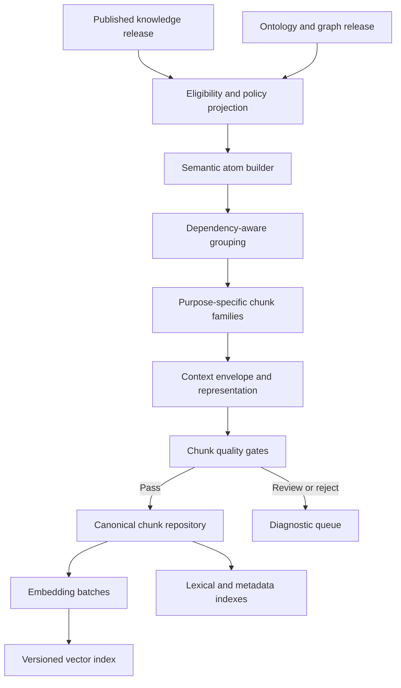

# ULIP Adaptive Chunking Engine

## 1. Purpose

The Adaptive Chunking Engine converts published knowledge assets and graph context into retrieval units that are concept-complete, learning-purpose aware, evidence-grounded, policy-safe, and suitable for embedding and hybrid search.

Chunking is adaptive because the same canonical knowledge can require different packaging for initial instruction, revision, worked problem solving, misconception repair, assessment preparation, professional reference, or experiential activity. Adaptation creates governed chunk families at publication time and authorized context envelopes at retrieval time. It never rewrites canonical knowledge for an individual learner.

Inputs are defined by [Knowledge Intelligence](05_knowledge_intelligence.md) and [Educational Ontology](04_educational_ontology.md). Platform indexing and serving are defined in [Platform Architecture](02_platform_architecture.md).

## 2. Goals

- Preserve complete educational meaning rather than arbitrary page or token windows.
- Keep claims, conditions, symbols, units, steps, examples, and evidence together.
- Represent relationships to prerequisites, misconceptions, competencies, and curricula.
- Optimize retrieval precision and context usefulness for different learning purposes.
- Support multilingual, multimodal, accessibility, and examination contexts.
- Produce deterministic, versioned, deduplicated, and policy-filterable records.
- Prevent learner data, restricted answers, or revoked content from leaking into embeddings.
- Enable exact reconstruction and reverse impact analysis.

## 3. Boundaries

### 3.1 Responsibilities

1. Select eligible published assets and graph neighborhoods.
2. Form semantic atoms and dependency-aware candidate groups.
3. Create purpose-specific chunk families and hierarchical summaries.
4. Enforce completeness, coherence, size, evidence, rights, and safety constraints.
5. Generate textual and structured representations for search and embedding.
6. Attach minimal filter metadata and full lineage references.
7. Evaluate chunk and retrieval quality.
8. Publish immutable chunk sets and embedding-space manifests.

### 3.2 Non-responsibilities

- OCR, layout recovery, or source normalization.
- Establishing concept truth or ontology identity.
- Estimating learner mastery.
- Granting access to content.
- Generating final learner responses.
- Treating model token limits as semantic boundaries.

## 4. Architecture



### 4.1 Components

| Component | Responsibility |
|---|---|
| Eligibility Filter | Lifecycle, trust, rights, audience, safety, evidence, and quality eligibility |
| Semantic Atom Builder | Minimal indivisible units and required attachment edges |
| Graph Grouper | Candidate subgraphs with prerequisite and explanatory closure |
| Purpose Planner | Select chunk template, granularity, and included asset roles |
| Boundary Optimizer | Choose boundaries under semantic and operational constraints |
| Representation Builder | Search text, structured content, media references, accessibility representation |
| Metadata Projector | Stable identifiers and approved filter fields |
| Quality Evaluator | Intrinsic, retrieval, educational, security, and regression gates |
| Chunk Publisher | Immutable chunk set, manifest, current alias, projection events |
| Embedding Coordinator | Model-specific preprocessing, batching, vector validation, index release |

## 5. Core Concepts

### 5.1 Semantic atom

A semantic atom is a knowledge element that cannot be split without losing meaning or correctness. Examples include:

- a proposition with its conditions and qualifier;
- a definition with defining characteristics;
- an equation with symbol definitions, units, assumptions, and validity domain;
- one procedure step with required decision condition, while the procedure remains an indivisible parent for instructional use;
- a table row with inherited headers and units;
- a figure with labels, caption, and equivalent textual description;
- a misconception with its correction;
- a question stem with its controlled answer linkage, subject to access policy.

Atoms reference canonical asset revisions and evidence. They do not duplicate canonical ownership.

### 5.2 Attachment rule

An attachment declares content that must travel with an atom for a given purpose. Types include:

- `requires-definition`;
- `requires-symbol-meaning`;
- `requires-condition`;
- `requires-prerequisite-summary`;
- `requires-caption`;
- `requires-safety`;
- `requires-counterexample`;
- `requires-source-attribution`;
- `answer-separate`.

Attachments can be hard or soft. A hard attachment cannot be dropped to satisfy size.

### 5.3 Chunk

A chunk is an immutable, purpose-labeled retrieval record containing:

- a coherent set of ordered semantic atoms;
- a primary concept and optional supporting concepts;
- one learning purpose and audience context;
- a self-contained search representation;
- structured payload references;
- exact evidence and derivation lineage;
- policy and trust metadata;
- quality measurements;
- parent, child, sibling, and related chunk links.

### 5.4 Chunk family

A family contains multiple valid views of the same concept neighborhood. Family members can include concept overview, definition, worked example, procedure, misconception repair, formula reference, assessment preparation, experiential activity, prerequisite bridge, and advanced composite.

Family members share a `family_id` but have independent chunk IDs, purposes, access policy, and quality results.

## 6. Chunk Types

| Type | Required content | Typical use |
|---|---|---|
| `concept_core` | definition, key attributes, scope, evidence | direct explanation and lookup |
| `concept_overview` | core plus relationships and concise examples | initial orientation |
| `worked_example` | problem context, method, steps, answer, assumptions | guided application |
| `procedure` | goal, prerequisites, ordered steps, checks, outcome, safety | practical or procedural learning |
| `formula_reference` | expression, symbols, units, assumptions, derivation link | problem solving |
| `misconception_repair` | misconception, diagnostic cue, correction, contrast | remediation |
| `prerequisite_bridge` | target, missing prerequisites, connecting explanation | adaptive transition |
| `comparison` | aligned dimensions, similarities, differences, boundary cases | concept discrimination |
| `case_or_scenario` | context, evidence, analysis, outcome, limitations | transfer and professional learning |
| `assessment_context` | objective, assessed concepts, evidence expectations, allowed hints | question selection or authoring |
| `experiential_activity` | goal, materials, setting, actions, observation, reflection, safety | project, lab, DIY, field learning |
| `composite_reasoning` | connected concepts, reasoning chain, representations, prerequisites | advanced and competitive preparation |
| `hierarchical_summary` | scoped summary and child references | broad retrieval and navigation |

Assessment answers and solutions are separate chunks or protected fields so policy can expose the stem without leaking the answer.

## 7. Chunk Contract

```json
{
  "chunk_id": "opaque-deterministic-id",
  "chunk_revision_id": "opaque-immutable-id",
  "family_id": "opaque-deterministic-id",
  "chunk_type": "concept_core",
  "learning_purpose": "initial_instruction",
  "primary_concept": "concept-uri",
  "supporting_concepts": ["concept-uri"],
  "content": {
    "search_text": "Self-contained representation",
    "sections": [],
    "structured_refs": []
  },
  "context": {
    "language": "en-IN",
    "curriculum_refs": [],
    "level_profile_ref": "asset-revision-id",
    "audience_profile": "audience-profile-id",
    "prerequisite_refs": []
  },
  "evidence": [],
  "lineage": {
    "knowledge_release": "release-id",
    "asset_revisions": [],
    "ontology_release": "release-id",
    "chunk_policy": "policy-id"
  },
  "policy": {
    "tenant_scope": "opaque-id",
    "trust_tier": "verified",
    "rights_policy_ref": "policy-id",
    "answer_visibility": "not_applicable"
  },
  "quality": {},
  "schema_version": "1.0.0",
  "content_digest": "sha256:..."
}
```

`search_text` is derived and reconstructible. It is not the system of record. Full source excerpts, personal data, and large binary content are not stored as vector payload metadata.

## 8. Semantic Boundary Algorithm

### 8.1 Inputs

The engine pins:

- knowledge release and eligible asset revisions;
- ontology and graph release;
- audience, curriculum, language, trust tier, and learning purpose;
- chunk policy and quality thresholds;
- tokenizer profile and maximum storage limits;
- embedding preparation profile.

### 8.2 Atomization

Assets are converted to typed atoms using asset-specific rules. Atomization preserves authored order and all hard attachments. Tables and media yield structured atoms plus equivalent search representations. Atom IDs derive from asset revision, semantic role, and stable local path.

### 8.3 Candidate graph

The candidate graph includes:

- atom containment and order;
- concept references;
- hard and soft attachments;
- prerequisite and explanatory dependencies;
- example, misconception, representation, and objective links;
- source continuity and discourse relations;
- rights and visibility compatibility.

Incompatible policy classes cannot occupy one chunk.

### 8.4 Boundary objective

Candidate grouping maximizes:

```text
semantic_coherence
+ learning_purpose_coverage
+ self_containment
+ evidence_density
+ retrieval_distinctiveness
+ source_continuity
- redundancy
- concept_drift
- unsupported_context
- operational_size_penalty
```

Weights are policy-versioned and evaluated by domain and chunk type. Hard constraints always override the objective.

### 8.5 Hard constraints

- All atoms and attachments fit the same tenant, rights, answer visibility, safety, and trust policy.
- Primary concept and learning purpose are explicit.
- A claim retains conditions, qualifiers, and evidence.
- A formula retains symbols, assumptions, and units.
- A procedure retains necessary order and safety constraints.
- A table retains inherited headers and units.
- A misconception cannot be detached from its correction in a remediation chunk.
- Chunk graph is connected under allowed relation types.
- Required source and asset references resolve.
- Search representation fits the hard storage limit.

### 8.6 Size handling

Size is a constraint after semantics. When a candidate exceeds limits, the engine applies this order:

1. remove redundant soft context;
2. replace eligible prerequisite detail with a linked verified summary;
3. partition along discourse or graph-community boundaries;
4. create parent summary and child chunks;
5. retain an oversized exception if the backend supports it and quality policy permits;
6. reject or review if no semantically valid representation fits.

The engine never cuts at a raw token boundary inside an atom.

### 8.7 Merge and split stability

Tie-breaking uses stable identifiers and source order. The algorithm records boundary decisions and objective components. Minor metadata changes that do not affect semantics do not change chunk identity. Asset revision or policy changes that alter content create a new chunk revision or family as defined by identity rules.

## 9. Adaptive Packaging

### 9.1 Publication-time adaptation

ULIP precomputes chunk families for approved purposes, audiences, languages, curricula, and level profiles. This makes quality review and indexing reproducible.

Examples:

- A beginner `concept_overview` includes terminology, one concrete example, and prerequisite summaries.
- An advanced `composite_reasoning` chunk includes multiple connected concepts, assumptions, alternative representations, and a reasoning chain.
- A language-learning chunk may combine an utterance, meaning, register, pronunciation reference, and productive task.
- A DIY procedure includes materials, tools, sequence, hazard controls, checkpoints, and expected result.
- An experiential activity includes observation prompts and reflection evidence, not only background text.

### 9.2 Retrieval-time context envelopes

The serving plane may assemble an ephemeral envelope from published chunks using:

- learner goal and approved mastery-band features;
- requested curriculum and level;
- modality and accessibility preference;
- language and locale;
- available time and session purpose.

The envelope references original chunks, applies authorization first, and records assembly policy. It is not embedded, promoted to canonical content, or used for general model training. Personal data is not inserted into chunk text.

### 9.3 Adaptation safety

- Adaptation changes selection, ordering, scaffolding, and representation, not factual truth.
- A lower reading level cannot remove essential conditions or safety constraints.
- Mastery estimates can suppress redundant scaffolding but not required evidence or prerequisites for a controlled task.
- Accessibility representations remain semantically equivalent and retain provenance.
- Age policy can restrict content; it cannot relabel restricted content as safe.

## 10. Multilingual and Multimodal Chunking

### 10.1 Multilingual

Chunks use one primary language. Parallel translations are separate revisions or linked chunks sharing concept and family identity. Cross-language search can use multilingual embeddings or query translation, but retrieved text retains its language and translation provenance.

Terminology, symbols, examples, directionality, and locale-sensitive units remain intact. Code-switching is allowed when pedagogically intentional and explicitly tagged.

### 10.2 Tables

A table chunk includes title, purpose, applicable notes, serialized headers, units, relevant rows, and cell anchors. Large tables can create a parent schema chunk plus row-group children with inherited context.

### 10.3 Equations

Equation chunks expose normalized plain text for search and structured math for rendering. Spoken-math or equivalent text can be included for accessibility. Symbol collisions across disciplines are disambiguated by concept and context.

### 10.4 Figures and diagrams

Media chunks include permitted media reference, authored caption, labels, equivalent description, discussed concept, and evidence. Generated descriptions are marked as synthesized and quality-gated. Visual-only meaning cannot be declared accessible without equivalent representation.

### 10.5 Code, procedures, and creative works

Code retains syntax, runtime context, and explanatory linkage. Procedures preserve order. Creative works can retain excerpt boundaries required for interpretation but follow rights limits; embeddings must not contain prohibited full-text reproductions.

## 11. Embedding Preparation

### 11.1 Embedding record

The embedding coordinator emits:

```json
{
  "record_id": "chunk-revision-id",
  "text": "approved search representation",
  "metadata": {
    "tenant_id": "opaque-id",
    "chunk_type": "concept_core",
    "language": "en-IN",
    "primary_concept": "concept-uri",
    "trust_tier": "verified",
    "corpus_release": "release-id",
    "rights_class": "institutional"
  },
  "embedding_profile": "profile-id",
  "text_digest": "sha256:..."
}
```

Metadata is an allowlisted projection. Sensitive evidence excerpts, learner data, assessment answers, and access-control internals are excluded.

### 11.2 Vector-space invariants

1. One physical index contains one embedding model, revision, dimensionality, normalization, distance metric, and preprocessing profile.
2. The vector count and dimensions match the manifest before alias promotion.
3. Every vector resolves to one published chunk revision.
4. Revoked, superseded, or unauthorized chunks are filtered by backend query and post-retrieval enforcement.
5. Embedding input digest is retained, enabling exact regeneration.
6. No vector is accepted with NaN, infinity, zero norm where unsupported, or unexpected dimensions.

### 11.3 Index release

Embeddings are written to a versioned index. Validation samples confirm nearest-neighbor behavior, policy filters, counts, and payload integrity. An atomic alias switch promotes the index. Prior indexes remain available for rollback until retention and revocation rules permit deletion.

## 12. Retrieval Contract

Chunk retrieval accepts:

- tenant and authorization context;
- query and language;
- learning purpose;
- concept, curriculum, competency, level, and modality filters;
- minimum trust tier;
- corpus release or alias;
- requested result and context budgets.

Results include chunk revision, score components, matched representation, concept and level context, evidence references, policy-safe excerpt, and exact corpus and index releases.

Hybrid retrieval combines lexical, vector, metadata, and graph signals. Score fusion and reranking are versioned. Primary selection considers relevance, evidence quality, learning-purpose fit, prerequisite suitability, diversity, source authority, and redundancy.

## 13. Chunk Invariants

1. Every chunk references published, eligible asset revisions.
2. Every claim in search text is reconstructible from referenced assets.
3. Every chunk has one primary learning purpose and concept or explicitly scoped composite.
4. No chunk crosses tenant, rights, trust, answer visibility, or incompatible safety boundaries.
5. Chunk text contains no learner-specific data.
6. Hard semantic attachments are present.
7. Evidence anchors resolve through the pinned knowledge release.
8. Parent and child relations are acyclic and contained within compatible policy.
9. Generated summaries are labeled and claim-support validated.
10. Chunk IDs and revisions are deterministic under the published identity policy.
11. Revoked chunks cannot be returned through any active index alias.
12. Operational size limits never justify semantically incomplete output.

## 14. Quality Gates

### 14.1 Intrinsic quality

- semantic coherence and topic focus;
- self-containment for declared purpose;
- claim and evidence coverage;
- attachment completeness;
- correct concept, curriculum, and level metadata;
- redundancy and contradiction handling;
- language and terminology quality;
- structured media preservation;
- policy compatibility.

### 14.2 Retrieval quality

Evaluation sets are stratified by language, domain, grade or stage, curriculum, purpose, chunk type, and query form. Measures include:

- recall at K and normalized discounted cumulative gain;
- concept and evidence precision;
- answer-support recall;
- no-result and false-broadening rates;
- duplicate-family saturation;
- prerequisite and level suitability;
- citation resolvability;
- answer leakage and unauthorized-result rate;
- context utilization in grounded generation.

### 14.3 Publication thresholds

Schema, lineage, policy, evidence, answer-leakage, and unauthorized-result tests are blocking. Retrieval metric regressions beyond the approved tolerance block alias promotion. Human review is required for complex split failures, controlled assessment chunks, safety-critical procedures, and generated accessibility descriptions under configured policy.

## 15. Security, Privacy, Rights, and Safety

- Eligibility evaluates rights and privacy before representation or embedding.
- Chunk workers use artifact-scoped credentials and cannot access learner stores.
- Vector filters are mandatory but not trusted as the sole authorization layer.
- Query and result caches include authorization and corpus fingerprints.
- Assessment stems, hints, answers, and solutions use separate visibility labels and, when required, separate indexes.
- Rights expiry triggers immediate serving denial followed by asynchronous index cleanup.
- Provider embedding is permitted only for approved data classes, regions, retention, and no-training terms.
- Search text is scanned for accidental personal data, secrets, hidden prompt instructions, and disallowed source reproduction.
- Safety constraints remain hard attachments on practical, laboratory, field, and professional chunks.

## 16. Failure Handling

| Failure | Response |
|---|---|
| Missing or revoked asset | Exclude candidate and invalidate dependent chunk revisions |
| Incompatible policy within candidate | Split on policy boundary or reject |
| Oversized indivisible atom | Use supported oversized record or review; never truncate |
| Missing formula or table context | Fail completeness gate and return diagnostic |
| Model summary unsupported | Reject summary; use extractive representation if valid |
| Embedding provider unavailable | Retain canonical chunks, retry with budget, or build a separately versioned approved profile |
| Vector validation failure | Reject index promotion and keep current alias |
| Partial indexing | Continue serving prior complete release |
| Retrieval quality regression | Freeze promotion, compare boundary and model changes, reprocess |
| Rights revocation during build | Cancel affected batches and invalidate candidate manifest |

Stages are idempotent. Batches checkpoint chunk revision and text digest. Retrying cannot create duplicate canonical records.

## 17. Observability

### 17.1 Processing metrics

- atoms, candidates, chunks, and families by type and language;
- merge, split, oversized, rejected, and review rates;
- token and character distributions without logging text;
- hard-attachment failures and policy-boundary splits;
- embedding throughput, latency, cost, fallback, and invalid-vector counts;
- publication-to-index convergence.

### 17.2 Quality and serving metrics

- intrinsic quality dimensions and gate failures;
- retrieval relevance, evidence precision, level fit, and family diversity;
- no-result, stale-result, and unauthorized-result detections;
- citation resolution and generation context-use rate;
- answer leakage test results;
- drift by domain, language, curriculum, and embedding profile;
- revocation propagation and index parity.

Traces connect source, knowledge release, chunk revision, embedding batch, index release, retrieval receipt, and generated response. Metrics use bounded dimensions and never include query or chunk text.

## 18. Non-Functional Requirements

| Requirement | Target |
|---|---|
| Determinism | Same pinned inputs produce the same atom, chunk, and boundary identities |
| Scale | Billions of published chunks through tenant and corpus partitioning |
| Throughput | Horizontal chunk and embedding batches with bounded provider concurrency |
| Resumability | Continue from completed asset or batch checkpoints |
| Index atomicity | Serving sees complete prior or complete new index release |
| Retrieval availability | 99.95% monthly through serving plane |
| Retrieval latency | Chunk retrieval p95 under 700 ms, excluding generation |
| Revocation block | New serving denied within 60 seconds of control-plane revocation |
| Rebuildability | All indexes reconstruct from canonical chunk manifests |
| Portability | Embedding records and chunk repository export in vendor-neutral schemas |

## 19. Versioning and Change Management

- Chunk schema, atomization rules, boundary policy, templates, tokenizer profile, representation builder, and quality policy are independently versioned.
- A chunk release pins exact knowledge and ontology releases.
- Content changes create a new chunk revision. Context-only metadata changes follow declared identity rules and still produce an immutable release.
- An embedding profile includes model artifact digest, tokenizer, preprocessing, dimensions, normalization, metric, provider, and license.
- A new embedding profile always builds a separate index.
- Boundary or representation changes run offline retrieval evaluation and corpus impact analysis before promotion.
- Release aliases promote atomically and support rollback.
- Old chunk revisions remain resolvable for evidence and replay until retention allows removal.

## 20. Traceability

For any vector or search result, ULIP can traverse:

```text
index record
  -> chunk revision and boundary decision
  -> semantic atoms and asset revisions
  -> knowledge and ontology releases
  -> propositions, DIR blocks, and evidence anchors
  -> immutable source version
```

Reverse lineage identifies all chunk families, embeddings, indexes, retrieval caches, and generated outputs affected by a source correction, concept migration, asset revision, rights change, or policy update.

## 21. Related Architecture

- [System Vision](01_system_vision.md)
- [Platform Architecture](02_platform_architecture.md)
- [Document Intelligence](03_document_intelligence.md)
- [Educational Ontology](04_educational_ontology.md)
- [Knowledge Intelligence](05_knowledge_intelligence.md)
