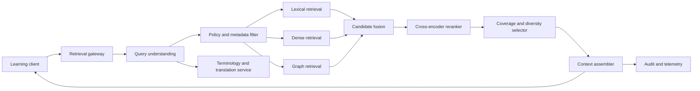

# Contextual Retrieval Architecture

## Purpose

The contextual retrieval service selects the smallest evidence set that can answer a learning request accurately, at the requested curriculum and learner level, while preserving enough provenance to audit every claim. It supports explanations, tutoring, assessment authoring, competitive-exam practice, and learning-path planning.

The service is hybrid by design. Lexical search protects exact terminology, formulas, names, and rare entities. Dense search handles paraphrase and multilingual similarity. The knowledge graph supplies prerequisites and structurally related concepts. A cross-encoder reranker makes the final relevance decision. No single retrieval signal is authoritative.

## Scope and guarantees

For every accepted response context, the service guarantees:

1. Every evidence span resolves to an immutable source revision and source locator.
2. Curriculum, jurisdiction, language, age or level, licensing, and tenant access rules are applied before ranking whenever they can be expressed as store filters.
3. Reranking cannot reintroduce a candidate removed by an authorization or policy filter.
4. A generated answer can cite only evidence identifiers present in the returned context manifest.
5. Conflicting sources are surfaced, not silently merged.
6. Retrieval abstains when evidence coverage or confidence is below the configured policy threshold.

Chunk production is defined in [Multi-resolution Chunks](08_multiresolution_chunks.md). Graph expansion is defined in [Knowledge Graph Architecture](09_knowledge_graph_architecture.md). Assessment and pathway consumers are defined in [Assessment Intelligence](10_assessment_intelligence.md) and [Learning Path Engine](12_learning_path_engine.md).

## System context



The gateway is stateless. Search indexes hold only published artifacts. Canonical metadata and graph relations are read from the versioned knowledge registry. A retrieval request is pinned to one `knowledge_snapshot_id`, preventing mixed-version contexts during an index rollout.

## Request contract

```json
{
  "request_id": "uuid",
  "tenant_id": "tenant-acme",
  "actor_id": "opaque-subject-id",
  "query": "Why does increasing temperature shift this equilibrium?",
  "query_language": "en-IN",
  "response_language": "en-IN",
  "curriculum": {
    "framework_id": "cbse",
    "framework_version": "2026",
    "jurisdiction": "IN",
    "grade_band": "11-12",
    "exam_ids": ["jee-main"]
  },
  "learner": {
    "age_band": "16-18",
    "proficiency_band": "advanced",
    "accessibility_needs": ["plain_math_alt_text"]
  },
  "intent": "explain",
  "concept_hints": ["concept:chemical-equilibrium"],
  "filters": {
    "source_ids": [],
    "content_types": ["definition", "derivation", "worked_example"],
    "license_classes": ["owned", "open"]
  },
  "retrieval_policy": "grounded_learning_v3",
  "knowledge_snapshot_id": "ks_2026_07_21_01",
  "max_context_tokens": 6000,
  "deadline_ms": 900
}
```

Required fields are `request_id`, `tenant_id`, `query`, `query_language`, `intent`, `retrieval_policy`, and `knowledge_snapshot_id`. The gateway derives authorization from the authenticated principal, never from client-supplied identifiers alone. Unknown curriculum or proficiency values are rejected with `INVALID_SCOPE`, rather than widened silently.

Supported intents are `lookup`, `explain`, `compare`, `solve`, `assess`, `remediate`, and `plan`. Intent controls ranking features and evidence coverage requirements, not access control.

## Query understanding

Query understanding is deterministic where possible and model-assisted where necessary:

1. Normalize Unicode, mathematical symbols, whitespace, and locale-specific numerals while retaining an unmodified query for audit.
2. Detect language and script. A client language declaration that disagrees strongly with detection is recorded as a warning.
3. Classify intent and extract concepts, entities, units, equations, curriculum terms, and requested cognitive operation.
4. Resolve extracted terms to canonical concept identifiers using aliases scoped by language, curriculum, and subject.
5. Produce lexical variants, transliterations, and a pivot-language semantic representation. Translated strings augment the query and never replace the original.
6. Identify ambiguity. For high-impact ambiguity, return a clarification request. For low-impact ambiguity, retrieve each interpretation and label it.

The query-understanding result includes model version, prompt or rule version, term mappings, confidence, and all expansions. Personally identifying learner data is not included in embedding text.

## Candidate generation

### Mandatory filtering

The following predicates are applied before candidate scoring:

- tenant and principal access
- source publication state
- license and regional use
- `knowledge_snapshot_id`
- curriculum compatibility
- requested language or approved fallback language
- content safety and age suitability
- valid-time and system-time visibility

When strict curriculum filtering would produce no evidence, the service may use explicitly cross-walked equivalent concepts. It labels the evidence `curriculum_fallback` and lowers the curriculum score. It does not fall back to unrelated curricula.

### Lexical retrieval

BM25F searches title, canonical concept name, aliases, body, formulas, and source headings with field-specific boosts. Formula tokens, chemical notation, citations, and named entities are indexed without stemming. The lexical retriever returns the top 100 candidates per query interpretation.

### Dense retrieval

Dense search uses a versioned multilingual embedding model over leaf and concept-summary chunks. Query and document embeddings must share `embedding_model_id` and normalization settings. Approximate nearest-neighbor search returns the top 100 candidates per query interpretation. A shadow index is built and evaluated before any embedding migration.

### Graph retrieval

Resolved concepts seed a bounded, typed graph expansion. Allowed edges depend on intent:

| Intent | Preferred relations | Maximum depth |
| --- | --- | ---: |
| `lookup` | `defines`, `alias_of`, `part_of` | 1 |
| `explain` | `prerequisite_of`, `explains`, `example_of` | 2 |
| `compare` | `contrasts_with`, shared parents | 2 |
| `solve` | `prerequisite_of`, `applies_to`, `uses_formula` | 3 |
| `assess` | `measures`, `misconception_of`, `prerequisite_of` | 2 |
| `remediate` | reverse `prerequisite_of`, `misconception_of` | 3 |
| `plan` | `prerequisite_of`, `maps_to_competency` | policy bounded |

Only approved edges at the pinned graph version participate. Cycles and fan-out caps are enforced as specified in [Knowledge Graph Architecture](09_knowledge_graph_architecture.md).

## Fusion and ranking

Candidates from each retriever are deduplicated by `semantic_unit_id` and source-span overlap. Reciprocal rank fusion gives robust initial ordering:

\[
RRF(d)=\sum_{r \in \{lexical,dense,graph\}}\frac{w_r}{k+\operatorname{rank}_r(d)}
\]

`k` is fixed at 60. Default weights are lexical `1.0`, dense `1.0`, and graph `0.7`; the policy registry may set intent-specific weights. Missing ranks contribute zero.

The top 150 fused candidates are scored by a multilingual cross-encoder. The final score is:

\[
S(d,q)=0.52C+0.13L+0.10G+0.08U+0.07A+0.05Q+0.05P-\Pi
\]

where:

- \(C\): calibrated cross-encoder relevance
- \(L\): normalized lexical score
- \(G\): typed graph proximity with path confidence
- \(U\): curriculum and exam alignment
- \(A\): age, proficiency, and language fit
- \(Q\): source and extraction quality
- \(P\): provenance completeness
- \(\Pi\): penalties for staleness, fallback translation, duplicate coverage, unresolved conflict, or unsupported level

All components are normalized to `[0,1]`. Configuration is identified by `ranking_policy_version`. Weights change only after offline judgment-set evaluation and an online guarded rollout. Source prestige is never used as a substitute for relevance, and source popularity is not a feature.

## Coverage and diversity selection

The selector maximizes evidence coverage within the token budget. It uses maximal marginal relevance:

\[
MMR(d)=\lambda S(d,q)-(1-\lambda)\max_{s\in Selected}\operatorname{sim}(d,s)
\]

with default \(\lambda=0.72\). Selection is constrained to:

- include direct evidence for each material sub-question
- include prerequisite evidence only when needed for comprehension
- include at least two independent sources for high-stakes disputed claims when available
- cap any source revision at 60 percent of context tokens
- preserve complete formulas, tables, examples, and citation boundaries
- exclude mutually inconsistent claims unless both are labeled as a conflict set

Parent summaries may establish orientation, but leaf evidence carries citations. Neighbor windows are added only when a leaf span contains unresolved pronouns, omitted definitions, or split mathematical reasoning. Multi-resolution assembly rules are detailed in [Multi-resolution Chunks](08_multiresolution_chunks.md).

## Response and citation contract

```json
{
  "request_id": "uuid",
  "status": "OK",
  "knowledge_snapshot_id": "ks_2026_07_21_01",
  "ranking_policy_version": "grounded_learning_v3.4",
  "query_analysis": {
    "intent": "explain",
    "resolved_concepts": ["concept:le-chatelier-principle"],
    "interpretation_confidence": 0.94
  },
  "evidence": [
    {
      "evidence_id": "ev_01J...",
      "chunk_id": "chk_01J...",
      "semantic_unit_id": "su_01J...",
      "resolution": "leaf",
      "text": "An increase in temperature...",
      "score": 0.91,
      "score_breakdown": {
        "cross_encoder": 0.94,
        "lexical": 0.71,
        "graph": 0.88,
        "curriculum": 1.0,
        "level": 0.92,
        "quality": 0.89,
        "provenance": 1.0,
        "penalty": 0.0
      },
      "concept_ids": ["concept:le-chatelier-principle"],
      "source": {
        "source_id": "src_01J...",
        "source_revision_id": "sr_01J...",
        "title": "Chemistry, Grade 12",
        "locator": {"page": 173, "section": "7.8", "char_start": 812, "char_end": 1049},
        "content_hash": "sha256:...",
        "license_class": "owned"
      },
      "transformations": ["ocr_v5", "layout_v3"],
      "conflict_set_id": null
    }
  ],
  "coverage": {
    "subquestions": 1,
    "supported_subquestions": 1,
    "estimated_claim_coverage": 0.93
  },
  "warnings": [],
  "trace_id": "00-..."
}
```

Status values are `OK`, `PARTIAL`, `ABSTAIN`, `CLARIFICATION_REQUIRED`, `INVALID_SCOPE`, and `POLICY_DENIED`. `PARTIAL` identifies unsupported sub-questions explicitly. `ABSTAIN` returns no answer-ready context and includes a machine-readable reason such as `INSUFFICIENT_EVIDENCE`, `CONFLICT_UNRESOLVED`, or `INDEX_UNAVAILABLE`.

## Multilingual behavior

Canonical concepts have language-independent identifiers and language-specific labels. Retrieval runs against the original language and approved query expansions. A cross-language hit is eligible only if:

- the source language is known;
- the response system can quote it faithfully or provide a labeled translation;
- terminology mappings are curriculum-scoped;
- mathematical and named-entity fidelity checks pass.

The response includes source text and translation provenance. Translation confidence below `0.85`, or any changed quantity, unit, negation, formula, or answer option, forces review or abstention for assessment use.

## Caching and lifecycle

Cache keys include the normalized query hash, authorization-policy digest, learner-band digest, retrieval policy, language pair, and `knowledge_snapshot_id`. Cached evidence never outlives the earliest source revocation or policy expiration. User identity, raw profile data, and free-text conversation history are excluded from shared cache keys and values.

An index release progresses through `building`, `validated`, `shadow`, `active`, `retiring`, and `deleted`. Activation atomically updates the snapshot pointer. Rollback restores the previous pointer without rewriting records. Retrieval traces retain all model, index, graph, and policy versions needed for replay.

## Security and guardrails

- Enforce authorization at gateway and storage layers using tenant-scoped credentials.
- Treat source text and user queries as untrusted data. Retrieved instructions never alter system policy or tool permissions.
- Strip active content, macros, scripts, and hidden OCR layers during ingestion.
- Parameterize all metadata and graph queries. Client filters are parsed into an allowlisted abstract syntax tree.
- Encrypt traffic and storage; tokenize actor identifiers in telemetry.
- Apply rate, cost, fan-out, and deadline limits per tenant.
- Exclude learner-sensitive attributes from ranking except explicit accessibility and pedagogical adaptation fields.
- Log policy decisions without logging unnecessary query or evidence text.
- Support source takedown by revision, tenant, jurisdiction, and license class with bounded cache invalidation.

## Observability and service objectives

Every stage emits an OpenTelemetry span carrying `request_id`, snapshot versions, candidate counts, filter counts, model identifiers, latency, and fallback reason. Text and embeddings are not span attributes.

| Signal | Production objective |
| --- | ---: |
| Gateway availability | 99.9% monthly |
| p95 latency, normal query | <= 900 ms |
| p99 latency, normal query | <= 1.8 s |
| Citation resolvability | >= 99.99% |
| Authorization-filter escapes | 0 |
| Empty result rate on answerable benchmark | <= 2% |
| Context duplication ratio | <= 0.15 |
| Version-mixed contexts | 0 |

Dashboards segment quality and latency by language, curriculum, subject, age band, intent, source class, and retrieval route. Alerts fire on embedding drift, abnormal filter-drop rates, unresolved citations, index freshness lag, cross-language regression, and increased abstention.

## Validation

Offline evaluation uses adjudicated, versioned query sets containing answerable, unanswerable, ambiguous, multilingual, curriculum-specific, formula-heavy, and adversarial prompts.

Required release gates:

- Recall@20 `>= 0.92` for gold evidence
- nDCG@10 `>= 0.85`
- MRR@10 `>= 0.82`
- evidence precision@5 `>= 0.88`
- claim coverage `>= 0.90`
- citation entailment `>= 0.95`
- curriculum-fit accuracy `>= 0.97`
- age or level-fit accuracy `>= 0.95`
- unanswerable abstention F1 `>= 0.90`
- no protected-slice metric may regress by more than 3 percentage points

Human raters assess relevance, sufficiency, source faithfulness, curriculum fit, reading-level fit, and conflict handling using blinded pairwise comparisons. Online experiments use interleaving or tenant-level allocation, monitor downstream answer correctness and learner harm indicators, and retain an immediate rollback switch.

## Failure handling

| Failure | Behavior |
| --- | --- |
| Dense index unavailable | Continue with lexical and graph retrieval; mark degraded route |
| Lexical index unavailable | Continue with dense and graph retrieval; raise operations alert |
| Graph unavailable | Retrieve without expansion; do not infer prerequisites |
| Reranker timeout | Use calibrated fused score and reduce confidence |
| Snapshot mismatch | Fail closed with `INDEX_UNAVAILABLE` |
| Source locator cannot resolve | Drop candidate and increment provenance error |
| Conflicting authoritative sources | Return labeled conflict set or abstain |
| Token budget too small | Preserve highest-coverage leaf evidence; omit orientation summaries |
| Unsupported language | Request approved fallback or return `INVALID_SCOPE` |
| Authorization service unavailable | Fail closed with `POLICY_DENIED` |

Degraded retrieval is never described as fully grounded. The response contract carries route, warnings, and reduced coverage so downstream systems can lower autonomy or require review.
