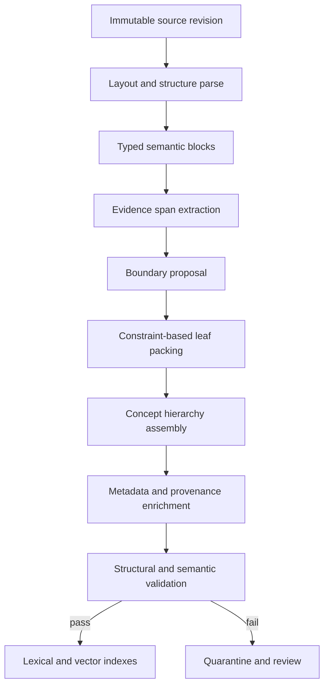
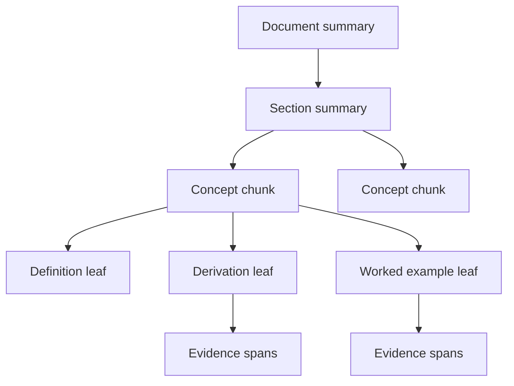

# Multi-resolution Chunk Architecture

## Purpose

Multi-resolution chunks preserve educational meaning at several granularities so retrieval can match a precise fact, explain a complete concept, or orient a learner within a chapter without losing source traceability. Chunk boundaries follow semantic and pedagogical structure, not fixed page or token counts.

The architecture produces an immutable hierarchy:

1. **Evidence span**: the smallest source-grounded statement, equation, table region, diagram region, or worked step that can be cited.
2. **Leaf chunk**: one coherent learning unit, such as a definition with qualifiers, one derivation, one worked example, or one misconception and correction.
3. **Concept chunk**: a synthesis of leaves that explains one canonical concept.
4. **Section summary**: an orientation artifact over related concepts.
5. **Document summary**: a navigational artifact over a source revision.

Evidence spans and leaf chunks support claims. Synthesized parent chunks support discovery and orientation. A parent cannot serve as sole evidence unless every statement has an explicit child-evidence map.

## Design principles

- **Concept completeness**: keep a definition with its constraints, variables, units, and exceptions.
- **Pedagogical atomicity**: one leaf has one dominant learning purpose.
- **Structure preservation**: never separate a table from its headers, a figure from its caption and references, or a solution step from required prior steps.
- **No invented bridges**: overlap is produced from adjacent source spans, never model-generated filler.
- **Stable identity**: unchanged semantic units retain identity across republishing even if storage layout changes.
- **Language parity**: language variants map to one canonical concept but retain independent source and translation provenance.
- **Level specificity**: reading level, cognitive demand, curriculum, and exam tags are explicit metadata, not inferred at request time.

The retrieval use of this hierarchy is specified in [Contextual Retrieval](07_contextual_retrieval.md). Concept and relation identifiers come from [Knowledge Graph Architecture](09_knowledge_graph_architecture.md).

## Pipeline



All stages are idempotent with respect to `source_revision_id`, stage configuration, and model version. Stage outputs are content-addressed.

## Source block model

The layout parser emits ordered blocks with source coordinates:

```json
{
  "block_id": "blk_01J...",
  "source_revision_id": "sr_01J...",
  "page": 42,
  "reading_order": 17,
  "block_type": "equation",
  "text": "F = ma",
  "bbox": [92.3, 211.7, 301.4, 248.6],
  "style": {
    "heading_level": null,
    "font_role": "display_math",
    "list_depth": 0
  },
  "references": ["blk_caption_12"],
  "ocr_confidence": 0.99,
  "content_hash": "sha256:..."
}
```

Block types are `heading`, `paragraph`, `list_item`, `equation`, `table`, `figure`, `caption`, `code`, `example`, `exercise`, `solution`, `footnote`, and `callout`. Tables additionally preserve cells, row and column headers, spans, and reading order. Equations preserve source representation plus normalized MathML or LaTeX when available. Figures retain a reference to the original region and approved alternative text.

## Boundary detection

Candidate boundaries receive a score:

\[
B_i=0.30H_i+0.22T_i+0.18D_i+0.12R_i+0.10L_i+0.08S_i-P_i
\]

where:

- \(H_i\): heading or explicit structural boundary
- \(T_i\): topic-shift probability between adjacent blocks
- \(D_i\): discourse closure, such as completed definition or argument
- \(R_i\): rhetorical-role transition
- \(L_i\): list, example, exercise, or solution closure
- \(S_i\): sentence-boundary confidence
- \(P_i\): split penalty for protected structures

A boundary is eligible at `B_i >= 0.62`. The policy registry versions weights and thresholds by content family, such as textbook, statute, source code, or lecture transcript.

Protected structures impose an infinite split penalty:

- equation with immediately following variable definitions or constraints
- table with headers, notes, and caption
- figure with caption and in-text explanatory reference
- worked example with stem, givens, steps, and final answer
- definition with exceptions or qualifiers
- ordered procedure whose later steps depend on earlier steps
- question with answer choices, key, rationale, and distractor explanations
- code listing with required imports or declarations

## Leaf packing algorithm

Leaf chunks are produced by constrained dynamic programming over candidate boundaries. The objective minimizes:

\[
Cost(c)=2.0\,Split(c)+1.4\,Incoherence(c)+0.8\,SizePenalty(c)+0.6\,Orphan(c)
\]

subject to:

- exactly one dominant concept or pedagogical role
- all source blocks are contiguous, except linked captions and footnotes
- no protected structure is split
- source ordering is preserved
- hard serialized size does not exceed 1,800 model tokens

The preferred leaf range is 180 to 700 tokens. These are operating bounds, not boundary causes. A semantically complete unit below 180 tokens remains intact and is enriched with a parent breadcrumb for indexing. A protected unit above 1,800 tokens becomes a structured compound chunk whose independently retrievable children retain ordered dependency links.

### Overlap

Overlap is selective:

- include up to two preceding sentences when they resolve a pronoun, symbol, or omitted subject;
- include the defining heading path on every leaf;
- include required equation-variable definitions by reference or duplication;
- never overlap an answer key into a question-only learner view;
- cap copied text at 15 percent of a leaf.

Copied spans carry `overlap_of_span_id`, allowing deduplication and preventing repeated text from being counted as independent evidence.

## Semantic roles

Each leaf has one primary role and zero or more supporting roles:

- `definition`
- `explanation`
- `principle`
- `fact`
- `formula`
- `derivation`
- `process`
- `worked_example`
- `case_study`
- `misconception`
- `correction`
- `exercise`
- `solution`
- `assessment_rationale`
- `diagram_explanation`

Role classification combines source structure, deterministic rules, and a versioned classifier. Confidence below `0.80` results in `unclassified`, not a guessed high-impact role. Assessment content is additionally protected by the controls in [Assessment Intelligence](10_assessment_intelligence.md).

## Hierarchy assembly

Leaf chunks map to canonical concepts using evidence-backed aliases and curriculum context. A leaf may reference several concepts, but exactly one is primary unless it is explicitly a `comparison` or `composite_problem`.

Concept chunks are assembled from approved leaves using a fixed pedagogical order:

1. concise meaning
2. why it matters
3. mechanism or derivation
4. constraints and exceptions
5. worked example
6. common misconception
7. assessment opportunity

A concept chunk contains a `claim_evidence_map`. Model-generated synthesis is rejected if any material sentence lacks supporting evidence or contradicts a child. Section and document summaries use the same rule and include no claims derived only from another generated summary.



## Chunk contract

```json
{
  "chunk_id": "chk_01J...",
  "chunk_version": 4,
  "semantic_unit_id": "su_01J...",
  "resolution": "leaf",
  "primary_role": "worked_example",
  "supporting_roles": ["formula", "explanation"],
  "title": "Applying conservation of momentum",
  "body": "A 2 kg cart...",
  "language": "en-IN",
  "script": "Latn",
  "token_count": 384,
  "content_hash": "sha256:...",
  "parent_ids": ["chk_concept_01J..."],
  "child_ids": [],
  "previous_leaf_id": "chk_01H...",
  "next_leaf_id": "chk_01K...",
  "primary_concept_id": "concept:linear-momentum-conservation",
  "concept_ids": [
    "concept:momentum",
    "concept:linear-momentum-conservation"
  ],
  "curriculum_mappings": [
    {
      "framework_id": "cbse",
      "framework_version": "2026",
      "node_id": "phy-11-05-03",
      "alignment": "teaches",
      "confidence": 0.96
    }
  ],
  "learner_fit": {
    "age_bands": ["14-16", "16-18"],
    "proficiency_bands": ["intermediate"],
    "reading_level": {"scale": "cefr", "value": "B2"},
    "cognitive_demand": "apply"
  },
  "exam_mappings": [
    {"exam_id": "jee-main", "syllabus_version": "2026", "weight": 0.82}
  ],
  "quality": {
    "semantic_coherence": 0.94,
    "self_containment": 0.91,
    "ocr_confidence": 0.99,
    "mapping_confidence": 0.96,
    "review_status": "approved"
  },
  "source_spans": [
    {
      "span_id": "spn_01J...",
      "source_id": "src_01J...",
      "source_revision_id": "sr_01J...",
      "page": 42,
      "section_path": ["Mechanics", "Momentum", "Example 4"],
      "char_start": 1912,
      "char_end": 2788,
      "bbox": [71.1, 94.3, 522.2, 681.8],
      "content_hash": "sha256:..."
    }
  ],
  "transform_lineage": [
    {"stage": "ocr", "version": "ocr_v5", "artifact_hash": "sha256:..."},
    {"stage": "chunk", "version": "chunker_v7.2", "artifact_hash": "sha256:..."}
  ],
  "indexing": {
    "lexical_text_hash": "sha256:...",
    "embedding_text_hash": "sha256:...",
    "embedding_model_id": "multilingual-e5-v4"
  },
  "valid_from": "2026-07-21T00:00:00Z",
  "valid_to": null,
  "publication_state": "published"
}
```

`chunk_id` identifies one immutable version. `semantic_unit_id` groups revisions judged to represent the same learning unit. `content_hash` covers canonicalized user-visible content. Source-span hashes allow exact citation verification.

## Embedding views

The stored `body` is never silently rewritten for embedding. Each chunk has a deterministic embedding view:

```text
[subject] Physics
[concept] Conservation of linear momentum
[curriculum] CBSE Grade 11
[role] Worked example
[heading] Mechanics > Momentum > Example 4
[content] A 2 kg cart...
```

Only approved metadata fields enter this view. Learner data, tenant secrets, answer-release controls, raw filenames, and access labels do not. Formula-rich chunks also receive a normalized symbolic representation, but symbolic and natural-language vectors remain separately identifiable.

Parent and leaf chunks use distinct vector namespaces. Retrieval can search both, but final evidence selection deduplicates descendants and gives leaf chunks precedence for citation.

## Provenance and source fidelity

Every character in a source-derived chunk maps to one or more source spans. Normalization operations, including hyphen repair, OCR correction, table linearization, and notation conversion, are captured as reversible transformations. Material corrections require a reviewed amendment record; they do not overwrite source text.

Generated summaries store sentence-level support:

```json
{
  "sentence_id": "sent_03",
  "text": "Momentum remains constant when net external impulse is zero.",
  "supported_by": ["spn_01J...", "spn_01K..."],
  "entailment_score": 0.97,
  "generator_version": "summary_model_2026_06"
}
```

A citation resolver returns the original source view, normalized view, transformation history, and licensing-safe display mode.

## Versioning and lifecycle

Chunk artifacts move through `draft`, `validated`, `published`, `superseded`, `revoked`, and `deleted`. Only `published` chunks enter production indexes.

Reprocessing follows these rules:

- unchanged source spans and semantics retain `semantic_unit_id`;
- changed body, source mapping, safety status, or claim map creates a new `chunk_id` and increments `chunk_version`;
- metadata-only changes that affect retrieval eligibility also create a new version;
- superseded versions remain replayable until retention expiry;
- revoked sources are removed from active indexes and caches within the policy service-level objective;
- hierarchy publication is atomic for a `knowledge_snapshot_id`.

Diffing reports split, merge, moved, modified, and unchanged units. Assessment and learning-path artifacts depending on modified or revoked chunks are marked stale through reverse lineage.

## Quality validation

Automated validators run before publication:

| Metric | Release threshold |
| --- | ---: |
| Source-span resolvability | 100% |
| Protected-structure integrity | 100% |
| Leaf semantic coherence | >= 0.90 mean, no item below 0.75 |
| Self-containment | >= 0.88 |
| Concept mapping precision | >= 0.95 |
| Boundary F1 against adjudicated set | >= 0.90 |
| Parent sentence entailment | >= 0.95 |
| Duplicate-text ratio within concept | <= 0.15 |
| Orphan leaf rate | <= 0.5% |
| Reading-order accuracy | >= 0.99 |
| Formula and quantity fidelity | 100% on protected benchmark |
| Cross-language terminology fidelity | >= 0.97 |

Gold sets cover prose, equations, diagrams, tables, multilingual content, OCR degradation, competing curricula, and exam items. Human reviewers inspect random samples and all low-confidence, high-stakes, conflict, or transformed mathematical content. Evaluation is segmented by source type, language, script, subject, and curriculum.

## Security and policy controls

- Chunk workers read sources through short-lived, tenant-scoped credentials.
- Source text is treated as untrusted. Embedded instructions cannot change pipeline configuration.
- Active content and external links are neutralized before parsing.
- Answer keys, licensed extracts, minor-sensitive material, and embargoed exam content carry separate policy labels enforced at retrieval.
- Object storage, queues, and indexes use encryption and tenant partitioning.
- Logs contain identifiers and hashes, not unrestricted source text.
- Deletion and legal hold propagate through source spans, chunks, summaries, vectors, caches, and dependent artifacts.
- Generated alternative text and summaries receive toxicity, age-suitability, and unsupported-claim checks.

## Observability

Each stage emits counts, latency, artifact versions, and quality distributions keyed by source revision and trace identifier. Required dashboards include:

- chunks per resolution, role, source, language, and curriculum
- token and character distributions
- boundary-confidence distribution
- protected-structure violations
- orphan, duplicate, and oversize rates
- provenance-resolution failures
- summary entailment and concept-mapping drift
- publication lag and revocation propagation time
- index count parity by snapshot

Alerts trigger on unexplained chunk-count shifts over 20 percent, any source-fidelity violation, embedding-view hash mismatch, publication of quarantined content, or index and registry count divergence.

## Failure handling

| Failure | Required action |
| --- | --- |
| Low OCR or layout confidence | Preserve source region, quarantine affected leaves, request reprocessing or review |
| Oversize protected structure | Emit structured compound with ordered children |
| Missing caption or table header | Keep artifact unavailable for answer evidence until repaired |
| Ambiguous concept mapping | Publish as `unmapped` only for lexical discovery; exclude from graph-dependent uses |
| Parent synthesis lacks support | Reject parent; retain approved leaves |
| Translation changes formula or quantity | Reject variant and alert reviewer |
| Source revision revoked | Tombstone active chunks, invalidate indexes and dependent artifacts |
| Partial index write | Do not activate snapshot; retry from content-addressed artifacts |
| Model or policy unavailable | Continue deterministic stages and quarantine outputs requiring the unavailable decision |

The pipeline fails closed for provenance, licensing, answer-release, and source-fidelity violations. It may degrade to leaf-only retrieval when summaries or concept mappings are unavailable.
