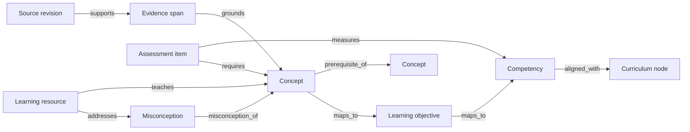
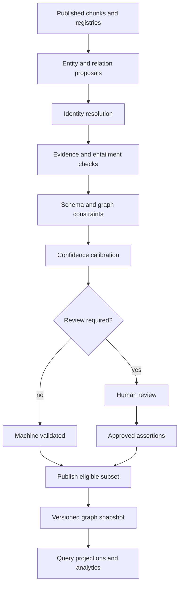

# Knowledge Graph Architecture

## Purpose

The ULIP knowledge graph provides a versioned semantic backbone for educational content. It connects canonical concepts, competencies, learning objectives, curricula, assessments, misconceptions, sources, and evidence. The graph powers prerequisite-aware retrieval, competency alignment, adaptive pathways, coverage analysis, and explanations of why an item or resource was selected.

The graph is not a source of ungrounded truth. Every asserted educational relation carries provenance, confidence, lifecycle state, and scope. Generated hypotheses remain separate from reviewed assertions and cannot affect high-stakes learning or assessment until approved.

Related designs:

- [Contextual Retrieval](07_contextual_retrieval.md)
- [Multi-resolution Chunks](08_multiresolution_chunks.md)
- [Assessment Intelligence](10_assessment_intelligence.md)
- [Competency Mapping](11_competency_mapping.md)
- [Learning Path Engine](12_learning_path_engine.md)

## Logical model

The graph is a directed, typed, attributed multigraph. Multiple edges between the same nodes are permitted when relation type, scope, source, or valid time differs.



### Node types

| Type | Identity and role |
| --- | --- |
| `Concept` | Language-independent unit of knowledge or skill |
| `ConceptLabel` | Language, script, locale, and curriculum-scoped label or alias |
| `LearningObjective` | Observable action with Bloom level and conditions |
| `Competency` | Demonstrable capability defined by a competency framework |
| `CurriculumNode` | Subject, strand, standard, outcome, syllabus topic, or exam objective |
| `AssessmentItem` | Versioned question or task, excluding restricted content from general views |
| `Misconception` | Evidence-backed incorrect model or error pattern |
| `LearningResource` | Chunk, worked example, lesson, simulation, or activity |
| `SourceRevision` | Immutable edition or ingestion revision |
| `EvidenceSpan` | Resolvable source location supporting a node or assertion |
| `PersonOrWork` | Public author, theorem, law, historical work, or named entity |

Learners are not graph nodes in the shared knowledge graph. Learner mastery is stored in a tenant-isolated learner model keyed to graph identifiers, limiting exposure of personal data.

### Edge types and direction

| Edge | Direction | Meaning | Required constraints |
| --- | --- | --- | --- |
| `prerequisite_of` | prerequisite to dependent | Mastery materially improves readiness | No self-loop; approved subgraph must be acyclic within scope |
| `part_of` | child to whole | Compositional containment | Acyclic per hierarchy |
| `is_a` | subtype to supertype | Taxonomic specialization | Acyclic and semantically substitutable |
| `related_to` | concept to concept | Symmetric topical relation | Stored once with canonical endpoint order |
| `contrasts_with` | concept to concept | Symmetric differentiating relation | Difference statement required |
| `causes` | cause to effect | Scoped causal relation | Evidence and context required |
| `explains` | explainer to target | Mechanistic or conceptual explanation | Explanation evidence required |
| `applies_to` | concept to application | Valid application domain | Conditions required when bounded |
| `example_of` | example or resource to concept | Instantiates a concept | Evidence reference required |
| `misconception_of` | misconception to concept | Common incorrect understanding | Correction and evidence required |
| `teaches` | resource to concept | Resource intentionally teaches concept | Coverage and level required |
| `measures` | item to objective or competency | Item produces evidence about target | Measurement weight required |
| `requires` | item or resource to concept | Completion requires prior knowledge | Requirement strength required |
| `aligned_with` | local entity to external standard | Cross-framework semantic alignment | Alignment relation and version required |
| `supported_by` | assertion to evidence span | Evidence provenance | Resolvable immutable span required |
| `supersedes` | new version to old version | Lifecycle replacement | Same identity family required |

`prerequisite_of` always points from what must be learned first to what depends on it. APIs and analytics must not reinterpret this direction.

## Assertion model

An edge is an assertion with first-class identity:

```json
{
  "edge_id": "edge_01J...",
  "edge_version": 3,
  "source_node_id": "concept:fractions",
  "target_node_id": "concept:rational-equations",
  "relation_type": "prerequisite_of",
  "scope": {
    "curriculum_framework_id": "cbse",
    "curriculum_version": "2026",
    "subject": "mathematics",
    "grade_band": "8-10",
    "exam_ids": []
  },
  "strength": 0.86,
  "confidence": 0.94,
  "criticality": "required",
  "conditions": ["symbolic fractions, not numerical fraction comparison"],
  "evidence": [
    {
      "evidence_span_id": "spn_01J...",
      "support_type": "explicit",
      "extractor": "relation_model_v4",
      "entailment_score": 0.97
    }
  ],
  "asserted_by": {
    "method": "model_then_human",
    "actor_id": "reviewer:opaque",
    "review_id": "rev_01J..."
  },
  "status": "approved",
  "valid_time": {
    "from": "2026-04-01",
    "to": null
  },
  "system_time": {
    "recorded_at": "2026-07-21T10:00:00Z",
    "superseded_at": null
  },
  "content_hash": "sha256:..."
}
```

`strength` represents educational effect size or dependency intensity. `confidence` represents confidence that the assertion is true within its scope. Algorithms must not substitute one for the other.

Status values are `proposed`, `machine_validated`, `in_review`, `approved`, `rejected`, `superseded`, and `revoked`. Production retrieval and pathways use only `approved` edges, except explicitly labeled exploratory analytics.

## Canonical identity and multilingual labels

Concept identifiers are opaque, stable, and language independent. Labels are separate records:

```json
{
  "label_id": "lbl_01J...",
  "concept_id": "concept:conservation-linear-momentum",
  "text": "रेखीय संवेग संरक्षण",
  "language": "hi-IN",
  "script": "Deva",
  "label_type": "preferred",
  "curriculum_scope": {"framework_id": "cbse", "version": "2026"},
  "valid_from": "2026-04-01",
  "source_span_ids": ["spn_01J..."],
  "review_status": "approved"
}
```

Identity resolution uses normalized labels, aliases, definitions, graph neighborhoods, curriculum scope, and source evidence. Auto-merge requires confidence `>= 0.98` and no type, formula, curriculum, or language conflict. Confidence from `0.90` through `0.98` requires review. Lower confidence creates distinct concepts linked by `possibly_same_as`, which is excluded from production traversal.

Merge creates a new canonical revision, records all predecessors, and rewrites no historical assertions. Split creates new identifiers and marks dependent mappings for revalidation.

## Construction pipeline



### Proposal generation

Deterministic parsers handle explicit cross-references, curriculum hierarchy, source structure, item targets, and existing identifiers. A versioned multilingual relation model proposes semantic relations. Every proposal includes exact supporting spans and an extracted rationale. Prompt text from source documents is treated as data.

### Confidence calibration

Proposal confidence is calibrated on adjudicated relation sets:

\[
C=\operatorname{Calibrate}(0.35E+0.20M+0.15S+0.15R+0.10X+0.05A)
\]

where \(E\) is evidence entailment, \(M\) model confidence, \(S\) source quality, \(R\) rule agreement, \(X\) cross-source agreement, and \(A\) identity-resolution confidence. Calibration uses isotonic regression by relation family and language. No edge without resolvable evidence can exceed `0.69`.

### Review policy

Human review is mandatory for:

- prerequisite changes affecting a published learning path
- causal relations
- concept merges or splits
- cross-curriculum equivalence
- high-stakes assessment measurement mappings
- conflicting authoritative evidence
- model confidence below `0.90`
- mathematical, legal, medical, safety-critical, or culturally sensitive assertions

Reviewers see source context, translation variants, model rationale, proposed scope, and affected downstream artifacts. Dual approval is required for high-stakes exam mappings and restricted answer-key relations.

## Graph constraints

Constraints run before snapshot publication:

1. Node and edge types must match the relation schema.
2. Every assertion must have at least one resolvable evidence span, except structural system assertions with a signed registry source.
3. Approved prerequisite graphs must be acyclic within a curriculum and proficiency scope.
4. `part_of` and `is_a` must be acyclic.
5. Symmetric relations use canonical endpoint ordering and cannot be duplicated.
6. Inverse relations are materialized by query projection, not independently authored.
7. All external framework nodes include framework and version.
8. Assessment items cannot measure a competency without an active item version and scoring rule.
9. Revoked evidence invalidates sole-supported assertions.
10. Cross-tenant content cannot share edges unless the nodes belong to an approved shared catalog.

### Prerequisite cycle resolution

When a proposed edge creates a cycle, publication stops for the affected component. The system computes the minimum-confidence feedback edge set and presents it for review. It never deletes edges automatically. If the cycle represents co-requisites, reviewers replace prerequisite edges with a `co_requisite` relation or introduce a composite concept with evidence.

## Storage architecture

Canonical nodes, assertions, versions, and provenance reside in PostgreSQL with bitemporal columns and append-only audit records. PostgreSQL is authoritative. Read-optimized projections are built for:

- recursive graph traversal and path queries
- lexical label resolution
- vector similarity over definitions and labels
- analytics in a columnar warehouse

The serving graph may use a native graph engine when scale requires it, but it is a disposable projection. Every projection record carries the canonical row version and snapshot identifier. Snapshot activation occurs only after count, checksum, and constraint parity checks.

Tenant isolation uses database row-level security and separate encryption contexts. Restricted assessment relations are projected to separate access-controlled views.

## Query contracts

### Traversal request

```json
{
  "request_id": "uuid",
  "tenant_id": "tenant-acme",
  "start_node_ids": ["concept:rational-equations"],
  "relations": ["prerequisite_of"],
  "direction": "incoming",
  "scope": {
    "curriculum_framework_id": "cbse",
    "curriculum_version": "2026",
    "grade_band": "8-10"
  },
  "max_depth": 6,
  "max_nodes": 100,
  "minimum_confidence": 0.85,
  "graph_snapshot_id": "gs_2026_07_21_01",
  "include_evidence": true
}
```

### Traversal response

The response contains nodes, edges, paths, truncation flags, evidence references, and a reproducibility envelope:

```json
{
  "graph_snapshot_id": "gs_2026_07_21_01",
  "nodes": [],
  "edges": [],
  "paths": [
    {
      "node_ids": ["concept:fractions", "concept:algebraic-fractions", "concept:rational-equations"],
      "edge_ids": ["edge_a", "edge_b"],
      "path_strength": 0.74,
      "explanation": "Fractions precede algebraic fractions, which precede rational equations."
    }
  ],
  "truncated": false,
  "policy_version": "graph_read_v2",
  "trace_id": "00-..."
}
```

Path strength is the product of edge strength and confidence, length-normalized with a geometric mean. Queries enforce relation allowlists, depth, node, time, and cost limits. Arbitrary graph query languages are not exposed to clients.

## Graph analytics

Analytics are computed per graph snapshot and curriculum scope:

- weighted in-degree and out-degree
- PageRank for navigational importance
- betweenness for bridge concepts
- prerequisite depth and descendant count
- strongly connected components for integrity checks
- curriculum and competency coverage
- source diversity per assertion
- isolated and weakly supported node rates

Centrality supports discovery and quality review, not truth ranking. It cannot outweigh low evidence confidence, curriculum mismatch, or access controls. Learning-path cost uses prerequisite structure and mastery, not raw PageRank.

## Integration semantics

### Retrieval

Retrieval expands only approved relations from the pinned snapshot. Each expanded candidate records the path used, edge identifiers, and path confidence. Graph proximity is one ranking feature as defined in [Contextual Retrieval](07_contextual_retrieval.md).

### Assessment

Items connect to objectives, competencies, concepts, cognitive demand, and misconceptions. Measurement weights and evidence requirements are defined in [Assessment Intelligence](10_assessment_intelligence.md). Item exposure and answer restrictions remain enforced outside generic graph views.

### Competency mapping

Framework crosswalks use `aligned_with` assertions with `exact`, `narrower`, `broader`, or `partial` alignment. Mapping confidence and approval semantics are defined in [Competency Mapping](11_competency_mapping.md).

### Learning paths

The path engine reads a frozen prerequisite and resource subgraph. It cannot author graph edges. If required nodes are missing or cyclic, it follows the degraded behaviors in [Learning Path Engine](12_learning_path_engine.md).

## Versioning and change propagation

Each release produces an immutable `graph_snapshot_id` and manifest containing:

- parent snapshot
- node and edge counts by type and status
- schema and ontology versions
- evidence corpus snapshot
- model and rule versions
- checksums and validation report
- added, changed, superseded, and revoked identifiers

Consumers pin a snapshot for the duration of a request or learning plan. A change-data-capture stream publishes assertion events. Reverse dependency indexes mark retrieval indexes, competency maps, assessment blueprints, and learning paths stale. Breaking ontology changes require a migration projection and dual-read validation before activation.

Historical queries can specify valid time and system time. Deletion follows retention and legal-hold policy while preserving non-sensitive audit proofs where legally permitted.

## Security and governance

- Authenticate every graph request and derive tenant scope from the principal.
- Enforce row-level policy in canonical storage and projection builders.
- Use allowlisted query templates and parameterized predicates.
- Separate restricted assessment nodes and answer relations from general content.
- Record reviewer actions in tamper-evident append-only audit logs.
- Minimize reviewer identity in serving responses.
- Scan labels and source text for prompt injection; graph text never controls tools or policy.
- Rate-limit traversals and cap fan-out to prevent denial of service and bulk extraction.
- Apply license, jurisdiction, embargo, and source-revocation policy to nodes, edges, and evidence.
- Run fairness reviews for culturally or linguistically sensitive mappings and prerequisite claims.

## Observability and service objectives

| Signal | Objective |
| --- | ---: |
| Graph read availability | 99.95% monthly |
| p95 one-hop traversal | <= 150 ms |
| p95 depth-6 bounded traversal | <= 500 ms |
| Projection parity | 100% before activation |
| Evidence resolvability | >= 99.99% |
| Approved prerequisite cycles | 0 |
| Unauthorized graph disclosures | 0 |
| Snapshot activation rollback time | <= 10 minutes |

Metrics are segmented by relation type, language, curriculum, source, review route, and tenant class. Traces record snapshot, policy version, bounded query shape, result count, and truncation. Node labels, learner data, and source text are excluded from routine telemetry.

Alerts cover projection lag, cycle introduction, evidence revocation, confidence drift, unusual traversal fan-out, cross-tenant policy failures, orphan growth, and sudden mapping changes.

## Validation and release gates

Adjudicated graph test sets measure:

- entity resolution precision `>= 0.98`
- entity resolution recall `>= 0.95`
- relation precision `>= 0.95` overall and `>= 0.98` for prerequisites
- relation recall `>= 0.90`
- relation-type macro F1 `>= 0.92`
- confidence expected calibration error `<= 0.05`
- curriculum-scope accuracy `>= 0.97`
- multilingual label fidelity `>= 0.98`
- prerequisite direction accuracy `>= 0.99`
- evidence entailment `>= 0.95`

Structural gates require zero schema violations, zero prohibited cycles, zero dangling approved edges, and 100 percent snapshot checksum parity. Protected slices by language, script, curriculum, subject, and grade may not regress by more than 3 percentage points.

## Failure handling

| Failure | Required behavior |
| --- | --- |
| Canonical store unavailable | Serve pinned read projection if valid; reject writes |
| Projection lag exceeds policy | Keep prior snapshot active and alert |
| Evidence cannot resolve | Exclude affected assertion and mark dependents stale |
| Prerequisite cycle detected | Block component publication and require review |
| Identity ambiguity | Keep separate nodes; exclude speculative merge from production |
| Graph traversal limit reached | Return bounded partial result with `truncated=true` |
| External framework version missing | Reject mapping |
| Model unavailable | Continue deterministic extraction; queue semantic proposals |
| Restricted edge access denied | Omit edge and prevent path inference through it |
| Snapshot not found | Fail with `GRAPH_SNAPSHOT_UNAVAILABLE`, never substitute latest |

The graph favors an older validated snapshot over a newer partial one. It fails closed for authorization, provenance, restricted assessment content, and version consistency.
