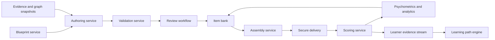

# Assessment Intelligence Architecture

## Purpose

Assessment Intelligence creates, validates, calibrates, assembles, delivers, and analyzes source-grounded educational assessments. It supports formative practice, diagnostic checks, classroom assessment, certification preparation, and competitive-exam simulation while preserving validity, fairness, security, and explainability.

The subsystem does not equate generated fluency with correctness. Every published item has a target construct, source evidence, scoring rule, difficulty evidence, review status, exposure policy, and immutable version. High-stakes use requires human approval and empirical calibration.

Dependencies:

- evidence retrieval: [Contextual Retrieval](07_contextual_retrieval.md)
- source units: [Multi-resolution Chunks](08_multiresolution_chunks.md)
- concepts and misconceptions: [Knowledge Graph Architecture](09_knowledge_graph_architecture.md)
- framework alignment: [Competency Mapping](11_competency_mapping.md)
- adaptive remediation: [Learning Path Engine](12_learning_path_engine.md)

## Bounded contexts



Services communicate through versioned APIs and an event bus. PostgreSQL is authoritative for blueprints, item versions, reviews, forms, scoring rules, and calibration parameters. Source artifacts and media use encrypted object storage. Restricted answer material is isolated from general retrieval indexes.

## Assessment blueprint

A blueprint defines what an assessment is allowed to measure:

```json
{
  "blueprint_id": "bp_01J...",
  "blueprint_version": 5,
  "purpose": "formative",
  "curriculum": {
    "framework_id": "cbse",
    "framework_version": "2026",
    "subject": "physics",
    "grade_band": "11-12"
  },
  "exam_profile": {
    "exam_id": "jee-main",
    "syllabus_version": "2026",
    "delivery_mode": "computer_based"
  },
  "constraints": {
    "item_count": 25,
    "duration_seconds": 3600,
    "languages": ["en-IN", "hi-IN"],
    "target_information": 18.0,
    "difficulty_distribution": {
      "foundational": 0.20,
      "intermediate": 0.50,
      "advanced": 0.30
    },
    "bloom_distribution": {
      "remember": 0.08,
      "understand": 0.20,
      "apply": 0.42,
      "analyze": 0.25,
      "evaluate": 0.05
    },
    "content_targets": [
      {
        "competency_id": "cmp:mechanics-problem-solving",
        "weight": 0.40,
        "minimum_items": 8
      }
    ],
    "item_type_limits": {"single_select": 15, "numeric": 10},
    "enemy_set_policy": "exclude_same_form",
    "accessibility_profile": "wcag_assessment_v2"
  },
  "scoring_policy_id": "score_jee_formative_v3",
  "review_policy_id": "review_competitive_v2",
  "graph_snapshot_id": "gs_2026_07_21_01",
  "competency_map_version": "cm_2026_07",
  "status": "active"
}
```

Blueprint weights sum to one within each distribution. Constraints are machine-validated before authoring or assembly. An exam profile describes the named examination only when its current syllabus, format, timing, and marking scheme are backed by approved references.

## Item model

```json
{
  "item_id": "item_01J...",
  "item_version": 7,
  "lineage_id": "ilineage_01J...",
  "item_type": "single_select",
  "language": "en-IN",
  "stem": "A block slides...",
  "stimulus": {
    "text": null,
    "media_asset_ids": ["asset_01J..."],
    "alternative_text": "Free-body diagram showing..."
  },
  "response_options": [
    {"option_id": "A", "content": "2 m/s²"},
    {"option_id": "B", "content": "4 m/s²"}
  ],
  "scoring": {
    "rule_type": "exact_option",
    "correct_response": ["B"],
    "max_score": 1.0,
    "partial_credit": [],
    "negative_mark": 0.25,
    "tolerance": null
  },
  "rationale": {
    "worked_solution": "Resolve forces...",
    "option_rationales": {
      "A": "This results from omitting friction.",
      "B": "Correct after subtracting friction."
    }
  },
  "targets": [
    {
      "competency_id": "cmp:newtonian-modeling",
      "learning_objective_id": "lo:apply-newtons-second-law",
      "concept_ids": ["concept:newtons-second-law", "concept:friction"],
      "measurement_weight": 1.0,
      "bloom_level": "apply"
    }
  ],
  "misconception_links": [
    {"option_id": "A", "misconception_id": "mis:ignore-friction"}
  ],
  "level": {
    "designed_band": "advanced_secondary",
    "reading_demand": "B2",
    "estimated_steps": 4,
    "calculator_policy": "not_allowed"
  },
  "evidence": {
    "source_span_ids": ["spn_01J...", "spn_01K..."],
    "chunk_ids": ["chk_01J..."],
    "claim_evidence_map": {
      "stem_claim_1": ["spn_01J..."],
      "solution_step_2": ["spn_01K..."]
    },
    "knowledge_snapshot_id": "ks_2026_07_21_01"
  },
  "psychometrics": {
    "status": "pilot",
    "model": "2PL",
    "difficulty_b": 0.72,
    "discrimination_a": 1.18,
    "guessing_c": null,
    "standard_errors": {"a": 0.14, "b": 0.11},
    "sample_size": 840
  },
  "security": {
    "classification": "restricted",
    "exposure_limit": 2000,
    "enemy_set_ids": ["enemy_kinematics_variant_3"],
    "embargo_until": null
  },
  "review": {
    "status": "approved",
    "content_review_id": "rev_content_01J...",
    "bias_review_id": "rev_bias_01J..."
  },
  "valid_from": "2026-07-21T00:00:00Z",
  "valid_to": null,
  "content_hash": "sha256:..."
}
```

Supported core item types are `single_select`, `multiple_select`, `numeric`, `short_answer`, `constructed_response`, `essay`, `scenario`, `case_study`, and `practical_observation`. Each type has a schema-specific scoring contract. Free-response model scoring is advisory unless the applicable policy and reliability gate permit autonomous use.

## Evidence-grounded authoring

### Inputs

The authoring service receives a blueprint slice, target competency and objectives, requested language, difficulty band, graph snapshot, evidence snapshot, and deterministic random seed. It retrieves approved concept, prerequisite, example, misconception, and source chunks. Answer-restricted evidence is available only to authorized authoring workers.

### Pipeline

1. **Construct specification**: define the observable skill, content boundaries, Bloom operation, response process, and prohibited shortcuts.
2. **Evidence packet**: retrieve source spans for every expected fact, formula, answer, and rationale.
3. **Item proposal**: generate stem, stimulus, response format, scoring rule, solution, distractors, and metadata as structured output.
4. **Independent solve**: a separate solver, without access to the proposed key, solves the item.
5. **Deterministic checks**: verify schema, units, numerical answer, option uniqueness, scoring totals, lexical leakage, and blueprint constraints.
6. **Grounding checks**: map every material statement and solution step to evidence; run entailment and contradiction checks.
7. **Pedagogical checks**: evaluate construct alignment, cognitive demand, prerequisite burden, reading demand, misconception diagnosticity, and age suitability.
8. **Bias and accessibility checks**: inspect irrelevant cultural loading, stereotypes, sensitive attributes, language parity, screen-reader behavior, color dependence, and media alternatives.
9. **Review and pilot**: route according to risk; pilot eligible items before operational scoring.

The proposer and independent solver use different model families or deterministic solvers where feasible. Model agreement is supporting evidence, not proof.

## Difficulty and cognitive demand

Before empirical data, designed difficulty is estimated from interpretable features:

\[
D_0=0.20P+0.18S+0.16I+0.14R+0.12A+0.10L+0.10N
\]

where \(P\) is prerequisite depth, \(S\) solution steps, \(I\) concept integration count, \(R\) reasoning demand, \(A\) abstraction, \(L\) linguistic load, and \(N\) numerical or symbolic complexity. All values are normalized to `[0,1]`.

Designed difficulty never claims equivalence to a named competitive exam without a versioned exam benchmark and calibrated comparison items. After pilot data, empirical item parameters replace the designed estimate for assembly. The designed estimate remains for explanation and drift analysis.

Bloom level is assigned from the required response process, not from verbs alone. For example, “calculate” may be `apply` or `analyze` depending on whether the learner must choose a model, distinguish cases, or integrate concepts.

## Distractor intelligence

Distractors must be:

- incorrect under the stated conditions;
- mutually distinct and grammatically parallel;
- plausible because of an evidence-backed misconception or error step;
- free from answer-length, wording, unit, and position cues;
- suitable for the learner level and language;
- accompanied by a diagnostic rationale.

Generated distractors not linked to an approved misconception are labeled `non_diagnostic`. A distractor that becomes correct under a reasonable interpretation causes item rejection. Option-order randomization respects dependencies such as “all of the above,” which is prohibited by default.

## Automated validation

Validation produces a signed report with check versions and evidence:

| Category | Checks |
| --- | --- |
| Correctness | independent solve, symbolic or numeric verification, units, tolerances, key consistency |
| Grounding | citation resolution, claim entailment, source conflict, curriculum version |
| Construct validity | target alignment, cognitive operation, prerequisite contamination |
| Item quality | ambiguity, clueing, option equivalence, excessive verbosity, local independence |
| Fairness | differential language burden, stereotype and sensitive-context screen, cultural relevance |
| Accessibility | semantic markup, keyboard operation, alternative text, non-color cueing |
| Security | memorized-source similarity, answer leakage, prompt injection, restricted-data policy |
| Delivery | renderer parity, scoring determinism, locale and math rendering |

Automatic publication is limited to low-stakes formative items when all hard checks pass, grounding and independent-solve confidence are at least `0.97`, target alignment is at least `0.95`, and policy permits. All other items require an authorized reviewer. High-stakes items require independent content and fairness reviews.

## Psychometric models

### Classical Test Theory

Pilot analytics compute item facility, corrected point-biserial discrimination, distractor selection, omission rate, timing, and reliability. Operational minimums are policy-specific. Default review triggers are:

- facility below `0.15` or above `0.90`
- point-biserial below `0.20`
- any distractor selected by fewer than `3%` of eligible attempts
- median time outside `0.5x` to `2.5x` blueprint expectation

These are review triggers, not automatic deletion rules.

### Item Response Theory

The platform uses a two-parameter logistic model for dichotomous items by default:

\[
P(X=1\mid\theta)=\frac{1}{1+\exp[-a(\theta-b)]}
\]

The three-parameter model is permitted for multiple-choice pools with enough data and defensible guessing behavior. Graded response or generalized partial credit models serve polytomous items. Calibration records the model, population, estimation method, fit, standard errors, and linking design.

Items require at least 500 representative responses for preliminary 2PL calibration and 1,000 for operational use, unless a documented Bayesian small-sample policy applies. Poor fit, parameter drift, or high uncertainty removes an item from adaptive use while preserving it for analysis.

### Fairness analysis

Differential item functioning uses logistic regression and Mantel-Haenszel for defined groups with adequate sample sizes. Effect size and uncertainty are reported together. A moderate or large DIF signal requires expert review of translation, context, and construct relevance. Sensitive-group data is access-controlled, minimized, and never exposed in learner feedback.

## Form assembly

Fixed forms are selected by mixed-integer optimization. The objective minimizes deviation from blueprint content, test information, difficulty, time, language parity, exposure, and format targets:

\[
\min \sum_j w_j\lvert achieved_j-target_j\rvert+\sum_i exposurePenalty_i x_i
\]

subject to item count, content minima, enemy sets, security classification, accessibility, total time, and item-use constraints. The solver returns an infeasibility explanation when no valid form exists. It does not silently relax hard constraints.

Adaptive delivery uses maximum-information item selection within the same constraints. A shadow test tracks unmet blueprint targets. Selection maximizes information at the current ability estimate, penalized for exposure and content imbalance. Stopping requires minimum and maximum length, standard error, content coverage, and time rules.

## Scoring and learner evidence

Scoring is deterministic for closed-response items. Numeric scoring specifies units, tolerance type, precision, accepted equivalent forms, and invalid-response handling. Constructed responses use a versioned rubric with criterion scores and anchor responses.

Each score event includes:

```json
{
  "score_event_id": "se_01J...",
  "attempt_id": "attempt_01J...",
  "item_id": "item_01J...",
  "item_version": 7,
  "response_hash": "sha256:...",
  "raw_score": 0.0,
  "max_score": 1.0,
  "criterion_scores": [],
  "scoring_policy_id": "score_jee_formative_v3",
  "scorer": {"type": "rule", "version": "numeric_v4"},
  "competency_evidence": [
    {
      "competency_id": "cmp:newtonian-modeling",
      "evidence_weight": 0.78,
      "outcome": "incorrect",
      "misconception_id": "mis:ignore-friction"
    }
  ],
  "created_at": "2026-07-21T10:15:00Z"
}
```

Model-scored responses also record confidence and rubric evidence. Confidence below the policy threshold routes to human review and does not update high-stakes mastery.

## Explanations and feedback

Learner feedback cites the exact item evidence and identifies the demonstrated step or misconception. It distinguishes:

- correctness of this response;
- evidence about a competency;
- uncertainty in the mastery inference;
- recommended next action.

Feedback does not reveal restricted keys before the assessment closes. For a wrong answer, the platform first provides level-appropriate guidance according to delivery policy, then a worked solution when permitted. Language variants must preserve quantities, formulas, scoring, and diagnostic intent.

## Lifecycle and versioning

Item states are `draft`, `validated`, `in_review`, `pilot`, `operational`, `suspended`, `retired`, and `revoked`. Any change to learner-visible content, key, scoring, target, source evidence, translation, or media creates a new immutable `item_version`. Psychometric parameters are versioned separately against the exact item version and population.

An item is marked stale when a source span, concept, competency map, curriculum, scoring policy, or safety rule changes. Stale operational items are suspended automatically if the dependency change could affect correctness or validity. Forms pin all item and policy versions.

## Security and integrity

- Separate item content, answer keys, and psychometric data using least-privilege services and encryption keys.
- Use short-lived credentials, tenant isolation, audit logging, and dual control for high-stakes exports.
- Never place operational items or keys in general-purpose vector indexes or model-training corpora.
- Apply exposure limits, enemy sets, pool rotation, watermarking where lawful, and anomaly detection for harvesting.
- Bind delivery sessions to signed form manifests and verify item hashes before render and score.
- Isolate untrusted item text from prompts and tool instructions.
- Protect learner responses as sensitive educational records with explicit retention and deletion policies.
- Detect collusion and unusual response similarity with privacy-reviewed features; never take punitive action solely from an automated signal.
- Require incident response and rapid revocation for leaked items or keys.

## Observability and service objectives

| Signal | Objective |
| --- | ---: |
| Item bank read availability | 99.95% |
| Scoring availability | 99.99% |
| Deterministic rescoring parity | 100% |
| Source citation resolvability | >= 99.99% |
| Published closed-response key error rate | < 0.01% |
| Unauthorized answer-key disclosure | 0 |
| p95 closed-response scoring latency | <= 250 ms |
| Form manifest hash mismatch | 0 |

Dashboards cover authoring yield, rejection reasons, review time, pool depth, blueprint coverage, calibration health, item drift, DIF, exposure, timing, scoring overrides, language parity, and dependency staleness. Telemetry carries identifiers and aggregate features, not raw responses or answer keys.

## Validation and release gates

Before release, the subsystem must pass:

- schema and scoring property tests for every item type
- 100 percent independent-solve agreement for published closed-response items
- 100 percent quantity, unit, formula, and key fidelity
- citation entailment `>= 0.97`
- competency and objective mapping precision `>= 0.95`
- language-equivalence agreement `>= 0.97`
- accessibility conformance to WCAG 2.2 AA and applicable assessment profiles
- model-scoring quadratic weighted kappa `>= 0.80` against double-scored human responses where autonomous use is allowed
- no material subgroup quality regression beyond policy tolerance

Psychometric validation includes dimensionality, local independence, fit, reliability or information, linking stability, parameter drift, and DIF. Competitive-exam claims require comparison with an approved, current, representative benchmark.

## Failure handling

| Failure | Required behavior |
| --- | --- |
| Evidence or graph snapshot unavailable | Stop authoring and assembly for affected targets |
| Independent solver disagrees | Reject item and retain diagnostics |
| Form constraints infeasible | Return explicit shortfall; do not weaken hard constraints |
| Scoring service degraded | Queue signed responses and prevent duplicate attempts |
| Item leak suspected | Suspend item lineage, invalidate unstarted forms, trigger incident process |
| Calibration drift | Remove item from adaptive selection and review |
| Translation mismatch | Disable affected language version only |
| Rubric scorer confidence low | Route to human scoring; do not update mastery |
| Source or curriculum superseded | Mark dependencies stale and suspend if validity may change |
| Delivery loses connectivity | Follow signed offline policy, encrypt local responses, and reconcile idempotently |

The subsystem fails closed for correctness, scoring determinism, source grounding, authorization, key secrecy, and high-stakes validity. It may degrade to low-stakes reviewed practice only when the active policy explicitly permits it.
