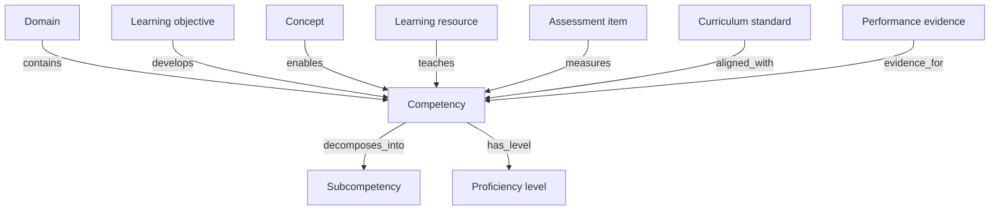
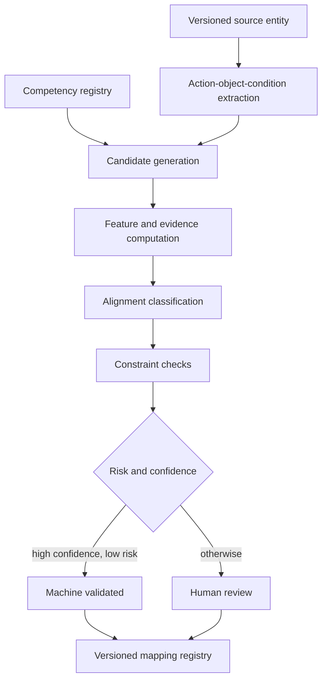

# Competency Mapping Architecture

## Purpose

Competency Mapping connects learning content, concepts, objectives, assessment evidence, and external standards to explicit capabilities a learner can demonstrate. The service supports curriculum coverage, assessment blueprints, mastery inference, credential evidence, resource selection, and cross-framework portability.

A competency mapping is an evidence-backed, scoped assertion. It does not claim that topical similarity proves competence, that completion proves mastery, or that two curriculum standards are interchangeable.

Dependencies:

- concept and assertion semantics: [Knowledge Graph Architecture](09_knowledge_graph_architecture.md)
- item measurement evidence: [Assessment Intelligence](10_assessment_intelligence.md)
- adaptive use: [Learning Path Engine](12_learning_path_engine.md)
- source provenance: [Multi-resolution Chunks](08_multiresolution_chunks.md)

## Competency model

A competency is an observable capability defined by:

- **action**: what the learner does
- **object**: knowledge or artifact acted upon
- **conditions**: tools, context, constraints, and supports
- **quality criterion**: required accuracy, fluency, complexity, or independence
- **proficiency scale**: ordered performance levels with evidence descriptors
- **scope**: subject, domain, curriculum, age or grade band, language policy, and jurisdiction

```json
{
  "competency_id": "cmp:model-one-dimensional-motion",
  "competency_version": 4,
  "framework": {
    "framework_id": "ulip-core-science",
    "framework_version": "2026.1"
  },
  "preferred_label": {
    "language": "en",
    "text": "Model one-dimensional motion"
  },
  "definition": {
    "action": "construct and use",
    "object": "mathematical models of one-dimensional motion",
    "conditions": [
      "constant or piecewise-constant acceleration",
      "symbolic, graphical, or numerical representations"
    ],
    "quality_criteria": [
      "selects an appropriate representation",
      "uses consistent units",
      "justifies assumptions",
      "interprets the result in context"
    ]
  },
  "proficiency_scale_id": "scale_ulip_5_v2",
  "scope": {
    "subject": "physics",
    "domain": "mechanics",
    "age_bands": ["14-16", "16-18"],
    "jurisdictions": ["global"]
  },
  "source_span_ids": ["spn_01J..."],
  "status": "active",
  "valid_from": "2026-07-01",
  "valid_to": null,
  "content_hash": "sha256:..."
}
```

Competency identifiers are language independent. Labels, examples, and performance descriptors are localized records with translation provenance.

## Ontology



Relations have distinct semantics:

| Relation | Meaning |
| --- | --- |
| `decomposes_into` | Child capabilities jointly constitute a broader capability |
| `prerequisite_competency` | One capability materially supports later capability development |
| `develops` | Objective intentionally builds the competency |
| `enables` | Concept knowledge is necessary or useful to perform the competency |
| `teaches` | Resource provides learning activity for the competency |
| `measures` | Item elicits scorable evidence about the competency |
| `evidence_for` | Learner performance contributes to a mastery estimate |
| `aligned_with` | Entity semantically corresponds to a framework node under a declared relation |

`teaches` and `measures` are never inferred from `mentions`. `enables` is not equivalent to mastery.

## Proficiency scale

ULIP uses a five-level, criterion-referenced scale:

| Level | Label | Evidence descriptor |
| ---: | --- | --- |
| 0 | Not evidenced | No valid evidence, or evidence is insufficient |
| 1 | Emerging | Performs isolated steps with substantial support |
| 2 | Developing | Completes familiar tasks with limited support and inconsistent transfer |
| 3 | Proficient | Completes representative tasks independently and accurately |
| 4 | Advanced | Integrates concepts, handles novel constraints, and justifies trade-offs |

Framework-specific scales remain authoritative in their own scope. Crosswalks map performance descriptors, not level numbers alone. The service never translates “Grade 8” directly into proficiency level.

## Mapping assertion

```json
{
  "mapping_id": "map_01J...",
  "mapping_version": 3,
  "subject": {
    "type": "assessment_item",
    "id": "item_01J...",
    "version": 7
  },
  "competency": {
    "id": "cmp:model-one-dimensional-motion",
    "version": 4
  },
  "relation": "measures",
  "alignment": "partial",
  "measurement": {
    "weight": 0.75,
    "target_levels": [2, 3],
    "evidence_strength": "direct",
    "required_response_process": [
      "select model",
      "calculate",
      "interpret"
    ],
    "construct_irrelevant_demands": ["reading_load:B2"],
    "scoring_rule_id": "score_numeric_reasoning_v3"
  },
  "scope": {
    "curriculum_framework_id": "cbse",
    "curriculum_version": "2026",
    "grade_band": "11-12",
    "language": "en-IN"
  },
  "confidence": 0.96,
  "evidence": [
    {
      "type": "item_analysis",
      "reference_id": "analysis_01J...",
      "supports": ["required_response_process", "target_levels"]
    },
    {
      "type": "source_span",
      "reference_id": "spn_01J...",
      "supports": ["competency_definition"]
    }
  ],
  "method": {
    "proposal": "mapping_model_v5",
    "ruleset": "mapping_rules_v4",
    "review": "dual_human"
  },
  "status": "approved",
  "valid_from": "2026-07-21T00:00:00Z",
  "valid_to": null,
  "content_hash": "sha256:..."
}
```

`alignment` is one of:

- `exact`: equivalent intent, scope, conditions, and quality criteria
- `narrower`: subject covers a strict subset
- `broader`: subject covers the competency plus additional capability
- `partial`: meaningful overlap without containment
- `none`: reviewed and determined not aligned

Mappings are directional. If A is `narrower` than B, the inverse is `broader`, not another independently inferred mapping.

## Mapping pipeline



### Candidate generation

Candidates are the union of:

- lexical matches over preferred labels, aliases, action verbs, and domain terms;
- multilingual dense similarity over definitions and performance descriptors;
- graph proximity through concepts and learning objectives;
- curriculum hierarchy and approved framework crosswalks.

Candidate generation favors recall and returns at most 100 candidates per source entity. Tenant, framework version, language, domain, and lifecycle filters apply first.

### Feature model

For source entity \(s\) and competency \(c\), the mapping model computes:

\[
M(s,c)=0.24A+0.20O+0.14C+0.12Q+0.10D+0.08G+0.07L+0.05E-\Pi
\]

where:

- \(A\): action and cognitive-process match
- \(O\): object and concept match
- \(C\): conditions and constraint match
- \(Q\): quality-criterion or scoring match
- \(D\): domain and curriculum scope match
- \(G\): approved graph support
- \(L\): learner level and linguistic fit
- \(E\): evidence quality and provenance completeness
- \(\Pi\): penalty for construct-irrelevant demand, translation uncertainty, scope conflict, or stale dependency

The model separately predicts alignment class and calibrated confidence. A high similarity score cannot override action, condition, scope, or version conflicts.

Default routing:

- confidence `>= 0.95`, low-risk `teaches` or `develops`: machine-validated publication permitted
- confidence `0.80` through `0.95`: human review
- confidence `< 0.80`: no production mapping
- every `measures`, cross-framework `exact`, high-stakes, credential, or framework-level mapping: human review regardless of confidence

Thresholds are versioned and calibrated by entity type, relation, language, and framework.

## Entity-specific rules

### Learning objectives

An objective maps to a competency only when its observable verb, object, conditions, and success criterion are compatible. Bloom level contributes to, but does not determine, target proficiency.

### Learning resources

A resource `teaches` a competency when it contains explanation or practice for the required response process. Coverage is recorded as `introduces`, `practices`, or `consolidates`. A resource that merely defines related concepts receives `enables`, not `teaches`.

### Assessment items

An item `measures` a competency only if a correct response requires the target capability and its scoring rule captures relevant performance. Mappings include measurement weight, required response process, target proficiency levels, prerequisite load, and construct-irrelevant demands. Rules align with [Assessment Intelligence](10_assessment_intelligence.md).

### Curriculum standards

A curriculum crosswalk compares the full standard statement, elaborations, conditions, grade band, and expected depth. Crosswalks are version-to-version. Title similarity alone is insufficient. `exact` requires dual review and evidence that substitution does not change intended learning or assessment.

## Review workflow

Reviewers receive:

- source and competency definitions with immutable versions;
- highlighted action, object, conditions, and criteria;
- model feature breakdown and confidence;
- supporting source spans and graph paths;
- known framework and language conflicts;
- downstream impact, including active items and learning paths.

Review actions are `approve`, `approve_with_edit`, `reject`, `defer`, and `request_framework_owner`. High-stakes `measures` and `exact` crosswalks require two independent qualified reviewers. Disagreement goes to an adjudicator. Reviewer reliability and drift are monitored without using productivity as a quality proxy.

## Mapping API

### Query

```json
{
  "request_id": "uuid",
  "tenant_id": "tenant-acme",
  "entity": {"type": "learning_resource", "id": "chk_01J...", "version": 4},
  "relations": ["teaches", "enables"],
  "framework_id": "ulip-core-science",
  "framework_version": "2026.1",
  "minimum_confidence": 0.85,
  "status": ["approved", "machine_validated"],
  "mapping_snapshot_id": "cms_2026_07_21_01",
  "include_evidence": true
}
```

### Response

```json
{
  "mapping_snapshot_id": "cms_2026_07_21_01",
  "mappings": [
    {
      "mapping_id": "map_01J...",
      "relation": "teaches",
      "alignment": "narrower",
      "competency_id": "cmp:model-one-dimensional-motion",
      "competency_version": 4,
      "coverage": "practices",
      "target_levels": [2],
      "confidence": 0.93,
      "evidence_refs": ["spn_01J..."],
      "explanation": {
        "matched_action": "construct",
        "matched_object": "motion model",
        "uncovered_criteria": ["justify assumptions"]
      }
    }
  ],
  "truncated": false,
  "policy_version": "mapping_read_v3",
  "trace_id": "00-..."
}
```

The service returns an explicit explanation of covered and uncovered elements. Clients must not display a partial mapping as full coverage.

## Coverage analytics

For a curriculum node or assessment blueprint, coverage is computed over weighted competency elements:

\[
Coverage=\frac{\sum_i w_i \cdot covered_i \cdot confidence_i}{\sum_i w_i}
\]

`covered_i` is `1.0` for exact evidence, `0.75` for narrower evidence that fully addresses the element, `0.5` for partial evidence, and `0` otherwise. Broader mappings count only the competency-relevant part.

Coverage reports distinguish:

- introduced, practiced, assessed, and mastered
- direct versus inferred evidence
- content availability versus learner performance
- framework and version
- language and accessibility availability
- confidence and unresolved gaps

No aggregate score may hide a required competency with zero assessment or learning-resource coverage.

## Learner evidence integration

Assessment score events reference approved `measures` mappings. The learner model receives:

- competency and version
- target proficiency level
- item measurement weight
- score outcome and uncertainty
- item discrimination and difficulty when calibrated
- attempt context and allowed support
- evidence timestamp and decay policy

Resource completion alone is not mastery evidence. Practice interactions may contribute low-weight process evidence when instrumentation is valid and the learner has consented. The learning-path engine consumes mastery estimates, not raw sensitive responses.

## Multilingual and level-aware mapping

Competency identity is shared across languages, but mapping evidence is language-specific when linguistic demand affects performance. Translations retain:

- source and target text;
- translator or model version;
- terminology glossary version;
- quantity, formula, negation, and named-entity checks;
- reviewer status.

An assessment translation receives a separate mapping version if reading load, cultural context, or response process changes. Age and grade bands are scope constraints, not proxies for ability. Accessibility adaptations are evaluated for whether they preserve the construct.

## Lifecycle and versioning

Competencies, frameworks, proficiency scales, source entities, and mappings are immutable by version. Mapping states are `proposed`, `machine_validated`, `in_review`, `approved`, `rejected`, `stale`, `superseded`, and `revoked`.

A mapping becomes stale when any pinned dependency changes:

- source entity content or scoring rule
- competency definition or proficiency descriptors
- curriculum or framework version
- graph assertion used as evidence
- translation
- mapping model, threshold, or policy when revalidation is mandated

Snapshot publication is atomic. Change events include affected downstream item banks, coverage reports, learner estimates, credentials, and active paths. Historical mastery remains explainable against the mapping version used at the time; forward decisions use current approved mappings.

## Security and governance

- Enforce tenant and framework-owner authorization at the canonical registry and API.
- Separate learner evidence from the shared competency graph.
- Restrict credential and high-stakes assessment mappings to approved roles.
- Use signed reviewer actions and append-only audit events.
- Treat external framework text and uploaded resources as untrusted input.
- Parameterize queries and cap candidate, traversal, and export sizes.
- Apply source license, jurisdiction, embargo, and deletion policies to mapping evidence.
- Minimize sensitive subgroup data and use it only in controlled fairness evaluation.
- Require framework-owner approval before publishing organization-wide crosswalks.
- Prevent automated decisions about advancement or certification from relying on a single low-confidence mapping.

## Observability and service objectives

| Signal | Objective |
| --- | ---: |
| Mapping read availability | 99.95% monthly |
| p95 direct mapping lookup | <= 200 ms |
| Snapshot consistency | 100% |
| Resolvable mapping evidence | >= 99.99% |
| Unauthorized mapping disclosure | 0 |
| Stale dependency propagation | <= 15 minutes |
| Framework-version mixing | 0 |

Dashboards track proposal volume, acceptance, reviewer agreement, confidence calibration, mapping churn, stale backlog, framework coverage, language coverage, and downstream impact. Metrics are segmented by relation, entity type, framework, subject, language, level, and review route.

## Validation

Evaluation uses independently adjudicated mappings and explicit hard negatives, including entities with similar topics but different actions or conditions.

Release gates:

- candidate Recall@20 `>= 0.97`
- approved mapping precision `>= 0.95`
- relation and alignment macro F1 `>= 0.92`
- `measures` precision `>= 0.98`
- `exact` crosswalk precision `>= 0.99`
- expected calibration error `<= 0.05`
- reviewer agreement weighted kappa `>= 0.80`
- multilingual mapping agreement `>= 0.95`
- scope and framework-version accuracy `>= 0.99`
- evidence resolvability `100%` in release sample

No language, curriculum, or age-band slice may regress by more than 3 percentage points without explicit governance approval and mitigation. Outcome validation checks whether competency-aligned evidence predicts later performance better than topic-only baselines.

## Failure handling

| Failure | Required behavior |
| --- | --- |
| Framework version unavailable | Reject request; do not substitute latest |
| Candidate model unavailable | Use deterministic lexical and graph candidates, then require review |
| Evidence cannot resolve | Exclude mapping and mark dependents stale |
| Competency identity ambiguous | Keep separate candidates and require adjudication |
| Snapshot activation incomplete | Keep prior snapshot active |
| Conflicting framework mappings | Return both with conflict status; do not collapse |
| Translation fidelity below threshold | Disable language-specific mapping |
| Stale `measures` mapping | Stop using new score events for mastery update |
| Reviewer conflict | Escalate to adjudication |
| Learner-evidence store unavailable | Queue signed events; do not infer from incomplete data |

The service fails closed for measurement, certification, framework-version consistency, provenance, and authorization. It may return an explicitly incomplete coverage report, but never reports unknown mappings as absent competencies.
