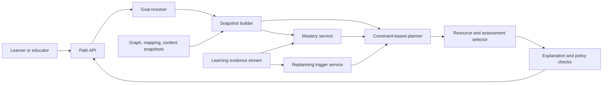

# Learning Path Engine Architecture

## Purpose

The Learning Path Engine creates and continuously replans a source-grounded sequence of learning activities toward declared goals. It combines prerequisite structure, competency requirements, learner evidence, curriculum constraints, available time, language, accessibility, and resource quality.

The engine recommends; it does not make irreversible placement, certification, or access decisions. Every recommendation includes the evidence, constraints, mastery uncertainty, and graph relations that caused it. Missing evidence is represented as uncertainty, not failure by the learner.

Dependencies:

- resource evidence and ranking: [Contextual Retrieval](07_contextual_retrieval.md)
- resource hierarchy: [Multi-resolution Chunks](08_multiresolution_chunks.md)
- prerequisite semantics: [Knowledge Graph Architecture](09_knowledge_graph_architecture.md)
- assessment evidence: [Assessment Intelligence](10_assessment_intelligence.md)
- competency targets and mappings: [Competency Mapping](11_competency_mapping.md)

## Architecture



The Path API and planner are stateless. Plans, learner evidence, and mastery estimates are versioned in tenant-isolated PostgreSQL. The knowledge graph, competency map, resource catalog, and assessment bank are pinned immutable snapshots. Events use an at-least-once bus and idempotency keys.

## Inputs and goal contract

```json
{
  "request_id": "uuid",
  "tenant_id": "tenant-acme",
  "learner_id": "opaque-learner-id",
  "goal": {
    "type": "competency_set",
    "targets": [
      {
        "competency_id": "cmp:mechanics-problem-solving",
        "competency_version": 4,
        "target_proficiency": 3,
        "required": true,
        "weight": 1.0
      }
    ],
    "curriculum": {
      "framework_id": "cbse",
      "framework_version": "2026",
      "grade_band": "11-12"
    },
    "exam": {
      "exam_id": "jee-main",
      "syllabus_version": "2026",
      "exam_date": "2027-01-20"
    }
  },
  "constraints": {
    "start_at": "2026-07-22",
    "deadline": "2026-12-31",
    "minutes_per_week": 300,
    "session_minutes": {"minimum": 20, "preferred": 45, "maximum": 75},
    "languages": ["hi-IN", "en-IN"],
    "resource_modalities": ["text", "interactive", "video"],
    "accessibility_needs": ["captions", "keyboard_only"],
    "offline_required": false,
    "assessment_frequency": "moderate"
  },
  "preferences": {
    "preferred_modalities": ["interactive"],
    "challenge_level": "balanced"
  },
  "policy_id": "path_balanced_v4",
  "snapshot_ids": {
    "graph": "gs_2026_07_21_01",
    "competency_mapping": "cms_2026_07_21_01",
    "content": "ks_2026_07_21_01",
    "assessment": "as_2026_07_21_01"
  }
}
```

Required constraints are treated as hard: authorization, deadline bounds, curriculum and framework versions, age safety, licensing, accessibility, language availability, resource validity, prerequisite criticality, and assessment security. Preferences are soft and can be traded off with an explanation.

The engine rejects goals that cannot resolve to approved competency or curriculum identifiers. It does not infer a named exam profile from a free-text label.

## Learner state

Learner state is separated into facts, estimates, and preferences:

```json
{
  "learner_state_id": "ls_01J...",
  "learner_id": "opaque-learner-id",
  "as_of": "2026-07-21T10:00:00Z",
  "curriculum_context": {
    "framework_id": "cbse",
    "framework_version": "2026"
  },
  "mastery": [
    {
      "competency_id": "cmp:vector-resolution",
      "competency_version": 3,
      "proficiency_distribution": [0.02, 0.08, 0.25, 0.50, 0.15],
      "mastery_probability": 0.65,
      "credible_interval": [0.53, 0.76],
      "evidence_count": 14,
      "last_evidence_at": "2026-07-20T13:15:00Z",
      "model_id": "mastery_bkt_irt_v3"
    }
  ],
  "learning_history_summary": {
    "completed_resource_ids": ["chk_01J..."],
    "recent_session_minutes": 42,
    "observed_pace_ratio": 1.12
  },
  "preferences": {
    "languages": ["hi-IN", "en-IN"],
    "modalities": ["interactive"]
  },
  "consents": {
    "personalization": true,
    "research_analytics": false
  },
  "version": 19
}
```

Age, disability, language, and socioeconomic attributes are not used as ability proxies. Explicit age band and accessibility needs filter safety and delivery compatibility. Preferences affect ranking only after pedagogical and policy constraints.

## Mastery inference

### Evidence hierarchy

Evidence weights depend on validity:

| Evidence | Default use |
| --- | --- |
| Calibrated assessment item | Direct mastery evidence |
| Reviewed but uncalibrated formative item | Direct, lower-weight evidence |
| Rubric-scored performance task | Direct evidence with scorer uncertainty |
| Diagnostic misconception response | Targeted negative or corrective evidence |
| Guided practice step | Process evidence with assistance adjustment |
| Resource completion | Engagement only, not mastery |
| Self-report | Planning preference and confidence context, not proof |

Only events linked by an approved `measures` mapping update competency mastery. Details are defined in [Competency Mapping](11_competency_mapping.md).

### Model

For competencies with calibrated items, the service updates a multidimensional ability estimate using item-response likelihoods and maps it to the competency proficiency scale. For sparse or formative evidence, Bayesian Knowledge Tracing maintains:

\[
P(L_n\mid obs)=
\begin{cases}
\frac{P(L)(1-S)}{P(L)(1-S)+(1-P(L))G}, & obs=correct\\
\frac{P(L)S}{P(L)S+(1-P(L))(1-G)}, & obs=incorrect
\end{cases}
\]

followed by learning transition:

\[
P(L_{n+1})=P(L_n\mid obs)+(1-P(L_n\mid obs))T
\]

where \(S\) is slip, \(G\) guess, and \(T\) transition probability. Parameters are versioned and fitted by domain and evidence type. Assistance, item discrimination, response time anomalies, and scorer confidence modify evidence weight, not the observed score.

Temporal decay increases uncertainty rather than directly declaring lost mastery. Transfer across related competencies is capped and allowed only through approved graph or decomposition relations. No estimate is updated from generated text similarity alone.

### Cold start

With insufficient evidence, the engine uses a broad prior from the declared course entry point, never sensitive demographics. It offers a short diagnostic or lets the learner choose a starting confidence. The resulting plan contains early checkpoints and labels mastery as uncertain.

## Planning graph

The snapshot builder creates a learner-specific directed acyclic planning graph:

1. Resolve target competencies to required concepts and learning objectives.
2. Traverse approved `prerequisite_of` and `prerequisite_competency` edges within scope.
3. Collapse approved co-requisite components into composite nodes.
4. Remove nodes already mastered above threshold, but schedule spaced checks when uncertainty or decay is high.
5. Attach eligible resources and assessments using approved `teaches`, `enables`, and `measures` mappings.
6. Filter resources by authorization, curriculum, language, age safety, accessibility, source status, and deadline availability.
7. annotate each node with estimated duration, learning gain distribution, cognitive load, forgetting risk, and exam relevance.

The engine never repairs graph cycles silently. Unexpected cycles make the affected target unplannable and produce a graph-quality incident.

## Planning algorithm

### Objective

Planning selects an ordered set of activities \(x\) that maximizes expected target mastery under hard constraints:

\[
\max_x \; 0.38Gain(x)+0.18Retention(x)+0.15Coverage(x)+0.10Quality(x)
+0.08Preference(x)+0.06Diversity(x)+0.05ExamFit(x)-Penalty(x)
\]

Penalties cover overload, excessive switching, redundant coverage, long gaps, uncertainty, and schedule risk. Required prerequisites, accessibility, licensing, and deadline constraints cannot be traded for objective value.

### Solver

The engine uses receding-horizon planning:

1. Topologically order unmastered prerequisite and target nodes.
2. Generate eligible activity candidates per node.
3. Use constrained beam search with width 50 over the next 8 activities.
4. At each expansion, simulate mastery and time distributions, enforce hard constraints, and calculate objective value.
5. Keep Pareto-nondominated states for expected gain, completion risk, and workload.
6. Commit the next 1 to 3 activities and retain the remainder as a provisional roadmap.
7. Replan after material evidence or constraint changes.

Beam search is deterministic for the same inputs and random seed. If the candidate set is small, an exact mixed-integer solver validates the beam result in shadow mode. A policy release must remain within 3 percent of exact objective value on solvable benchmark instances.

### Zone of productive challenge

An activity is normally eligible when predicted success probability is between `0.60` and `0.85`. Remediation may target `0.75` through `0.95`; challenge activities may target `0.45` through `0.70` when learner policy permits. The engine avoids repeated failure by inserting prerequisite explanation, worked examples, or reduced-complexity practice after two high-confidence failures.

### Spacing and interleaving

The scheduler approximates forgetting risk from mastery uncertainty, elapsed time, and prior successful retrievals. It schedules reviews near the predicted drop below the retention threshold. Interleaving is allowed after foundational acquisition and uses distinct but confusable concepts when the graph and competency map support discrimination practice.

## Activity selection

Resources are ranked only after eligibility filtering:

\[
R=0.26Alignment+0.18ExpectedGain+0.14Quality+0.12LevelFit+
0.10LanguageFit+0.08Accessibility+0.07ModalityFit+0.05Freshness-\Pi
\]

Alignment is supported by approved competency and concept mappings. Expected gain is estimated from comparable, consented learning events and includes uncertainty. Popularity cannot override evidence quality or level fit.

For every target node, the planner prefers a pedagogical pattern:

1. activate required prior knowledge;
2. explain or demonstrate;
3. guided practice;
4. independent retrieval or application;
5. feedback and correction;
6. delayed check and transfer.

The pattern is shortened when reliable mastery evidence already exists. It is expanded when diagnostic evidence reveals a misconception.

## Plan contract

```json
{
  "plan_id": "plan_01J...",
  "plan_version": 6,
  "learner_id": "opaque-learner-id",
  "status": "active",
  "goal": {
    "target_competency_ids": ["cmp:mechanics-problem-solving"],
    "target_proficiency": 3,
    "deadline": "2026-12-31"
  },
  "snapshot_ids": {
    "learner_state": "ls_01J...",
    "graph": "gs_2026_07_21_01",
    "competency_mapping": "cms_2026_07_21_01",
    "content": "ks_2026_07_21_01",
    "assessment": "as_2026_07_21_01"
  },
  "policy_id": "path_balanced_v4",
  "planner_version": "beam_v5.2",
  "random_seed": 118420,
  "forecast": {
    "target_mastery_probability": 0.81,
    "credible_interval": [0.69, 0.89],
    "completion_probability": 0.86,
    "estimated_minutes": {"p50": 1880, "p90": 2460}
  },
  "steps": [
    {
      "step_id": "step_01",
      "order": 1,
      "activity_type": "diagnostic",
      "resource_or_assessment_id": "form_01J...",
      "target_competency_ids": ["cmp:vector-resolution"],
      "prerequisite_for": ["cmp:mechanics-problem-solving"],
      "scheduled_window": {
        "earliest": "2026-07-22",
        "latest": "2026-07-24",
        "estimated_minutes": 20
      },
      "completion_rule": {
        "type": "submit_assessment",
        "minimum_valid_evidence_items": 6
      },
      "branch_rules": [
        {
          "condition": "mastery_probability < 0.60",
          "action": "insert_remediation",
          "target": "cmp:vector-resolution"
        }
      ],
      "explanation": {
        "reason_codes": ["UNCERTAIN_PREREQUISITE", "TARGET_DEPENDENCY"],
        "graph_path_edge_ids": ["edge_01J..."],
        "mapping_ids": ["map_01J..."],
        "evidence_summary": "Recent valid evidence is insufficient.",
        "alternatives_considered": 7
      }
    }
  ],
  "unmet_constraints": [],
  "created_at": "2026-07-21T10:05:00Z",
  "content_hash": "sha256:..."
}
```

Plans with unmet hard constraints are not `active`. Status values are `draft`, `active`, `paused`, `completed`, `superseded`, `unplannable`, and `revoked`.

## Replanning

Replanning is triggered by:

- valid assessment or rubric evidence;
- repeated misconception or failure;
- faster or slower observed pace;
- missed schedule window;
- changed goal, availability, language, or accessibility need;
- content, graph, competency-map, curriculum, exam, or policy change;
- resource revocation or assessment compromise;
- uncertainty crossing a policy threshold.

Evidence events are idempotent by `evidence_event_id`. The mastery service uses optimistic concurrency on learner-state version. The planner compares the current plan with the candidate plan and applies a stability penalty to unnecessary changes. Completed steps never disappear from history. The API returns a plan diff with additions, removals, reorderings, and reason codes.

To prevent churn, minor evidence updates are batched for up to 15 minutes. Safety, revocation, leaked assessment, authorization, or deadline events bypass batching.

## Explainability and learner control

Every step explanation identifies:

- which goal it supports;
- which approved prerequisite path made it necessary;
- current mastery estimate and uncertainty;
- why this resource fits curriculum, language, level, and accessibility;
- why alternatives ranked lower;
- what evidence can cause the plan to change.

Learners can request another eligible modality, defer a step, change availability, or contest evidence. Educators can pin, exclude, or reorder within authorization and hard constraints. Overrides are recorded with rationale and never rewrite model history.

The interface avoids deficit labels. It states “more evidence is needed” when uncertainty is high and distinguishes prerequisite review from failure.

## Competitive-exam mode

Exam mode adds a versioned exam syllabus, date, form constraints, marking scheme, and calibrated item benchmark. The planner:

- computes competency and syllabus coverage gaps;
- weights but does not exclusively optimize high-frequency topics;
- schedules timed, secure simulations only after prerequisite coverage;
- accounts for negative marking and response strategy without teaching gaming that bypasses understanding;
- separates designed difficulty from empirically calibrated exam difficulty;
- reserves final periods for cumulative retrieval, interleaving, and realistic forms.

If current exam specifications or calibrated items are unavailable, the engine labels the plan general preparation and does not claim exam fidelity.

## Multilingual, age, and accessibility behavior

The planner prefers resources in the learner's chosen language but may use an approved bilingual bridge when terminology transfer is pedagogically useful. Cross-language resources must have terminology, formula, quantity, and source-fidelity validation.

Age band filters content safety and context. It does not cap competence. Reading demand and cognitive demand are modeled separately. Accessibility is a hard eligibility requirement; an adaptation is used only when its construct equivalence is approved. Missing accessible alternatives makes the affected path infeasible rather than silently serving an unusable resource.

## Lifecycle and consistency

Plan versions are immutable. Each pins all data and policy snapshots. A new plan version supersedes the previous version after successful validation and atomic write. Snapshot updates do not alter an active plan in place; they trigger impact analysis and, where material, replanning.

Learner evidence uses event time and processing time. Late events cause a replay from the latest checkpoint when they fall within the correction window. Retention, correction, consent withdrawal, and deletion rules propagate to mastery estimates, plans, analytics, and caches.

Resource and mapping dependency indexes support bounded revocation. A removed source or leaked item immediately blocks unstarted steps and produces a safe replacement or pauses the plan.

## Security, privacy, and guardrails

- Authenticate all requests and enforce tenant, learner, educator, content, and assessment scopes.
- Keep learner state outside the shared knowledge graph and use per-tenant encryption contexts.
- Minimize personal data; use opaque identifiers in events, logs, and model features.
- Honor consent, data export, correction, retention, and deletion requirements.
- Do not use protected or socioeconomic attributes to infer ability, pace, motivation, or ambition.
- Treat resource text and event payloads as untrusted; they cannot modify planner policy or execute tools.
- Restrict answer keys and operational assessment content to authorized delivery contexts.
- Cap plan horizon, graph traversal, candidate count, solver time, and event replay.
- Require human approval for paths tied to certification, mandatory remediation, or other consequential decisions.
- Detect harmful repetition, excessive workload, repeated high-confidence failure, and unsafe content; pause and escalate according to policy.

## Observability and service objectives

| Signal | Objective |
| --- | ---: |
| Path API availability | 99.9% monthly |
| p95 initial planning latency | <= 2.5 s |
| p95 evidence-triggered replan latency | <= 5 s |
| Snapshot-consistent plans | 100% |
| Hard-constraint violations in active plans | 0 |
| Explanation completeness | >= 99.9% |
| Revoked-step blocking | <= 5 minutes |
| Duplicate evidence application | 0 |

Metrics cover planning latency, candidate pruning, infeasibility reasons, objective components, mastery uncertainty, plan churn, completion, time prediction error, learning gain, repeated failure, resource diversity, override rate, and revocation lag. Quality metrics are segmented by language, curriculum, subject, age band, accessibility profile, learner evidence depth, and pathway policy.

Raw responses, free text, precise disability information, and resource content are excluded from routine telemetry. Traces use opaque identifiers and pinned versions.

## Validation and experimentation

### Offline validation

Release gates include:

- prerequisite-order validity `100%`
- hard-constraint satisfaction `100%`
- competency coverage `>= 0.95` for feasible goals
- resource-to-target mapping precision `>= 0.95`
- plan explanation evidence resolvability `100%`
- beam objective gap from exact solver `<= 3%` on benchmark instances
- completion-time median absolute percentage error `<= 20%`
- calibrated mastery Brier score `<= 0.15`
- no protected-slice constraint or accessibility failures

Simulation uses synthetic learner policies and replay of consented, de-identified historical events. Leakage controls split by learner and time. Counterfactual evaluation reports uncertainty and does not replace prospective evaluation.

### Online evaluation

Guarded experiments randomize at learner or classroom level and measure:

- delayed mastery and transfer, not clicks alone;
- time to target proficiency;
- completion and voluntary continuation;
- assessment validity and retest effects;
- workload and repeated-failure indicators;
- override, contest, and support-request rates;
- parity across supported languages, curricula, and accessibility profiles.

Every experiment has a predeclared hypothesis, guardrail thresholds, minimum duration, stopping rules, and rollback. A short-term engagement gain cannot justify lower learning, higher harm, or fairness regression.

## Failure handling

| Failure | Required behavior |
| --- | --- |
| Learner evidence unavailable | Use last valid state, mark stale, avoid high-impact adaptation |
| Graph or mapping snapshot unavailable | Keep existing pinned plan; reject new plan creation |
| Prerequisite cycle | Mark affected goal `unplannable` and raise graph incident |
| No accessible or licensed resource | Return explicit constraint shortfall and educator action |
| Planner timeout | Return last validated plan or bounded deterministic topological plan |
| Mastery model unavailable | Use last estimate with widened uncertainty; schedule diagnostic |
| Assessment item revoked or leaked | Block step immediately and select approved replacement |
| Conflicting evidence | Widen uncertainty and schedule discriminating evidence |
| Deadline infeasible | Return achievable forecast and required constraint changes |
| Event duplication or reordering | Deduplicate and replay by event time |
| Policy or authorization service unavailable | Fail closed for new recommendations |
| Harm or overload guardrail fires | Pause affected sequence and provide support or educator escalation |

A fallback topological plan may order approved prerequisites and resources, but it must be labeled non-adaptive and cannot claim personalized mastery optimization. The engine always prefers an explicit infeasibility result over a plan that violates safety, access, provenance, or pedagogical prerequisites.
