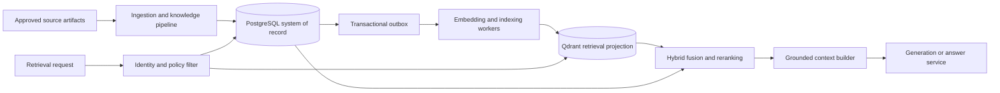
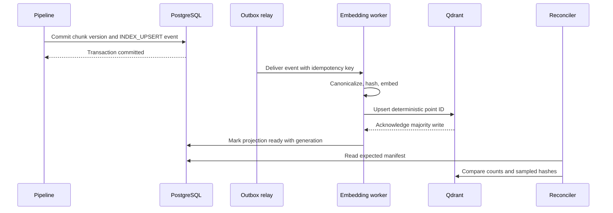

# 13. Vector Store Architecture

## Purpose and scope

This document defines the production vector persistence boundary for the Universal Learning
Intelligence Platform (ULIP). It covers semantic knowledge retrieval across school curricula,
competitive examinations, higher education, professional learning, languages, creative subjects,
and experiential learning.

The vector store is a derived search index. It is not the system of record for ownership,
publication state, curriculum relationships, user entitlements, or generated questions. PostgreSQL
holds those records and Qdrant provides low-latency semantic and lexical candidate retrieval. See
[Qdrant Design](14_qdrant_design.md), [PostgreSQL Design](15_postgres_design.md), and
[RAG Architecture](16_rag_architecture.md).

This is the normative production design. The current local pipeline can use embedded Qdrant and
SQLite, but those modes do not meet the availability, isolation, or disaster-recovery requirements
in this document.

## Architectural decisions

| Decision | Choice | Reason |
|---|---|---|
| Vector engine | Qdrant cluster | Native filtered vector search, hybrid dense and sparse retrieval, aliases, replication, and snapshots |
| Relational system of record | PostgreSQL | Transactions, row-level security, graph traversal, workflow state, audit, and publication control |
| Index unit | A concept-complete semantic chunk | Page-sized and fixed-token chunks separate definitions from examples and reduce grounding quality |
| Dense model | `BAAI/bge-small-en-v1.5`, 384 dimensions, cosine | Matches the implemented local pipeline and supports an offline deployment path |
| Lexical signal | Qdrant sparse vector built from the normalized chunk text | Preserves exact formula, statute, name, vocabulary, and terminology matches |
| Reranking | Cross-encoder service after candidate fusion | Improves precision without putting model-specific behavior in persistence |
| Tenant model | Shared collections with mandatory `tenant_id` filters | Avoids unbounded collection growth while preserving logical isolation |
| Index lifecycle | Immutable embedding generations behind aliases | Allows model and schema migration without in-place mixed vectors |
| Canonical content | PostgreSQL and immutable source artifacts | Qdrant payload is a denormalized retrieval projection |
| Cross-store delivery | PostgreSQL transactional outbox plus idempotent indexer | Prevents dual-write races and supports repair |

## Context



The ingestion plane may be asynchronous. The serving plane only exposes a content version after
its required relational records and vector projection have both reached `published` readiness.

## Responsibility boundaries

### Qdrant owns

* Dense and sparse vectors for published, retrieval-eligible knowledge chunks.
* Denormalized payload fields required to enforce tenant, entitlement, locale, domain, curriculum,
  level, publication, and validity filters before similarity ranking.
* Search-time scores and index-generation metadata.
* Optional vectors for approved, non-user-specific question exemplars.

### PostgreSQL owns

* Tenant, source, edition, document, concept, chunk, and provenance records.
* Curriculum hierarchy, concept graph, prerequisites, learning objectives, misconceptions,
  competencies, assessment blueprints, questions, and approvals.
* Publication state, legal rights, retention, access-control policy, and effective dates.
* Embedding jobs, transactional outbox events, index manifests, reconciliation results, and audit.
* Agent workflow state and every generated artifact.

### Object storage owns

* Original uploads, normalized documents, extracted page text, OCR evidence, media, and immutable
  exports.
* Checksums and retention-locked snapshots where required by licensing policy.

Qdrant payload text is a serving projection, not the authoritative original. A vector point may be
deleted and reconstructed from PostgreSQL plus object storage.

## Canonical identity and version model

ULIP distinguishes logical identity from content and embedding versions:

* `tenant_id`: stable organization boundary.
* `source_id`: logical licensed or tenant-owned source.
* `source_version_id`: immutable edition or upload revision.
* `concept_id`: stable logical concept within a tenant.
* `chunk_id`: stable identity for a semantic unit.
* `chunk_version`: increments when normalized text or material metadata changes.
* `content_hash`: SHA-256 over canonical UTF-8 chunk text and grounding-relevant metadata.
* `embedding_generation`: immutable model, tokenizer, normalization, and vector-schema version.
* `point_id`: UUIDv5 of `tenant_id | chunk_id | chunk_version | embedding_generation`.

Reprocessing identical canonical content produces the same point ID and no duplicate. A changed
chunk creates a new chunk version. A model change creates a new embedding generation without
changing chunk identity.

Generated questions are never indexed into the main knowledge collection. Only questions that
complete validation, editorial approval, rights review, and exemplar promotion can enter the
separate exemplar collection.

## Retrieval record contract

Each knowledge point contains a dense vector, a sparse vector, and a bounded payload:

```json
{
  "point_id": "uuid",
  "vectors": {
    "text_dense": [0.012, -0.034],
    "text_sparse": {
      "indices": [18, 907],
      "values": [1.2, 0.7]
    }
  },
  "payload": {
    "tenant_id": "uuid",
    "chunk_id": "uuid",
    "chunk_version": 3,
    "concept_id": "uuid",
    "source_id": "uuid",
    "source_version_id": "uuid",
    "content_hash": "sha256:...",
    "text": "Self-contained concept text",
    "title": "Conservation of momentum",
    "chunk_type": "concept",
    "domain": "school",
    "subject": "physics",
    "curriculum_ids": ["uuid"],
    "grade_bands": ["11", "12"],
    "exam_ids": ["jee_main"],
    "level_band": "advanced",
    "bloom_levels": ["Understand", "Apply"],
    "language": "en",
    "jurisdiction": "IN",
    "visibility": "tenant",
    "entitlement_tags": ["license:ncert-2026"],
    "publication_state": "published",
    "valid_from": "2026-04-01T00:00:00Z",
    "valid_to": null,
    "quality_score": 0.93,
    "embedding_generation": "bge-small-en-v1.5__norm2__g003",
    "indexed_at": "2026-07-21T10:00:00Z"
  }
}
```

`text` is capped at 12 KiB and metadata payload at 24 KiB. Large evidence, page images, tables, and
media remain in object storage and are referenced through PostgreSQL. Payload arrays are bounded to
prevent high-cardinality fanout.

## Tenant and access isolation

Every point includes `tenant_id`. Every search filter includes an exact tenant condition injected
by the retrieval gateway from authenticated claims. Clients cannot supply, remove, or override that
condition.

Access filters are evaluated before vector ranking:

1. `tenant_id` exact match.
2. `publication_state = published`.
3. `visibility` and entitlement intersection.
4. `valid_from <= request_time` and `valid_to` absent or after request time.
5. Locale, jurisdiction, learner age, curriculum, and source-license constraints.
6. Caller-requested pedagogical filters such as domain, subject, level, or Bloom level.

The retrieval gateway rejects an unscoped request. Internal operators use a separate audited role
and cannot query multiple tenants through the learner-facing endpoint. Sensitive learner data and
user-authored private notes are not stored in shared knowledge collections.

## Write path and consistency

### Publication path



The system provides transactional consistency inside PostgreSQL and eventual consistency between
PostgreSQL and Qdrant. The publication API uses a readiness barrier:

* A source version is `indexing` until all expected points are acknowledged for the active write
  generation.
* It becomes `published` only after the manifest count, sampled hashes, and policy fields pass.
* Retrieval filters exclude points whose source version is not published.
* Normal indexing propagation target is 60 seconds at p95 and 5 minutes at p99.

Updates are append-first. The worker upserts the new point, marks it ready, and only then tombstones
the superseded point. Deletions create an outbox tombstone and a durable erasure record. Physical
deletion from Qdrant must complete within 15 minutes for ordinary withdrawal and within 24 hours for
a verified data-erasure request.

### Idempotency and reconciliation

The outbox event key is
`tenant_id:chunk_id:chunk_version:embedding_generation:operation`. Consumers record completed keys
in PostgreSQL. Qdrant upsert by deterministic point ID is naturally idempotent.

An hourly reconciler compares each active source manifest with Qdrant using point counts, indexed
version ranges, and sampled `content_hash` values. A daily full scroll verifies all point IDs. It
republishes missing events, deletes orphans after a quarantine period, and alerts rather than
silently repairing an ownership or tenant mismatch.

## Read path

1. Authenticate the caller and derive the immutable tenant and entitlement filter.
2. Normalize the query while retaining original language, formulas, and quoted terms.
3. Generate the dense query vector using the exact active embedding generation.
4. Generate the sparse query vector.
5. Search dense and sparse representations with identical policy filters.
6. Fuse candidates with reciprocal rank fusion.
7. Hydrate authoritative provenance and current publication state from PostgreSQL.
8. Remove stale, duplicate, withdrawn, or inaccessible candidates.
9. Rerank using query, chunk text, level fit, quality, and source authority.
10. Pack a citation-bearing context under the workflow token budget.

The vector score is a candidate signal, not a confidence probability. No workflow may answer from a
score threshold alone. See [RAG Architecture](16_rag_architecture.md) for grounding gates.

## Domain-aware metadata

All domains share the core contract. Optional typed metadata remains in PostgreSQL and only fields
needed for filtering are projected:

| Domain | Required retrieval facets |
|---|---|
| School | Curriculum, board, grade, subject, chapter, language |
| Competitive examination | Exam, syllabus year, stage, topic weight, permitted method |
| Higher education | Institution or framework, course, discipline, level, prerequisite depth |
| Professional | Occupation, competency framework, jurisdiction, regulation effective date |
| Language | Language, script, proficiency framework, CEFR or equivalent level, skill |
| Creative | Medium, technique, style, critique mode, rights classification |
| Experiential | Activity setting, equipment, duration, supervision, hazard class, age limit |

Safety-critical experiential content is only retrievable when the activity policy permits the
learner age and supervision mode. The vector store does not make that decision; it enforces the
filter supplied by the policy service.

## Capacity and performance

Capacity planning uses:

`point bytes = dense vector + sparse vector + payload + HNSW overhead + replication overhead`.

For a 384-dimension float32 vector, the dense component is 1,536 bytes before index overhead.
Production sizing must include sparse postings, payload indexes, replicas, snapshots, and 30 percent
free capacity. A shard should remain below 20 million points and below 70 percent memory utilization.
Add shards by creating a new generation rather than repeatedly resharding a hot collection.

### Service objectives

| Objective | Target |
|---|---|
| Retrieval API availability | 99.9% monthly |
| Qdrant search latency, top 50 candidates | p95 <= 150 ms, p99 <= 350 ms |
| End-to-end hybrid retrieval and hydration | p95 <= 450 ms, p99 <= 900 ms |
| Successful indexing after relational commit | p95 <= 60 s, p99 <= 5 min |
| Projection completeness for published versions | >= 99.99% |
| Tenant-filter violations | 0 |
| Disaster-recovery RPO | <= 5 min |
| Disaster-recovery RTO | <= 60 min |

Latency objectives exclude model generation. An error budget burn of 5 percent in one hour pages the
retrieval on-call team.

## Failure handling

| Failure | Behavior |
|---|---|
| Embedding service unavailable | Retain outbox event, retry with exponential backoff and jitter, never mark ready |
| Qdrant partial write | Retry the same deterministic point IDs and verify batch acknowledgements |
| PostgreSQL unavailable during hydration | Fail closed for tenant and publication checks; do not return payload-only results |
| Active alias missing | Stop serving that generation and page; do not guess a collection name |
| Dense embedding timeout | Use sparse-only retrieval if policy hydration is healthy and record degraded mode |
| Sparse path unavailable | Use dense-only retrieval with rerank and degraded telemetry |
| Both retrieval paths unavailable | Return a typed `RETRIEVAL_UNAVAILABLE`, not an ungrounded model answer |
| Manifest mismatch | Quarantine the source version from new generation jobs and run repair |
| Suspected tenant leak | Disable affected alias, preserve audit evidence, invoke security incident process |

Retries are bounded to eight attempts over 30 minutes. Poison events move to a dead-letter queue with
the exception class, input hash, generation, and correlation ID. Operators can replay them after the
root cause is corrected.

## Security and privacy

* Qdrant is private-network only. The public API never exposes native Qdrant endpoints.
* Service-to-service traffic uses mutual TLS and short-lived workload identities.
* Secrets are stored in the platform secret manager and rotated at least every 90 days.
* Disk, snapshot, and backup encryption uses tenant-approved keys.
* Payloads exclude learner identifiers, prompts, free-form feedback, and protected assessment
  responses.
* Text is scanned for credentials, personal data, malicious prompt instructions, and rights
  restrictions before indexing.
* Retrieval requests and returned chunk IDs are audit logged with purpose, tenant, actor, policy
  decision, and trace ID. Raw query retention is 30 days by default and configurable by tenant.
* Bulk scroll, snapshot, alias mutation, and collection deletion require a privileged operator role
  plus an approved change record.

## Backup and disaster recovery

Qdrant snapshots run every six hours and are copied to encrypted cross-region object storage. Keep
hourly or six-hourly snapshots for 7 days, daily snapshots for 35 days, and monthly snapshots for
13 months, subject to source licensing and deletion requirements.

Snapshots are useful for recovery speed, but PostgreSQL plus source artifacts remain sufficient to
rebuild every collection. Recovery procedure:

1. Restore or provision a healthy Qdrant cluster.
2. Restore the latest verified snapshot into isolated collection names.
3. Replay outbox events after the snapshot watermark.
4. Reconcile point counts and content hashes against PostgreSQL manifests.
5. Run tenant-isolation and retrieval smoke tests.
6. Atomically move the read alias after approval.

A restore exercise runs quarterly. A full rebuild from source runs at least twice per year to prove
that snapshots are not the only viable recovery path.

## Observability

Every query and indexing operation carries `trace_id`, `tenant_id`, `workflow_id`, and generation.
Metrics include:

* Search latency and errors by collection, shard, vector path, and filter class.
* Candidate counts before and after policy filtering, deduplication, hydration, and reranking.
* Empty-result and degraded-mode rates by domain and language.
* Indexing lag, outbox age, dead-letter depth, throughput, and embedding failures.
* Point counts by tenant and source, tombstone age, manifest mismatches, and orphan count.
* Qdrant memory, disk, CPU, segment count, optimizer backlog, replica health, and snapshot status.
* Retrieval relevance metrics such as recall@20, nDCG@10, citation coverage, and stale-hit rate.

Logs must not contain vectors or full copyrighted text. Sampled content debugging requires an
audited support session and is disabled by default.

## Migration and versioning

An embedding generation is immutable and records:

* Model name and immutable artifact digest.
* Vector dimension and distance metric.
* Text canonicalization and chunker versions.
* Dense and sparse encoder versions.
* Payload schema version.
* Build timestamp and evaluation report.

Migration uses dual indexing:

1. Create new physical collections and payload indexes.
2. Backfill all eligible chunk versions from PostgreSQL.
3. Continuously apply new outbox events to old and new write generations.
4. Evaluate recall, ranking, latency, domain coverage, and tenant filters against a golden set.
5. Shadow at least 10 percent of production queries for seven days.
6. Move the read alias to the new generation through an atomic alias operation.
7. Retain the old generation for a seven-day rollback window.
8. Delete the old generation only after backup verification and change approval.

Payload fields are additive within a schema version. A filter-semantic change, vector change, or
field removal requires a new generation. Rollback only moves aliases; it never rewrites vectors.

## Operational acceptance criteria

A vector generation is production-ready only when:

* All published PostgreSQL manifests reconcile with zero tenant or ownership mismatches.
* Golden-set recall@20 and nDCG@10 meet domain-specific release gates.
* Filter tests cover every tenant, visibility, entitlement, publication, validity, and safety path.
* Search and indexing load tests meet the stated objectives at 1.5 times forecast peak.
* Snapshot restore and alias rollback have been demonstrated.
* Security review confirms private networking, encryption, service identity, and audit coverage.
* The [Question Generation Architecture](18_question_generation.md) grounding tests pass against
  this generation.
