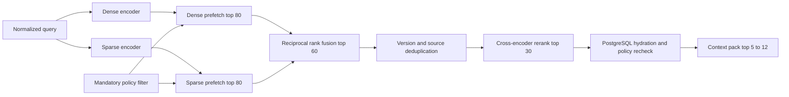

# 14. Qdrant Design

## Purpose

This document specifies Qdrant topology, collections, vectors, payloads, indexes, query behavior,
operations, and migrations for ULIP. The platform-wide persistence boundary is defined in
[Vector Store Architecture](13_vector_store_architecture.md). Relational records and cross-store
coordination are defined in [PostgreSQL Design](15_postgres_design.md).

## Production topology

ULIP runs Qdrant as a private, multi-availability-zone cluster:

* Three or more Qdrant nodes distributed across three availability zones.
* Replication factor 3 and write consistency factor 2.
* At least one shard replica per availability zone.
* REST and gRPC reachable only by the retrieval gateway, indexer, reconciler, backup controller,
  and approved operators.
* Mutual TLS at the service mesh or load balancer, API-key authentication at Qdrant, and workload
  identities at the platform boundary.
* Separate clusters for production, pre-production, and development. Production data is never
  copied to lower environments without approved redaction.

Single-node and embedded modes are supported only for development and test. They must not share a
filesystem path across processes.

## Collection strategy

ULIP uses a small, bounded set of physical collections per embedding generation:

| Logical alias | Physical naming pattern | Responsibility |
|---|---|---|
| `ulip_knowledge_read` | `ulip_knowledge__{generation}` | Approved concept-complete knowledge chunks |
| `ulip_question_exemplars_read` | `ulip_question_exemplars__{generation}` | Editorially approved item exemplars for style and pattern retrieval |

An optional `*_write` alias identifies the generation accepting writes. A dual-write migration may
point index workers at two explicit physical collections, but a read alias points to exactly one
physical collection.

Collections are not created per tenant, curriculum, source, language, or subject. Those dimensions
are payload filters. A dedicated collection is permitted only for a legally mandated physical
isolation tier or a vector schema that cannot coexist with the shared schema. The architecture
review board approves exceptions.

## Vector configuration

### Knowledge collection

```yaml
vectors:
  text_dense:
    size: 384
    distance: Cosine
    on_disk: false
sparse_vectors:
  text_sparse:
    index:
      on_disk: true
replication_factor: 3
write_consistency_factor: 2
on_disk_payload: true
```

The initial dense model is `BAAI/bge-small-en-v1.5`. Embeddings are L2-normalized by the embedding
worker and compared with cosine distance. The model artifact digest, tokenizer, canonicalizer, and
normalization version are part of `embedding_generation`.

The sparse representation uses the approved Qdrant sparse encoder pipeline over canonical chunk
text. Exact implementation and vocabulary are frozen per generation. Formula tokens, quoted
phrases, statutory identifiers, named entities, and language-specific terms are preserved.

### Exemplar collection

The exemplar collection uses the same dense and sparse shape as the active knowledge generation so
one query encoder can search both. Its payload and access policy differ. Learner responses,
unapproved drafts, secure examination banks, and live assessment items are forbidden.

## Sharding

Start with 6 shards per physical collection. Scale shard count in a new embedding generation when
the forecast would exceed either 20 million points or 150 GiB of indexed data per shard. Shard keys
are not exposed to clients.

Qdrant distributes points by point ID. ULIP does not shard by tenant because a large tenant could
produce an unbalanced shard and cross-tenant operations would become operationally complex. Tenant
isolation is enforced by indexed payload conditions and retrieval-gateway policy.

The platform maintains 30 percent free disk and memory headroom. Optimizer activity is throttled
during peak learner traffic.

## Point identity

Qdrant point IDs are UUIDv5 values:

```text
uuidv5(
  ULIP_VECTOR_NAMESPACE,
  tenant_id + "|" + entity_id + "|" + entity_version + "|" + embedding_generation
)
```

For knowledge, `entity_id` is `chunk_id`. For exemplars, it is `question_version_id`. Stable point
IDs make retries idempotent and allow direct existence checks during reconciliation.

The payload repeats the point identity components. A reconciler verifies that the computed UUID
matches the stored components.

## Knowledge payload schema

### Required fields

| Field | Type | Indexed | Meaning |
|---|---|---:|---|
| `tenant_id` | UUID keyword | Yes | Mandatory isolation key |
| `chunk_id` | UUID keyword | Yes | Stable semantic chunk |
| `chunk_version` | Integer | Yes | Immutable content revision |
| `concept_id` | UUID keyword | Yes | Canonical concept |
| `source_id` | UUID keyword | Yes | Logical source |
| `source_version_id` | UUID keyword | Yes | Immutable source edition |
| `content_hash` | Keyword | No | Canonical content checksum |
| `text` | String | Full text | Self-contained retrieval text |
| `title` | String | Full text | Chunk title |
| `chunk_type` | Keyword | Yes | `concept`, `objective`, `formula`, `process`, `case_study`, or related type |
| `domain` | Keyword | Yes | ULIP educational domain |
| `subject` | Keyword | Yes | Controlled subject identifier |
| `language` | Keyword | Yes | BCP 47 language tag |
| `visibility` | Keyword | Yes | `private`, `tenant`, `licensed`, or `public` |
| `publication_state` | Keyword | Yes | Must be `published` for learner retrieval |
| `embedding_generation` | Keyword | Yes | Immutable vector generation |
| `quality_score` | Float | Yes | Pipeline quality score in `[0,1]` |
| `valid_from` | Datetime | Yes | Earliest serving time |
| `valid_to` | Datetime | Yes | Optional withdrawal time |
| `indexed_at` | Datetime | Yes | Projection timestamp |

### Multi-valued indexed fields

`curriculum_ids`, `grade_bands`, `exam_ids`, `bloom_levels`, `entitlement_tags`, and
`safety_tags` are bounded keyword arrays. Each array has a maximum of 32 entries. Additional
relationships remain in PostgreSQL.

### Optional fields

Optional fields include `chapter_id`, `topic_id`, `subtopic_id`, `jurisdiction`,
`proficiency_framework`, `proficiency_level`, `competency_ids`, `regulation_version`,
`activity_hazard_class`, and `supervision_mode`. Missing values are not represented by empty
strings. Query builders use explicit missing-value semantics.

Payload field names and types cannot change in place. An incompatible change creates a new payload
schema version and physical collection.

## Payload indexes

The collection bootstrapper creates indexes before backfill:

```text
keyword: tenant_id, chunk_id, concept_id, source_id, source_version_id
keyword: domain, subject, language, visibility, publication_state
keyword: chunk_type, embedding_generation
keyword[]: curriculum_ids, grade_bands, exam_ids, bloom_levels
keyword[]: entitlement_tags, safety_tags
integer: chunk_version
float: quality_score
datetime: valid_from, valid_to, indexed_at
full_text: text, title
```

Full-text tokenization uses lowercasing, language-aware tokenization where available, and a minimum
token length of two. Exact identifiers and formulas are carried by sparse vectors and keyword
facets rather than relying only on full-text tokenization.

Index creation, type, and configuration are asserted on startup. An unexpected or missing index
fails deployment readiness instead of degrading silently.

## Filter construction

Only the retrieval gateway builds Qdrant filters. A client supplies pedagogical intent, not raw
Qdrant conditions.

The minimum filter is conceptually:

```json
{
  "must": [
    {"key": "tenant_id", "match": {"value": "<claim tenant>"}},
    {"key": "publication_state", "match": {"value": "published"}},
    {"key": "embedding_generation", "match": {"value": "<active generation>"}},
    {"key": "valid_from", "range": {"lte": "<request time>"}}
  ],
  "must_not": [
    {"key": "valid_to", "range": {"lte": "<request time>"}}
  ]
}
```

The gateway then adds a visibility and entitlement expression and validated domain filters. An
entitlement filter is a disjunction of permitted tags bounded to 64 values. Requests exceeding that
limit are resolved to an entitlement-set identifier before search.

Raw tenant IDs, publication states, entitlement tags, and safety tags from request bodies are
ignored. Unknown filter dimensions fail validation.

## Hybrid query plan



Default parameters:

* Dense prefetch: 80.
* Sparse prefetch: 80.
* Reciprocal rank fusion constant: 60.
* Fused candidates: 60.
* Reranker input: 30.
* Final chunks: 5 to 12, controlled by context budget.
* Per-source cap: 4 before reranking unless the query names a specific source.
* Per-concept cap: 2 after reranking unless multi-evidence retrieval is requested.

The service may lower candidate counts under an explicit degraded-mode policy. It records effective
parameters in the retrieval trace.

## Score handling

Dense, sparse, fused, and reranker scores are not interchangeable. The response records each score
with its method. The platform does not expose a fabricated universal confidence.

Release calibration sets domain and language-specific abstention gates using labeled relevance
sets. A score gate can reject poor evidence but cannot bypass publication, entitlement, or
grounding checks.

## Upsert and delete APIs

Index workers use batches of 128 points or at most 4 MiB, whichever comes first. Each batch:

1. Validates vector dimension, finite values, payload schema, tenant, and canonical hash.
2. Upserts points with `wait=true` and majority write consistency.
3. Reads a deterministic sample to verify payload and vector generation.
4. Commits the event completion and projection watermark in PostgreSQL.

A source update does not overwrite a prior content version. It inserts the new point and emits a
tombstone for the superseded point after publication readiness.

Deletes are explicit point-ID deletes. Filter-based deletes are reserved for approved bulk
withdrawal jobs that first materialize the target point IDs in PostgreSQL. Collection deletion is
never part of application code.

## Optimizer and storage settings

Operational values are load-tested for each deployment:

* HNSW `m = 16`, `ef_construct = 128`.
* Query `hnsw_ef = 96` initially, then tuned against recall and p99 latency.
* Payload stored on disk.
* Dense vectors in memory when the working set fits; use memmap in high-capacity tiers.
* Sparse index on disk.
* Deleted threshold 0.2 and vacuum minimum vectors 100,000.
* Default segment count sized to CPU and shard count, not manually increased without evidence.

Configuration changes require a benchmark report against the ULIP multilingual and multi-domain
golden set.

## Consistency and availability

Index writes use majority acknowledgment. Reads use the active alias and may be served from a
healthy replica. PostgreSQL remains the authority for active publication and access, so retrieval
hydrates and rechecks final candidates before context construction.

If one replica is unavailable, serving continues while replication is repaired. If quorum is lost,
writes stop. Reads may continue only if Qdrant reports a consistent collection and PostgreSQL policy
hydration remains available.

The caller sees one of three explicit modes:

* `normal`: dense, sparse, rerank, and relational hydration succeeded.
* `degraded`: one retrieval signal or reranker is unavailable, but policy and grounding succeeded.
* `unavailable`: policy cannot be enforced or no safe retrieval path exists.

## Security controls

* Qdrant API keys are unique per service and environment.
* The query service has search and read access only.
* The indexer has point upsert and delete access but no collection-delete privilege.
* The migration controller alone manages collections, payload indexes, snapshots, and aliases.
* The backup controller can create and export snapshots but cannot search payload text.
* Operator actions require just-in-time access, multi-factor authentication, and audit.
* Egress is restricted to approved object storage and monitoring endpoints.
* Snapshots are encrypted before leaving the cluster boundary.

Payload must not contain secrets, learner PII, raw user prompts, model chain-of-thought, or secure
assessment answers.

## Backup, restore, and disaster recovery

The backup controller creates snapshots every six hours, records collection generation and Qdrant
version, computes checksums, and copies snapshots to versioned cross-region storage. Snapshot
catalog state is persisted in PostgreSQL.

Restore validation includes:

* Snapshot checksum and Qdrant version compatibility.
* Collection point count by tenant and source-version manifest.
* Payload index presence and type.
* Sampled content hash and point-ID recomputation.
* Search quality smoke tests in every supported domain and language.
* Tenant and entitlement negative tests.

Recovery targets are RPO at most 5 minutes after outbox replay and RTO at most 60 minutes. If a
snapshot is unusable, rebuild from PostgreSQL and object storage into a new collection.

## Observability and alerts

### Metrics

* Query latency, error, timeout, and cancellation by collection and operation.
* Dense and sparse candidate counts, overlap, fused count, and empty-result rate.
* Shard and replica health, leader changes, and replication lag.
* Memory, disk, CPU, open file descriptors, segment count, vector count, and payload size.
* HNSW and sparse-index build backlog, optimizer duration, and deleted-vector ratio.
* Upsert latency, failed points, dimension mismatches, dead-letter events, and index lag.
* Snapshot age, duration, checksum failure, and restore-test age.
* Per-tenant query rate and throttling without logging raw query text.

### Alerts

Page immediately for loss of write quorum, tenant-filter canary failure, missing active alias,
corrupt snapshot, disk above 85 percent, or a 14.4x error-budget burn over one hour. Create a ticket
for disk above 70 percent, optimizer backlog over 30 minutes, snapshot age over 8 hours, or orphan
rate above 0.01 percent.

## Migration runbook

For an embedding, dimension, distance, sparse encoder, or incompatible payload change:

1. Allocate a named generation and write its manifest in PostgreSQL.
2. Create physical knowledge and exemplar collections.
3. Create and verify payload indexes.
4. Backfill from canonical records with deterministic point IDs.
5. Enable dual writes from the outbox consumer.
6. Reconcile all published source manifests.
7. Run offline golden-set evaluation and capacity tests.
8. Shadow production retrieval and compare relevance, latency, and empty-result rates.
9. Move the read aliases atomically after change approval.
10. Observe for seven days with the former generation retained.
11. Roll back by moving aliases if release gates regress.
12. Snapshot and delete the former generation after retention and approval.

For an additive payload field with unchanged semantics, create the index, backfill the field in
bounded batches, and only then enable queries that depend on it. Mixed field semantics are not
permitted.

## Release gates

A collection generation cannot receive the production read alias until:

* Every required payload index is present.
* All published records reconcile and no cross-tenant point exists.
* Recall@20, nDCG@10, citation coverage, and domain slices meet approved thresholds.
* p95 and p99 query latency pass at 1.5 times forecast peak.
* Quorum-loss, node-loss, full-disk, and restore tests pass.
* Security tests prove that tenant and entitlement conditions cannot be omitted.
* [RAG Architecture](16_rag_architecture.md) integration tests confirm grounded abstention.
