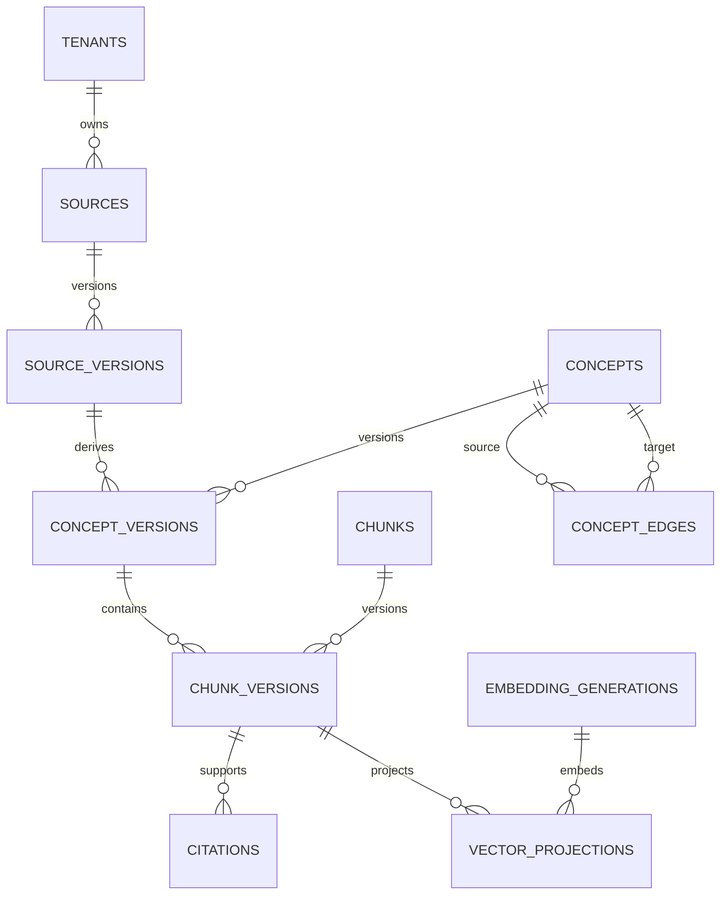
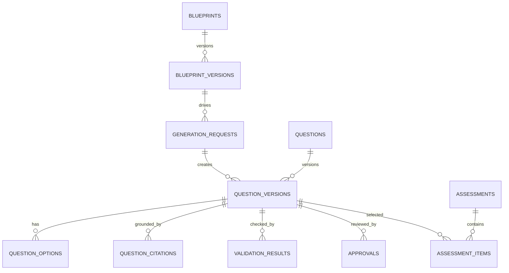

# 15. PostgreSQL Design

## Purpose

PostgreSQL is the transactional system of record for ULIP knowledge, provenance, graph relations,
publication, generated assessments, agent state, approvals, and audit. Qdrant is a rebuildable
retrieval projection described in [Vector Store Architecture](13_vector_store_architecture.md) and
[Qdrant Design](14_qdrant_design.md).

This design supersedes the development-only schema in `deploy/postgres/schema.sql` for production
planning. The existing tables can be migrated into this model, but production tenancy, immutable
versioning, approvals, outbox coordination, and audit must be added before launch.

## Deployment topology

Production uses PostgreSQL 16 or later:

* One writer and at least two synchronous or quorum-aware replicas across three availability zones.
* A managed failover endpoint for writes and separate read endpoints for approved analytical reads.
* PgBouncer in transaction pooling mode for stateless API services.
* Point-in-time recovery with continuous WAL archive to encrypted cross-region object storage.
* `pg_stat_statements`, `pgcrypto`, and `citext` enabled. Additional extensions require security and
  operational approval.
* Separate databases for production, pre-production, test, and development.

The request path does not use a read replica for authorization, publication, approval, or workflow
lease decisions because replica lag could expose stale state. Those reads go to the writer.

## Data ownership

| Schema | Responsibility |
|---|---|
| `iam` | Tenant-local principals, roles, entitlements, and policy references |
| `content` | Sources, versions, concepts, chunks, learning metadata, and provenance |
| `graph` | Typed concept edges and traversal support |
| `assessment` | Blueprints, question versions, options, citations, validation, and releases |
| `workflow` | Agent runs, checkpoints, tasks, approvals, tool calls, and idempotency |
| `projection` | Embedding generations, source manifests, outbox, and Qdrant watermarks |
| `audit` | Append-only security and business audit events |

Services receive privileges only on their owning schema and approved read views. Application code
does not connect as the database owner or migration role.

## Tenancy

ULIP uses shared tables with mandatory `tenant_id UUID NOT NULL`. Global reference rows use a
reserved platform tenant and are exposed to a tenant only through explicit licensing records.

Row-level security is enabled and forced on every tenant-bearing table:

```sql
ALTER TABLE content.concepts ENABLE ROW LEVEL SECURITY;
ALTER TABLE content.concepts FORCE ROW LEVEL SECURITY;

CREATE POLICY concepts_tenant_policy ON content.concepts
USING (tenant_id = current_setting('app.tenant_id', true)::uuid)
WITH CHECK (tenant_id = current_setting('app.tenant_id', true)::uuid);
```

At transaction start the data-access layer sets `SET LOCAL app.tenant_id` and
`SET LOCAL app.actor_id` from verified service claims. A missing tenant setting returns no tenant
rows and causes writes to fail. The connection pool reset hook clears all session state.

Every primary, unique, and foreign-key relationship involving tenant data includes `tenant_id`.
This prevents a child row from referencing another tenant even if application validation fails.
Cross-tenant SQL is restricted to an audited support role and security-definer functions with fixed
search paths.

## Naming, identity, and time

* Primary keys are UUIDv7, generated by the application or an approved database function.
* Human-readable codes are alternate keys, never primary keys.
* All timestamps use `TIMESTAMPTZ` in UTC.
* Enumerations that evolve use reference tables or checked text, not PostgreSQL enum types.
* Mutable tables include `created_at`, `created_by`, `updated_at`, `updated_by`, and `row_version`.
* Immutable versions include `version_no`, `content_hash`, `effective_from`, and optional
  `effective_to`.
* Deletion is explicit. Business records use state transitions and tombstones; hard deletion is
  limited to retention and verified erasure jobs.

## Core content model



### `content.sources`

One logical educational source.

| Column | Type | Constraint |
|---|---|---|
| `tenant_id` | UUID | PK part, FK tenant |
| `source_id` | UUID | PK part |
| `source_kind` | TEXT | `book`, `paper`, `course`, `standard`, `media`, `activity`, or approved value |
| `title` | TEXT | Required |
| `owner_name` | TEXT | Required for rights review |
| `rights_profile_id` | UUID | Required |
| `visibility` | TEXT | Checked |
| `status` | TEXT | `draft`, `active`, `withdrawn`, `deleted` |
| audit columns | Various | Required |

### `content.source_versions`

An immutable source edition or upload revision.

Key columns are `source_version_id`, `source_id`, `version_no`, `artifact_uri`, `artifact_sha256`,
`language`, `jurisdiction`, `curriculum_year`, `publication_state`, `quality_state`,
`effective_from`, `effective_to`, and `supersedes_version_id`.

`UNIQUE (tenant_id, source_id, version_no)` and
`UNIQUE (tenant_id, source_id, artifact_sha256)` make ingest retries idempotent. Once a version is
published, content columns are immutable. Corrections create another version.

### `content.concepts` and `content.concept_versions`

`concepts` stores stable identity and lifecycle. `concept_versions` stores name, definition,
description, type, domain, subject, topic, subtopic, level band, quality score, provenance, and
canonical hash.

A concept version can be derived from more than one source passage. The many-to-many table
`content.concept_evidence` records source version, page or segment locator, verbatim evidence hash,
extraction method, and confidence.

### `content.chunks` and `content.chunk_versions`

`chunks` stores stable semantic identity and concept ownership. `chunk_versions` stores canonical
text, title, chunk type, token count, language, quality score, metadata, content hash, publication
state, and source lineage.

Required uniqueness:

```sql
UNIQUE (tenant_id, chunk_id, version_no)
UNIQUE (tenant_id, concept_version_id, chunk_type, content_hash)
CHECK (char_length(canonical_text) BETWEEN 1 AND 12288)
CHECK (quality_score BETWEEN 0 AND 1)
```

The vector projection uses only published chunk versions. Source page locators are normalized in
`content.chunk_evidence`, not embedded in unbounded JSON.

### Learning records

Typed tables, each tenant-scoped, hold:

* `learning_objectives` with Bloom level, competency, assessment type, and concept version.
* `misconceptions` with misconception, explanation, correction, evidence, and severity.
* `competencies` with framework, skill, outcome, assessment method, and jurisdiction.
* `level_profiles` with level band, intrinsic difficulty, reasoning level, steps, prerequisite
  depth, confidence, rationale, and calibration method.
* `curriculum_mappings` linking concepts to board, curriculum, grade, course, exam, or professional
  framework.
* `activity_constraints` for experiential content, including age, equipment, supervision, and
  hazard policy.

Frequently queried typed fields are columns. JSONB stores bounded domain-specific extensions and
must have a registered JSON Schema version.

## Concept graph

`graph.concept_edges` has:

```text
tenant_id, edge_id, source_concept_id, target_concept_id,
relation_type, weight, evidence_id, valid_from, valid_to,
created_at, created_by
```

The direction convention for `prerequisite` is: source depends on target. Traversal from a learning
goal follows source to target. Valid relation types include `prerequisite`, `related`,
`parent_child`, `cause_effect`, `theory_application`, and `dependency`.

Constraints:

* Source and target must belong to the same tenant.
* Self-edges are forbidden except for a specifically approved equivalence relation.
* Weight is in `[0,1]`.
* One active edge exists per source, target, relation type, and evidence.
* Publication rejects prerequisite cycles unless the relation is explicitly classified as mutual.

Recursive CTEs support paths up to a request limit of six edges. Every recursive query carries
tenant predicates in both anchor and recursive terms. Materialized transitive closure is not used
initially. Add it only when measured graph scale violates the p95 objective.

## Assessment model



Core tables:

* `assessment.blueprints` and immutable `blueprint_versions`.
* `assessment.generation_requests` with client idempotency key, requested distribution, policy
  version, retrieval generation, prompt version, and status.
* `assessment.questions` for stable question identity.
* `assessment.question_versions` for immutable stem, explanation, type, answer representation,
  level, Bloom level, status, generator details, and content hash.
* `assessment.question_options` with stable order, option text or media reference, correctness, and
  rationale.
* `assessment.question_citations` with chunk version, quoted evidence locator, and support role such
  as `stem`, `answer`, `distractor`, or `solution`.
* `assessment.validation_results` with validator version, severity, score, details, and evidence.
* `assessment.assessments`, `assessment.assessment_versions`, and `assessment_items`.
* `assessment.releases` for approved publication to a learner cohort.

Correctness is not inferred only from `is_correct` booleans. `answer_spec JSONB` has a versioned,
type-specific schema and normalized answer hash. Question release requires a passing answer
verification result.

## Workflow and agent state

`workflow.runs` records workflow type, immutable input hash, policy version, state, current step,
tenant, actor, correlation ID, requested approvals, and timestamps.

`workflow.checkpoints` stores append-only state snapshots:

```text
tenant_id, run_id, checkpoint_seq, node_name, state_schema_version,
state_json, state_hash, created_at
```

State JSON is encrypted when it can contain licensed excerpts. It never stores secrets or hidden
model reasoning. `workflow.tasks` supports leases with `lease_owner`, `lease_expires_at`,
`attempt_no`, and `next_attempt_at`. A worker claims work using `FOR UPDATE SKIP LOCKED`.

`workflow.approval_requests` and `workflow.approval_decisions` are separate. The same actor cannot
both request and satisfy a high-risk approval. Approval boundaries are defined in
[Agentic Workflows](17_agentic_workflows.md).

## Vector projection and transactional outbox

### `projection.embedding_generations`

Stores generation ID, model artifact digest, dimension, metric, canonicalizer version, sparse
encoder version, payload schema, physical collection names, alias state, evaluation report, and
lifecycle status.

### `projection.vector_projections`

One expected projection per chunk version and generation:

```text
tenant_id, chunk_version_id, embedding_generation, point_id,
content_hash, desired_state, actual_state, attempts,
last_error_code, indexed_at, verified_at
```

Primary key is `(tenant_id, chunk_version_id, embedding_generation)`. `point_id` is unique.

### `projection.outbox`

The same transaction that commits a publishable chunk writes an outbox row. Required fields are
`event_id`, `tenant_id`, `aggregate_type`, `aggregate_id`, `aggregate_version`, `operation`,
`idempotency_key`, `payload`, `available_at`, `attempts`, and `published_at`.

The relay claims rows with `FOR UPDATE SKIP LOCKED`, publishes to the work queue, and records the
broker message ID. Consumer completion updates `vector_projections`, not the immutable outbox
payload. The unique `idempotency_key` prevents duplicate logical events.

No request transaction writes directly to Qdrant.

## Indexing strategy

Every tenant-scoped index begins with `tenant_id` unless the first predicate is a globally unique
UUID. Initial indexes:

```sql
CREATE INDEX source_versions_publish_idx
  ON content.source_versions (tenant_id, publication_state, effective_from, effective_to);

CREATE INDEX concept_topic_idx
  ON content.concept_versions (tenant_id, subject_id, topic_id, level_band)
  WHERE publication_state = 'published';

CREATE INDEX chunks_concept_idx
  ON content.chunk_versions (tenant_id, concept_version_id, chunk_type)
  WHERE publication_state = 'published';

CREATE INDEX edges_source_idx
  ON graph.concept_edges (tenant_id, source_concept_id, relation_type)
  WHERE valid_to IS NULL;

CREATE INDEX edges_target_idx
  ON graph.concept_edges (tenant_id, target_concept_id, relation_type)
  WHERE valid_to IS NULL;

CREATE INDEX question_status_idx
  ON assessment.question_versions (tenant_id, status, level_band, created_at DESC);

CREATE INDEX outbox_ready_idx
  ON projection.outbox (available_at, event_id)
  WHERE published_at IS NULL;
```

GIN indexes are limited to demonstrated JSONB containment or full-text query patterns. Every new
index includes `EXPLAIN (ANALYZE, BUFFERS)` evidence, write-cost analysis, and removal criteria.
Foreign-key columns are indexed.

Tables with high append volume, including audit events, tool calls, checkpoints, and outbox history,
are monthly range-partitioned by `created_at`. Current and next partitions are created automatically.

## Transaction boundaries and isolation

Default isolation is `READ COMMITTED`. Use:

* `REPEATABLE READ` for a generation request that must bind one coherent blueprint and publication
  snapshot.
* `SERIALIZABLE` for release numbering, active-version swaps, and approval quorum transitions.
* Advisory transaction locks keyed by tenant and aggregate for rare cross-row transitions.

All transactions are shorter than five seconds in request paths and 30 seconds in batch paths.
Large backfills use keyset pagination and commit every 1,000 rows. Network calls, embeddings, and
model calls never occur inside a database transaction.

Optimistic concurrency uses `row_version`. An update includes the expected value and increments it;
zero affected rows returns `CONCURRENT_MODIFICATION`.

## Idempotency

Every externally initiated write accepts `Idempotency-Key`. `workflow.idempotency_keys` stores
tenant, operation, key hash, request hash, response reference, status, and expiry.

Rules:

* Reuse with the same request hash returns the original result.
* Reuse with another request hash returns HTTP 409.
* Generation and ingestion keys remain for 30 days.
* Release, withdrawal, approval, and erasure keys remain for the audit-retention period.
* Database uniqueness is the final guard; application locks are not sufficient.

Content-derived records use canonical hashes and version uniqueness, so replay creates no duplicate.

## Security

* Connections require TLS 1.3 where supported and certificate verification.
* Credentials come from the secret manager, rotate at least every 90 days, and differ by service.
* Columns containing personal data or licensed raw excerpts use envelope encryption with tenant or
  data-class keys.
* Logs and query telemetry redact bind values by default.
* Dynamic SQL is forbidden in application paths. Queries are parameterized or use reviewed stored
  functions.
* RLS, foreign keys, checks, immutable-version triggers, and privilege tests run in CI.
* Database owner, migration, backup, application, support, and read-only roles are distinct.
* `audit.events` is append-only to application roles and exported to an immutable security store.

Learner answer events and adaptive profiles are data-classified separately from knowledge content.
They have shorter default retention and are never projected to Qdrant.

## Backup and disaster recovery

* Continuous WAL archiving provides a five-minute RPO.
* Daily full backups and hourly incremental backups are encrypted and cross-region replicated.
* Retain daily backups for 35 days, monthly backups for 13 months, and audit archives per contract.
* Backup catalogs, checksums, and restore logs are monitored.
* Quarterly restore tests recover into an isolated account, run schema checks, verify tenant RLS,
  compare row counts and hashes, replay the outbox, and exercise critical workflows.

Target RTO is 60 minutes. After database recovery, Qdrant is reconciled from
`projection.vector_projections` and the outbox watermark before publication resumes.

## Availability and service objectives

| Objective | Target |
|---|---|
| Transactional database availability | 99.95% monthly |
| Simple metadata read | p95 <= 50 ms, p99 <= 150 ms |
| Bounded prerequisite traversal | p95 <= 200 ms, p99 <= 500 ms |
| Write transaction | p95 <= 100 ms, p99 <= 300 ms |
| Planned failover | <= 60 s |
| Connection-pool saturation | < 80% sustained |
| Replica lag | p99 <= 5 s for non-authoritative reads |
| Backup RPO | <= 5 min |
| Restore RTO | <= 60 min |

Slow queries over 500 ms are sampled with normalized query ID. A 14.4x error-budget burn over one
hour pages the database on-call team.

## Failure handling

| Failure | Response |
|---|---|
| Writer failover | Retry idempotent transactions with decorrelated jitter for up to 30 seconds |
| Serialization conflict | Retry whole transaction at most three times |
| Pool exhaustion | Shed low-priority batch work, return typed overload for interactive requests |
| Deadlock | Roll back, retry twice, and alert on recurring query pairs |
| Outbox backlog | Continue relational commits, mark projection delayed, block publication readiness |
| Replica lag | Route authoritative reads to writer and remove lagging replica from pool |
| Migration failure | Stop deployment, leave prior application version serving, never auto-skip |
| Corruption suspicion | Make affected shard or database read-only, preserve evidence, initiate DR |

Errors use stable codes and correlation IDs. SQL text, credentials, full source excerpts, and learner
answers are excluded from application error messages.

## Observability

Metrics and traces include:

* Connection use, wait time, transaction rate, rollback, deadlock, and lock age.
* Query latency by normalized query ID and service.
* Buffer hit ratio, WAL rate, checkpoint duration, vacuum progress, bloat, and disk growth.
* Replica health, replay lag, failover events, backup age, and restore-test age.
* Table and partition size, sequence or UUID generation errors, constraint violations, and RLS
  denials.
* Outbox age, projection state counts, workflow lease expiry, approval wait time, and audit export
  lag.

Distributed traces link API request, transaction, outbox event, embedding job, Qdrant point, agent
run, and question version through immutable correlation fields.

## Schema migrations

Migrations use versioned SQL and expand, migrate, contract:

1. Add nullable columns or new tables and compatible indexes.
2. Deploy code that dual reads or dual writes.
3. Backfill with bounded, resumable jobs and recorded watermarks.
4. Verify counts, constraints, hashes, query plans, RLS, and application metrics.
5. Make constraints valid and required fields non-null.
6. Switch reads to the new representation.
7. Retain compatibility for one release window.
8. Remove old columns or tables in a separately approved migration.

Use `CREATE INDEX CONCURRENTLY` outside transactions for large live tables. Add foreign keys and
checks as `NOT VALID`, backfill, then validate. Destructive migrations require a tested restore and
rollback plan. Application versions declare minimum and maximum compatible schema versions and fail
readiness outside that range.

## Production acceptance

Before production:

* RLS positive and negative tests cover every tenant-bearing table and service role.
* Cross-tenant foreign keys are impossible.
* Publication, approval, release, withdrawal, and outbox transitions pass concurrency tests.
* Critical query plans meet objectives at 1.5 times forecast data and load.
* PITR and cross-region restore meet RPO and RTO.
* Schema migrations have forward and rollback rehearsals.
* Reconciliation with [Qdrant Design](14_qdrant_design.md) reaches zero unexplained differences.
* Agent checkpoint and approval behavior passes [Agentic Workflows](17_agentic_workflows.md)
  recovery tests.
