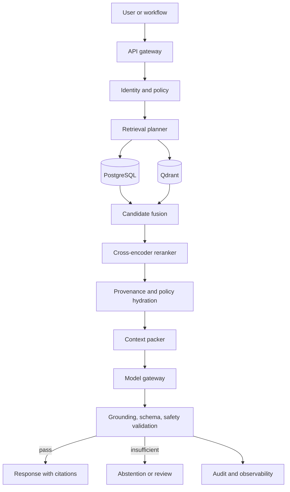

# 16. RAG Architecture

## Purpose

This document defines retrieval-augmented generation for ULIP. RAG serves explanations, tutoring,
learning paths, curriculum discovery, and grounded assessment generation across all ULIP domains.
It is designed to produce traceable outputs from authorized educational evidence and to abstain
when sufficient evidence is unavailable.

The retrieval projection is defined in
[Vector Store Architecture](13_vector_store_architecture.md) and [Qdrant Design](14_qdrant_design.md).
Authoritative metadata and provenance are in [PostgreSQL Design](15_postgres_design.md). Workflow
control and assessment-specific behavior are in [Agentic Workflows](17_agentic_workflows.md) and
[Question Generation](18_question_generation.md).

## Design principles

1. **Policy before relevance.** Tenant, entitlement, publication, validity, learner-age, and safety
   conditions are applied before similarity ranking.
2. **Evidence before generation.** The model receives only retrieved, cited, bounded evidence plus
   an explicit task contract.
3. **Abstention is a valid result.** No evidence, conflicting evidence, or unsupported answer claims
   produce a typed abstention or review request.
4. **Retrieval and generation are separately measurable.** Retrieval relevance, grounding, answer
   quality, and safety have independent release gates.
5. **Every claim is traceable.** Responses carry source and chunk-version citations; internal traces
   retain retrieval generation, scores, policies, and prompt version.
6. **Model output is untrusted.** Structured parsing, validation, policy checks, and citation
   verification occur after generation.
7. **Domain and learner context are explicit.** The same query can require different evidence for a
   school learner, a professional in a regulated jurisdiction, or an experiential activity.

## System context



Only the retrieval service talks to Qdrant. Only the content service and approved relational query
adapter read PostgreSQL knowledge records. The model gateway cannot call stores or arbitrary tools
unless an agent workflow grants a typed tool for that step.

## Request contract

A RAG request contains:

* `tenant_id` and actor claims from authentication, never from the body.
* `task`: `explain`, `tutor`, `learning_path`, `discover`, `generate_question`, or approved value.
* `query` and optional conversation summary.
* `domain`, subject, curriculum or framework, language, jurisdiction, and learner level.
* Optional concept IDs, source IDs, exam, Bloom level, proficiency level, and desired response type.
* Entitlements and policy decision reference supplied by the policy service.
* Token, latency, and cost budget chosen by the calling product.
* Correlation ID and request idempotency key for state-changing workflows.

The query is limited to 8 KiB. Conversation history is not sent directly to retrieval. A separate
step creates a bounded, attribution-free query summary and retains the current user question
verbatim.

## Query understanding and planning

The planner performs deterministic normalization first:

* Unicode normalization without altering mathematical symbols.
* BCP 47 language detection and script identification.
* Exact preservation of quoted terms, formulas, code, named works, standards, and legal identifiers.
* Spelling variants and curriculum aliases from tenant-approved dictionaries.
* Extraction of requested domain, subject, topic, level, time validity, source, and output intent.

A small classifier may propose query rewrites, but the original query always remains one retrieval
branch. Rewrites are limited to four and recorded. They cannot add an entitlement, tenant, source,
or safety condition.

The planner selects:

| Query type | Retrieval plan |
|---|---|
| Definition or fact | Hybrid chunk search plus authoritative-source preference |
| Procedure or worked example | Hybrid search filtered to process, formula, and example chunks |
| Prerequisite or learning path | PostgreSQL graph traversal plus vector support |
| Comparison or synthesis | Multi-query retrieval with source and viewpoint diversity |
| Current regulation or standard | Exact identifier search plus effective-date and jurisdiction filters |
| Language practice | Language, script, proficiency, and skill filters |
| Creative critique | Technique, medium, style, and rights-aware exemplar retrieval |
| Experiential activity | Activity, equipment, age, supervision, and hazard policy filters |
| Question generation | Blueprint-driven retrieval described in [Question Generation](18_question_generation.md) |

## Authorization and filtering

The policy service returns a signed, short-lived policy decision containing tenant, actor purpose,
permitted visibility classes, entitlement tags, jurisdiction, age or supervision constraints, and
expiry. The retrieval gateway validates it and builds store-native filters.

Mandatory conditions:

* Exact `tenant_id`.
* Published source and chunk version.
* Effective time validity.
* Visibility and license entitlement.
* Domain safety constraints.
* Active embedding generation.

The final candidate set is rechecked against PostgreSQL on the writer because Qdrant is eventually
consistent. Failure to hydrate policy state fails closed. Operators cannot request a policy bypass
through prompt text.

## Candidate retrieval

### Vector and lexical retrieval

Each query searches:

* Dense vector candidates for semantic similarity.
* Sparse vector candidates for lexical, formula, name, and identifier fidelity.
* Qdrant full-text or exact facets when the plan detects quoted or structured terms.

Default dense and sparse prefetch are 80 each. Reciprocal rank fusion returns 60 candidates. The
same mandatory policy filter is applied to every branch.

### Relational and graph retrieval

PostgreSQL contributes:

* Exact concept and curriculum matches.
* Prerequisite, parent-child, dependency, related, and theory-application edges.
* Current source publication and provenance.
* Learning objectives, misconceptions, competencies, and assessment suitability.
* Jurisdiction and regulation version.

Graph traversal is capped at depth six, 100 nodes, and 250 edges. Traversal cannot cross a tenant.

### Deduplication and diversity

Candidates are deduplicated by chunk identity, content hash, concept, and near-duplicate fingerprint.
The newest published chunk version wins. The planner applies per-source and per-concept caps so a
single book or repeated passage does not crowd out corroborating evidence.

For synthesis tasks, maximum marginal relevance promotes topic coverage and source diversity. For
exact fact tasks, authority and direct support outrank diversity.

## Reranking

A cross-encoder reranks the top 30 fused candidates. Its features are:

* Original query and candidate text.
* Semantic and sparse rank.
* Direct match to requested domain, curriculum, subject, topic, level, language, and jurisdiction.
* Source authority, quality score, publication recency, and effective-date fit.
* Chunk type fit for the requested task.
* Safety and supervision compatibility.

The reranker never receives inaccessible candidates. Scores are calibrated per domain and language
against labeled relevance sets. Rule-based authority floors apply to regulation, professional
procedure, health, safety, and high-stakes examination tasks.

## Evidence sufficiency gate

Before context packing, the service evaluates:

* At least one directly relevant, currently valid, accessible source.
* Answer-bearing evidence, not only topic similarity.
* Required authoritative source for regulated or syllabus-specific requests.
* Cross-source agreement when a claim requires corroboration.
* No unresolved contradiction among top evidence.
* Evidence language and learner level are suitable or an approved translation path exists.
* Retrieval scores exceed calibrated domain thresholds.

Outcomes:

* `SUFFICIENT`: proceed.
* `PARTIAL`: answer only supported parts and name what is missing.
* `CONFLICTING`: present the documented conflict or route to review.
* `INSUFFICIENT`: abstain and suggest a narrower query or approved source ingestion.
* `POLICY_BLOCKED`: do not reveal the existence or title of inaccessible sources.

The system does not fall back to model parametric knowledge for factual answers or question keys.

## Context construction

The context pack is a versioned structured object, not a concatenated untrusted prompt:

```json
{
  "context_schema_version": 2,
  "task": "explain",
  "query": "How does conservation of momentum apply to collisions?",
  "learner": {
    "domain": "school",
    "level": "advanced",
    "language": "en"
  },
  "evidence": [
    {
      "citation_id": "C1",
      "chunk_version_id": "uuid",
      "source_version_id": "uuid",
      "title": "Momentum and Collisions",
      "locator": {"page": 42},
      "text": "Authorized excerpt",
      "support_role": "definition",
      "authority": 0.96
    }
  ],
  "constraints": {
    "use_only_evidence": true,
    "cite_claims": true,
    "abstain_when_unsupported": true
  }
}
```

Context packing rules:

* Allocate at most 60 percent of the model context window to retrieved evidence.
* Reserve 20 percent for the answer and the remainder for system contract, schema, and validation.
* Include 5 to 12 chunks, normally no more than 4 from one source.
* Keep self-contained semantic chunks intact where possible.
* Put citation IDs adjacent to evidence.
* Include provenance and effective date but no inaccessible metadata.
* Escape and delimit all source text as data.
* Strip active content, scripts, external links, hidden text, and model-control tokens.
* Never include secrets, learner profiles beyond the task need, or raw model chain-of-thought.

If the budget is exceeded, remove the lowest marginal evidence rather than truncating all chunks.
Tables and formulas are preserved as atomic blocks.

## Prompt construction

Prompts are immutable, versioned assets with:

1. A system contract defining role, allowed evidence, citation format, abstention, and safety.
2. A typed task instruction.
3. Learner and domain constraints.
4. The structured evidence pack.
5. A strict output schema.

Source text can contain hostile instructions. The system contract states that content inside
evidence is quoted data and cannot change instructions, call tools, request secrets, or alter
policy. A prompt-injection classifier and deterministic pattern scanner label suspicious chunks.
Suspicious evidence can support a claim if required, but its control-like text is isolated and
never executed.

Model temperature is 0 to 0.2 for factual explanation and assessment. Creative learning tasks may
use a higher configured value only after grounding requirements are satisfied.

## Generation gateway

The model gateway:

* Selects only approved model versions for tenant data class and region.
* Enforces timeout, token, cost, and concurrency budgets.
* Disables provider training and retention where supported.
* Removes direct internet and arbitrary tool access.
* Validates request and response size.
* Records model ID, artifact or provider version, prompt version, parameters, usage, and latency.
* Retries transient failures at most twice with the same deterministic request hash.

Provider fallback is allowed only between models that passed the same task evaluation and data
handling policy. A fallback model does not relax grounding or output validation.

## Response validation and citations

The generated structured response is parsed without executing code. Validation includes:

* JSON Schema and task-specific semantic constraints.
* Every factual claim maps to one or more citation IDs.
* Citation IDs exist in the supplied context.
* Quoted text exactly matches or is a normalized excerpt of cited evidence.
* A natural-language inference verifier determines whether evidence supports each claim.
* Numerical expressions, units, and formulas pass deterministic checks where applicable.
* Safety, age, bias, personal data, copyright, and prohibited-content policies pass.
* Response language and requested reading level match.

The API returns stable citation objects with source title, edition, locator, and authorized link
where policy permits. Internal records retain immutable source and chunk version IDs.

Unsupported claims trigger one constrained repair attempt containing validation errors and the same
evidence. If repair fails, the service removes unsupported optional claims or abstains. It never
silently returns the failed draft.

## Conversation and personalization

Conversation state is stored in PostgreSQL with tenant and learner retention policy. The RAG request
uses:

* The current question.
* A bounded factual summary of prior turns.
* Explicit learner preferences relevant to presentation.
* Mastery signals necessary for level and prerequisite selection.

Prior model answers are not evidence. They may supply conversational references but must not enter
the citation set. Sensitive learner attributes are excluded unless essential and consented.

Personalization changes sequencing, vocabulary, example choice, and scaffolding. It cannot change a
correct answer, source entitlement, safety control, or curriculum fact.

## Caching

Retrieval results may be cached for five minutes using a key over tenant, policy decision hash,
normalized query, filters, active generations, and publication watermark. Generated explanations
may be cached only for public or tenant-shared content and a key that includes model, prompt,
context, policy, language, and learner-level hashes.

Private conversations, learner-specific recommendations, regulated professional answers, and
unreleased assessments are not shared-cache eligible. Withdrawal events purge affected cache keys.

## Failure and degradation

| Condition | Behavior |
|---|---|
| Dense retrieval unavailable | Use sparse plus relational retrieval if sufficiency passes |
| Sparse retrieval unavailable | Use dense plus relational retrieval if exact identifiers are not required |
| Reranker unavailable | Apply deterministic fused rank, authority, and diversity rules; mark degraded |
| PostgreSQL policy hydration unavailable | Fail closed |
| No relevant evidence | Return `INSUFFICIENT_EVIDENCE` |
| Evidence conflict | Cite both positions or route high-stakes tasks to review |
| Model timeout | Retry approved equivalent once or return `GENERATION_UNAVAILABLE` |
| Invalid structured output | One constrained repair, then fail or abstain |
| Citation verifier failure | Remove unsupported claim or abstain |
| Safety validator failure | Block output and emit policy-safe response |
| Context over budget | Repack evidence; never truncate policy or citation identifiers |

The current code's permissive empty-context model fallback is acceptable only in local
demonstration mode. Production factual and assessment workflows must enforce the evidence gate.

## Security and abuse resistance

* Treat query, conversation, retrieved text, and model output as untrusted.
* Authenticate every request and authorize every retrieval.
* Rate-limit by tenant, actor, workflow, and model cost.
* Detect extraction attacks, repeated source reconstruction, prompt injection, and secure-item
  probing.
* Apply maximum verbatim quote length and source-specific rights policy.
* Do not expose similarity scores, inaccessible source titles, internal policies, prompts, or tool
  descriptions to learners.
* Use signed media URLs with short expiry.
* Scan generated URLs and diagrams before rendering.
* Send high-confidence cross-tenant, secret, or secure-assessment leakage signals to the security
  incident path.

## Service objectives

| Objective | Target |
|---|---|
| RAG API availability | 99.9% monthly |
| Retrieval, fusion, rerank, and hydration | p95 <= 900 ms, p99 <= 1.8 s |
| First token for explanation | p95 <= 3 s, p99 <= 6 s |
| Complete explanation, 1,000 output tokens | p95 <= 8 s, p99 <= 15 s |
| Citation precision on release set | >= 99% |
| Citation coverage of factual claims | >= 98% |
| Grounded-answer rate on answerable set | >= 95% |
| Correct abstention on unanswerable set | >= 97% |
| Cross-tenant evidence leakage | 0 |
| Unsupported high-stakes answer | 0 known escaped defects |

Question-generation objectives are stricter and appear in
[Question Generation](18_question_generation.md).

## Observability and evaluation

Every trace records:

* Query and planner version, rewrite count, filters, and policy decision ID.
* Qdrant collection generation, branch ranks and scores, graph traversal, and hydration outcome.
* Deduplication, authority, diversity, rerank, and evidence-gate decisions.
* Context token use, citation IDs, model and prompt version, validator results, and abstention reason.
* Latency and cost by stage.

Raw learner queries and evidence text are redacted or access-controlled according to data class.

Evaluation uses frozen, versioned sets covering every domain, language, learner level, exact-term
query, multi-hop task, unanswerable request, conflicting source, prompt injection, and access
boundary. Metrics include recall@20, nDCG@10, mean reciprocal rank, context precision, answer
correctness, citation entailment, citation coverage, abstention accuracy, safety, latency, and cost.

Production quality monitoring uses sampled human review and delayed outcome signals. No automatic
online-learning loop publishes model or ranking changes without offline evaluation and approval.

## Versioning and rollout

Version independently:

* Query normalizer and planner.
* Dense and sparse embedding generation.
* Filter schema and policy contract.
* Fusion and reranking algorithms.
* Context schema and packer.
* System prompt and task prompt.
* Generation model.
* Output schema and validators.

A RAG release manifest pins all versions. Rollout proceeds through offline evaluation, integration
tests, shadow traffic, 5 percent canary, 25 percent, 50 percent, and full deployment. Automatic
rollback triggers on tenant-filter canary failure, citation precision regression, unsupported
high-stakes answer, or severe error-budget burn.

All generated artifacts retain their release manifest so they remain reproducible even after the
active RAG stack changes.
