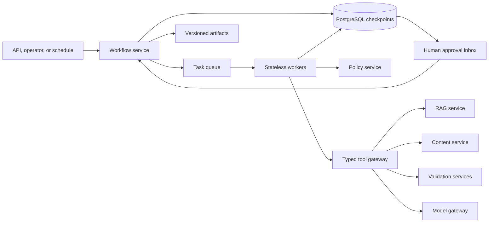
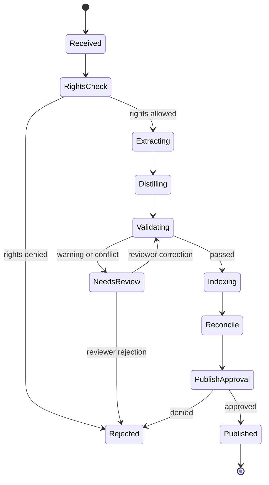

# 17. Agentic Workflows

## Purpose

This document defines ULIP agent orchestration, durable state, tool boundaries, approval controls,
recovery, and operations. Agents coordinate bounded educational workflows; they do not receive
unrestricted database, network, filesystem, or publication access.

Grounded retrieval is specified in [RAG Architecture](16_rag_architecture.md), durable persistence in
[PostgreSQL Design](15_postgres_design.md), and item authoring in
[Question Generation](18_question_generation.md).

## Architectural choice

ULIP uses LangGraph-compatible explicit state graphs behind a workflow service. PostgreSQL stores
durable checkpoints, leases, approvals, and artifact references. A queue distributes asynchronous
steps. Model providers and tools are accessed through typed gateways.

The production architecture does not rely on an in-process graph to survive restarts. A compiled
graph defines allowed nodes and transitions, while each transition is committed to PostgreSQL
before the next task is dispatched.



MCP can expose ULIP workflow entry points and approved retrieval tools to Droid or another client.
It is an interface adapter, not a trust boundary. The workflow service authenticates the call and
applies the same tenant, policy, state, and approval rules.

## Agent roles

An agent role is a prompt, model class, input schema, output schema, tool allowlist, budget, and
policy version. It has no ambient privileges.

| Role | Responsibility | Allowed capabilities | Forbidden capabilities |
|---|---|---|---|
| Ingestion coordinator | Orchestrate extraction and quality stages | Read staged artifact, invoke extractors and validators, write draft records | Publish, change rights, access other tenants |
| Knowledge curator | Normalize concepts and relationships | Read approved source evidence, propose concept records and edges | Invent unsupported facts, approve own changes |
| Retrieval planner | Build retrieval plan | Call policy and RAG retrieval interfaces | Query raw stores, weaken filters |
| Learning-path planner | Order concepts using graph and evidence | Read concepts, prerequisites, objectives, learner mastery | Alter mastery or publish curriculum |
| Question author | Create candidate items from a blueprint and evidence | RAG retrieval, model generation, deterministic templates | Release items, use inaccessible sources |
| Question verifier | Check answer, grounding, level, and item quality | Read candidate and cited evidence, call approved solvers | Edit source truth, approve high-risk item alone |
| Safety reviewer | Classify policy and activity risk | Read minimum required item and policy | Publish or disclose restricted content |
| Editorial assistant | Summarize validation and proposed edits | Create a new candidate version | Override failed validation |
| Release coordinator | Assemble approved versions | Read approval decisions, create release transaction | Generate content, bypass quorum |

Roles that author and verify a high-stakes artifact use independent model invocations and, where
required, different model families or deterministic solvers. The same workflow node cannot
self-attest its output.

## Supported workflows

### Source ingestion and publication



The coordinator runs discovery, quality analysis, noise removal, distillation, concept extraction,
learning objective creation, misconceptions, competencies, graph generation, assessment profiling,
quality validation, embedding preparation, semantic chunking, and vector projection. A source is
not retrievable until relational and Qdrant manifests reconcile and publication approval completes.

### Grounded question generation

1. Validate blueprint, entitlement, source scope, and idempotency key.
2. Retrieve blueprint-specific evidence.
3. Assess evidence sufficiency.
4. Build item plans across topic, level, Bloom, type, and domain.
5. Generate candidates.
6. Run schema, grounding, answer, distractor, duplication, fairness, safety, and rendering checks.
7. Repair a candidate at most twice using structured validator feedback.
8. Route candidates by risk to automatic rejection, editorial review, or approval quorum.
9. Persist immutable question versions and citations.
10. Release only approved versions.

See [Question Generation](18_question_generation.md) for item rules.

### Explanation

`authorize -> retrieve -> evidence_gate -> generate -> citation_validate -> safety_validate ->
return_or_abstain`

An explanation may complete without human approval when evidence and policy gates pass and the
request is not high stakes. Professional regulation, safety-critical experiential procedures, and
disputed content require review or an authoritative template.

### Learning path

`authorize -> load_mastery -> resolve_goal -> traverse_prerequisites -> retrieve_support ->
sequence -> validate_constraints -> return`

The planner can propose a path but cannot update learner mastery, enroll a learner, or certify a
competency. Those actions require explicit product APIs and actor confirmation.

### Correction and withdrawal

A reported defect creates a case linked to exact source, chunk, question, and workflow versions.
Agents can reproduce, collect evidence, assess impact, and propose a corrected version. A human
owner approves source corrections, released-question corrections, or broad withdrawal. Emergency
policy can hide an artifact immediately while preserving audit and later requiring retrospective
approval.

## Durable workflow state

Each run has an immutable envelope:

```json
{
  "run_id": "uuid",
  "tenant_id": "uuid",
  "workflow_type": "question_generation",
  "workflow_version": "qgen-3.2.0",
  "input_hash": "sha256:...",
  "idempotency_key_hash": "sha256:...",
  "actor_id": "uuid",
  "policy_version": "2026-07-01",
  "correlation_id": "uuid",
  "created_at": "2026-07-21T10:00:00Z"
}
```

Mutable graph state uses a versioned schema:

```json
{
  "state_schema_version": 4,
  "status": "validating",
  "current_node": "answer_verifier",
  "attempts": {"generate_candidate": 1, "answer_verifier": 1},
  "budgets": {
    "deadline_at": "2026-07-21T10:05:00Z",
    "model_tokens_remaining": 18000,
    "tool_calls_remaining": 24,
    "cost_units_remaining": 500
  },
  "artifacts": [
    {"kind": "question_candidate", "id": "uuid", "version": 1, "hash": "sha256:..."}
  ],
  "pending_approval_id": null,
  "last_error": null
}
```

Checkpoints contain references and hashes, not large source documents or model hidden reasoning.
Licensed excerpts are stored in access-controlled artifact tables or object storage. Secrets never
enter workflow state.

Every node transition is atomic:

1. Lock the run row and verify expected `row_version`.
2. Validate the proposed state against the workflow schema and transition table.
3. Append a checkpoint and node outcome.
4. Create the next task or approval request.
5. Increment `row_version` and commit.

## Workflow states and terminal outcomes

Common states are `queued`, `running`, `waiting_retry`, `waiting_approval`, `paused`, `cancelling`,
`completed`, `completed_with_warnings`, `rejected`, `failed`, and `cancelled`.

Terminal outcomes are immutable. Resuming after failure creates a child run with
`resumes_run_id` and can reuse verified artifacts by hash. It does not mutate history.

A cancellation is cooperative. Workers check cancellation before and after model or tool calls. Any
already-created draft remains non-published and is retained or deleted according to policy.

## Tool contracts

Tools use strict request and response schemas, operation-specific service identities, and bounded
timeouts. Important tools include:

* `retrieve_evidence`: read-only, policy-scoped RAG retrieval.
* `get_concept_graph`: read-only, bounded-depth tenant graph.
* `create_draft_artifact`: writes an immutable draft version.
* `validate_question`: read-only over candidate and evidence, writes validation result.
* `render_diagram`: accepts only the approved diagram DSL and returns sanitized SVG.
* `request_approval`: creates an approval request, never a decision.
* `assemble_release`: transactional release after verifying approval quorum.

Generic SQL, unrestricted filesystem, shell execution, arbitrary HTTP, and model-selected MCP
servers are forbidden in production workflows. A tool response is untrusted input and is validated
before entering state.

All calls carry tenant, actor or service role, run, step, purpose, policy decision, and trace IDs.
The gateway ignores tenant and privilege values produced by the model.

## Approval boundaries

### No human approval required

Subject to passing all automated gates:

* Low-stakes grounded explanations.
* Draft learning paths and practice recommendations.
* Duplicate detection, metadata classification, and retrieval indexing of already approved content.
* Draft question generation for internal review.

### One qualified approver required

* Publishing a new ordinary educational source.
* Releasing low-stakes practice questions from approved sources.
* Correcting a non-secure, unreleased item.
* Promoting an approved question to exemplar retrieval.

### Two-person quorum required

* Releasing high-stakes, summative, certification, or competitive-exam items.
* Publishing regulated professional guidance.
* Publishing safety-critical experiential instructions.
* Bulk source withdrawal or correction affecting released assessments.
* Overriding a warning from grounding, answer, fairness, rights, or safety validation.

One approver must be a domain expert and the other an editorial, compliance, or assessment owner.
The author, workflow initiator, and model cannot satisfy either approval slot.

### Platform security approval required

* Tenant data export, cross-tenant operation, bulk deletion, retention override.
* New tool capabilities, new external model provider, prompt access to a new data class.
* Collection alias changes and disaster-recovery failover affecting production.

Approval decisions include actor, role, artifact hash, validation summary hash, policy version,
comment, and expiry. Changing the artifact invalidates prior approvals.

## Autonomy and risk tiers

| Tier | Examples | Agent authority |
|---|---|---|
| A0 Read-only | Retrieve, classify, summarize | Execute within budget and policy |
| A1 Draft write | Create draft concept, path, or question | Persist immutable draft |
| A2 Reversible operational | Retry index, quarantine draft, rerun validation | Execute and audit |
| A3 Publication or learner impact | Publish source, release item, change mastery | Prepare action, require approval |
| A4 Security or irreversible | Erasure, cross-tenant export, destructive migration | No direct agent execution |

The workflow compiler validates that a role cannot reach a tool above its maximum tier.

## Idempotency and concurrency

Workflow creation is idempotent on tenant, workflow type, and caller key. Reusing a key with another
input hash returns conflict. Each node has:

```text
node_idempotency_key = run_id + node_name + logical_iteration + input_artifact_hashes
```

Node outcomes and created artifacts have unique constraints on that key. A retried node returns the
existing outcome. Tool calls pass derived idempotency keys to state-changing services.

Tasks use leases. A worker claims a task with `FOR UPDATE SKIP LOCKED`, sets a short expiry, and
heartbeats. Lease expiry permits another worker to resume from the committed checkpoint. External
calls may complete twice, so their idempotency is mandatory.

Only one transition can update a run version. Parallel fan-out steps write independent outcomes and
a deterministic join node commits when all required branches are terminal.

## Retry, repair, and compensation

Retry only transient failures:

* Network timeout, service unavailable, rate limit, failover, or serialization conflict.
* Exponential backoff with jitter: 1, 2, 4, 8, 16, and 30 seconds.
* Maximum six infrastructure attempts or the run deadline.
* Model transient failure receives at most two attempts, then an approved fallback if configured.

Do not retry:

* Policy denial, invalid schema, insufficient evidence, safety rejection, rights rejection,
  deterministic solver contradiction, or exhausted budget.

Content repair is distinct from infrastructure retry. A validator may request at most two
constrained revisions of a draft. It supplies machine-readable defects and the same approved
evidence. A third failure rejects the candidate or routes it to editorial review.

Side effects use compensating actions:

* A failed publication marks the source unavailable and emits projection tombstones.
* A failed release transaction leaves no partial assessment due to database atomicity.
* A generated signed URL expires naturally.
* External notification failure is retried without repeating the release.

Published immutable versions are corrected or withdrawn, never silently edited.

## Budget controls

Every run receives:

* Absolute deadline and per-node timeout.
* Maximum model input and output tokens.
* Maximum model calls and tool calls.
* Cost-unit limit.
* Maximum graph iterations and repair attempts.
* Maximum retrieval candidates and context size.
* Maximum number and size of generated artifacts.

Workers check the budget before a call and atomically reserve estimated cost. Actual usage is
reconciled after completion. Budget exhaustion creates a typed outcome, not an uncontrolled retry.

## Security and privacy

* Prompts, tool responses, and generated output are untrusted.
* Tool gateway, not the model, injects tenant, identity, policy, and idempotency fields.
* Agents cannot discover tools dynamically in production.
* Model providers receive only the minimum data and approved region or retention mode.
* Source instructions are isolated as quoted evidence to resist prompt injection.
* State, logs, and traces omit secrets and hidden model reasoning.
* Sensitive artifacts are encrypted and accessed through short-lived references.
* Workflow service identities rotate and are scoped by environment and role.
* Every state transition, model call, tool call, approval, release, cancellation, and operator
  intervention is audited.
* Anomalous tool sequences, source extraction behavior, cross-tenant identifiers, or cost spikes
  terminate the run and raise a security event.

## Observability

Metrics:

* Run rate, completion, rejection, failure, cancellation, and approval wait by workflow version.
* Node duration, queue wait, attempts, lease expiry, timeout, and error code.
* Model latency, token use, structured-output failure, fallback, and cost.
* Tool latency, policy denial, circuit-breaker state, and idempotent replay rate.
* Validation failure and repair success by rule, domain, language, and model.
* Human approval age, rejection reason, override rate, and approver workload.
* Checkpoint size, artifact count, dead-letter depth, and stuck-run count.

Traces link the workflow run to retrieval traces, model requests, artifact versions, approvals, and
release IDs. Logs use hashes and IDs rather than full copyrighted text or learner answers.

Alerts page on cross-tenant canary failure, unauthorized tool attempt, release without valid quorum,
queue age above five minutes for interactive work, or a 14.4x error-budget burn over one hour.

## Service objectives

| Objective | Target |
|---|---|
| Workflow control-plane availability | 99.9% monthly |
| Interactive run accepted and checkpointed | p95 <= 300 ms |
| Task dispatch after commit | p95 <= 2 s, p99 <= 10 s |
| Resume after worker loss | p95 <= 30 s |
| Durable transition success | >= 99.99% excluding validated business rejection |
| Duplicate externally visible side effects | 0 |
| Publication without required approval | 0 |
| Interactive explanation workflow | p95 <= 10 s |
| Three-item draft question workflow | p95 <= 60 s |

Human approval time is reported separately and excluded from automated workflow latency.

## Workflow versioning and migration

A workflow release pins graph definition, state schema, agent roles, prompts, model policy,
tool schemas, validators, and approval matrix.

Rules:

* A running workflow stays on its pinned version.
* Compatible node implementations can deploy if input and output schemas are unchanged.
* State-schema changes require an explicit pure migration function and fixture tests.
* Approval policy can become stricter immediately; a relaxed policy applies only to new runs.
* A removed tool remains available to existing runs only if security approves. Otherwise affected
  runs pause for migration or cancellation.
* New workflow versions use canary tenants and shadow comparison before default routing.

A migration job reads a checkpoint, validates its hash, transforms state, writes a new checkpoint
with prior and new schema versions, and preserves the original. It never edits checkpoint history.

## Operational runbooks

### Stuck run

1. Verify queue, lease, and dependency health.
2. Confirm no approval is pending.
3. Inspect typed error and last committed checkpoint.
4. Expire only the affected lease.
5. Replay the node using its idempotency key.
6. Create a child run if state or workflow migration is required.

### Model or tool incident

1. Open the circuit breaker for the failing version.
2. Pause affected workflow nodes.
3. Use an approved equivalent only if evaluation and data policy permit.
4. Resume from checkpoints.
5. Revalidate any artifact produced during the incident window.

### Approval integrity incident

1. Stop all affected release transitions.
2. Preserve workflow, artifact, and audit records.
3. Withdraw releases whose quorum cannot be proven.
4. Notify security and assessment owners.
5. Resume only after policy and audit reconciliation.

## Production acceptance

* Every graph transition and terminal state is schema validated.
* Crash, duplicate-delivery, lease-expiry, queue-replay, and database-failover tests create no
  duplicate side effects.
* Tool allowlists and risk tiers are compile-time and runtime enforced.
* Approval quorum, separation of duties, expiry, and artifact-hash invalidation pass negative tests.
* Prompt-injection and malicious-tool-output suites cannot change policy or tool access.
* Budgets terminate loops and repair attempts deterministically.
* Restore exercises resume durable runs from PostgreSQL.
* The question workflow meets all release gates in
  [Question Generation](18_question_generation.md).
