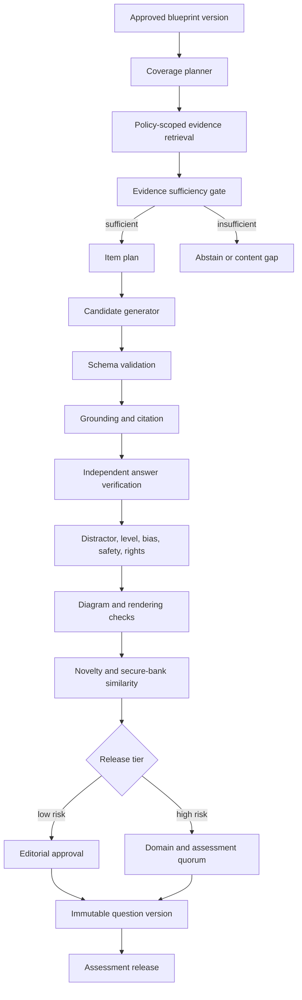
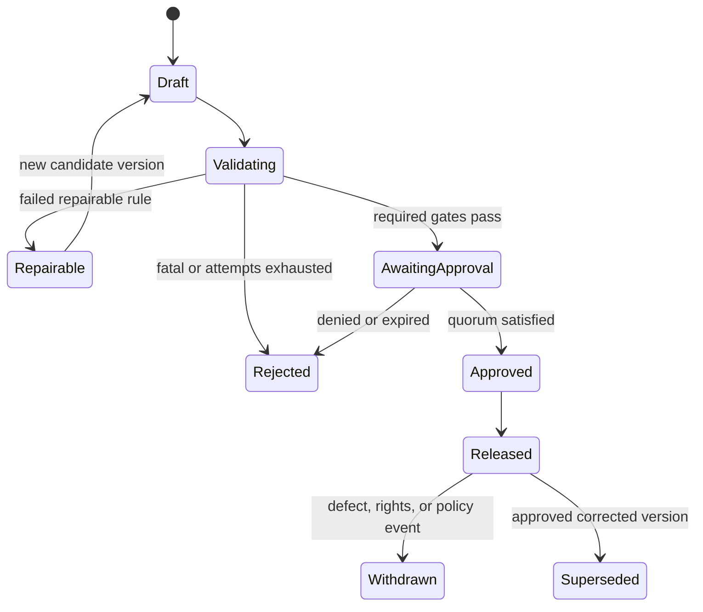

# 18. Question Generation Architecture

## Purpose

This document defines how ULIP generates, verifies, versions, approves, and releases grounded
questions. It covers school, competitive examination, higher education, professional, language,
creative, and experiential learning.

Generation uses the evidence and abstention contract in [RAG Architecture](16_rag_architecture.md),
the durable controls in [Agentic Workflows](17_agentic_workflows.md), and the assessment persistence
model in [PostgreSQL Design](15_postgres_design.md). The vector store supplies evidence candidates,
not answer truth.

## Quality contract

A releasable question is:

* Aligned to an approved blueprint, concept, curriculum or framework, level, and Bloom objective.
* Answerable from cited, authorized, currently valid evidence or an approved deterministic model.
* Unambiguous for the intended learner population.
* Correct in stem, key, options, rationale, worked solution, units, and diagram.
* Novel enough not to reproduce the source, a secure item, or another generated item.
* Free from unintended clues, implausible distractors, gratuitous complexity, and construct-irrelevant
  language.
* Accessible, inclusive, age-appropriate, safe, and compliant with rights and assessment policy.
* Versioned, traceable, reproducible, and approved at the required risk tier.

An item that fails any required gate is a draft defect, not a lower-confidence release.

## Architecture



Each stage writes a typed result linked to candidate hash, evidence versions, generator manifest,
and workflow run. Later stages cannot rewrite earlier evidence. A correction creates another
question version and reruns all affected validators.

## Blueprint contract

Generation begins from an immutable blueprint version, not a free-form prompt. Required fields:

| Area | Fields |
|---|---|
| Ownership | Tenant, creator, purpose, assessment owner, rights profile |
| Audience | Domain, learner age, grade or course, language, jurisdiction, accessibility needs |
| Alignment | Curriculum, syllabus year, competency framework, topic and concept scope |
| Distribution | Count by question type, level, Bloom level, objective, and content area |
| Scoring | Marks, partial credit, negative marking, time expectation, calculator or resource policy |
| Evidence | Allowed source versions, authority requirements, validity date, citation policy |
| Item rules | Option count, single or multiple response, media and diagram rules, word limits |
| Risk | Practice, formative, summative, competitive, certification, regulated, or safety-critical |
| Generation | Approved models and templates, prompt version, retrieval generation, seed policy |
| Release gates | Validator thresholds and required human approval roles |

The blueprint validator rejects contradictory distributions, missing source rights, impossible item
counts, unsupported languages, obsolete syllabus years, and risk tiers without qualified approvers.

## Canonical item model

ULIP stores a stable `question_id` and immutable `question_version_id`. The canonical version model
is richer than any delivery format:

```json
{
  "schema_version": 3,
  "question_id": "uuid",
  "question_version_id": "uuid",
  "status": "validated",
  "type": "single_choice",
  "domain": "school",
  "language": "en",
  "stem": {
    "content": "Question text with accessible math",
    "media": [],
    "diagram_spec": null
  },
  "options": [
    {
      "option_id": "uuid",
      "position": 1,
      "content": "Option text",
      "is_correct": true,
      "rationale": "Why this option is correct or incorrect"
    }
  ],
  "answer_spec": {
    "kind": "selected_options",
    "correct_option_ids": ["uuid"]
  },
  "worked_solution": "Evidence-grounded solution",
  "alignment": {
    "concept_ids": ["uuid"],
    "learning_objective_ids": ["uuid"],
    "level_band": "advanced",
    "bloom_level": "Apply"
  },
  "citations": [
    {
      "citation_id": "C1",
      "chunk_version_id": "uuid",
      "support_role": "answer"
    }
  ],
  "generation_manifest": {
    "workflow_version": "qgen-3.2.0",
    "retrieval_generation": "g003",
    "prompt_version": "qauthor-7",
    "model_version": "approved-model",
    "validator_bundle": "qval-5.1.0"
  }
}
```

Delivery adapters produce player-specific JSON, QTI, print, or API representations. Adapters cannot
change correctness, content, citations, or scoring. The existing `{"question": {...}}` quiz envelope
is one adapter target.

## Supported item types

Initial production support:

* Single-choice and multiple-choice.
* Numeric and short-answer with normalized answer rules.
* Multi-step problem solving.
* Scenario and case-based questions.
* Matching, ordering, cloze, and classification.
* Essay or constructed response with analytic rubric.
* Oral, listening, reading, writing, and speaking language tasks.
* Creative response with process and critique rubric.
* Practical or experiential observation with safety and performance rubric.

An item type is enabled only when its answer specification, scoring engine, delivery renderer,
accessibility behavior, and validator suite are production-ready. Unsupported types are rejected,
not approximated as multiple-choice.

## Coverage and item planning

The coverage planner turns blueprint quotas into item plans. A plan contains:

* Primary and supporting concepts.
* Learning objective and Bloom target.
* Level band and evidence depth.
* Item type, response mode, marks, estimated time, and cognitive steps.
* Required source authority and evidence roles.
* Misconception targets for distractors.
* Diagram, media, tool, or practical constraints.
* Domain-specific safety and fairness constraints.
* Similarity exclusions from existing and secure items.

Plans use deterministic constrained allocation. They satisfy all hard blueprint quotas before
optimizing topic balance, concept centrality, prerequisite coverage, and novelty. The planner emits
an infeasibility report rather than quietly changing quotas.

Level is not a label added after generation. It is derived from prerequisite depth, number of
combined concepts, abstraction, reasoning steps, representation changes, Bloom demand, and expected
time. Competitive items at JEE Main level and above normally combine two to four graph-connected
concepts. The evidence gate must support every member concept.

## Evidence retrieval and grounding

For each item plan the retrieval service searches approved source versions using:

* Concept IDs and topic.
* Curriculum, exam, course, professional framework, or proficiency level.
* Target level and Bloom objective.
* Required chunk types, such as concept, formula, example, misconception, procedure, case, or rubric.
* Language, jurisdiction, validity date, rights, age, and safety filters.

Evidence roles are explicit:

* `stem`: supports facts or scenario details stated in the stem.
* `answer`: proves the answer key.
* `solution`: supports methods and intermediate claims.
* `distractor`: supports a documented misconception or predictable error.
* `rubric`: supports performance criteria.
* `safety`: supports practical constraints and warnings.

Every answer-bearing proposition needs direct evidence or a deterministic derivation from evidence.
If required evidence is missing or conflicting, generation returns `CONTENT_GAP` with the missing
concept and role. It must not use model memory to fill the gap.

## Candidate generation

The item author receives a structured item plan and citation-labeled context. The generation
contract:

1. Use only supplied evidence and deterministic tools.
2. Create one item per requested plan.
3. Keep curriculum facts and answer invariant under stylistic changes.
4. Cite the evidence used for stem, key, solution, and distractors.
5. Output strict canonical JSON.
6. Do not mention internal prompts, tools, scores, or citation IDs in learner-facing text.
7. Do not imitate or reproduce source wording beyond the rights policy.
8. Do not generate hidden reasoning. Supply a concise, auditable worked solution.

Temperature is 0 to 0.2. The request pins model, prompt, evidence, tool, and random seed where the
provider supports deterministic seeding.

Deterministic parametric templates are preferred for item families whose answer and diagram can be
computed exactly, such as algebra, coordinate geometry, measurement, finance calculations, code
execution, and language morphology. A template is a versioned generator with parameter domains,
constraints, solver, renderer, and tests. Model prose can contextualize a template but cannot alter
its computed key.

## Domain-specific generation

### School

Align to board, curriculum year, grade, chapter, and taught method. Use age-appropriate vocabulary
and avoid prerequisites outside the declared grade unless the blueprint requests challenge
material. Examples must not create socioeconomic or regional bias.

### Competitive examinations

Pin exam, syllabus year, stage, marking scheme, permitted methods, expected time, and level band.
Multi-concept plans use graph-connected concepts. Independent solver verification and two-person
approval are mandatory. Similarity checks include licensed past papers and the secure live bank.

### Higher education

Pin discipline, course, level, notation convention, prerequisite course, and allowed theorem set.
Constructed responses use analytic rubrics. Proof questions distinguish assumptions, claims, and
valid inference steps.

### Professional learning

Pin competency framework, jurisdiction, regulation version, role, and effective date. Current
authoritative guidance must be cited. Regulated or consequential items require a qualified domain
expert. Obsolete source versions are ineligible.

### Language learning

Pin target language and script, source language, CEFR or equivalent level, skill, register, dialect
policy, and cultural context. Listening and speaking items include media transcripts and
pronunciation or scoring metadata. Distractors must represent plausible linguistic errors, not
random spelling corruption.

### Creative learning

Creative prompts are evaluated against a rubric rather than a single canonical answer. Rubrics
separate technique, process, interpretation, reflection, and originality. Reference works must be
rights-cleared. Style imitation of living artists or protected source reconstruction follows tenant
policy.

### Experiential learning

Pin activity setting, age, equipment, duration, accessibility, supervision, hazard class, and
emergency constraints. The generator cannot invent safety steps. Practical tasks require cited
safety evidence and human approval when there is physical risk. The scoring rubric observes process
and outcomes without encouraging unsafe shortcuts.

## Validation pipeline

Validators return `PASS`, `WARN`, or `FAIL`, a stable rule code, severity, evidence, and validator
version. A required `FAIL` blocks release. `WARN` handling is fixed by blueprint risk policy.

### 1. Schema and completeness

* Canonical JSON Schema.
* Required fields, option count, answer representation, citations, and manifest.
* Exactly one correct option for single choice and the configured range for multiple choice.
* No empty stem, option, solution, rationale, or rubric criterion where required.
* Stable IDs, valid locale, safe lengths, and renderable markup.

### 2. Grounding

* Citation IDs resolve to evidence supplied during generation.
* Every factual and answer-bearing claim is entailed by cited evidence.
* Formula, definition, scenario, and solution citations use appropriate evidence roles.
* Source versions are still published, valid, accessible, and rights-cleared.
* No uncited model fact changes the answer.

### 3. Independent answer verification

Use a verifier that did not author the candidate:

* Symbolic algebra and numerical solvers for supported mathematics.
* Unit and dimensional analysis.
* Sandboxed, deterministic execution for code questions with fixed resource limits and no network.
* Rule engines for logic, grammar, structured matching, and scoring.
* Source-grounded second-model verification for semantic items.
* Two qualified humans for high-stakes subjective keys and rubrics.

The verifier recomputes the answer from stem and approved evidence without seeing the author's
declared key until it produces its own result. A mismatch is `ANSWER_CONTRADICTION` and cannot be
repaired by changing only the key. The whole item returns to generation or review.

### 4. Distractor validation

For selected-response items:

* Every incorrect option is unambiguously incorrect under the stem.
* Distractors are plausible for the target level.
* Each maps to a documented misconception, calculation error, or reasoning error where possible.
* Options are parallel in grammar, units, precision, length, and representation.
* No option contains a unique lexical clue, absolute qualifier, or rationale leak.
* Correct-option positions are balanced across the assessment.
* Options do not overlap or form an unintended second key.
* `all of the above` and `none of the above` are disabled by default.

### 5. Alignment and difficulty

A classifier independent of the author predicts concepts, curriculum, Bloom level, level band, and
time. Required alignment:

* Primary concept matches the item plan.
* No unsupported prerequisite dominates the item.
* Predicted Bloom level is within one adjacent level for drafts and exact for release.
* Predicted difficulty is within the blueprint band.
* Reading complexity does not create construct-irrelevant difficulty.

Pilot psychometric data replaces model-estimated difficulty when available. The platform stores
estimated and observed values separately.

### 6. Language and accessibility

* Grammar, spelling, register, locale, and terminology.
* Plain language appropriate to level.
* Math has accessible text or MathML.
* Images and diagrams have meaningful alternatives and do not rely only on color.
* Keyboard and screen-reader delivery behavior is valid.
* No time, visual, auditory, or motor demand beyond the declared construct without accommodation.

### 7. Fairness and safety

* No stereotypes, protected-attribute assumptions, unnecessary trauma, or exclusionary context.
* Names, settings, and cultural references are balanced and understandable.
* Differential interpretation risk is reviewed across learner slices.
* Professional and experiential content obeys jurisdiction, age, equipment, and supervision policy.
* Personal data, secrets, harmful instructions, and prohibited content are absent.

### 8. Rights and novelty

Compare normalized text, semantic embeddings, structure fingerprints, numerical parameters, and
diagram fingerprints against:

* All source passages.
* Tenant question bank.
* Licensed past papers.
* Secure live assessment bank through a one-way similarity service.
* Items generated in the same request.

Thresholds are calibrated by item type. A high similarity result blocks release or requires rights
review. The secure-bank service returns only match severity and opaque reference, never item text.

### 9. Rendering

Render every delivery target in a sandbox. Verify math, tables, Unicode, SVG, media, option ordering,
page breaks, print contrast, responsive layout, and accessible names. SVG accepts only the approved
diagram DSL and is sanitized. Scripts, external references, event handlers, and foreign objects are
forbidden.

## Repair policy

A failed candidate can receive at most two constrained repair attempts. The repair input contains
rule codes, explanations, candidate JSON, and the original evidence. It cannot retrieve new
evidence, change blueprint alignment, or weaken validation.

Changes that alter stem facts, key, options, solution, citations, or diagram create a new candidate
version and rerun all validators. Cosmetic metadata changes rerun schema and rendering at minimum.
Repeated answer, grounding, rights, or safety failure routes to human review or rejection.

## Approval and release

Draft generation never equals publication.

| Risk | Release requirement |
|---|---|
| Internal draft | Automated required validators pass |
| Low-stakes practice | Qualified editorial approval and passing validators |
| Formative classroom | Subject or curriculum approval according to tenant policy |
| Summative or competitive | Independent domain expert plus assessment expert |
| Professional regulated | Licensed or qualified domain expert plus compliance owner |
| Safety-critical experiential | Domain or safety expert plus learning owner |
| Creative or subjective rubric | Domain practitioner plus assessment or editorial reviewer |

Approvals bind the exact question-version hash, validation-bundle hash, blueprint version, and source
versions. Any content change invalidates approval. The release transaction verifies approval quorum
and source validity on the PostgreSQL writer.

An emergency hide can immediately remove a defective item from new delivery. It does not erase
history and requires retrospective owner review.

## Idempotency and reproducibility

A generation request has a caller idempotency key and canonical request hash. Repeating both returns
the same request and artifacts. Reusing the key with another hash returns conflict.

Item-plan ID:

```text
uuidv5(blueprint_version_id, coverage_cell + ordinal + planner_version)
```

Candidate ID:

```text
uuidv5(item_plan_id, evidence_hash + generator_manifest_hash + attempt_no)
```

The generation manifest pins blueprint, source and chunk versions, retrieval generation, prompt,
model, parameters, template or solver, validator bundle, policy, and random seed. For hosted models
that cannot guarantee byte-identical results, reproducibility means exact inputs and recorded
outputs, not a promise of regenerating identical prose.

## Lifecycle and versioning

Question-version states:



Immutable versions retain their original state events and validation results. `Released` is a
release relationship, not a mutable flag on content. Assessments pin exact question versions so a
later correction cannot silently alter an administered form.

Schema changes use additive readers and explicit delivery adapters. A semantic change to answer
representation creates a new major schema version. Validator changes do not retroactively approve
items. They can trigger revalidation and withdrawal campaigns.

## Security and assessment integrity

* Separate draft, approved-bank, and secure-release privileges.
* Learner-facing services cannot list answer keys, rationales, citations hidden by policy, or secure
  item metadata before submission.
* Secure banks are not used as model prompt context.
* Model providers do not retain secure items and do not train on them.
* Question and answer access is purpose-bound and audited.
* Assessment forms use just-in-time assembly, encryption, short-lived delivery tokens, and
  watermarking where appropriate.
* Logs never contain complete secure stems plus keys.
* Rate and pattern controls detect item harvesting, answer probing, and collusion.
* Release personnel use just-in-time access and separation of duties.
* Suspected leakage triggers immediate hide, evidence preservation, form impact analysis, and
  security incident response.

## Failure handling

| Failure | Behavior |
|---|---|
| Blueprint infeasible | Return structured infeasibility; do not alter quotas |
| Insufficient or conflicting evidence | Record content gap and skip plan |
| Retrieval unavailable | Pause and retry; never generate from model memory |
| Model timeout or malformed JSON | Bounded retry or approved model fallback |
| Grounding failure | One constrained repair, then reject or review |
| Solver and key disagree | Reject candidate version and regenerate from plan |
| Validator unavailable | Keep candidate in validating; do not approve |
| Similarity service unavailable | Block high-stakes release; low-risk policy may queue review |
| Rendering failure | Block affected delivery format |
| Approval expires | Return to awaiting approval with no release |
| Source withdrawn before release | Invalidate candidate and approvals |
| Partial batch failure | Commit successful independent drafts, report exact failed item plans |

Question generation is asynchronous for batches. A request can be `completed_with_gaps` only when
the caller receives the unsatisfied coverage cells and no blueprint minimum is falsely reported as
met.

## Service objectives and NFRs

| Objective | Target |
|---|---|
| Generation control-plane availability | 99.9% monthly |
| Single selected-response draft, excluding human approval | p95 <= 30 s, p99 <= 60 s |
| Three-item selected-response draft | p95 <= 60 s, p99 <= 120 s |
| Batch of 100 draft items | 95% complete <= 30 min |
| Required validation completion after candidate | p95 <= 20 s |
| Released selected-response answer correctness | >= 99.9% on audited sample |
| Released factual citation precision | 100% |
| Released factual claim citation coverage | 100% |
| Released item schema and rendering validity | 100% |
| Duplicate or source-copy escape rate | < 0.1% |
| High-stakes release without quorum | 0 |
| Cross-tenant or secure-bank leakage | 0 |

The system supports horizontal worker scaling and backpressure. Interactive work has separate queue
capacity from bulk generation. Tenant quotas prevent one batch from exhausting model, solver,
renderer, or reviewer capacity.

## Observability

Metrics:

* Requests, plans, candidates, validated items, approvals, releases, gaps, and rejections.
* Latency, queue age, attempts, tokens, cost, and provider fallback per stage.
* Failure rate by validator rule, domain, language, item type, level, prompt, model, and template.
* Grounding coverage, answer contradiction, distractor defect, alignment drift, bias and safety
  flags, similarity blocks, and render failures.
* Human approval time, rejection, override, inter-rater agreement, and reviewer calibration.
* Correct-option position distribution and blueprint coverage.
* Post-release defect, challenge, withdrawal, item exposure, facility, discrimination, reliability,
  and differential item functioning.

Traces link blueprint cell, item plan, retrieval evidence, candidate, validations, repair,
approvals, release, and delivery. Full secure content is access-controlled and absent from general
telemetry.

Alerts page on release without valid quorum, answer-verifier bypass, source withdrawal affecting a
live form, secure-bank access anomaly, cross-tenant identifier, or severe post-release correctness
defect.

## Evaluation and continuous quality

Before a generator release, run a versioned benchmark stratified by:

* Domain, subject, curriculum, language, learner level, and item type.
* Bloom level and difficulty band.
* Single-concept and multi-concept reasoning.
* Formula, diagram, table, media, and constructed response.
* Unanswerable and conflicting evidence.
* Prompt injection, malicious source, rights, bias, safety, and secure-bank attacks.

Qualified reviewers score correctness, grounding, clarity, alignment, distractors, accessibility,
fairness, and usefulness. Inter-rater reliability and adjudication are recorded.

Production psychometrics inform future blueprints and validator calibration only after minimum
sample size, privacy review, and bias analysis. Observed difficulty does not automatically rewrite a
released item's label or content.

## Generator migration and rollout

A generator release is the complete manifest of planner, retrieval, prompt, model, template,
solver, renderer, validator, and policy versions.

Rollout:

1. Offline benchmark and security evaluation.
2. Regenerate a fixed golden blueprint and compare defects and coverage.
3. Shadow production draft requests without exposing outputs.
4. Canary with internal and selected tenant reviewers.
5. Enable 5 percent of low-risk drafts.
6. Expand only while correctness, grounding, rejection, latency, and cost gates hold.
7. Require separate approval before high-stakes use.
8. Retain the prior generator for rollback and reproduction.

Rollback changes routing for new requests. Existing runs remain pinned or are cancelled and
restarted explicitly. Released question versions never change during a generator rollback.

## Production acceptance

* All supported item types have canonical schemas, scoring, adapters, and validator suites.
* Golden-set items meet correctness, grounding, alignment, distractor, accessibility, safety,
  rights, and novelty gates.
* Independent answer verification cannot be bypassed.
* Unanswerable plans produce content gaps, not invented questions.
* Idempotency, crash recovery, duplicate delivery, and partial-batch tests create no duplicate
  released items.
* Approval separation and artifact-hash binding pass negative tests.
* Source withdrawal invalidates pending approval and prevents release.
* Secure-bank red-team tests show no content disclosure.
* Load tests meet objectives at 1.5 times forecast peak.
