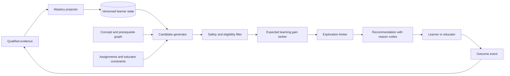

# Adaptive Learning Architecture

## Purpose and decision

ULIP adapts the sequence, support, and challenge of learning activities while preserving educator authority, learner agency, and assessment validity. The system uses an evidence-traced mastery model with conservative Bayesian updates, prerequisite-aware recommendations, and explicit safety constraints.

The following decisions are binding:

1. Adaptation is an assistive recommendation, not an autonomous high-stakes decision.
2. Mastery is stored per learner, concept, curriculum context, and model version. It is not a permanent label on a learner.
3. Summative grades, admissions, discipline, diagnosis, and special-education placement are outside the adaptive policy.
4. A cold-start learner receives curriculum-aligned defaults and a short, optional diagnostic. Demographic attributes are never used to infer mastery.
5. Every recommendation records the evidence, policy version, constraints, and reason codes that produced it.
6. Educators and learners can override or decline a recommendation without penalty.

This design consumes the concept graph and calibrated content described by [Knowledge Intelligence](05_knowledge_intelligence.md), relies on [Assessment Intelligence](10_assessment_intelligence.md), and applies the controls in [security and governance](22_security_and_governance.md).

## Goals and non-goals

### Goals

- Estimate concept mastery with uncertainty rather than a single opaque score.
- Select the next useful activity within curriculum, accessibility, safety, and educator constraints.
- Support remediation, practice, enrichment, and spaced review.
- Detect disengagement and repeated failure without making clinical or behavioral claims.
- Measure whether adaptations improve learning, not merely clicks or time in product.
- Permit replay, audit, rollback, and comparison of policy versions.

### Non-goals

- Replacing teachers, counselors, guardians, or accessibility specialists.
- Maximizing screen time, activity count, or platform retention.
- Predicting protected characteristics, disability, mental health, or socioeconomic status.
- Generating an unrestricted learning path directly from an LLM.
- Lowering curriculum expectations solely because a learner has struggled.

## Domain model

| Entity | Purpose | Required fields |
|---|---|---|
| `LearningEvidence` | Immutable observation from an assessed interaction | learner pseudonym, concept IDs, item ID and version, attempt, response, correctness or rubric score, hints, duration bucket, channel, event time, evidence quality |
| `MasteryState` | Current estimate for one learner-concept-context tuple | probability, uncertainty, evidence count, last practiced time, decay-adjusted value, model version, update time |
| `LearnerPreference` | Learner-declared presentation choices | language, modality preference, pace preference, accessibility profile reference, consent scope |
| `LearningConstraint` | Hard boundary on recommendation | assigned curriculum, due dates, allowed content, accommodations, educator locks, age band, jurisdiction |
| `Recommendation` | Ranked candidate and explanation | candidate activity, target concepts, expected learning gain, confidence, reason codes, policy version, rejected constraints, expiry |
| `Intervention` | Human-reviewed support action | trigger, owner, status, communication record, resolution |

Raw responses remain in the assessment record. The adaptive store keeps identifiers and features needed for modeling, not answer text unless the feature is essential and approved by governance. Learner preferences are separate from inferred states so a preference is never misrepresented as ability.

## Evidence contract

Only quality-qualified events update mastery. An event is accepted when it has:

- an idempotency key and trusted event time;
- a resolvable learner, content version, item version, and concept mapping;
- an assessment mode that permits formative adaptation;
- scoring confidence above the assessment-specific threshold;
- no integrity flag that invalidates the attempt;
- a declared evidence weight.

Evidence weight combines item discrimination, scoring confidence, attempt context, hint use, and recency. Speed is a weak feature and cannot independently decrease mastery because motor, language, connectivity, and accessibility differences affect duration. Ungraded browsing, sentiment, facial analysis, keystroke biometrics, and third-party advertising data never update mastery.

Late and duplicate events are handled deterministically. The projector deduplicates by idempotency key, orders accepted evidence by event time, and replays the affected learner-concept partition when a late event falls before the latest projection. Reprocessing produces the same state for the same ordered evidence and model version.

## Learner model

### Mastery estimate

Each concept begins with a curriculum-level prior `Beta(α0, β0)`. A quality-qualified observation adds fractional evidence:

```text
α' = α + evidence_weight × normalized_score
β' = β + evidence_weight × (1 - normalized_score)
mastery_probability = α' / (α' + β')
uncertainty = credible_interval_width(α', β')
```

The update is explainable, supports partial-credit rubrics, and prevents one interaction from dominating the estimate. Priors are determined by course and grade-band calibration, not identity or demographics. A diagnostic result may replace the default prior only with learner consent and sufficient assessment reliability.

For concepts with prerequisites, the model records both observed mastery and a graph-informed readiness score. Prerequisite state can reduce confidence that an advanced activity is appropriate, but it does not rewrite the observed mastery estimate.

### Forgetting and spacing

The system computes a read-time recall estimate from the last stable mastery state:

```text
recall_estimate = floor + (mastery_probability - floor) × exp(-decay_rate × elapsed_days)
```

`decay_rate` is calibrated by concept class and aggregate learning evidence. Per-learner decay is enabled only after enough repeated observations to avoid overfitting. The persisted mastery state is not destructively reduced; the read-time estimate and its parameters are stored with each recommendation.

### State bands

Bands aid policy decisions but do not replace the underlying probability and uncertainty:

| Band | Rule | Permitted policy response |
|---|---|---|
| Unobserved | No qualified evidence | Core curriculum default or optional diagnostic |
| Emerging | Lower credible bound below 0.50 | Worked example, prerequisite check, low-stakes practice |
| Developing | Estimate 0.50 to below 0.75 | Targeted practice with fading support |
| Secure | Estimate at least 0.75 and lower bound at least 0.60 | Retrieval practice, next concept, or mixed application |
| Durable | Two or more spaced confirmations and lower bound at least 0.75 | Longer review interval or enrichment |

Thresholds are policy configuration by subject and assessment family. Changes require offline evaluation and versioning.

## Adaptation policy

The policy is a constrained ranker. It never presents an activity that violates a hard constraint, even if the predicted learning gain is high.



### Candidate generation

Candidates come only from published, tenant-authorized content and consist of:

1. the next assigned core activity;
2. a prerequisite activity for a concept with low readiness;
3. a worked example matching the current misconception;
4. a retrieval-practice item due under the spacing policy;
5. an enrichment activity when core mastery is secure;
6. an equivalent accessible or language-localized presentation.

Retrieval uses concept IDs, learning objectives, level bands, and prerequisite distance. Semantic similarity can find candidates but cannot bypass publication status, age band, rights, curriculum, or quality filters.

### Ranking

Eligible candidates are scored using:

```text
utility =
  expected_learning_gain
  + spacing_value
  + curriculum_progress_value
  + learner_preference_match
  - cognitive_jump_penalty
  - repetition_penalty
  - uncertainty_penalty
```

Weights are policy-versioned. Completion probability is used only to avoid clearly unusable recommendations, never as the primary objective. An LLM may produce a learner-facing explanation from structured reason codes, but it does not choose the candidate or alter constraints.

### Exploration and challenge

At most 10 percent of eligible recommendations may use policy exploration in a low-stakes setting. Exploration is bounded to adjacent difficulty bands, excludes learners in an active support intervention, and can be disabled by an educator or tenant. The platform maintains a challenge floor: after remediation, the learner returns to grade-level work with support rather than remaining indefinitely in easier material.

### Reason codes

Every recommendation exposes at least one stable reason code:

- `PREREQUISITE_GAP`
- `SPACED_REVIEW_DUE`
- `MISCONCEPTION_REMEDIATION`
- `CORE_SEQUENCE_NEXT`
- `MASTERY_CONFIRMED_ENRICHMENT`
- `ACCESSIBLE_EQUIVALENT`
- `EDUCATOR_ASSIGNED`

The learner view uses plain language. The educator view includes concept state, evidence count, uncertainty, and rejected alternatives. Neither view exposes hidden chain-of-thought or another learner's data.

## Safe adaptation constraints

### Hard prohibitions

The adaptive engine must not:

- use race, ethnicity, religion, caste, sex, gender identity, sexual orientation, disability, immigration status, or socioeconomic proxies as ranking features;
- infer a diagnosis, disability, motivation, intelligence, or emotional state;
- permanently track a learner into a lower curriculum path;
- remove assigned core content without educator approval;
- adapt a live summative assessment unless the approved accommodation is part of the assessment specification;
- generate unsupervised content for an age band when that content has not passed publication and safety review;
- notify a guardian, educator, or authority based only on an unverified model inference;
- optimize for advertising, purchases, or time-on-platform.

### Repeated struggle

After three qualified unsuccessful attempts on the same objective, the system stops increasing difficulty, offers a worked example or alternate representation, and gives the learner a neutral option to ask for help. After two remediation cycles without progress, it opens an educator-visible support signal. This is not a risk score and carries no diagnosis. An educator closes or escalates the intervention.

### Accessibility

Approved accommodations are hard constraints. The candidate set must include equivalent accessible formats before ranking. Adaptation does not trade away extra time, assistive-technology compatibility, reduced-motion settings, captions, contrast, language support, or alternative input. An inaccessible activity is ineligible, not merely down-ranked.

### Age and child safety

Age band, tenant policy, and jurisdiction determine permitted content, communication, retention, and consent. Learners cannot be directed to public chat, unmoderated external links, or persuasive commercial content. Potential self-harm, abuse, exploitation, or imminent-danger disclosures follow the human-reviewed escalation process in [security and governance](22_security_and_governance.md); the mastery model does not consume those disclosures.

## Cold start, recovery, and overrides

### Cold start

The default path uses the learner's enrolled curriculum and the educator's sequence. The learner may take a short diagnostic with skip and exit options. Until sufficient evidence exists, recommendations emphasize broad coverage and display high uncertainty.

### Model recovery

If the mastery service or feature pipeline is unavailable, ULIP serves the assigned static sequence, preserves interactions in an outbox, and performs idempotent projection after recovery. A stale-state badge appears to educators when adaptation is based on state older than the policy limit.

### Human control

- Educators can pin, exclude, or reorder activities for a class or learner.
- Learners can choose another eligible activity, repeat content, or disable preference-based personalization.
- Guardians receive controls only where law and tenant policy grant them.
- Overrides record actor, reason category, scope, and expiry.
- An emergency kill switch disables adaptive ranking by tenant or globally while static learning remains available.

## Evaluation and promotion

### Offline evaluation

Every model or policy candidate is evaluated against a time-split, de-identified dataset. Promotion requires:

| Measure | Gate |
|---|---|
| Mastery calibration | Expected calibration error at most 0.05 overall |
| Predictive quality | Brier score no worse than the active model |
| Learning outcome estimate | Non-negative against static-sequence baseline |
| Exposure concentration | No activity receives more than the configured safe share without curricular justification |
| Subgroup calibration | Absolute calibration gap at most 0.05 for every approved cohort with sufficient sample size |
| Override behavior | Educator and learner overrides remain effective in all policy tests |
| Safety constraints | Zero prohibited candidate selections in adversarial fixtures |

Small cohorts are suppressed to protect privacy. Protected attributes used for fairness evaluation are held in a separately controlled analytics boundary and never passed to online ranking.

### Online evaluation

Rollout proceeds through internal, educator sandbox, 1 percent, 10 percent, 50 percent, and full-eligible-tenant stages. Experiments are limited to low-stakes activities and require informed tenant participation. The primary outcome is delayed concept retention on a parallel assessment. Guardrails include frustration signals, opt-outs, help requests, accessibility failures, educator overrides, and outcome disparities.

Automatic rollback occurs when:

- any safety constraint is violated;
- a guardrail worsens beyond its pre-registered limit for two consecutive evaluation windows;
- subgroup harm exceeds the fairness gate;
- scoring or content-version integrity is uncertain;
- the serving error budget is exhausted.

Experiment assignment, analysis plan, sample size, stopping rule, and metrics are registered before exposure begins. Peeking does not trigger early promotion.

## APIs and event flow

### Recommendation request

The online contract accepts:

- tenant, learner pseudonym, course, and session;
- current assignment and concept context;
- accessibility and presentation constraints by reference;
- maximum candidates and request id.

It returns ranked activities, policy and model versions, state freshness, reason codes, confidence, and an expiry. It does not return sensitive profile fields.

### Events

The canonical flow is:

1. Assessment emits `evidence.recorded.v1`.
2. The evidence validator emits `evidence.accepted.v1` or a reasoned rejection.
3. The mastery projector emits `mastery.updated.v1`.
4. The recommender emits `recommendation.issued.v1`.
5. The client emits `recommendation.accepted.v1`, `overridden.v1`, or `expired.v1`.
6. Completion emits a new evidence event when the activity is assessable.

Schemas are backward compatible within a major version. Events include tenant, data classification, trace ID, occurred time, received time, source version, and idempotency key.

## Data lifecycle and auditability

Evidence and recommendation records follow tenant, jurisdiction, and learner-age retention rules. Deletion propagates from the identity mapping through evidence, projections, caches, and analytic datasets. Aggregate models are retrained or influence-adjusted when deletion obligations require it.

For each recommendation, ULIP can reconstruct:

- input evidence references and their quality weights;
- mastery, graph, content, and policy versions;
- hard constraints applied;
- eligible and rejected candidate identifiers with reason categories;
- final utility components;
- override and outcome.

Audit access is permissioned and logged. Raw learner-level traces are not exported to general analytics.

## Operational indicators

The adaptive subsystem publishes the following indicators to the [observability platform](23_observability.md):

- evidence acceptance and rejection rate by reason;
- mastery projection lag and replay count;
- recommendation latency, availability, fallback rate, and stale-state rate;
- candidate-filter rejection rate by constraint;
- override, opt-out, and help-request rate;
- recommendation diversity and repetition;
- retention gain, calibration error, and fairness gates by approved cohort;
- active model and policy version distribution.

## Acceptance criteria

The adaptive architecture is production-ready when:

1. deterministic replay produces identical learner state for a fixed event stream and model version;
2. every recommendation is traceable to qualified evidence and stable reason codes;
3. prohibited attributes are absent from online features and verified by schema enforcement;
4. static-sequence fallback works during mastery and ranking outages;
5. educator and learner overrides are tested end to end;
6. offline calibration, fairness, accessibility, and adversarial safety gates pass;
7. deletion and model-version rollback complete within the governed service targets;
8. an educator pilot demonstrates improved delayed retention without violating any guardrail.
