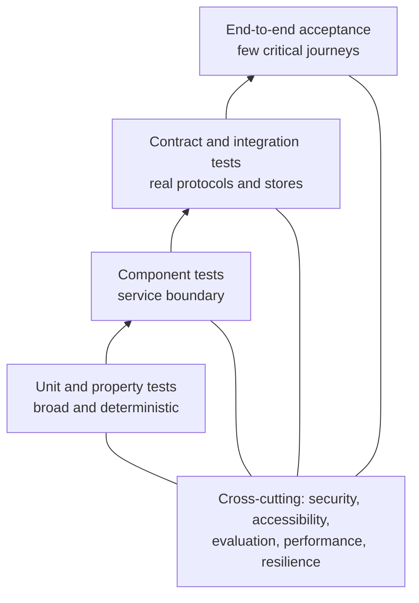
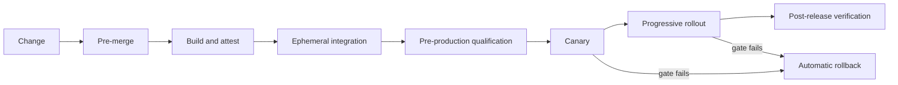

# Testing Strategy and Quality Gates

## Purpose

ULIP requires evidence that educational outputs are correct, safe, accessible, private, resilient, and operationally supportable. This strategy defines the test layers, ownership, fixtures, environments, release gates, and production verification for the ingestion, knowledge, assessment, serving, and adaptive-learning planes.

Testing follows four rules:

1. Deterministic logic is proved at the lowest practical layer.
2. Every contract is versioned and tested by both producer and consumer.
3. Probabilistic behavior is evaluated with fixed corpora, statistical thresholds, and human-reviewed gold sets rather than exact string matches.
4. No release can waive a security, privacy, child-safety, accessibility, data-integrity, or assessment-validity gate.

Related controls are defined in [adaptive learning](19_adaptive_learning.md), [deployment architecture](21_deployment_architecture.md), [security and governance](22_security_and_governance.md), and [observability](23_observability.md).

## Quality model

| Quality attribute | Evidence required |
|---|---|
| Functional correctness | Unit, component, integration, workflow, and acceptance tests |
| Educational validity | Gold-set evaluation, rubric agreement, psychometric review, educator sign-off |
| Safety and fairness | Adversarial suites, prohibited-output checks, cohort analysis, human escalation tests |
| Privacy and security | Threat-driven tests, authorization matrix, data-flow checks, dependency and image scans |
| Accessibility | Automated WCAG checks plus keyboard, screen-reader, zoom, contrast, captions, and cognitive walkthroughs |
| Reliability | Load, soak, dependency-failure, retry, replay, backup, restore, and regional failover tests |
| Operability | Telemetry assertions, alert tests, runbook exercises, deployment and rollback rehearsals |
| Reproducibility | Pinned fixtures, versioned models and prompts, deterministic seeds, artifact provenance |

## Test portfolio

Target distribution is based on execution count, not engineering effort:

| Layer | Target share | Scope | Typical runtime |
|---|---:|---|---|
| Static and schema | Continuous | Formatting, types, policy, secrets, licenses, schemas | Seconds |
| Unit and property | 65% | Pure functions, scoring, graph rules, parsing, policy constraints | Milliseconds |
| Component | 20% | Service with real local dependencies or controlled fakes | Seconds |
| Contract and integration | 10% | API/event compatibility and Postgres/Qdrant/object-store behavior | Seconds to minutes |
| End-to-end and acceptance | 5% | Critical learner, educator, author, and operator journeys | Minutes |

Performance, resilience, security, accessibility, educational evaluation, and disaster recovery are cross-cutting suites. They do not replace the pyramid.

## Test data and fixtures

### Fixture classes

- **Synthetic documents:** generated PDF, TXT, Markdown, OCR, formula, table, diagram, multilingual, duplicate, corrupted, encrypted, and oversized inputs.
- **Licensed regression corpus:** representative educational content whose test usage and retention are approved.
- **Gold knowledge sets:** educator-reviewed concepts, prerequisites, misconceptions, objectives, chunks, and citations.
- **Gold assessment sets:** item stems, answers, distractors, rubrics, level bands, and known invalid items.
- **Safety corpus:** age-inappropriate content, prompt injection, hate, self-harm, abuse, sexual content involving minors, dangerous instructions, bullying, privacy extraction, and jailbreak attempts.
- **Operational fixtures:** delayed events, dependency timeouts, poison messages, partial writes, stale caches, key rotation, tenant deletion, and restore manifests.

Every fixture has an owner, source and license, classification, expected use, retention, and review date. Production learner records are prohibited in developer tests. Staging uses synthetic or irreversibly de-identified data approved by privacy review.

### Reproducibility

Each run records:

- source revision and build artifact digest;
- schema, pipeline, prompt, model, embedding, policy, and rubric versions;
- deterministic seed where the provider supports it;
- fixture manifest digest;
- environment and dependency versions;
- raw structured output needed to recompute the result;
- evaluator versions and thresholds.

External model tests use a recorded-response mode for routine CI and a live-provider qualification suite before model promotion. Recorded responses are encrypted if they contain licensed content and expire under the fixture retention policy.

## Static verification

Every change runs:

- formatter and linter checks;
- type checks for application and infrastructure code;
- schema validation for configuration, API specifications, events, manifests, and quiz outputs;
- secret detection and credential-pattern scanning;
- software-composition analysis, license policy, and lockfile integrity checks;
- infrastructure-as-code, Kubernetes, container, and policy-as-code validation;
- documentation link and Mermaid syntax validation;
- migration ordering and reversibility checks.

Generated artifacts must be reproducible from source. A modified generated file without a corresponding generator or source change fails CI.

## Unit and property testing

Unit tests isolate network, time, randomness, and filesystem behavior. Property-based tests cover invariants that examples routinely miss.

### Required invariants

- stable identifiers remain stable for semantically unchanged source objects;
- tenant identifiers are present on every tenant-scoped key and query;
- graph edges reference existing nodes and prerequisite cycles are rejected or explicitly classified;
- chunk boundaries retain concept completeness and stay within configured limits;
- scoring is bounded, monotonic where specified, and preserves rubric totals;
- evidence updates are idempotent, order-correct after replay, and cannot use prohibited features;
- adaptive candidate filtering always precedes ranking;
- retrieval never returns unpublished, unauthorized, wrong-tenant, wrong-age-band, or expired content;
- citations refer to the source version used to create the answer;
- deletion removes all discoverable tenant-subject records from indexes and caches;
- retries cannot create duplicate questions, attempts, evidence, or store writes.

Fuzz tests target parsers, document metadata, OCR output, archive handling, API payloads, and diagram specifications. Resource bounds are asserted to prevent decompression, recursion, token, and graph-expansion abuse.

## Component testing

Each independently deployable service is tested with its production serialization, persistence adapter, and authorization middleware. Containers or in-process equivalents provide Postgres, Qdrant, object storage, event transport, and cache behavior. Mocking is limited to unavailable external providers and failure injection.

Component suites verify:

- health, readiness, startup, graceful shutdown, and backpressure;
- transaction and outbox semantics;
- idempotency and duplicate delivery;
- timeout, retry, circuit-breaker, and dead-letter behavior;
- pagination, filtering, tenant scope, and authorization;
- cache invalidation and stale-read limits;
- audit event emission;
- OpenTelemetry traces, required metrics, and redaction;
- version skew across one supported previous and current contract version.

## Contract and integration testing

### API contracts

OpenAPI or equivalent machine-readable schemas are the source of truth. Provider checks prove response shape and semantics; consumer tests prove each active client can use the provider. Breaking changes require a new major version and migration window.

### Event contracts

The schema registry enforces backward compatibility within a major version. Tests validate required metadata, partition key, idempotency key, event and receive times, data classification, trace context, and unknown-field tolerance. Golden producer events are replayed through every active consumer before deployment.

### Data stores

Integration tests run against supported Postgres and Qdrant versions and verify:

- constraints, indexes, row or query tenant isolation, and migrations;
- recursive prerequisite traversal limits;
- vector metadata filtering before result return;
- transactional metadata plus outbox behavior;
- snapshot and point-in-time recovery compatibility;
- index rebuild from the authoritative object and relational stores;
- read behavior during rolling upgrades.

SQLite and embedded Qdrant are development conveniences. Passing against them does not replace production-engine integration tests.

## End-to-end critical journeys

The pre-production suite covers:

1. author uploads a permitted source, observes scanning and processing, reviews extracted knowledge, and publishes a version;
2. educator assigns approved material to a class and previews the learner experience;
3. learner receives an accessible activity, submits an answer, receives a cited explanation, and continues along an allowed recommendation;
4. educator overrides an adaptive recommendation and sees the override take effect;
5. content is revoked and becomes unavailable in retrieval, caches, assignments, and new recommendations within the revocation target;
6. learner or guardian exercises an authorized data-access and deletion request;
7. tenant administrator exports audit evidence and changes a policy without affecting another tenant;
8. operator deploys, observes canary health, rolls back, and confirms schema compatibility;
9. dependency loss triggers the documented fallback and recovery without duplicate evidence;
10. a safety disclosure reaches the human-reviewed escalation path without entering the mastery model.

End-to-end tests use stable semantic selectors and API assertions. Screenshots alone are not acceptance evidence.

## Educational and AI evaluation

### Gold-set process

Gold items are independently reviewed by two qualified educators or subject-matter experts. Disagreement is adjudicated and recorded. Gold sets are stratified by subject, language, curriculum, age band, difficulty, question type, diagram use, and accessibility need. Items are refreshed when content, standards, rubrics, or known model failure modes change.

### Ingestion and knowledge evaluation

| Measure | Release threshold |
|---|---:|
| Citation/source-page precision | At least 0.99 |
| Concept extraction precision | At least 0.95 |
| Concept extraction recall | At least 0.90 |
| Prerequisite-edge precision | At least 0.95 |
| Duplicate-concept F1 | At least 0.95 |
| Unsupported factual assertion rate | At most 0.5% |
| Cross-tenant retrieval | Exactly 0 |

### Assessment evaluation

| Measure | Release threshold |
|---|---:|
| Answer-key correctness | At least 0.995 |
| Rubric-score agreement with adjudicated gold | Weighted kappa at least 0.85 |
| Distractor plausibility without ambiguity | At least 0.95 |
| Declared level agreement | Weighted kappa at least 0.80 |
| Required citation coverage | 100% |
| Duplicate or memorized protected item rate | Exactly 0 |

Generated summative items require human approval regardless of aggregate metrics. Statistical item analysis after use monitors difficulty, discrimination, differential item functioning, exposure, and invalidation rates.

### Retrieval and generation evaluation

Retrieval reports recall at `k`, mean reciprocal rank, metadata-filter correctness, and citation coverage. Generated explanations are evaluated for factual entailment, completeness, age appropriateness, instructional quality, and citation faithfulness. A response that fails a hard safety or citation rule scores zero regardless of style.

Model-as-judge results are advisory unless calibrated against current human judgments. The judging model must be different from the candidate where practical, receive a structured rubric, and be monitored for drift. Human review remains the authority for safety, educational validity, and contested results.

### Adaptive evaluation

The mastery and recommendation gates in [adaptive learning](19_adaptive_learning.md) are mandatory. Test fixtures prove deterministic replay, static fallback, educator override, exploration limits, challenge floor, accommodation preservation, and feature exclusion.

## Security, privacy, child-safety, and fairness tests

Threat-driven tests map to the STRIDE analysis in [security and governance](22_security_and_governance.md). At minimum they cover:

- broken object and function-level authorization;
- tenant and learner isolation in API, jobs, stores, caches, exports, and telemetry;
- prompt injection in documents, retrieved text, tool output, and learner input;
- unsafe URL fetching, archive traversal, parser exploits, and malicious files;
- SSRF, injection, deserialization, request smuggling, and denial-of-wallet;
- token replay, session fixation, key rotation, and revoked access;
- model extraction, training-data leakage, membership inference sampling, and sensitive-data regurgitation;
- audit tampering and repudiation;
- content moderation bypass across supported languages and encoded forms;
- child impersonation, grooming patterns, unmoderated contact, and guardian/educator escalation authorization.

Dynamic scans run against an isolated ephemeral environment. Penetration testing occurs before general availability and at least annually, with targeted testing after material authentication, authorization, ingestion, AI-tooling, or tenant-isolation changes.

Fairness evaluation uses approved cohort data in a separate controlled analytics boundary. It reports calibration, false-positive and false-negative rates, learning outcomes, content exposure, and override rates where statistically valid. Small groups are suppressed, and the absence of sufficient data is reported as insufficient evidence rather than fairness.

## Accessibility and compatibility

The learner and educator surfaces target WCAG 2.2 AA. Each critical journey is tested with:

- keyboard-only navigation and visible focus;
- current screen-reader/browser combinations in the support matrix;
- 200 percent zoom and reflow;
- high contrast, non-color cues, and reduced motion;
- captions, transcripts, and audio controls;
- accessible math, tables, diagrams, form errors, and status announcements;
- extended-time and alternate-input accommodations;
- plain-language and cognitive-load review.

Automated checks run on every UI change. Manual assistive-technology testing is required for a release that changes a critical journey.

## Performance and capacity

Performance tests use production-like topology, content cardinality, tenant distribution, vector dimensions, and request mixes. Results are invalid if observability is disabled.

| Scenario | Pass condition |
|---|---|
| Recommendation API steady state | Meets the p95 and availability SLO at forecast peak plus 30% |
| Retrieval steady state | Meets p95 latency with authorization and metadata filters enabled |
| Ingestion throughput | Sustains forecast daily volume in 8 hours or less |
| Burst | Absorbs 3 times forecast rate for 15 minutes without data loss |
| Soak | Runs 24 hours at forecast peak without unbounded memory, lag, or connection growth |
| Large tenant | Handles the approved maximum corpus, graph, and class size within SLO |
| Cost | Per-document and per-learning-session cost stays within the release budget |

Load tests do not target production unless an approved plan, traffic cap, monitoring, and abort condition are in place.

## Resilience and disaster recovery

Automated fault tests inject latency, timeout, process termination, unavailable replicas, corrupt messages, exhausted quotas, and provider errors. The suite proves:

- bounded retries with jitter and no retry storms;
- durable queueing and idempotent replay;
- static learning fallback when adaptive services fail;
- last-known-approved content when generation is unavailable;
- graceful degradation when vector search, LLM, OCR, or analytics is unavailable;
- backup restoration and point-in-time recovery;
- Qdrant index reconstruction from authoritative sources;
- regional failover within the recovery objectives in [deployment architecture](21_deployment_architecture.md).

Quarterly restore tests use sampled production-format backups in an isolated account. Semiannual game days rehearse a regional serving failure and a data-integrity incident.

## CI/CD stages and gates

### Gate 1: pre-merge

- static, unit, property, component, and changed-contract tests pass;
- changed code has at least 90 percent line and 85 percent branch coverage, with no reduction in repository coverage;
- all critical authorization and policy branches have explicit tests;
- no committed secret, prohibited license, critical vulnerability, or unapproved schema break;
- reviewer approval includes a domain owner for educational, privacy, security, or accessibility-sensitive changes.

### Gate 2: build and attest

- immutable artifact is built once from a pinned dependency graph;
- SBOM, provenance, signature, vulnerability report, and configuration schema are attached;
- no exploitable critical or high vulnerability is present;
- artifact digest is the unit promoted across environments.

### Gate 3: ephemeral integration

- migrations, API and event contracts, store integration, audit emission, and end-to-end smoke journeys pass;
- telemetry contains required fields and no test-sensitive values;
- failure injection confirms retry and idempotency behavior.

### Gate 4: pre-production qualification

- full end-to-end, accessibility, educational evaluation, security regression, load, and rollback suites pass;
- live model/provider qualification passes for the exact model, prompt, safety policy, and region;
- release evidence is approved by engineering, product, education quality, security/privacy, and operations for their domains.

### Gate 5: canary and progressive rollout

- canary receives internal or explicitly enrolled traffic;
- SLOs, error-budget burn, correctness, safety, fairness, latency, cost, and business guardrails remain within limits;
- rollout progresses through 1, 10, 25, 50, and 100 percent with an observation window at each step;
- any hard safety failure, tenant-isolation failure, data corruption, or exhausted fast-burn budget triggers immediate rollback and content/model quarantine.

### Gate 6: post-release

Synthetic critical journeys pass from every active region, audit evidence is complete, and no new high-severity incident appears during the defined soak window. The release record links artifacts, approvals, metrics, dashboards, and rollback outcome.

## Defect policy

| Severity | Meaning | Release effect |
|---|---|---|
| Critical | Learner harm, child-safety failure, cross-tenant exposure, material data loss, incorrect summative scoring at scale | Stop and rollback or disable |
| High | Critical journey unavailable, repeated incorrect learning output, authorization bypass with constrained reach | Block promotion; emergency fix |
| Medium | Degraded non-critical workflow with workaround | Risk acceptance by service and product owners |
| Low | Cosmetic or minor usability issue | May proceed with tracked remediation |

Security, privacy, safety, accessibility, assessment validity, and legal defects cannot be downgraded solely to meet a date. Risk acceptance must identify scope, compensating control, owner, expiry, and verification.

## Ownership and maintenance

- Service teams own unit, component, contract, integration, performance, and runbook tests.
- Education quality owns gold-set governance and educational acceptance thresholds.
- Security and privacy own threat suites and non-waivable control gates.
- Accessibility specialists own the support matrix and manual qualification.
- Site reliability engineering owns resilience, SLO, failover, restore, and operational readiness gates.
- Quality engineering owns shared harnesses, flake control, test analytics, and end-to-end suites.

A flaky test is treated as a defect. It is quarantined only with an owner, failure evidence, and a maximum seven-day expiry. Quality thresholds are reviewed quarterly and after every severity-one incident or material model change.

## Release evidence checklist

A production promotion is authorized only when the release record contains:

1. immutable artifact digest, SBOM, signature, and provenance;
2. complete test run identifiers and fixture manifest;
3. migration and rollback evidence;
4. educational, safety, fairness, privacy, security, and accessibility reports applicable to the change;
5. load and cost evidence against forecast;
6. SLO dashboards and alert verification;
7. named release owner and incident commander;
8. approved canary population, observation windows, and automatic rollback conditions.
