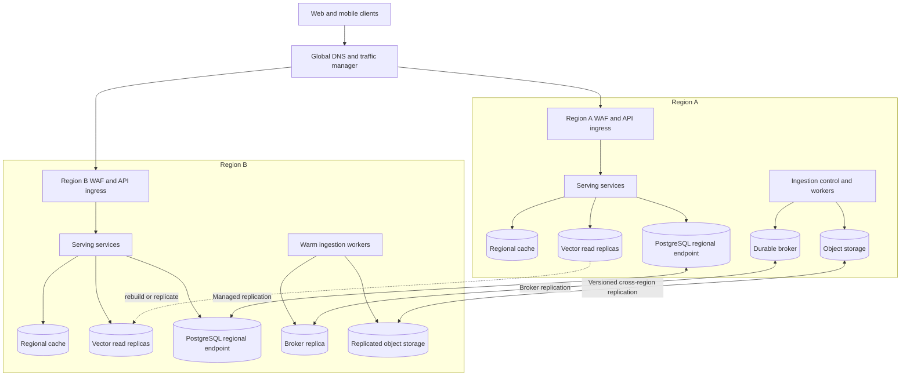
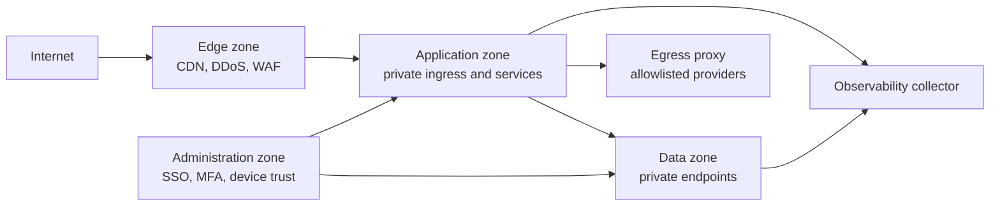
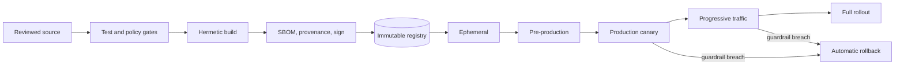

# Deployment Architecture

## Purpose and decisions

This document defines ULIP's production environments, cloud topology, deployment units, release method, scaling boundaries, failure behavior, and disaster-recovery design.

The production architecture uses:

- managed Kubernetes for stateless services and workers;
- managed PostgreSQL as the authoritative transactional and graph-metadata store;
- managed object storage as the authoritative source and derived-artifact store;
- a managed Qdrant-compatible vector service or dedicated Qdrant cluster as a rebuildable search index;
- a durable managed event broker for asynchronous workflows;
- managed key, secret, identity, web-application firewall, and observability services;
- active-active serving across two regions within one jurisdictional data boundary;
- single-writer ingestion per tenant corpus, with warm regional failover;
- GitOps, immutable signed artifacts, and progressive delivery.

Local Docker, SQLite, and embedded Qdrant remain developer profiles. They are not production topologies.

## Environment model

| Environment | Purpose | Data policy | Availability |
|---|---|---|---|
| Local | Developer feedback | Synthetic or explicitly licensed local fixtures | Best effort |
| Ephemeral | Per-change integration and preview | Synthetic fixtures only | Destroyed after run |
| Development | Shared service integration | Synthetic fixtures | Business hours |
| Pre-production | Production-parity qualification, load, restore, and failover | Synthetic or approved irreversibly de-identified fixtures | Production-like |
| Production | Tenant workloads | Classified tenant and learner data | SLO-backed |

Every environment has a separate cloud account or subscription, Kubernetes cluster, network boundary, identity realm, encryption keys, secrets, databases, object buckets, vector collections, broker namespaces, and observability tenant. Production credentials are never valid outside production. Pre-production mirrors production deployment manifests and policies but cannot route to production data services.

Promotion moves the same signed artifact digest from ephemeral through production. Source is never rebuilt between stages.

## Regional topology

### Traffic policy

Serving requests use latency-aware routing across healthy regions. Sessions are stateless and do not require regional affinity. Tenant jurisdiction is resolved before routing; traffic and data never fail over outside the tenant's approved residency boundary.

Writes use globally unique idempotency keys. Transactional learner and assignment writes go to the managed database writer and acknowledge only after durable commit. Regional caches are non-authoritative. If replication technology cannot guarantee conflict-free multi-writer semantics, the database remains one writer with cross-region read and failover endpoints.

Ingestion is assigned to one region per corpus to avoid duplicate orchestration. A tenant-region lease in PostgreSQL controls ownership. A second region may acquire the lease only after the original has expired or an operator has fenced it.

### Availability zones

Each production region spans at least three availability zones:

- ingress and stateless deployments spread across three zones;
- PostgreSQL uses synchronous multi-zone high availability;
- broker topics and object storage use zone-redundant durability;
- Qdrant has at least three voting nodes with replicas distributed across zones;
- pod disruption budgets preserve quorum and service capacity during maintenance.

No production service depends on a single node, zone, network address translation gateway, or control-plane add-on.

## Deployment units

| Unit | Responsibility | Scaling signal |
|---|---|---|
| Edge/API gateway | TLS termination, WAF, rate limits, routing, request identity | Requests, connections, latency |
| Identity adapter | OIDC/SAML federation, session and token exchange | Authentication rate and latency |
| Content API | Upload metadata, lifecycle, publication, entitlements | Request rate |
| Ingestion orchestrator | Durable workflow state, leases, phase scheduling | Pending workflows |
| Extract/OCR workers | Parsing and OCR in sandboxed jobs | Queue depth, CPU, document pages |
| Knowledge workers | Distillation, graph, validation, chunking | Queue age, CPU, provider quotas |
| Embedding/index workers | Embedding and vector upsert | Queue age, accelerator or CPU utilization |
| Learning API | Courses, assignments, attempts, progress | Requests and transaction latency |
| Retrieval service | Authorized hybrid/vector retrieval and citations | Requests, p95 latency |
| Generation service | Explanations and formative item generation | In-flight requests, token quota |
| Assessment service | Delivery, scoring, rubric and item versions | Concurrent attempts and score queue |
| Mastery projector | Evidence validation and learner-state projection | Partition lag |
| Recommendation service | Constrained adaptive ranking | Requests and p95 latency |
| Audit exporter | Append-only audit and controlled export | Export queue age |

Deployment units communicate over authenticated service identities. Network policy denies traffic unless an explicit service-to-service flow is declared.

## Data placement

### Authoritative stores

- **PostgreSQL:** tenant metadata, users and pseudonymous subject mappings, content metadata, graph relations, assignments, attempts, scores, evidence, mastery projections, workflow state, outbox, and audit index.
- **Object storage:** original uploads, quarantined files, immutable source versions, extracted page artifacts, repository manifests, published assets, signed exports, model-evaluation evidence, and backups.
- **Event broker:** durable transport, not the system of record. Events are replayable for the configured retention window.

### Derived stores

- **Qdrant:** embeddings and filter metadata. Every point references authoritative content and version. Collections can be rebuilt.
- **Regional cache:** entitlements, published content, short-lived retrieval results, and model configuration. Entries have tenant scope and bounded time-to-live.
- **Analytics warehouse:** de-identified or pseudonymized governed copies delivered through approved transformations. It is not on the serving path.

Object storage has versioning, retention locks for audit classes, malware quarantine, checksum verification, and cross-region replication. PostgreSQL uses encryption, point-in-time recovery, query auditing, and tenant-aware access controls. Vector payloads contain the minimum filterable metadata and no direct learner identity.

## Network and trust zones

- Public exposure ends at the managed edge.
- Cluster nodes, databases, vector stores, broker, caches, secrets, and telemetry endpoints use private addresses and private service endpoints.
- Administrative access is just-in-time, device-bound, strongly authenticated, approved, and recorded.
- Workloads have no default internet egress. An egress proxy permits only approved model, OCR, identity, package-mirror, and notification endpoints.
- Uploaded documents and retrieved content are untrusted data. Parsing and rendering run without cloud credentials in sandboxed jobs with read-only filesystems, resource quotas, and no network unless explicitly required.
- Service mesh or workload identity provides mutual authentication and short-lived credentials. Authorization remains in each service rather than relying only on network location.

## Kubernetes baseline

Production clusters enforce:

- separate namespaces and service accounts by trust domain;
- restricted pod-security standards, non-root users, read-only root filesystems, dropped capabilities, and seccomp;
- signed-image admission, approved registries, digest pinning, and SBOM policy;
- default-deny ingress and egress network policy;
- topology spread, anti-affinity, disruption budgets, resource requests and limits;
- horizontal pod autoscaling plus queue-based worker autoscaling;
- node pools separated for edge, general compute, untrusted parsing, and specialized workloads;
- encrypted ephemeral volumes and no host-path mounts;
- workload identity instead of static cloud keys;
- controlled service-mesh sidecar or ambient upgrades;
- cluster autoscaling with reserved headroom for one-zone loss.

Production changes are reconciled from a protected GitOps repository. Direct mutation is blocked except for a time-bound, audited break-glass workflow whose resulting drift must be reconciled.

## Configuration, secrets, and feature controls

Configuration is schema-validated at build and startup. Environment-specific values are separated from application defaults. Secrets live in a managed secret store, are mounted or fetched using workload identity, and never appear in Git, images, command lines, or telemetry.

Rotation targets are:

- workload credentials: short-lived and automatically renewed;
- database and broker credentials: 90 days or less where static credentials remain necessary;
- signing and encryption keys: annual rotation plus immediate rotation after suspected exposure;
- external provider keys: 90 days or less and scoped by environment.

Feature flags have an owner, tenant scope, default, creation date, expiry, and safe fallback. Security, privacy, retention, consent, and authorization controls cannot be disabled by general feature flags. Model, prompt, embedding, rubric, and adaptive-policy versions are controlled configuration with independent kill switches.

## Build and release pipeline

The gates in [testing strategy](20_testing_strategy.md) apply. Deployments use rolling or canary replacement for stateless services and partition-aware rolling replacement for consumers. The release controller pauses between 1, 10, 25, 50, and 100 percent traffic based on SLO, correctness, safety, cost, and business guardrails.

Rollback changes workload and controlled configuration to the previous signed digest. Database compatibility is preserved through expand-migrate-contract:

1. deploy additive schema;
2. deploy code that can read old and new forms;
3. backfill with resumable, rate-limited jobs;
4. switch reads after validation;
5. retain backward compatibility through the rollback window;
6. remove old fields in a later release.

Destructive and long-lock migrations are prohibited in the application deployment. They require a separate reviewed operation with load testing, backup checkpoint, abort conditions, and a verified rollback or forward-repair path.

## Scaling and capacity

### Stateless serving

Autoscaling uses concurrency and latency, not CPU alone. Minimum replicas across zones absorb a single-zone failure without waiting for scale-up. Requests have deadlines; fan-out has bounded concurrency; retries are limited to idempotent operations and use jitter.

### Asynchronous ingestion

Each phase has its own queue and worker pool so OCR, LLM, embedding, and graph workloads cannot starve one another. Queue partition keys preserve document ordering where needed. Autoscaling uses oldest-message age and weighted work units such as pages or tokens. Tenant quotas and fair scheduling prevent one large corpus from monopolizing workers.

### Databases and indexes

- PostgreSQL connection pools have per-service and per-tenant budgets.
- Read replicas serve safe stale-tolerant reads; scoring and evidence writes use the writer.
- Qdrant collections are sharded by capacity and residency, not per learner.
- Index creation and optimization run outside peak periods with headroom.
- Cache entries include tenant, authorization-relevant version, content version, locale, and policy version in the key.

Capacity is reviewed monthly and before major tenant onboarding. Production maintains at least 30 percent steady-state compute headroom, storage alarms at 70 and 85 percent, and tested quota-increase lead times.

## Dependency failure behavior

| Dependency failure | Required behavior |
|---|---|
| LLM provider | Serve approved stored content and deterministic workflows; queue eligible generation; do not fabricate success |
| OCR/parser | Quarantine affected document, preserve prior published version, continue unrelated ingestion |
| Qdrant | Use bounded lexical or cached retrieval where valid; disable unsupported generation; rebuild from authoritative stores |
| PostgreSQL writer | Reject new durable writes with retryable status; never acknowledge an uncommitted attempt or score |
| Event broker | Persist to transactional outbox; publish after recovery |
| Adaptive services | Serve educator-assigned static sequence and retain evidence for replay |
| Regional cache | Read through to authoritative service with load shedding |
| Identity provider | Existing short-lived sessions continue within policy; new login fails closed |
| Telemetry backend | Buffer bounded telemetry locally; application remains available; never disable audit generation |

Circuit breakers, bulkheads, load shedding, and per-tenant rate limits prevent cascading failure. Degraded responses include a stable machine-readable reason and do not expose internal topology.

## Backups and disaster recovery

### Recovery classes

| Class | Systems | RPO | RTO |
|---|---|---:|---:|
| A: learner and transactional | PostgreSQL assignments, attempts, scores, evidence, mastery, identity mapping | 5 minutes | 60 minutes |
| B: published source and audit | Versioned object storage, published artifacts, audit archives | 15 minutes | 4 hours |
| C: rebuildable indexes | Qdrant, caches, search projections | 24 hours | 8 hours |
| D: analytics | Warehouse projections and aggregate marts | 24 hours | 24 hours |

Production backups use separate credentials and accounts from runtime, encryption with recovery-controlled keys, immutability, and deletion protection. Backup success is insufficient evidence; restoration is the test.

### Recovery methods

- PostgreSQL uses continuous write-ahead-log archiving, daily full backups, multi-zone standby, and cross-region replica.
- Object storage uses versioning, checksum validation, cross-region replication, and retention locks by data class.
- Broker configuration is exported and topics replicate where supported; authoritative outbox and stores permit event regeneration.
- Qdrant snapshots accelerate recovery, but the definitive recovery path rebuilds vectors from published chunk manifests and pinned embedding versions.
- GitOps, infrastructure modules, signed images, and configuration history reconstruct the compute plane.

Monthly automated restore samples validate backup readability. Quarterly recovery exercises restore a complete tenant into an isolated account and reconcile counts, checksums, relationships, citations, and access controls. Semiannual regional exercises demonstrate the class A RTO and class B recovery path.

### Regional failover

1. The incident commander confirms the regional failure and tenant residency eligibility.
2. Traffic management drains the unhealthy region.
3. Database automation promotes the fenced cross-region replica.
4. Broker consumers acquire region leases only after the failed writer is fenced.
5. Serving starts with caches cold and load shedding enabled.
6. Synthetic learner and educator journeys verify authentication, retrieval, attempts, scoring, recommendations, and audit.
7. Traffic increases progressively while replication and integrity are monitored.
8. Failback occurs as a separate planned change after reconciliation.

Split-brain prevention takes priority over write availability. If fencing is uncertain, ULIP enters read-only or static-learning mode.

## Data integrity and reconciliation

Each asynchronous write carries an idempotency key, source version, tenant, trace ID, and checksum where applicable. Scheduled reconcilers compare:

- object manifests to relational metadata;
- published chunks to vector points;
- transaction outbox positions to broker acknowledgments;
- assessment attempts to scores and evidence;
- learner deletion ledgers to every derived store;
- cross-region object and database replication positions.

Mismatch creates a durable incident signal. Repair is replay-based and does not silently mutate source records.

## Operational readiness

A new deployment unit cannot receive production traffic until it has:

- a named owner and escalation path;
- service-level indicators, objectives, dashboards, and burn-rate alerts;
- capacity model and tenant quotas;
- health, readiness, and graceful-shutdown behavior;
- dependency timeouts and fallback;
- data classification and retention mapping;
- threat model and access-control tests;
- backup or rebuild method;
- deploy, rollback, dependency-failure, data-integrity, and regional-recovery runbooks;
- cost allocation tags and budget alerts.

The telemetry and runbook standards are specified in [observability](23_observability.md).

## Production acceptance criteria

The topology is ready for general availability when:

1. a single node or availability-zone loss causes no learner-visible outage beyond the SLO;
2. forecast peak plus 30 percent headroom passes load and soak tests;
3. immutable canary deployment and automatic rollback are demonstrated;
4. cross-tenant and cross-environment access tests have zero failures;
5. class A and B restores meet their RPO and RTO with integrity reconciliation;
6. a regional serving failover succeeds within 60 minutes inside the approved residency boundary;
7. adaptive, generation, retrieval, and broker dependency failures follow the declared safe fallbacks;
8. all production artifacts have signatures, SBOMs, provenance, and no unapproved critical or high vulnerabilities;
9. SLO dashboards, burn alerts, operational runbooks, and on-call ownership are active.
