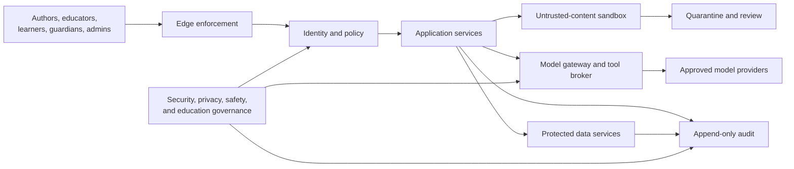
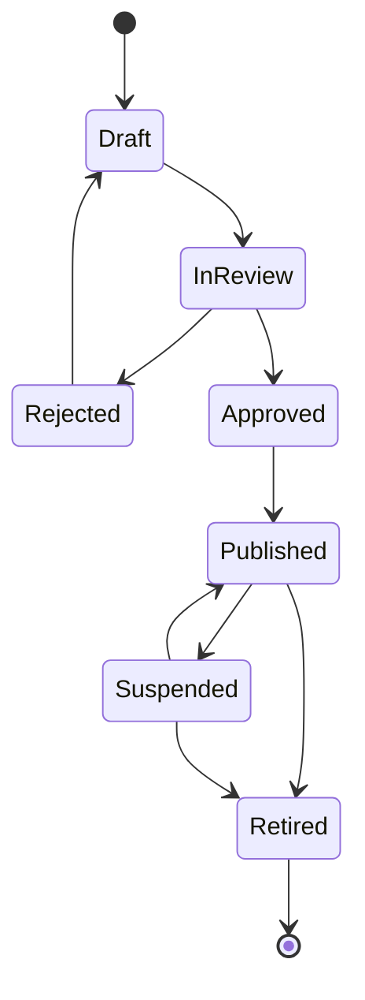

# Security, Privacy, Safety, and Governance

## Purpose and security posture

ULIP handles educational intellectual property, learner records, assessment data, and, in many deployments, children's personal data. Security and privacy are product behavior, not perimeter features. Controls apply from source upload through publication, learning, assessment, adaptation, analytics, export, and deletion.

The governing decisions are:

1. Zero trust: every human and workload request is authenticated, authorized, tenant-scoped, and auditable.
2. Data minimization: ULIP collects and retains only data required for a declared educational purpose.
3. Deny by default: unpublished content, learner records, model tools, exports, and administrative functions require explicit grants.
4. Human authority: high-impact educational and child-safety decisions cannot be made solely by automation.
5. Untrusted AI boundary: documents, retrieved text, learner input, and model output are untrusted data. They never grant permissions or directly execute tools.
6. Tenant and jurisdiction isolation: data routing, storage, keys, models, logs, and support access respect contractual residency and isolation.
7. Safety over availability: suspected cross-tenant exposure, incorrect summative scoring, exploitation, or child harm triggers containment even when service is reduced.

This document governs the controls referenced by [adaptive learning](19_adaptive_learning.md), [testing strategy](20_testing_strategy.md), [deployment architecture](21_deployment_architecture.md), and [observability](23_observability.md).

## Security and governance boundaries



The edge limits volumetric and protocol abuse. Identity and policy establish subject, tenant, role, purpose, resource, and context. Application services enforce object-level authorization. Untrusted parsing and rendering are isolated from credentials and networks. Model access goes through a policy-enforcing gateway. Protected data services use private endpoints. Audit receives security-relevant events independently of business analytics.

## Data classification and handling

| Class | Examples | Handling |
|---|---|---|
| Public | Published marketing and public documentation | Integrity controls; public distribution allowed |
| Internal | Service configuration without secrets, internal plans, aggregate non-sensitive metrics | Workforce identity; no public sharing |
| Confidential | Licensed source content, unpublished questions, prompts, tenant configuration, pseudonymous usage | Encryption; tenant scope; limited export; logged access |
| Restricted | Direct identifiers, child records, assessment responses and scores, accommodations, guardian links, security logs, key material | Strongest access, field or store separation, private endpoints, strict retention, no model training |
| Safety-restricted | Abuse or self-harm disclosure, child-safety case notes, investigation evidence | Dedicated case access, dual-control export, minimal replication, specialized retention |

Every schema field, event, object prefix, log field, and analytic dataset has a classification and purpose tag. Unknown data is treated as Restricted. Classification changes require data-owner and privacy approval.

### Data inventory and lineage

The governance catalog records:

- business owner and technical custodian;
- educational purpose and lawful basis where applicable;
- subjects, fields, classification, source, and downstream recipients;
- tenant and residency;
- retention and deletion trigger;
- encryption and key ownership;
- processors and sub-processors;
- model or analytics use;
- approved access roles and export forms.

Lineage links original source, extracted artifacts, chunks, embeddings, generated items, assignments, learner evidence, mastery state, analytics, backups, and deletion ledger entries.

## Identity and access management

### Human identity

- Enterprise tenants federate with OIDC or SAML. Local passwords are not used for workforce administration.
- Administrators, support staff, content approvers, and incident responders require phishing-resistant MFA.
- Learner authentication supports age-appropriate tenant identity while avoiding unnecessary identity proofing.
- Guardian association requires tenant-authoritative verification and cannot be created solely from a learner-provided email.
- Sessions are short-lived, rotate on privilege change, and are revoked on tenant deprovisioning or risk response.
- Device posture is required for privileged workforce and support access.

### Workload identity

Services use short-lived workload identities and mutual authentication. Static cloud keys are prohibited. A workload receives only the database schema, object prefix, broker topic, key operation, model endpoint, and network path needed for its function.

### Authorization model

ULIP combines role-based and attribute-based access control:

```text
permit when
  authenticated
  and subject.tenant_id == resource.tenant_id
  and role permits action
  and purpose permits action
  and resource state permits action
  and subject scope covers resource scope
  and jurisdiction permits processing
  and contextual risk is acceptable
```

Core roles are learner, guardian, educator, content author, content approver, tenant administrator, support operator, security responder, privacy officer, and service workload. Role names do not imply universal access. An educator is constrained to assigned organizations, classes, subjects, and active dates. A guardian sees only legally and tenant-authorized data for linked learners. Support begins with metadata-only views and requires time-bound elevation for content.

Object-level authorization is enforced in the service and supported by tenant-scoped database controls. Client-side filtering is never an authorization control.

### Privileged and break-glass access

Privilege is just-in-time, approved, time-bound, reason-coded, and recorded. Production database shells and bulk learner exports require two-person approval. Emergency break-glass access generates an immediate security alert, uses a dedicated account, expires automatically, and receives next-business-day review.

Quarterly access certification covers privileged users, service accounts, tenant administrators, safety case roles, and external processors. Dormant and orphaned grants are revoked automatically.

## Tenant isolation

Tenant identity is derived from the authenticated principal and trusted routing context, never accepted from a request body as authority. It is included in:

- relational primary, foreign, and unique keys;
- every query predicate and row-level isolation policy;
- object-store prefixes and signed URL policy;
- broker topics or message attributes and consumer checks;
- vector payload filters applied before result return;
- cache keys;
- audit records, trace baggage, rate limits, and quotas;
- encryption context and, for regulated tiers, tenant-specific keys.

Cross-tenant joins are denied in application roles. Central operations use a separate control plane and aggregated metadata. Automated tests attempt cross-tenant access through APIs, background jobs, search, exports, caches, telemetry, deletion, and recovery.

## Cryptography and secrets

- TLS 1.2 or newer protects all network traffic; modern managed defaults prefer TLS 1.3.
- Managed encryption protects databases, object storage, vector storage, broker, backups, and telemetry at rest.
- Restricted direct identifiers and safety case data are separated and encrypted with dedicated keys.
- Keys reside in managed KMS or HSM services, with separate keys by environment, region, purpose, and regulated tenant tier.
- Envelope encryption includes tenant and data class in the authenticated encryption context.
- Signing keys protect artifacts, release provenance, webhooks, exports, and audit bundles.
- Passwords, tokens, model keys, database credentials, and private keys live only in the managed secret store.

Key administration is separated from data administration. Rotation, revocation, recovery, and loss procedures are tested. Cryptographic erasure may support deletion only where key scope does not destroy unrelated tenant or legal-hold data.

## STRIDE threat model

### Assets

Protected assets include identity and guardian links, learner records, accommodations, assessment items and responses, scores, mastery and recommendation state, licensed source content, model prompts and outputs, tenant policy, audit evidence, signing and encryption keys, release artifacts, and service availability.

### Threats and required mitigations

| STRIDE | Representative threats | Required mitigations | Verification |
|---|---|---|---|
| Spoofing | Stolen educator session, forged workload, guardian impersonation, replayed webhook | Federation, phishing-resistant MFA, workload identity, audience-bound short tokens, nonce and timestamp validation, verified guardian link | Authentication, replay, revocation, and impersonation tests |
| Tampering | Changed source, answer key, score, event, policy, model version, or audit record | Content hashes, immutable versions, transactional writes, signed events where trust crosses boundaries, protected branches, append-only audit, reconciliation | Integrity replay, signature, migration, and audit-chain tests |
| Repudiation | Denial of publication, override, grade change, export, or support access | Actor and workload identity, trusted time, reason code, before/after reference, trace ID, immutable audit, synchronized clocks | Audit completeness and export verification |
| Information disclosure | Cross-tenant retrieval, logs containing answers or personal data, model leakage, overbroad export, exposed backup | Object authorization, tenant filters, minimization, redaction, private endpoints, scoped signed URLs, output filtering, encryption, DLP, export approval | Isolation, log scanning, model leakage, and restore-access tests |
| Denial of service | PDF bombs, recursive graphs, token exhaustion, hot tenant, retry storm, vector overload | File and page limits, sandbox quotas, bounded graph traversal, budgets, fair queues, rate limits, bulkheads, circuit breakers, load shedding | Fuzz, load, soak, quota, and chaos tests |
| Elevation of privilege | Prompt-injected tool call, broken function authorization, compromised worker, CI artifact replacement | Tool broker with explicit allowlists and typed parameters, server authorization, least privilege, sandboxing, signed images, admission policy, protected release | Tool-abuse, BFLA, container escape, and supply-chain tests |

### Trust-boundary review

A threat-model review is required for any new data class, external processor, model provider, tool capability, public endpoint, authentication flow, privileged role, ingestion format, export, or cross-region path. High-risk changes require security sign-off before implementation and penetration testing before broad release.

## Untrusted content and AI security

### Ingestion

Uploads enter quarantine and receive type detection, checksum, malware scanning, size and page limits, decompression-ratio checks, and license/tenant entitlement validation. File extensions are not trusted. Parsing and OCR run in an isolated sandbox with:

- no tenant or cloud credentials;
- no default network access;
- non-root execution, read-only base image, and ephemeral encrypted scratch space;
- CPU, memory, process, time, page, and output limits;
- patched parser images and rapid quarantine capability.

Active content, macros, scripts, embedded files, remote references, and unsupported codecs are rejected or rendered inert. Original files remain immutable.

### Prompt injection and tool use

Document text, retrieval results, model responses, web content, and user input are data, never instructions with authority. System policy and tool permissions are not placed in retrievable tenant content.

The model gateway:

- selects only approved provider, model, region, and retention mode;
- constructs prompts from typed, size-bounded fields;
- delimits untrusted content and strips active markup;
- attaches tenant policy, age band, and task-specific output schema;
- enforces token and cost budgets;
- validates structured output;
- checks citations, content safety, and sensitive-data leakage;
- records model, prompt, policy, and retrieval versions.

Models do not receive cloud credentials. Tool requests pass through a deterministic broker that authenticates the caller, checks tenant and user permission, validates a strict schema, applies resource and destination allowlists, rate limits, and records the action. High-impact actions such as publication, grading changes, learner export, external communication, or safety escalation require deterministic service logic and, where specified, human confirmation.

Provider prompts and responses are excluded from provider training and retained only for the minimum contracted abuse-monitoring period. A provider that cannot meet residency, deletion, confidentiality, and training-exclusion requirements is ineligible for Restricted data.

### Output controls

Generated educational content is grounded in authorized sources, carries citations, and is labeled by provenance. Content intended for publication or summative use requires human review. Safety classifiers and deterministic rules can block or route output, but an allow decision does not establish educational correctness.

The platform detects and prevents:

- disclosure of system prompts, credentials, personal data, or unpublished assessment banks;
- unsupported claims presented as source-grounded;
- instructions that facilitate violence, exploitation, self-harm, or illegal activity beyond approved educational treatment;
- sexual content involving minors;
- manipulative, discriminatory, or demeaning learner messages;
- direct model communication to guardians, authorities, or external parties.

## Privacy engineering

### Purpose limitation

Each processing purpose has approved input fields, outputs, recipients, retention, and lawful basis. Data collected for learning delivery is not reused for advertising, sale, behavioral marketing, or unrelated model training. Tenant content and learner interactions are excluded from foundation-model training by default.

### Privacy principles

- Collect the minimum fields needed to deliver the selected service.
- Prefer tenant identifiers and pseudonymous learner IDs over direct identifiers.
- Separate direct identity from learning evidence and join only in authorized workflows.
- Aggregate and suppress small cohorts in analytics.
- Do not use protected characteristics in online recommendation.
- Use protected data for fairness evaluation only in a separate governed boundary with explicit authority.
- Provide age-appropriate notices and tenant-configurable consent records where consent is the lawful basis.
- Complete a data-protection impact assessment before processing that creates high risk to learners.

### Data-subject and guardian requests

The privacy service supports authenticated access, correction, deletion, restriction, portability, and objection as applicable. Requests are tenant-routed and identity-verified without collecting excessive new data.

Deletion propagates through:

1. direct identity and guardian mappings;
2. transactional records eligible for deletion;
3. learner evidence and mastery projections;
4. vector entries, caches, queues, and search indexes;
5. governed analytics and experiment datasets;
6. provider-held prompt or response records;
7. backups through expiry or controlled tombstone application after restore.

The deletion ledger records scope, stores, result, exceptions, legal holds, and completion time without preserving deleted content. Legal retention for grades or audit is separated from optional personalization data.

### Retention baseline

Tenant contracts and jurisdiction profiles may shorten or extend a period only after legal and privacy review.

| Data | Default trigger and period |
|---|---|
| Quarantined rejected upload | Delete 30 days after rejection |
| Unpublished derived artifacts | Delete 90 days after source deletion or abandonment |
| Published content versions | Contract life plus 90 days, subject to rights obligations |
| Formative raw responses | Active course plus 12 months |
| Mastery and recommendation detail | Active course plus 12 months |
| Summative records | Tenant and jurisdiction education-record schedule |
| General application logs | 30 days searchable, 90 days archive |
| Security audit records | 1 year searchable, 7 years immutable archive |
| Safety case data | Jurisdictional safeguarding schedule with restricted access |
| Model gateway prompts and responses | Disabled by default; up to 30 days only when approved for quality or abuse review |
| Backups | 35-day rolling window plus governed long-term recovery copies |

Retention is enforced by lifecycle jobs and verified by deletion metrics and sampled audits.

### Analytics and research

Operational analytics uses pseudonymous identifiers and approved event fields. Research datasets require a protocol, purpose, minimization, ethics/privacy review, access expiry, and output disclosure review. Differential privacy or equivalent statistical protection is used when releasing aggregates whose combination could identify a learner. Re-identification attempts are prohibited and monitored.

## Child safety

### Product boundaries

- No advertising, sale of learner data, dark patterns, public learner profiles, location sharing, or open direct messaging.
- Learner-to-adult and learner-to-learner communication is disabled unless the tenant enables a moderated educational channel with retention and reporting.
- External links are allowlisted or pass through a warning and filtering policy appropriate to age.
- Age assurance is proportionate and tenant-led; ULIP does not collect government identity solely to personalize learning.
- Search and generation apply age-band content rules.
- Notifications avoid sensitive details on lock screens and respect quiet hours.
- Guardians receive only data and controls authorized by law and tenant policy. Older learners retain rights applicable in their jurisdiction.

### Safety signals and response

A learner disclosure involving self-harm, abuse, exploitation, grooming, or imminent danger is handled as a potential signal, not a confirmed fact. The system:

1. provides an age-appropriate immediate message that avoids judgment and encourages contact with a trusted person or local emergency service when danger appears imminent;
2. captures the minimum necessary case context in the safety-restricted store;
3. routes the signal to trained, authorized human reviewers under tenant policy;
4. prevents the disclosure from entering mastery, recommendation, general analytics, or model-training data;
5. records reviewer decisions and communications;
6. contacts guardians, tenant safeguarding leads, or authorities only under approved policy and human decision, except where a deterministic legally mandated emergency process applies.

Automated classifiers prioritize review but do not make a diagnosis, disciplinary decision, or report to authorities. Access is limited to the safety case team and audited. Reviewer wellness, escalation coverage, language support, and response-time objectives are part of operational readiness.

### Abuse prevention

Controls address grooming, coercion, bullying, sexual exploitation, sextortion, impersonation, and attempts to obtain a child's contact or location. Moderated channels use content and behavior signals with human review. Evidence preservation is scoped, legally reviewed, and separated from routine product data.

## Educational and model governance

### Governed objects

The following are immutable, versioned, and traceable:

- source and rights record;
- extracted concepts, objectives, misconceptions, graph, chunks, and embeddings;
- item, answer key, rubric, diagram, and psychometric status;
- prompt template, system policy, model, provider, parameters, and safety configuration;
- learner-model and adaptive-policy versions;
- evaluator, gold set, thresholds, and approval record.

### Lifecycle



Authors cannot approve their own high-stakes content. Published objects are never edited in place; a correction creates a new version and records supersession. Suspension removes an object from new retrieval, assignment, and recommendation within the revocation SLO while preserving authorized historical records.

### Model and policy approval

Promotion requires:

- documented intended use, prohibited use, languages, age bands, and jurisdictions;
- provider due diligence and data-processing terms;
- evaluation on current educational, safety, privacy, security, accessibility, and fairness suites;
- cost, latency, availability, and fallback evidence;
- red-team results and resolved high-risk findings;
- named business, education-quality, privacy, security, and operational owners;
- canary plan, monitoring, kill switch, and rollback target.

Material model alias changes are treated as new versions. Automatic provider upgrades are disabled. Emergency suspension can be executed by security, safety, or model-risk on call.

### High-impact decisions

Generated or adaptive output cannot independently determine a final grade, admission, discipline, accessibility eligibility, special-education placement, safeguarding report, or other legal or similarly significant outcome. Such workflows require validated evidence, transparent criteria, qualified human review, and an appeal or correction mechanism.

## Audit and accountability

Security-relevant events include:

- login, federation, MFA, session revocation, and risk decision;
- authorization denial and privilege change;
- learner, guardian, educator, and tenant-link changes;
- source upload, quarantine, approval, publication, suspension, and export;
- assessment creation, answer-key change, delivery, scoring, override, and invalidation;
- mastery and policy version change, recommendation override, and adaptive kill switch;
- model, prompt, tool, provider, and safety-policy change;
- access to Restricted or safety-restricted data;
- support elevation, bulk operation, deletion, legal hold, key use, backup restore, and break-glass access;
- release, policy exception, and incident action.

Audit records include actor, tenant, action, target reference, outcome, reason category, source, trusted time, trace ID, and before/after version reference. Sensitive content and secrets are excluded. Logs are append-only, integrity-protected, access-controlled, replicated, and monitored for gaps. Clock synchronization is mandatory.

## Vulnerability and supply-chain management

- Source changes require review and protected-branch checks.
- Dependencies are pinned and scanned for vulnerabilities and license policy.
- Builds are isolated, reproducible where practical, and produce SBOM and SLSA-aligned provenance.
- Images are minimal, signed, scanned, and admitted by digest.
- Package retrieval uses approved registries or mirrors; typosquatting and dependency-confusion controls are enabled.
- Critical internet-facing vulnerabilities are remediated or mitigated within 24 hours, high within 7 days, medium within 30 days, and low within 90 days.
- External penetration testing occurs before general availability and annually.
- A coordinated vulnerability-disclosure channel and incident intake are maintained.

An exploitable critical or high vulnerability blocks release. An exception needs security approval, compensating controls, an owner, and an expiry shorter than the normal remediation target.

## Incident response and breach handling

The incident process follows preparation, detection, triage, containment, eradication, recovery, notification, and learning. Severity is based on learner harm, data class, tenant scope, assessment integrity, exploitability, and service impact.

Immediate containment options include:

- revoke sessions, workload identity, keys, provider credentials, or signed URLs;
- disable model, prompt, tool, content version, adaptive policy, export, or tenant;
- isolate an ingestion format or worker pool;
- fence a region or database writer;
- place affected records under preservation hold;
- switch to static learning or read-only mode.

The privacy officer and legal counsel determine regulatory and contractual notification. Child-safety leads govern safeguarding communication. Engineering does not contact affected learners, guardians, schools, regulators, or authorities outside the approved incident communication plan.

Evidence is collected with chain of custody. Recovery validates authorization, integrity, deletion, score correctness, and telemetry before traffic returns. A blameless review records root causes, control failures, affected data, corrective actions, owners, and dates.

Detailed detection and response procedures live in [observability](23_observability.md).

## Governance bodies and decision rights

| Body | Decision rights |
|---|---|
| Product and education council | Intended use, learning outcomes, content standards, assessment validity |
| Security and architecture council | Threat acceptance, control design, platform boundaries, release exceptions |
| Privacy and data governance council | Purpose, lawful basis, data inventory, retention, processors, subject rights |
| Child-safety council | Age-appropriate design, moderation, escalation, safeguarding policy |
| Model-risk council | Model/provider approval, evaluations, limitations, drift, suspension |
| Change advisory group | High-risk production changes and disaster-recovery readiness |

The accountable executive cannot delegate legal accountability to a model or vendor. Each control has an owner, operator, evidence source, test cadence, and exception path.

## Policy exceptions

An exception states the policy, exact scope, affected tenants and data, risk analysis, compensating controls, approvers, owner, start, expiry, and validation plan. It cannot authorize unlawful processing or waive child-safety, cross-tenant isolation, breach notification, or high-impact human-review requirements. Exceptions expire automatically and are reviewed monthly.

## Control assurance

| Cadence | Evidence |
|---|---|
| Continuous | Authorization, tenant isolation, secret, dependency, image, policy, DLP, and audit-gap monitoring |
| Per release | Threat-based regression, artifact attestation, model/content evaluation, access and telemetry checks |
| Monthly | Retention execution, vulnerability aging, key health, processor status, exception review |
| Quarterly | Privileged access certification, deletion sample, tenant isolation exercise, restore test, governance metrics |
| Semiannual | Regional recovery and child-safety exercise |
| Annual | Penetration test, policy review, processor reassessment, incident exercise, training |

## Production acceptance criteria

ULIP can process learner data in production only when:

1. the data inventory, purposes, classification, retention, residency, processors, and owners are approved;
2. authentication, object authorization, tenant isolation, and privileged-access tests pass with zero critical failures;
3. STRIDE and AI threat models cover every trust boundary and all high risks are mitigated or formally accepted;
4. encryption, key rotation, secret handling, immutable audit, and break-glass controls are exercised;
5. deletion and access requests complete across authoritative, derived, provider, analytic, and backup workflows within policy;
6. model, content, assessment, and adaptive-policy governance can approve, suspend, roll back, and reconstruct a version;
7. child-safety prevention, human review, escalation, evidence access, and communication exercises pass;
8. signed artifacts, SBOMs, provenance, vulnerability gates, and incident runbooks are active;
9. every high-impact workflow provides qualified human review and a correction or appeal path.
