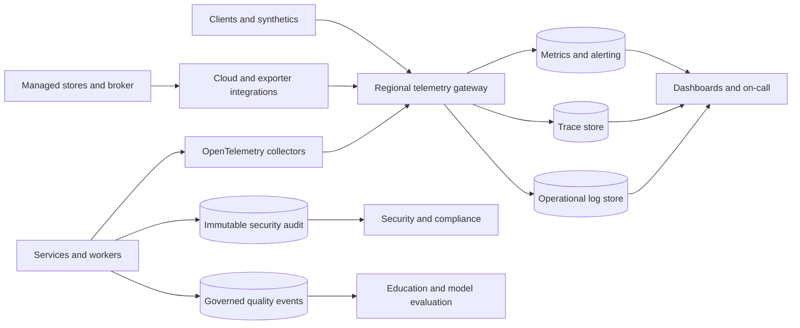

# Observability, SLOs, and Operational Response

## Purpose and decisions

ULIP observability must answer four questions:

1. Can learners and educators complete critical journeys?
2. Are educational, assessment, adaptive, privacy, and safety outcomes correct?
3. Which tenant, release, model, policy, dependency, or data flow explains degradation?
4. Can responders detect, contain, and recover within the committed objective?

The platform standardizes on OpenTelemetry for application metrics, traces, and structured logs; Prometheus-compatible metrics for alerting; centralized searchable logs; a trace backend; immutable security audit storage; and governed analytics for educational outcomes. Product analytics, operational telemetry, security audit, and safety case records are separate data products with different access and retention.

Observability is part of every service's production contract. A service without telemetry, service-level objectives, alerts, runbooks, and an owner cannot receive production traffic.

## Telemetry architecture

Collectors are deployed per cluster and region with bounded disk buffering. Loss of a telemetry backend does not stop learning delivery, but audit generation fails closed for operations whose policy requires an audit record. Exporters use private endpoints, encryption, backpressure, and data-class routing.

## Telemetry contract

### Resource attributes

Every metric, trace, and operational log includes, where applicable:

- `service.name`, `service.version`, and deployment artifact digest;
- `deployment.environment`, cloud region, cluster, and namespace;
- owner team and service tier;
- active schema, feature, model, prompt, embedding, rubric, and adaptive-policy versions;
- tenant tier and pseudonymous tenant key where operationally necessary;
- trace and span IDs.

Direct learner identifiers, email, name, raw response, prompt body, document text, access token, secret, and full URL query are prohibited. Pseudonymous learner IDs are excluded from metrics and general logs. Authorized traces may carry an ephemeral session correlation ID that rotates and expires within 24 hours.

### Trace propagation

W3C Trace Context crosses HTTP, gRPC, broker, workflow, and model-gateway boundaries. Asynchronous messages carry trace context, idempotency key, occurred and received times, tenant pseudonym, data class, source version, and workflow ID. A consumer creates a linked span when processing occurs outside the producer's trace lifetime.

Required span attributes include operation, route template, outcome, dependency, retry count, cache result, data classification, and stable error code. Raw SQL, vector query text, source content, and model prompts are not span attributes.

### Structured logs

Logs are JSON and contain timestamp, severity, service, version, region, event name, trace ID, stable error code, outcome, and redacted context. Stack traces are captured for unexpected server errors but scrubbed before export. User-visible errors carry a correlation ID, not an internal stack or topology.

Errors use a governed taxonomy:

- `AUTHN_*`, `AUTHZ_*`, `TENANT_*`
- `VALIDATION_*`, `CONTENT_*`, `ASSESSMENT_*`
- `WORKFLOW_*`, `BROKER_*`, `DATABASE_*`, `VECTOR_*`
- `MODEL_*`, `POLICY_*`, `SAFETY_*`
- `RATE_LIMIT_*`, `DEPENDENCY_*`, `INTERNAL_*`

### Metrics

Metric names use a `ulip_` prefix, base units, and cumulative counters. Histograms use centrally managed buckets. Labels have bounded cardinality. Allowed dimensions include service, operation, region, result, status class, dependency, model family, policy version, queue, content type, tenant tier, and age band only when privacy review approves aggregation.

Tenant ID, learner ID, document ID, trace ID, URL, exception text, question text, and arbitrary error messages are prohibited metric labels.

## Golden signals and domain signals

### Platform golden signals

Every online service reports:

- request rate and concurrency;
- success, client-error, server-error, timeout, and rejection rate;
- end-to-end and dependency latency;
- CPU, memory, connections, threads, file descriptors, and saturation;
- retry, circuit-breaker, load-shed, and fallback rate;
- deployment version and regional traffic share.

Every worker reports queue depth, oldest-message age, throughput, processing duration, retries, dead-letter count, lease conflicts, and idempotent duplicates.

### Ingestion and knowledge quality

- uploaded, quarantined, accepted, rejected, and published documents;
- pages and bytes processed per phase;
- phase latency, failure, retry, queue age, and cost;
- OCR confidence and low-confidence page rate;
- extracted concept, objective, misconception, edge, chunk, and citation counts;
- validation rejection by reason;
- unsupported assertion, citation mismatch, duplicate, and graph-cycle rates;
- source-to-published lineage completeness;
- vector indexing lag and manifest-to-index reconciliation mismatch.

### Retrieval and generation

- authorized retrieval success, latency, result count, zero-result rate, and metadata-filter rejection;
- recall and citation coverage on continuous evaluation probes;
- generation success, timeout, safety block, schema failure, groundedness failure, and fallback;
- input and output tokens, provider latency, quota, and cost;
- model, prompt, retrieval, and output-policy version distribution;
- unpublished, wrong-age-band, or wrong-tenant result count, which must remain zero.

### Assessment and learning

- assignment launch, item render, attempt submit, durable save, score completion, and feedback success;
- answer-key and rubric versions;
- scoring latency, human-review queue age, override, invalidation, and appeal rates;
- accessibility-mode journey success;
- evidence acceptance, rejection, duplicate, and late-event rates;
- mastery projection lag, replay, stale state, recommendation latency, fallback, override, opt-out, and repetition;
- delayed retention, calibration, and approved fairness indicators from governed evaluation.

### Security, privacy, and safety

- authentication failures and suspicious session changes;
- authorization denial by stable reason;
- cross-tenant policy denials and any confirmed isolation failure;
- privileged elevation, break-glass use, bulk export, key operation, and audit gap;
- malware and prompt-injection detection, tool denial, egress denial, and safety block;
- deletion and access-request age, completion, and store reconciliation;
- retention deletion success and legal-hold exclusions;
- child-safety case intake and human review age, visible only to the restricted safety team;
- vulnerability age and policy exception expiry.

Sensitive security and safety indicators use restricted dashboards and coarse tenant-free aggregation for general operations.

## Service-level indicators and objectives

SLOs are calculated from server-side events and validated by external synthetic journeys. Unless stated otherwise, the window is a rolling 28 days and excludes only approved maintenance announced at least 72 hours in advance. Dependency failures count against the user-facing SLO when the user journey fails.

| Service or journey | SLI | Objective |
|---|---|---:|
| Learner application availability | Successful critical learner requests / eligible requests | 99.95% |
| Educator application availability | Successful critical educator requests / eligible requests | 99.9% |
| Learner API latency | p95 server duration for critical read APIs | 500 ms |
| Durable attempt submission | p95 from submit to committed receipt | 1 second |
| Assessment scoring | Valid auto-scorable attempts completed within 5 seconds | 99.9% |
| Published-content retrieval | Successful authorized retrieval requests | 99.95% |
| Retrieval latency | p95 end-to-end authorized retrieval duration | 750 ms |
| Formative generation | Valid requests yielding approved response or declared safe fallback within 15 seconds | 99.0% |
| Recommendation availability | Valid requests yielding constrained recommendation or static fallback | 99.95% |
| Recommendation latency | p95 end-to-end duration | 800 ms |
| Evidence freshness | Accepted evidence reflected in mastery state within 60 seconds | 99.9% |
| Ingestion timeliness | Documents up to the governed standard size reach review-ready state within 30 minutes | 95.0% |
| Publication revocation | Suspended content absent from new retrieval and recommendations within 5 minutes | 99.99% |
| Audit completeness | Required audited actions with durable audit record | 100% |
| Privacy deletion execution | Valid deletion requests completed within the policy due date | 99.9% |
| Child-safety review | Potential imminent-danger signal acknowledged by authorized human within 5 minutes, when staffed service is contracted | 99.0% |

Correctness objectives are hard guardrails:

- confirmed cross-tenant data return: zero;
- acknowledged but lost learner attempt: zero;
- unapproved content used in summative assessment: zero;
- prohibited adaptive-policy action: zero;
- required audit record missing: zero.

A hard-guardrail breach creates a severity-one incident and stops affected rollout regardless of availability performance.

### Error budgets

An SLO of 99.95 percent permits about 20.2 minutes of bad events in 28 days; 99.9 percent permits about 40.3 minutes. Event-count SLOs use failed eligible events rather than minutes.

Policy:

- more than 75 percent budget remaining: normal delivery;
- 50 to 75 percent remaining: review recurring contributors;
- 25 to 50 percent remaining: reliability work receives priority and risky changes require service-owner approval;
- below 25 percent remaining: freeze non-essential releases for that service;
- exhausted budget or hard-guardrail breach: stop rollout, restore reliability, and obtain SRE approval to resume.

No error budget exists for security, privacy, child-safety, tenant-isolation, audit-completeness, or acknowledged-data-loss guardrails.

## Alerting

Alerts represent urgent user impact, imminent SLO breach, data-integrity risk, or required human safety response. Capacity forecasts and low-urgency anomalies create work items rather than paging.

### Multi-window burn alerts

For 28-day availability SLOs:

| Severity | Burn condition | Action |
|---|---|---|
| Page | 14.4 times burn over 5 minutes and 1 hour | Immediate response |
| Page | 6 times burn over 30 minutes and 6 hours | Immediate response |
| Work item | 3 times burn over 2 hours and 24 hours | Same business day |
| Work item | 1 times burn over 6 hours and 3 days | Reliability planning |

Both windows must breach to reduce noise. Latency and freshness SLOs use the same error-budget model based on bad-event ratio.

### Immediate pages

- confirmed or credible cross-tenant access;
- missing required audit flow;
- acknowledged learner attempt or score loss;
- wrong answer key deployed to active summative assessment;
- prohibited adaptive action or age-inappropriate content exposure;
- child-safety signal beyond its contracted acknowledgment target;
- publication revocation beyond five minutes;
- database integrity, replication, or backup corruption;
- regional traffic failure or exhausted fast-burn budget;
- active credential compromise, malicious tool use, or uncontained data exfiltration.

Each page includes service, region, version, start time, user impact, current burn, relevant graphs, recent changes, dependency state, and runbook link. Alerts never include learner content or direct identity.

### Alert quality

Every page has an owner and runbook, is tested quarterly, and is reviewed after firing. The target is at least 90 percent actionable pages and fewer than two false pages per on-call rotation. Repeated manual silencing is prohibited; the alert or underlying system is corrected.

## Dashboards

### Executive health

- critical-journey SLO attainment and error-budget remaining;
- active severity-one and severity-two incidents;
- learner and educator journey success by region;
- hard-guardrail status;
- privacy and child-safety target status in privacy-preserving aggregates;
- forecast capacity and service cost.

### Service dashboard

- traffic, errors, latency, saturation, deployment and region;
- dependency latency and errors;
- queue age, retries, dead letters, and fallback;
- recent deploys, flags, models, prompts, policies, and migrations;
- top stable error codes and trace exemplars;
- SLO burn and remaining budget.

### Ingestion and content quality

- documents by lifecycle state and phase;
- queue age and throughput;
- validation and quarantine reasons;
- gold-probe precision, recall, citation, and unsupported-claim trends;
- vector indexing and publication reconciliation;
- model/provider cost and failure.

### Learning and assessment integrity

- launch-to-submit funnel without learner-level identity;
- save and scoring latency;
- scoring override, invalidation, appeal, and rubric agreement;
- recommendation fallback, override, opt-out, repetition, and state freshness;
- delayed retention and fairness gates from governed cohorts;
- accessibility critical-journey success.

### Security and governance

Restricted views provide authentication risk, authorization denial, privileged access, tenant-isolation probes, malware and injection detections, export and deletion status, audit continuity, vulnerability age, safety review age, and policy exceptions.

## Continuous verification

Synthetic probes run at least every five minutes from every active region and execute:

1. learner authentication using a dedicated synthetic tenant;
2. published-content lookup and citation retrieval;
3. accessible item rendering;
4. attempt save and deterministic score;
5. evidence projection and recommendation with a known reason code;
6. educator assignment preview and override;
7. publication suspension in a separate controlled probe corpus;
8. audit event discovery.

Synthetic records are clearly marked, excluded from educational analytics, and automatically cleaned. Canary model probes run fixed safe prompts and adversarial fixtures without using learner data. Data reconcilers compare source manifests, relational metadata, vector indexes, outbox positions, attempts, scores, evidence, deletion ledgers, and regional replication.

## Incident command

| Severity | Example | Acknowledgment | Update cadence |
|---|---|---:|---:|
| SEV-1 | Learner harm, cross-tenant disclosure, material data loss, active summative corruption, widespread outage | 5 minutes | 30 minutes |
| SEV-2 | Major critical-journey degradation, contained Restricted-data incident, regional failover | 15 minutes | 60 minutes |
| SEV-3 | Limited degradation with workaround | 4 business hours | Daily |
| SEV-4 | Minor defect or capacity risk | 2 business days | As agreed |

The first qualified responder becomes incident commander until handoff. Distinct roles cover operations, communications, security/privacy or safety, and scribe. Responders use approved incident channels and avoid copying learner content. Only designated communications roles contact tenants or external parties.

All SEV-1 and SEV-2 incidents receive a review within five business days. Corrective actions identify owner, priority, validation, and due date. Reviews examine detection delay, decision quality, control failure, recovery, and recurrence risk without assigning blame.

## Runbook standard

Every runbook contains:

- scope, symptoms, impact, owner, severity guidance, and prerequisites;
- dashboards, queries, synthetics, and recent-change view;
- safe diagnostic steps in order;
- containment and feature or model kill switches;
- rollback and recovery commands through approved automation;
- integrity and security checks;
- user and tenant communication triggers;
- exit criteria, escalation, evidence preservation, and follow-up.

Runbooks are executable from a least-privileged operator role. Screenshots and person-specific knowledge are not substitutes for steps.

## Core runbooks

### RB-01: Learner or retrieval SLO burn

**Trigger:** fast-burn alert or failed multi-region learner synthetic.

1. Declare severity based on reach and hard-guardrail status; appoint incident command.
2. Compare regions, operations, tenants tiers, artifact versions, dependencies, and the last 60 minutes of changes.
3. Stop an active rollout if the canary or new configuration correlates with failures.
4. Confirm database, cache, vector, broker, identity, and model-gateway health using dependency dashboards.
5. Shed non-critical generation and export traffic before learner reads, attempt saves, or scoring.
6. Route away from an unhealthy region only after confirming database fencing and residency.
7. Roll back to the last known signed artifact when change correlation is credible.
8. Verify three consecutive synthetic passes and burn below one times for 30 minutes.
9. Preserve traces and change evidence, communicate impact, and schedule review.

### RB-02: Ingestion stalled or poison document

**Trigger:** oldest-message age breaches threshold, no phase completions, repeated worker crash, or dead-letter growth.

1. Identify the phase, partition, tenant reach, document type, worker version, and provider.
2. Pause only the affected partition or content type; do not repeatedly retry the same item.
3. Quarantine a suspected malicious or pathological document and isolate its artifacts.
4. Check quotas, leases, database connections, broker health, object integrity, model quota, and sandbox limits.
5. Scale workers only when downstream health and tenant fairness permit.
6. Replay from the last durable phase checkpoint with the original idempotency key.
7. Reconcile manifest, relational state, and vector points before publication resumes.
8. Exit when queue age recovers, no new dead letters occur for 30 minutes, and a known-good document completes.

### RB-03: Incorrect or unsafe published content

**Trigger:** educator report, safety detector, citation probe, wrong answer key, or governance suspension.

1. Record content, item, source, model, prompt, rubric, tenant, assignments, and version.
2. Suspend the exact version using the governed kill switch. For active summative impact, pause the assessment.
3. Verify removal from retrieval, cache, assignment launch, recommendation, and generation context within five minutes.
4. Identify exposed learners and downstream derived versions without broadly exporting their data.
5. Education quality determines correction, item invalidation, rescoring, and communication; child-safety or privacy leads join when applicable.
6. Publish a reviewed replacement as a new version. Never alter historical evidence in place.
7. Verify citations, scoring, caches, indexes, recommendations, and audit trail before reactivation.
8. Exit after impacted tenants are informed under policy and all derived artifacts reconcile.

### RB-04: Evidence projection lag or adaptive failure

**Trigger:** evidence freshness SLO burn, stale-state spike, projection replay storm, or prohibited recommendation.

1. If a prohibited recommendation is credible, disable the affected policy version immediately and declare SEV-1.
2. Switch impacted tenants to educator-assigned static sequence.
3. Compare accepted event offsets, projector checkpoints, dead letters, model version, concept partitions, and late-event rate.
4. Stop duplicate consumers or fence a stale regional lease.
5. Repair poison events through a versioned correction; never delete evidence silently.
6. Replay the affected partition idempotently and compare state checksums.
7. Re-enable adaptation through canary after policy constraints, overrides, and state freshness pass.
8. Exit after backlog is zero, stale-state rate returns to baseline, and three synthetic recommendation journeys pass.

### RB-05: Suspected cross-tenant disclosure

**Trigger:** isolation probe, customer report, anomalous query, cache collision, export anomaly, or security alert.

1. Declare SEV-1, engage security and privacy, and preserve evidence.
2. Disable or isolate the implicated route, cache, vector collection, job, export, model, or service. Safety takes priority over availability.
3. Revoke affected sessions and credentials when compromise is possible.
4. Determine source tenant, recipient tenant, data class, time window, objects, caches, logs, backups, and external processors.
5. Validate whether exposure was possible and confirmed using audit, traces, query records, and object versions without widening access.
6. Correct the tenant filter or authorization defect, flush affected caches, rotate credentials where needed, and scan sibling paths.
7. Privacy and legal owners determine notification; engineering communicates only through the incident plan.
8. Restore traffic by canary after adversarial isolation tests return zero cross-tenant results.

### RB-06: Database or region failure

**Trigger:** writer unavailable, replication integrity risk, zone quorum loss, or region unreachable.

1. Stop non-essential writes and retries; preserve attempt submissions in the approved client or outbox path.
2. Confirm failure mode and replication position. Fence the old writer before promotion.
3. Follow the residency-approved failover sequence in [deployment architecture](21_deployment_architecture.md).
4. Enable read-only or static-learning mode if fencing is uncertain.
5. Promote, reconcile transactions and outbox, warm minimum caches, then run critical synthetics.
6. Restore traffic progressively while watching integrity, saturation, lag, and SLO burn.
7. Treat failback as a later planned change.

### RB-07: Model provider degradation or unsafe model behavior

**Trigger:** timeout or schema spike, cost anomaly, safety regression, data-retention concern, or model alias change.

1. Pin and confirm the actual provider model version and affected prompt/policy versions.
2. Disable the affected route or model using the model kill switch.
3. Serve last-known-approved content and deterministic fallbacks; queue only work whose expiry and purpose permit delay.
4. Verify provider status, quota, region, retention mode, and unexpected version change.
5. Run the live qualification and safety suite against a candidate fallback.
6. Canary the approved fallback and monitor groundedness, safety, latency, cost, and schema validity.
7. Resume only after model-risk approval for a material version change.

### RB-08: Telemetry or audit interruption

**Trigger:** missing collectors, export backlog, trace collapse, metric gap, or audit sequence discontinuity.

1. Distinguish operational telemetry loss from security-audit loss.
2. For required audit loss, disable affected privileged, publication, export, grading-change, and deletion operations.
3. Check collector capacity, certificates, storage quota, endpoint health, and network policy.
4. Preserve local buffers and avoid restart loops that discard them.
5. Restore export, verify sequence continuity and record counts, and reconcile application actions against transactional outboxes.
6. Backfill only from authoritative signed records and mark reconstructed records.
7. Exit after gaps are explained, alerts recover, and a controlled audited action is discoverable end to end.

## Retention and access

| Telemetry | Searchable | Archive | Access |
|---|---:|---:|---|
| High-cardinality operational traces | 14 days | 30 days sampled | Service and SRE |
| Operational application logs | 30 days | 90 days | Service and SRE |
| Metrics | 15 months | 24 months for aggregate SLO series | Service, SRE, governance |
| Security audit | 1 year | 7 years immutable | Security, privacy, authorized audit |
| Safety case telemetry | Per safeguarding policy | Per safeguarding policy | Restricted safety team |
| Governed learning quality events | Course plus 12 months, then aggregate | Approved aggregate only | Education quality and privacy-approved analysts |

Legal and tenant requirements can alter these periods through policy. Access is logged, least-privileged, and reviewed. Debug logging with payloads is prohibited in production.

## Cost and observability health

Telemetry budgets are set by signal value and service tier. Head-based trace sampling retains a baseline, while tail sampling retains all errors, high latency, policy denial, canary, and incident traces. Restricted-data redaction occurs before sampling.

The observability system monitors itself:

- collector dropped spans, metrics, and logs;
- export queue age and disk buffer;
- scrape and rule-evaluation failures;
- alert-delivery tests;
- dashboard and runbook link checks;
- audit sequence continuity;
- telemetry spend by service and signal.

Cost reductions cannot remove audit evidence, SLO calculation, hard-guardrail detection, or incident forensics.

## Operational acceptance criteria

ULIP is operationally ready when:

1. all critical journeys have server SLIs and multi-region synthetic validation;
2. every production service emits the required resource, trace, log, and metric contract without sensitive payloads;
3. SLOs, error budgets, multi-window alerts, dashboards, and owners are configured;
4. hard-guardrail breaches page immediately and stop progressive rollout;
5. core runbooks have been exercised by an on-call engineer who did not author them;
6. audit interruption fails closed for governed operations and can be reconciled;
7. telemetry remains available through one-zone loss and buffers bounded backend interruption;
8. a game day demonstrates safe fallback, regional recovery, integrity reconciliation, and incident communication within objectives.
