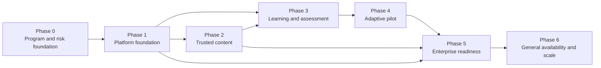

# ULIP Delivery Roadmap

## Purpose

This roadmap turns the architecture into a sequenced, measurable delivery program. It prioritizes trusted educational content, safe learner journeys, enterprise controls, adaptive learning, and scale in that order. Phase completion depends on evidence and outcomes, not elapsed time.

The plan assumes stable, cross-functional teams for platform, content intelligence, learning and assessment, experience, data and adaptive learning, security/privacy, quality engineering, and site reliability. The first production pilot is intentionally narrow: one jurisdiction, one language, one curriculum, formative assessment, and a small group of trained educators.

## Delivery principles

1. Ship vertical journeys, not disconnected services.
2. Build identity, tenant isolation, data governance, audit, and observability before learner data enters production.
3. Keep original sources and transactional records authoritative; derived indexes are rebuildable.
4. Start with educator-reviewed content and deterministic fallbacks.
5. Introduce AI and adaptation behind versioned policies, evaluation gates, kill switches, and human control.
6. Prove accessibility, privacy, child safety, recovery, and operational ownership before scale.
7. Promote the same signed artifact through environments using the [testing strategy](20_testing_strategy.md) and [deployment architecture](21_deployment_architecture.md).
8. Stop expansion when outcome, safety, correctness, or reliability guardrails fail.

## Target outcomes

By general availability, ULIP will:

- ingest a governed educational source and publish a traceable knowledge version;
- let an educator discover, review, assign, and revoke approved content;
- let a learner complete an accessible activity and receive correct, cited formative feedback;
- deliver reliable attempts, scoring, evidence, and progress views;
- recommend constrained next activities with educator and learner override;
- demonstrate improved delayed retention in a pre-registered pilot without harmful subgroup effects;
- satisfy enterprise identity, tenant isolation, audit, privacy, child-safety, deployment, recovery, and SLO requirements;
- reconstruct each published asset, score, recommendation, and release from versioned evidence.

## Scope boundaries through general availability

### Included

- PDF, TXT, and Markdown educational sources;
- one initial curriculum and language, followed by explicitly qualified additions;
- concepts, objectives, misconceptions, prerequisites, citations, semantic chunks, and retrieval;
- educator-reviewed formative questions, explanations, assignments, attempts, scoring, and progress;
- accessible web learner and educator journeys;
- constrained adaptive sequencing for formative learning;
- enterprise federation, roles, tenant controls, audit, data rights, telemetry, support, backup, and recovery.

### Deferred until after general availability

- autonomous summative item publication or scoring of open-ended high-stakes responses;
- admissions, discipline, special-education placement, diagnosis, or safeguarding decisions by automation;
- open social messaging, advertising, marketplace sales, or public learner profiles;
- unrestricted agent tool use;
- broad jurisdiction rollout before residency, consent, retention, and child-safety qualification;
- native mobile applications unless the pilot proves a web limitation that cannot be resolved accessibly.

## Dependency map

The critical path is governance and tenant isolation, production platform, trusted content publication, reliable assessment evidence, adaptive evaluation, disaster recovery, and general-availability qualification. Experience work, additional ingestion formats, and secondary analytics proceed in parallel only when they do not delay this path.

## Phase overview

| Phase | Indicative duration | Release | Primary outcome |
|---|---:|---|---|
| 0. Program and risk foundation | 2 weeks | Architecture baseline | Decisions, owners, measures, and legal/safety boundary are executable |
| 1. Platform foundation | 6 weeks | Internal platform alpha | Secure, observable, deployable tenant shell |
| 2. Trusted content pipeline | 8 weeks | Author alpha | Approved sources become traceable published knowledge |
| 3. Learning and assessment | 8 weeks | Educator sandbox beta | Accessible assignment-to-feedback journey works end to end |
| 4. Adaptive learning pilot | 10 weeks | Limited pilot | Safe adaptation improves learning under educator control |
| 5. Enterprise readiness | 8 weeks | Release candidate | SLO, security, privacy, support, and recovery are proven |
| 6. General availability and scale | 6 weeks | GA | Controlled production expansion with repeatable operations |

Durations are planning ranges from phase authorization. Exit evidence, not the date, controls promotion.

## Phase 0: Program and risk foundation

### Outcome

The organization agrees on intended use, initial market boundary, decision rights, risk controls, architecture, measures, and delivery ownership before building production pathways.

### Deliverables

- approved intended-use and prohibited-use statement;
- first jurisdiction, learner age band, language, curriculum, tenant profile, and deployment residency;
- data inventory, classification, purpose, retention, processor map, and privacy-impact assessment plan;
- child-safety and high-impact human-review policy;
- architecture decision register covering tenancy, identity, stores, events, models, environments, and recovery;
- named service, data, model, security, privacy, education-quality, safety, accessibility, and operational owners;
- product outcome tree and baseline measurement plan;
- threat model, abuse cases, compliance mapping, and risk register;
- prioritized vertical journey backlog with dependency owners;
- cost envelope and capacity assumptions.

### Dependencies

Executive sponsor, qualified education leadership, privacy/legal counsel, child-safety expertise, and target pilot partners.

### Release gate

Architecture, education quality, security, privacy, safety, accessibility, operations, and product owners approve the baseline. Any unresolved high risk blocks Phase 1 authorization.

### Exit criteria

1. All production data classes have an owner, purpose, lawful basis where required, region, retention, and approved recipients.
2. Initial scope is limited to one named curriculum, language, jurisdiction profile, and formative use.
3. At least 95 percent of architectural decisions required for Phase 1 are resolved; the remainder have an owner and a decision date before implementation dependency.
4. Every critical journey and hard guardrail has a measurable indicator and target.
5. All critical and high threat-model risks have an approved mitigation in the delivery backlog.
6. Staffing covers every critical-path workstream with no unowned production service.

## Phase 1: Platform foundation

### Outcome

Teams can deploy a secure tenant-aware service, observe it, and recover it without learner production data.

### Deliverables

- isolated local, ephemeral, development, pre-production, and production accounts and clusters;
- GitOps, immutable build, artifact registry, SBOM, signing, provenance, and policy admission;
- enterprise federation adapter, workload identity, baseline roles, and policy enforcement;
- tenant-scoped PostgreSQL, object storage, broker, vector service, cache, and KMS foundations;
- API and event standards, schema registry, outbox, idempotency, and audit library;
- OpenTelemetry collection, dashboards, SLO templates, paging, and synthetic-tenant harness;
- secrets, egress, network, sandbox, rate-limit, backup, and restore baseline;
- developer environment and golden service template;
- CI checks for static quality, contracts, tenant scope, dependencies, secrets, containers, and infrastructure.

### Dependencies

Approved Phase 0 decisions, cloud and identity tenants, domain and certificate control, security tooling, and budget.

### Release gate

Only synthetic data is allowed. A cross-functional review authorizes the internal platform alpha after isolation, deployment, rollback, telemetry, and restore evidence passes.

### Exit criteria

1. A signed service artifact deploys unchanged through ephemeral and pre-production.
2. Canary rollout and automatic rollback complete in under 15 minutes.
3. API, worker, database, broker, cache, object, and vector operations propagate trace context end to end.
4. Automated tenant-isolation tests return zero cross-tenant records across APIs, caches, jobs, search, exports, and logs.
5. No exploitable critical or high vulnerability remains in released artifacts.
6. PostgreSQL point-in-time restore and object-version restore succeed with checksums in pre-production.
7. A one-zone failure exercise preserves the synthetic critical journey within the draft availability SLO.
8. Required audit actions are 100 percent discoverable by trace ID.

## Phase 2: Trusted content pipeline

### Outcome

An authorized source becomes reviewed, traceable, assessment-ready knowledge, and can be revoked safely.

### Deliverables

- upload, quarantine, malware/type validation, rights and entitlement checks;
- isolated PDF, TXT, Markdown, OCR, table, formula, and diagram processing;
- versioned source, pages, concepts, objectives, misconceptions, prerequisite graph, chunks, citations, and manifests;
- deterministic validation, quality scoring, duplicate handling, and rejection reasons;
- author review, correction, approval, publication, suspension, retirement, and supersession workflow;
- authorized hybrid and vector retrieval with metadata filters;
- embedding and index rebuild process from authoritative manifests;
- educator-curated gold corpus and continuous knowledge-quality evaluation;
- cost, queue, provider, indexing, reconciliation, and publication telemetry.

### Dependencies

Phase 1 platform, qualified content licenses, subject-matter experts, initial curriculum mapping, and approved model/provider configuration.

### Release gate

The author alpha is restricted to trained internal authors and partner reviewers. No learner assignment is enabled.

### Exit criteria

1. At least 500 representative pages across 20 sources complete with full lineage and version reconstruction.
2. Citation precision is at least 0.99; concept precision at least 0.95; concept recall at least 0.90; prerequisite-edge precision at least 0.95.
3. Unsupported factual assertion rate is at most 0.5 percent on the adjudicated gold corpus.
4. All published chunks have source, page or location, content version, rights, curriculum, age band, language, and publication status.
5. A suspended version disappears from new retrieval and recommendation candidate feeds within five minutes in 99.99 percent of probes.
6. Corrupt, malicious, oversized, unsupported, and prompt-injected fixtures are safely rejected or quarantined.
7. A complete vector collection rebuild reconciles 100 percent with the published manifest.
8. Five authors complete upload-to-publication and correction-to-supersession journeys without operator database access.

## Phase 3: Learning and assessment

### Outcome

An educator assigns approved material and a learner completes an accessible formative activity with durable, correct, cited feedback.

### Deliverables

- organization, class, course, roster, educator scope, and guardian-link boundaries;
- content discovery, preview, assignment, due date, and revocation;
- versioned item, option, answer key, rubric, diagram, provenance, and review workflow;
- accessible learner delivery, autosave, resume, submit, feedback, and explanation;
- deterministic scoring for supported item types and human review for subjective scoring;
- immutable attempt and score history, correction, invalidation, appeal, and audit;
- formative question generation behind educator review;
- evidence events and non-adaptive progress summaries;
- WCAG 2.2 AA critical-journey implementation;
- educator and learner support flows.

### Dependencies

Phase 2 published content and retrieval, Phase 1 identity/audit, roster integration or controlled pilot import, assessment specifications, and accessibility support matrix.

### Release gate

The educator sandbox beta uses synthetic learners and invited educators. A later supervised classroom rehearsal may use consented pilot data only after privacy and safety readiness.

### Exit criteria

1. Twenty educators successfully create, preview, assign, revoke, and review a formative activity.
2. At least 200 synthetic or supervised learner journeys complete with zero acknowledged attempt loss.
3. Answer-key correctness is at least 0.995 and required citation coverage is 100 percent on the gold set.
4. Rubric-score agreement reaches weighted kappa of at least 0.85 for supported human-reviewed workflows.
5. Attempt-submit p95 is at most 1 second and 99.9 percent of auto-scorable attempts finish within 5 seconds at forecast peak plus 30 percent.
6. All critical journeys pass keyboard, screen-reader, 200 percent zoom, reflow, contrast, reduced-motion, and accessible-math testing.
7. Learner, guardian, educator, author, approver, and tenant-admin authorization matrices pass with zero critical failures.
8. Score correction, content revocation, learner export, and deletion are complete and auditable end to end.

## Phase 4: Adaptive learning pilot

### Outcome

ULIP recommends safe next activities using qualified evidence and demonstrates learning benefit without reducing learner agency or educator control.

### Deliverables

- immutable learning evidence and deterministic mastery projection;
- uncertainty, decay, prerequisite readiness, and stable mastery reason codes;
- constrained candidate generation and expected-learning-gain ranking;
- static-sequence fallback, educator pin/exclude/reorder, learner alternate choice, and adaptive kill switch;
- repeated-struggle support flow and accessible equivalent selection;
- offline replay, calibration, fairness, adversarial safety, and policy evaluation;
- pre-registered pilot design with delayed-retention primary outcome and guardrails;
- approved cohort analytics boundary, small-group suppression, and experiment audit;
- recommendation and mastery operations under the [adaptive architecture](19_adaptive_learning.md).

### Dependencies

Reliable Phase 3 attempts and scoring, Phase 2 concept graph and content, consent and privacy authority, representative gold evidence, and trained pilot educators.

### Release gate

Rollout follows internal, educator sandbox, 1 percent, 10 percent, 50 percent, and full pilot stages. It is limited to formative activities. Any hard safety, fairness, accessibility, integrity, or tenant-isolation failure rolls back to static sequencing.

### Exit criteria

1. Deterministic replay produces identical state checksums for 100 percent of qualification streams.
2. Expected calibration error is at most 0.05 and Brier score is no worse than the static baseline.
3. Prohibited-feature and adversarial-policy suites select zero prohibited candidates.
4. Recommendation availability is at least 99.95 percent including static fallback; p95 latency is at most 800 ms.
5. At least 95 percent of educators can identify why a recommendation was made in usability testing.
6. Educator and learner overrides take effect immediately in 100 percent of tested paths.
7. The pre-registered pilot shows a statistically supported positive change in delayed retention or reaches the pre-approved practical-effect threshold, with no guardrail breach.
8. Absolute approved-cohort calibration gap is at most 0.05 for every cohort with sufficient sample size; insufficient samples are explicitly reported.
9. Opt-out, help-request, repeated-failure, accessibility, and educator-override guardrails remain within pre-registered limits.

## Phase 5: Enterprise readiness

### Outcome

The pilot product meets contractual security, privacy, reliability, deployment, support, and recovery requirements for a controlled production launch.

### Deliverables

- enterprise federation, automated provisioning, tenant administration, scoped support, and access certification;
- jurisdiction configuration for residency, consent, retention, guardian rights, exports, and deletion;
- child-safety human review, escalation, communication, evidence access, and responder training;
- production multi-zone and two-region serving topology from [deployment architecture](21_deployment_architecture.md);
- SLOs, error budgets, multi-window paging, dashboards, synthetics, and exercised runbooks from [observability](23_observability.md);
- backup, tenant restore, point-in-time recovery, index rebuild, regional failover, and reconciliation;
- vulnerability management, penetration test, provider review, supply-chain attestation, and incident exercise;
- support tiers, service ownership, status communication, tenant onboarding, and operational handoff;
- cost allocation, quotas, capacity model, and forecast controls.

### Dependencies

Stable Phase 3 learner journeys, qualified Phase 4 adaptive release, production contracts, support staff, second region in the same residency boundary, and tenant onboarding commitments.

### Release gate

The release candidate requires formal sign-off from engineering, SRE, education quality, product, security, privacy, child safety, accessibility, support, and the accountable executive. Critical and high risk cannot be accepted solely to meet the launch date.

### Exit criteria

1. Learner availability is at least 99.95 percent and educator availability at least 99.9 percent during a 28-day production-like soak.
2. Forecast peak plus 30 percent and a 24-hour peak-load soak meet latency, error, saturation, and cost limits.
3. One-zone loss causes no critical-journey outage outside the SLO.
4. A regional serving failover completes in 60 minutes or less with no acknowledged data loss and correct fencing.
5. Class A data restore meets 5-minute RPO and 60-minute RTO; published-source restore meets its 15-minute RPO and 4-hour RTO.
6. External penetration testing has no unresolved exploitable critical or high findings.
7. Privacy access and deletion exercises reconcile all authoritative, derived, provider, analytic, cache, and backup workflows within policy.
8. Child-safety and Restricted-data incident exercises meet acknowledgment, access, evidence, and communication requirements.
9. At least 90 percent of pages in the on-call exercise are actionable, and every production service has an exercised rollback and dependency-failure runbook.
10. Signed artifacts, SBOMs, provenance, audit coverage, model cards, data inventory, support ownership, and processor records are complete.

## Phase 6: General availability and scale

### Outcome

ULIP expands through controlled tenant cohorts while maintaining learning outcomes, safety, correctness, reliability, and unit economics.

### Deliverables

- cohort-based production onboarding and tenant readiness checklist;
- service catalog, status page, contractual SLO reporting, and support review;
- monthly outcome, quality, fairness, safety, privacy, reliability, and cost review;
- repeatable qualification packs for each new subject, language, age band, curriculum, model, provider, and jurisdiction;
- regional capacity forecasting and quota automation;
- model and content drift detection, re-evaluation, and suspension;
- prioritized scale improvements based on measured bottlenecks;
- post-GA research program for knowledge tracing and content effectiveness under governance.

### Dependencies

Phase 5 release candidate, trained onboarding and support teams, signed tenant terms, approved content rights, and tenant technical readiness.

### Release gate

The first four weeks are a launch cohort with daily operations review and frozen non-essential architecture changes. Expansion requires green outcome and guardrail reviews for the prior cohort.

### Exit criteria

1. Three production tenant cohorts onboard without a SEV-1 security, privacy, safety, data-integrity, or assessment-validity incident.
2. All user-facing SLOs meet target for two consecutive 28-day windows.
3. At least 80 percent of trained educators activate an assignment and at least 70 percent return in the following instructional week, measured only for participating pilot contexts.
4. Delayed-retention benefit remains at or above the approved practical-effect threshold with no statistically credible harmful cohort disparity.
5. Content publication rejection, correction, suspension, and citation metrics remain within Phase 2 gates.
6. Support demand per 100 active educators and cost per active learner stay within the approved operating model for two cohorts.
7. Capacity forecasts show at least 30 percent headroom and no unresolved resource with less than 90 days to exhaustion.
8. Tenant access reviews, retention, data-rights, backups, model evaluations, and runbooks meet their scheduled control cadence.

## Cross-cutting workstreams

| Workstream | Phase 0 | Phase 1 | Phase 2 | Phase 3 | Phase 4 | Phase 5 | Phase 6 |
|---|---|---|---|---|---|---|---|
| Education quality | Standards and measures | Schema review | Gold corpus and publication | Assessment validity | Outcome evaluation | Qualification sign-off | Drift and expansion packs |
| Security/privacy/safety | Threat and data baseline | Controls and audit | Ingestion and rights | Learner/guardian controls | Fairness and experiment review | Pen test and exercises | Continuous assurance |
| Platform/SRE | Capacity assumptions | Cloud and GitOps | Worker platform | Serving SLOs | State and fallback | Multi-region and DR | Scale and cost |
| Experience/accessibility | Research baseline | Design system | Author review | Critical journeys | Explainability and override | Support readiness | Ongoing conformance |
| Data/model | Measures and governance | Event and version standards | Extraction and retrieval | Assessment evidence | Mastery and policy | Drift and operations | Research and qualification |
| Quality engineering | Test strategy | CI and isolation harness | Gold evaluation | E2E/accessibility | Policy evaluation | Load/DR/security | Regression at scale |

Each workstream supplies evidence to the phase gate. Completion of engineering tasks without education-quality, privacy, safety, accessibility, and operational evidence does not complete a phase.

## Release governance

### Release classes

| Class | Examples | Required approval |
|---|---|---|
| Standard | Backward-compatible service fix with no policy or data-flow change | Service owner and automated gates |
| Elevated | New API, schema addition, ingestion format, dependency, or learner workflow | Service, quality, security/privacy as applicable, SRE |
| High risk | Authentication, authorization, tenant isolation, scoring, model, prompt, adaptive policy, child safety, retention, regional routing | Cross-functional release council |
| Emergency | Active incident containment or restoration | Incident commander plus domain owner; retrospective review |

### Promotion evidence

Every release record links:

- scope and risk class;
- immutable artifact, SBOM, signature, and provenance;
- migrations and rollback;
- test and evaluation runs;
- model, prompt, content, rubric, and policy versions;
- security, privacy, safety, education, accessibility, and operational approvals;
- canary cohorts, guardrails, observation windows, and result;
- dashboards, runbooks, owner, and incident channel.

## Program metrics

### Learning and educator value

- delayed concept retention against the registered baseline;
- educator time from source approval to assignment;
- educator acceptance, override, and correction rate;
- learner completion, help-request, opt-out, and repeat-struggle rate;
- curriculum coverage and durable mastery, with uncertainty.

### Trust and quality

- citation precision and unsupported assertion rate;
- answer-key correctness and rubric agreement;
- content correction, suspension, and appeal rate;
- accessibility critical-journey pass rate;
- approved fairness calibration and outcome gaps;
- child-safety and privacy target compliance.

### Delivery and operations

- lead time, deployment frequency, change-failure rate, and restore time;
- SLO attainment and error-budget consumption;
- incident detection and recovery time;
- queue age, capacity headroom, and dependency fallback;
- cost per processed page, published concept, generated formative item, and active learner;
- phase-gate pass rate and aging risks.

Metrics are interpreted together. Faster delivery cannot offset correctness or safety failures, and engagement cannot substitute for learning outcomes.

## Risk register and mitigations

| Risk | Early indicator | Mitigation | Owner |
|---|---|---|---|
| Source quality varies materially | OCR and validation rejection trend | Quarantine, source profiles, human review, format scope limit | Content intelligence |
| AI output is unsupported or unsafe | Citation and safety probe regression | Grounding, deterministic validators, review, kill switch, stored fallback | Model risk and education quality |
| Tenant data crosses a boundary | Isolation probe or cache anomaly | Tenant-aware keys, service policy, data controls, immediate containment | Security and platform |
| Assessment validity is weak | Key correction, low rubric agreement, appeals | Item governance, gold sets, human approval, psychometric analysis | Assessment lead |
| Adaptation reinforces disadvantage | Cohort calibration or outcome gap | Feature exclusion, constrained policy, static fallback, fairness gate | Adaptive lead and privacy |
| Child-safety handling is inconsistent | Review-age breach or access anomaly | Restricted case workflow, trained rota, exercises, policy automation | Child-safety lead |
| External provider changes behavior | Version, latency, safety, or cost shift | Pin versions, qualification, multi-provider fallback, suspension | Platform and model risk |
| Costs grow faster than learning value | Unit-cost and token trend | Budgets, caching, batching, deterministic alternatives, scope limit | Product and FinOps |
| Enterprise integration delays pilot | Federation or roster readiness | Standards-based adapter and controlled import fallback | Enterprise integration |
| Operational maturity lags feature delivery | Runbook, page-quality, or restore failure | Block phase gate and reserve reliability capacity | SRE |

Risks are reviewed weekly through the pilot and monthly after GA. A red critical-path risk pauses dependent expansion.

## Scope and schedule control

When a phase is at risk, scope is reduced in this order:

1. additional formats, subjects, languages, curricula, and jurisdictions;
2. secondary authoring and analytics features;
3. optional generation styles and model choices;
4. non-critical integrations;
5. cohort size.

The program does not cut tenant isolation, audit, accessibility, assessment correctness, privacy rights, child safety, testing, rollback, backup, recovery, or human-review controls.

## Definition of done

A roadmap deliverable is done only when:

1. behavior and non-functional acceptance criteria pass;
2. security, privacy, safety, accessibility, and educational implications are reviewed;
3. API, event, data, model, prompt, policy, and content versions are documented;
4. telemetry, dashboards, alerts, and cost allocation are active;
5. deploy, rollback, failure, reconciliation, and support paths are tested;
6. runbooks and ownership are accepted by operators;
7. user documentation and age-appropriate notices are published;
8. release evidence is attached to the governed record.

## First 30 days after authorization

The program starts with these concrete actions:

1. appoint accountable owners and approve the intended-use boundary;
2. select the pilot jurisdiction, curriculum, language, age band, and tenant cohort;
3. complete the data inventory, privacy and child-safety workshops, and threat model;
4. baseline the gold corpus and delayed-retention measurement;
5. establish cloud accounts, identity federation, GitOps, artifact signing, and observability foundation;
6. implement the tenant-scoped golden service, audit event, outbox event, and synthetic journey;
7. run the first tenant-isolation, signed deployment, rollback, and restore exercise;
8. review Phase 0 evidence and authorize only the Phase 1 scope that meets its dependencies.
