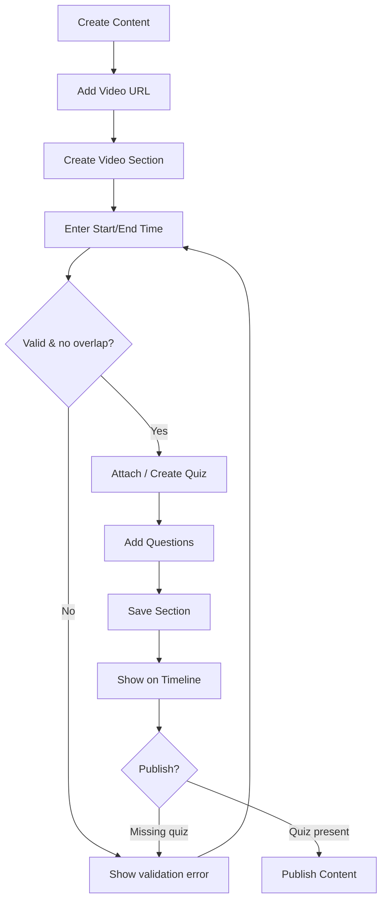
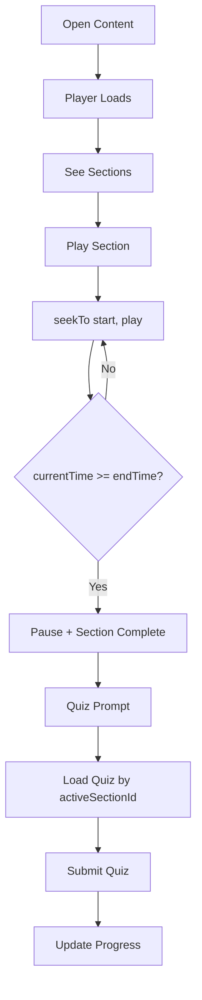
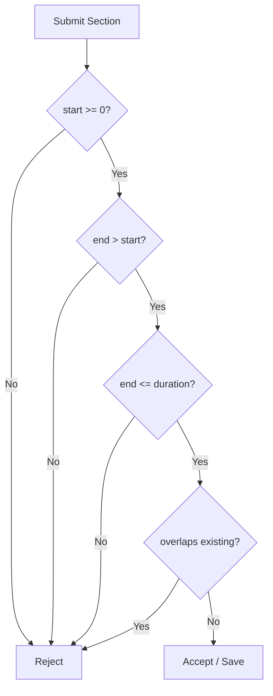
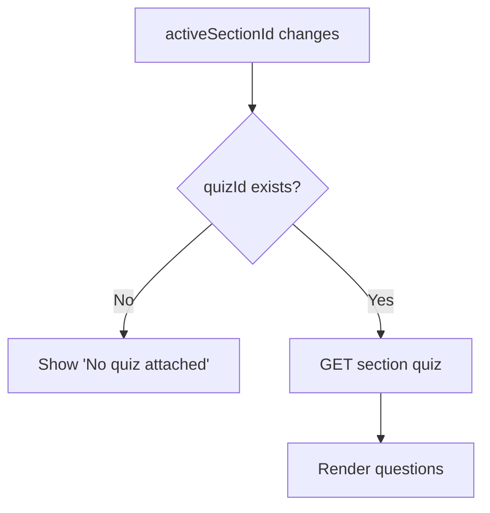
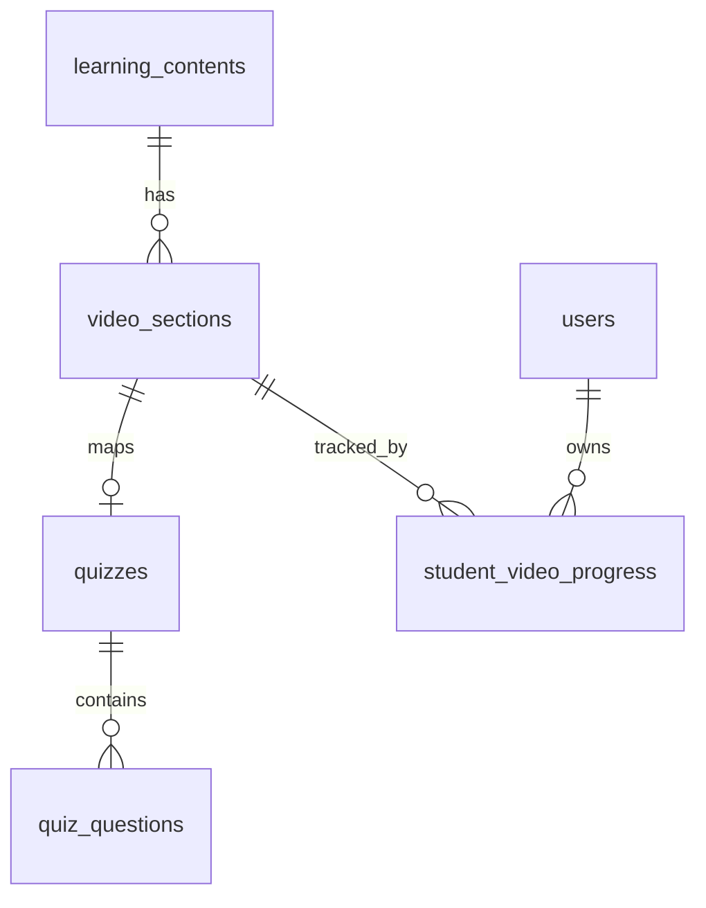

# Video Section Builder with Dynamic Quiz Mapping — Architecture & Spec

Status: Approved for implementation (Phases 1-6). AI generation (Phase 7) deferred.

## 1. Goal

Let content creators split ONE video (YouTube or uploaded) into time-bounded
learning sections. Each section carries metadata, an optional single quiz, and
drives a student watch → quiz → progress loop. No media is ever physically cut;
playback is bounded by `seekTo(start)` + monitor-and-pause at `end`.

## 2. How this fits the existing codebase (extend, don't reinvent)

- Backend: microservices (Express + Zod + PostgreSQL, RLS via `organization_id`
  and `app_current_org()`).
  - `content-service` owns `learning_contents` + `learning_content_sections`
    (mounts routers under `/content`, `/bookmarks`; gateway prefixes `/api`).
  - `quiz-service` owns `quizzes` + `quiz_questions`.
  - `topic-service` owns topic ↔ content/quiz mappings.
- Frontend: Expo v54 + expo-router. Create Content lives in
  `frontend/src/components/manage/ContentTab.tsx` (hosted by `app/(tabs)/manage.tsx`).
  Student playback is `frontend/src/components/subject/StudentContentViewer.tsx`.
  YouTube: `<iframe>` on web, `react-native-youtube-iframe` on native. Uploaded:
  `<video>` on web, `expo-av` `Video` on native.

Existing `learning_content_sections` already carries exactly one `quiz_id` per
section — so "one quiz per section" is an established pattern we mirror.

## 3. Data-model decision (recommended: dedicated table)

We add a dedicated `video_sections` table rather than extending
`learning_content_sections`, because:

- `learning_content_sections` models distinct media items (each its own
  url/type). Video sections are time-slices of ONE video sharing a source URL —
  semantically different.
- Rich per-segment fields (learning_objective, age_group, difficulty, status)
  would bloat the shared table.
- Time-range overlap is enforceable natively with a Postgres
  `EXCLUDE USING gist` constraint that only makes sense on a dedicated table.
- Progress rows get a clean FK to a stable, purpose-built table.

## 4. Database schema (migration `0022_video_sections.sql`)

Follows the repo conventions (UUID `gen_random_uuid()`, `organization_id` FK,
RLS with `app_current_org()`, `IF NOT EXISTS`, `BEGIN/COMMIT`).

```sql
BEGIN;
CREATE EXTENSION IF NOT EXISTS btree_gist;

CREATE TABLE IF NOT EXISTS video_sections (
  id UUID PRIMARY KEY DEFAULT gen_random_uuid(),
  content_id UUID REFERENCES learning_contents(id) ON DELETE CASCADE NOT NULL,
  organization_id UUID REFERENCES organizations(id) ON DELETE CASCADE NOT NULL,
  title VARCHAR(255) NOT NULL,
  description TEXT,
  start_time INTEGER NOT NULL CHECK (start_time >= 0),
  end_time INTEGER NOT NULL,
  learning_objective TEXT,
  age_group VARCHAR(10) CHECK (age_group IN ('5-10','11-14','15-18')),
  category VARCHAR(120),
  difficulty VARCHAR(10) CHECK (difficulty IN ('easy','medium','hard')),
  quiz_id UUID REFERENCES quizzes(id) ON DELETE SET NULL,
  status VARCHAR(12) NOT NULL DEFAULT 'draft'
    CHECK (status IN ('draft','ready','published')),
  section_order INTEGER NOT NULL DEFAULT 0,
  created_at TIMESTAMP DEFAULT NOW(),
  updated_at TIMESTAMP DEFAULT NOW(),
  CHECK (end_time > start_time),
  -- Rule 6: a quiz maps to only ONE section
  UNIQUE (quiz_id),
  -- Rule 4: no overlapping ranges within the same content
  EXCLUDE USING gist (
    content_id WITH =,
    int4range(start_time, end_time) WITH &&
  )
);

CREATE TABLE IF NOT EXISTS student_video_progress (
  id UUID PRIMARY KEY DEFAULT gen_random_uuid(),
  student_id UUID REFERENCES users(id) ON DELETE CASCADE NOT NULL,
  content_id UUID REFERENCES learning_contents(id) ON DELETE CASCADE NOT NULL,
  section_id UUID REFERENCES video_sections(id) ON DELETE CASCADE NOT NULL,
  organization_id UUID REFERENCES organizations(id) ON DELETE CASCADE NOT NULL,
  video_watch_status VARCHAR(12) NOT NULL DEFAULT 'not_started'
    CHECK (video_watch_status IN ('not_started','in_progress','completed')),
  quiz_status VARCHAR(12) NOT NULL DEFAULT 'not_started'
    CHECK (quiz_status IN ('not_started','in_progress','completed')),
  watched_seconds INTEGER NOT NULL DEFAULT 0,
  quiz_score INTEGER,
  completed_at TIMESTAMP,
  created_at TIMESTAMP DEFAULT NOW(),
  updated_at TIMESTAMP DEFAULT NOW(),
  UNIQUE (student_id, section_id)
);

CREATE INDEX IF NOT EXISTS idx_video_sections_content ON video_sections(content_id, section_order);
CREATE INDEX IF NOT EXISTS idx_video_sections_org ON video_sections(organization_id);
CREATE INDEX IF NOT EXISTS idx_svp_student ON student_video_progress(student_id, content_id);
CREATE INDEX IF NOT EXISTS idx_svp_section ON student_video_progress(section_id);

-- RLS (standard org policy, matching 0004/0009/0021)
ALTER TABLE video_sections ENABLE ROW LEVEL SECURITY;
CREATE POLICY video_sections_tenant_select ON video_sections FOR SELECT
  USING (app_current_org() IS NULL OR organization_id = app_current_org());
CREATE POLICY video_sections_tenant_modify ON video_sections FOR ALL
  USING (app_current_org() IS NULL OR organization_id = app_current_org())
  WITH CHECK (app_current_org() IS NULL OR organization_id = app_current_org());

ALTER TABLE student_video_progress ENABLE ROW LEVEL SECURITY;
CREATE POLICY svp_tenant_select ON student_video_progress FOR SELECT
  USING (app_current_org() IS NULL OR organization_id = app_current_org());
CREATE POLICY svp_tenant_modify ON student_video_progress FOR ALL
  USING (app_current_org() IS NULL OR organization_id = app_current_org())
  WITH CHECK (app_current_org() IS NULL OR organization_id = app_current_org());
COMMIT;
```

DB rules satisfied: (1) `end_time > start_time` CHECK, (2) `duration = end-start`
computed, not stored, (3) overlap EXCLUDE, (4) unique `quiz_id`, (5) section FK to
content via `content_id`.

## 5. TypeScript interfaces (`frontend/src/types/videoContent.ts`)

```ts
export type VideoType = 'youtube' | 'uploaded';
export type SectionStatus = 'draft' | 'ready' | 'published';
export type AgeGroup = '5-10' | '11-14' | '15-18';
export type Difficulty = 'easy' | 'medium' | 'hard';
export type WatchStatus = 'not_started' | 'in_progress' | 'completed';

export interface VideoSection {
  id: string;
  contentId: string;
  title: string;
  description?: string;
  startTime: number;      // seconds
  endTime: number;        // seconds
  duration: number;       // derived endTime - startTime
  learningObjective?: string;
  ageGroup?: AgeGroup;
  category?: string;
  difficulty?: Difficulty;
  quizId?: string;
  status: SectionStatus;
  sectionOrder: number;
  createdAt: string;
  updatedAt: string;
}

export interface VideoContent {
  id: string;
  title: string;
  description?: string;
  videoType: VideoType;
  videoUrl: string;
  youtubeVideoId?: string;
  duration: number;
  sections: VideoSection[];
  status: 'draft' | 'published';
}

export interface StudentVideoProgress {
  id: string;
  studentId: string;
  contentId: string;
  sectionId: string;
  videoWatchStatus: WatchStatus;
  quizStatus: WatchStatus;
  watchedSeconds: number;
  quizScore?: number;
  completedAt?: string;
}
```

Quiz/Question reuse the existing `quizzes`/`quiz_questions` shapes and the
`QuestionEditor` types already in `frontend/src/components/quiz/`.

## 6. Start/End playback mechanism (core design)

No cutting. A single shared hook owns the timing; two thin players adapt it.

`frontend/src/components/player/useVideoSectionPlayback.ts`
```
useVideoSectionPlayback({ startTime, endTime, onSectionEnd })
  → seekTo(startTime) on load
  → tick (poll getCurrentTime every ~300ms, or timeupdate/onStateChange)
  → if currentTime >= endTime: pause(); fire onSectionEnd()  // -> quiz prompt
```

- YouTube web: switch bare `<iframe>` to the IFrame Player API
  (`?enablejsapi=1&start=<s>&end=<e>&rel=0`), use `player.seekTo`,
  `player.getCurrentTime`, `player.playVideo`, `player.pauseVideo`, `onStateChange`.
  The `end` URL param is a safety net; polling triggers the quiz UI precisely.
- YouTube native: `react-native-youtube-iframe` with `initialPlayerParams={{start,end}}`,
  ref `getCurrentTime()`/`seekTo()`, `onChangeState`.
- Uploaded web/native: `<video>` / `expo-av` `Video`; set position to `startTime`,
  pause on `timeupdate`/`onPlaybackStatusUpdate` when `>= endTime`.

## 7. Validation

`frontend/src/utils/timeUtils.ts`
- `parseTime(input): number` — accepts `HH:MM:SS`, `MM:SS`, or raw seconds.
- `formatTime(seconds): string` — canonical `HH:MM:SS`/`MM:SS`.

`frontend/src/utils/sectionValidation.ts`
```ts
export function isOverlapping(newStart, newEnd, existing, ignoreId?) {
  for (const s of existing) {
    if (ignoreId && s.id === ignoreId) continue;
    if (newStart < s.endTime && newEnd > s.startTime) {
      return { isValid: false, reason: `Selected time overlaps with "${s.title}"` };
    }
  }
  return { isValid: true };
}
```
Rules enforced client + server:
1. `start >= 0`; 2. `end > start`; 3. `end <= videoDuration`; 4. no overlap;
5. exact range reuse blocked (subset of overlap); 6. quiz maps to one section
(unique constraint + API check); 7. save w/o quiz allowed as draft, publish
requires quiz; 8. publish requires quiz to have >= 1 question.

## 8. Backend API

content-service (new `routes/video-sections.ts`, repo `video-sections.repository.ts`):
- `POST   /api/content/:contentId/video-sections` — create (validates time + overlap).
- `GET    /api/content/:contentId/video-sections` — list ordered.
- `PATCH  /api/video-sections/:sectionId` — edit.
- `DELETE /api/video-sections/:sectionId` — delete.
- `POST   /api/video-sections/:sectionId/quiz` — attach (reject if quiz already mapped).
- `GET    /api/video-sections/:sectionId/quiz` — quiz for active section.
- `POST   /api/students/:studentId/video-progress` — upsert progress.
- `GET    /api/content/:contentId/video-progress` — teacher dashboard aggregate.

quiz-service:
- `POST /api/video-sections/:sectionId/quiz/submit` — grade + write progress/attempt.

All mounted with `requireAuth` + tenant context; creator routes gated by
`canManageTeacherContent`, publish by `canPublishGlobalResources`.

## 9. Frontend components (mapped to Expo structure)

```
frontend/src/
  types/videoContent.ts
  utils/timeUtils.ts, sectionValidation.ts, youtubeUtils.ts
  components/
    content/                # creator, invoked from ContentTab.tsx
      CreateVideoSectionButton.tsx
      VideoSectionModal.tsx
      VideoSectionList.tsx
      VideoSectionCard.tsx
      VideoSectionTimeline.tsx
      QuizAttachPanel.tsx
      SectionValidationMessage.tsx
    player/
      useVideoSectionPlayback.ts
      DynamicVideoPlayer.tsx
      YouTubeSectionPlayer.tsx
      UploadedVideoSectionPlayer.tsx
      SectionEndQuizPrompt.tsx
    student/
      StudentVideoLearningView.tsx
      DynamicQuizPanel.tsx
      StudentSectionProgress.tsx
    dashboard/
      TeacherVideoProgressDashboard.tsx
      SectionCompletionSummary.tsx
  api/videoSections.ts       # client wrappers (matches existing api util style)
```
Reuse: `QuestionEditor` (quiz building), `QuizRenderer` (student quiz).

Timeline colors: draft=gray, ready=blue, published=green, missing-quiz=orange,
overlap-error=red, student-completed=green check.

## 10. Workflows

Creator: add video URL → Create Video Section → enter start/end → validate →
attach/create quiz + questions → save section (draft/ready) → preview → publish.

Student: open content → player loads → see sections → play a section → auto-stop
at end → prompt "You completed this section. Take the quiz." (Start Quiz /
Replay) → quiz loads by activeSectionId → submit → progress updated → resume/next.

Dynamic quiz rule: quiz panel keys off `activeSectionId`. On change, reload quiz;
if none → "No quiz attached for this section."

## 11. Teacher dashboard

Per content: total sections, published sections, sections with/without quiz,
student completion %, quiz average score, students pending quiz, students failed,
students requiring intervention (fail + low completion).

## 12. Edge cases

Invalid YouTube URL; duration unavailable (defer end validation until
`onReady`/`getDuration`); start ≥ end; end > duration; overlap; quiz already
mapped; deleted quiz (`ON DELETE SET NULL` → section reverts to draft); deleted
section (cascade progress); student closes early (persist `in_progress` +
`watched_seconds`); replay (reset watch to start, keep quiz status); network
failure (retry + optimistic UI); autoplay blocked (show manual Play + muted
fallback).

## 13. Mermaid diagrams

### Content creator flow


### Student video learning flow


### Section validation flow


### Dynamic quiz loading flow


### Database relationships


## 14. Test cases (representative)

- timeUtils: `parseTime('00:01:30')=90`, `parseTime('01:30')=90`, `parseTime('90')=90`.
- overlap: A[0,120] + B[90,180] → reject; A[0,120] + B[120,240] → allow.
- quiz mapping: attach quiz-001 to section-2 when already on section-1 → reject.
- publish gate: publish without quiz → reject; quiz with 0 questions → reject.
- player: at `currentTime >= endTime` → paused + prompt shown once.
- progress: submit quiz → `quiz_status=completed`, `quiz_score` persisted.
- API: create section beyond video duration → 400 with reason.

## 15. Implementation plan

- Phase 1: migration + manual section CRUD (backend + creator UI).
- Phase 2: attach quiz manually (reuse QuestionEditor).
- Phase 3: DynamicVideoPlayer + useVideoSectionPlayback (YouTube + uploaded).
- Phase 4: DynamicQuizPanel keyed on activeSectionId.
- Phase 5: student progress tracking + submit.
- Phase 6: teacher dashboard.
- Phase 7 (deferred): AI quiz generation from transcript.
