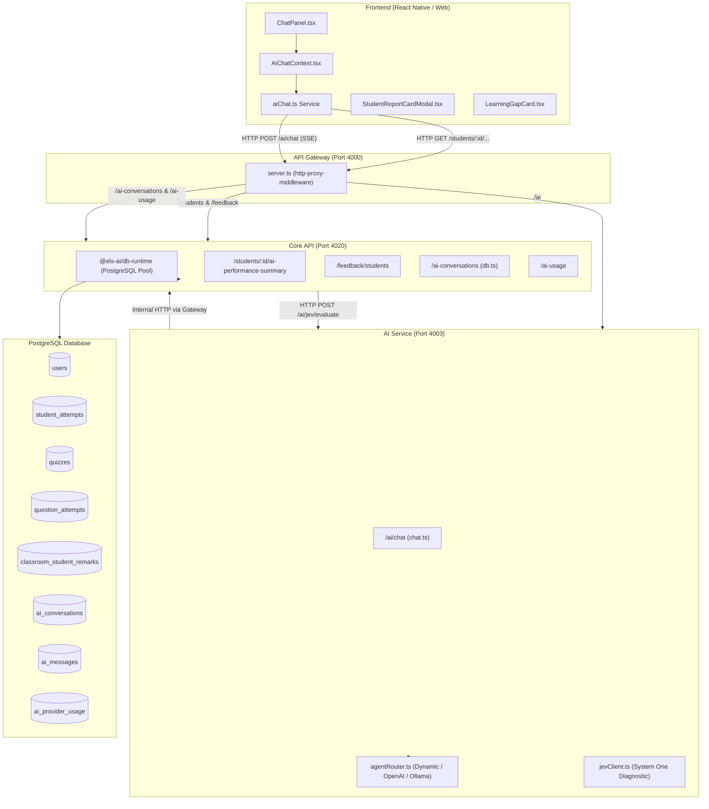

# Student Report & AI Chatbot Architecture: Database Connection & Execution Flow

This document details how the AI Chatbot connects to the database, the step-by-step lifecycle of generating student reports, the tools/services involved, and the complete data flow.

---

## 1. High-Level Architecture & DB Connection Topology

The system uses a decoupled, microservice-based architecture orchestrated by an API Gateway:



### Key DB Connection Concept:
- **`backend/core-api`**: Directly connects to the **PostgreSQL** database via `@els-ai/db-runtime` (`db.query`). It is the source of truth for student performance, quiz attempts, question attempts, remarks, and chat persistence.
- **`backend/ai-service`**: **Does NOT maintain a direct DB connection**. Instead, it interacts with the database indirectly:
  1. Receives verified database metrics injected via request payload (`studentContext`).
  2. Persists chat sessions and audit logs by making internal HTTP requests back to `core-api` (`/ai-conversations` and `/ai-usage`) via the Gateway.

---

## 2. Database Tables Involved in Student Reports & Chat

| Table Name | File Reference | Purpose |
| :--- | :--- | :--- |
| `users` | [students.ts](file:///home/dhruv/work-dhruv/hph/els-ai/els-ai/backend/core-api/src/services/auth/routes/students.ts#L598-L608) | Retrieves student profile (name, grade level, email, profile image). |
| `student_attempts` & `quizzes` | [students.ts](file:///home/dhruv/work-dhruv/hph/els-ai/els-ai/backend/core-api/src/services/auth/routes/students.ts#L612-L658) | Computes total quizzes attempted, overall accuracy %, best quiz, and 3 lowest quizzes. |
| `question_attempts` & `quiz_questions` | [students.ts](file:///home/dhruv/work-dhruv/hph/els-ai/els-ai/backend/core-api/src/services/auth/routes/students.ts#L661-L680) | Identifies recurring error patterns and top 5 missed questions/concepts. |
| `classroom_student_remarks` | [students.ts](file:///home/dhruv/work-dhruv/hph/els-ai/els-ai/backend/core-api/src/services/auth/routes/students.ts#L682-L697) | Retrieves the latest teacher remarks and evaluation categories. |
| `ai_conversations` | [db.ts](file:///home/dhruv/work-dhruv/hph/els-ai/els-ai/backend/core-api/src/services/aichat/db.ts#L7-L20) | Stores chat sessions, user role, title, and timestamps. |
| `ai_messages` | [db.ts](file:///home/dhruv/work-dhruv/hph/els-ai/els-ai/backend/core-api/src/services/aichat/db.ts#L21-L30) | Stores individual chat messages (`user` or `assistant`), linked to conversations. |
| `ai_provider_usage` | [db.ts](file:///home/dhruv/work-dhruv/hph/els-ai/els-ai/backend/core-api/src/services/aichat/db.ts#L35-L51) | Audits LLM provider usage, token counts, latency, and success/failure. |

---

## 3. End-to-End Step-by-Step Flow

### Phase 1: Student Search & Selection
1. **User action**: In the Chatbot UI ([ChatPanel.tsx](file:///home/dhruv/work-dhruv/hph/els-ai/els-ai/frontend/src/components/chat/ChatPanel.tsx)), the user opens the student picker and enters a name.
2. **API Call**:
   ```http
   GET /feedback/students?query=<name>&limit=12
   ```
   Routed: `Frontend` → `Gateway (4000)` → `Core API (4020)` → DB `users` table.
3. **Selection**: User taps a student card.

---

### Phase 2: Fetching Verified DB Metrics & Diagnostic Synthesis
1. **API Call**: [ChatPanel.tsx](file:///home/dhruv/work-dhruv/hph/els-ai/els-ai/frontend/src/components/chat/ChatPanel.tsx#L420-L432) invokes `fetchStudentPerformanceSummary(apiFetch, studentId)`:
   ```http
   GET /students/:studentId/ai-performance-summary
   Authorization: Bearer <token>
   ```
2. **Core API Processing** ([students.ts](file:///home/dhruv/work-dhruv/hph/els-ai/els-ai/backend/core-api/src/services/auth/routes/students.ts#L574-L770)):
   - **Permission Check**: Verifies caller is a teacher, admin, superadmin, student self, or linked parent.
   - **PostgreSQL Queries**:
     - Fetches user details from `users`.
     - Fetches and sorts last 50 quiz attempts from `student_attempts JOIN quizzes`. Calculates average accuracy %, identifies best quiz and lowest 3 quizzes.
     - Fetches top 5 missed questions from `question_attempts qa JOIN student_attempts sa LEFT JOIN quiz_questions qq WHERE qa.is_correct = false`.
     - Fetches latest 3 remarks from `classroom_student_remarks`.
   - **Cognitive Diagnostic Evaluation**:
     - Makes internal request to `AI Service`: `POST /ai/jev/evaluate` ([jevClient.ts](file:///home/dhruv/work-dhruv/hph/els-ai/els-ai/backend/ai-service/src/services/jevClient.ts)).
     - If JEV fails or is unconfigured, applies deterministic heuristic fallback based on accuracy thresholds:
       - `masteryTier`: "High Mastery" (≥80%), "Steady Progress" (≥65%), "Needs Targeted Support" (≥50%), "Critical Intervention Required" (<50%).
       - `riskScore`: 0 to 3 scale.
       - `primaryWeakDomain`: Most frequently missed question concept.
       - `recommendedIntervention`: Remedial quiz or enrichment practice.
3. **Response Received by Frontend**:
   Returns structured `StudentPerformanceSummaryData` containing `student`, `metrics`, and `jevDiagnosis`.
4. **UI Update**:
   - Displays Student badge in Chat Header (`Avg X% • Mastery Tier`).
   - Activates contextual Student Action Chips:
     - `📄 View official report card for [Name]`
     - `Summarize [Name]'s verified DB performance report`
     - `What are [Name]'s weak areas and learning gaps?`
     - `Show [Name]'s best performed quiz & strengths`
     - `What is the recommended intervention plan for [Name]?`
     - `Draft a remedial practice quiz for [Name]`

---

### Phase 3: Generating the Report

There are **two distinct paths** depending on what the user selects:

#### Path A: Zero-Latency Official Report Card Modal
- **Trigger**: User clicks `📄 View official report card for [Name]` or types `"view report card"`.
- **Interception**: [ChatPanel.tsx](file:///home/dhruv/work-dhruv/hph/els-ai/els-ai/frontend/src/components/chat/ChatPanel.tsx#L510-L517) intercepts this locally without sending an LLM message:
  ```typescript
  if (text.toLowerCase().includes('view official report card') || text.toLowerCase().includes('open report card')) {
    setShowReportCardModal(true);
    return;
  }
  ```
- **Rendering**: Directly displays [StudentReportCardModal.tsx](file:///home/dhruv/work-dhruv/hph/els-ai/els-ai/frontend/src/components/chat/StudentReportCardModal.tsx).
- **Features**:
  - Uses the ground-truth DB data already loaded.
  - Shows Academic Standing & Risk Score badge.
  - Lists Best Quiz, Struggling Quizzes, and Missed Concepts.
  - Formats a clean printable/shareable text report with "Copy Report" and "Print Report" buttons.

#### Path B: AI Chat Synthesis & Pedagogical Report
- **Trigger**: User sends `"Summarize [Name]'s verified DB performance report"` or asks an open-ended diagnostic question.
- **Client Action**: [AiChatContext.tsx](file:///home/dhruv/work-dhruv/hph/els-ai/els-ai/frontend/src/context/AiChatContext.tsx#L157-L162) calls `streamChatMessage`:
  ```http
  POST /ai/chat
  Content-Type: application/json
  Authorization: Bearer <token>

  {
    "conversationId": "<uuid | undefined>",
    "message": "Summarize Dhruv's verified DB performance report",
    "studentContext": {
      "student": { ... },
      "metrics": { ... },
      "jevDiagnosis": { ... }
    }
  }
  ```
- **AI Service Execution** ([chat.ts](file:///home/dhruv/work-dhruv/hph/els-ai/els-ai/backend/ai-service/src/routes/chat.ts)):
  1. **Persistence Check**:
     - If no `conversationId`, calls `POST /ai-conversations` on Core API to create one in `ai_conversations`.
     - Loads conversation history from Core API.
     - Appends the user message to `ai_messages` via Core API.
  2. **Prompt Augmentation**:
     - Injects active student DB metrics into the system prompt:
       ```markdown
       ## ACTIVE STUDENT CONTEXT (VERIFIED DB METRICS & DIAGNOSTIC EVALUATION):
       - Student: Dhruv (Grade: 10)
       - Total Quizzes Attempted: 8
       - Overall Average Accuracy: 74%
       - Best Performed Quiz: Photosynthesis Basics (Score: 92%)
       - Lowest Scoring Quizzes: Cellular Respiration (58%)
       - Top Missed Concepts: Krebs Cycle (Missed 3x)
       - Academic Mastery Standing: Steady Progress (Struggle Risk: 1/3)
       - Primary Learning Gap: Cellular Respiration
       - Recommended Action Plan: Assign 5-question remedial quiz
       ```
     - System prompt instructs LLM to ground all statements strictly in these numbers and never hallucinate.
  3. **Multi-Agent Provider Execution** ([router.ts](file:///home/dhruv/work-dhruv/hph/els-ai/els-ai/backend/ai-service/src/agents/router.ts)):
     - Routes the request through the provider chain: Dynamic AI Provider → OpenAI → Local Ollama fallback.
     - Streams Server-Sent Events (`data: {"delta": "..."}`) back through the Gateway to the frontend in real time.
  4. **Structured Card Detection**:
     - If the model generates a `learning_gap_summary` JSON block:
       ```json
       {
         "type": "learning_gap_summary",
         "weak_areas": [{ "title": "Cellular Respiration", "description": "Struggles with ATP yield and Krebs cycle." }],
         "learning_gap": "Confusion between aerobic and anaerobic stages."
       }
       ```
       The frontend renders [LearningGapCard.tsx](file:///home/dhruv/work-dhruv/hph/els-ai/els-ai/frontend/src/components/chat/LearningGapCard.tsx), giving the teacher 1-click buttons to:
       - "View Full Report Card" → Opens [StudentReportCardModal.tsx](file:///home/dhruv/work-dhruv/hph/els-ai/els-ai/frontend/src/components/chat/StudentReportCardModal.tsx).
       - "Draft Practice Quiz" → Automatically prompts the AI to generate a targeted 5-question quiz.
  5. **Post-Processing & Audit**:
     - Assistant reply is persisted to `ai_messages` via Core API.
     - LLM title generation is triggered asynchronously for new threads (`generateLlmTitle`).
     - Token count and latency are audited in `ai_provider_usage` via Core API.

---

## 4. Summary of Tools & Modules Used

| Module / Component | Path | Responsibility |
| :--- | :--- | :--- |
| **ChatPanel** | `frontend/src/components/chat/ChatPanel.tsx` | Main chatbot UI, student selector, quick action chips, message list. |
| **AiChatContext** | `frontend/src/context/AiChatContext.tsx` | State management for conversations, streaming tokens, thinking state. |
| **aiChat Service** | `frontend/src/services/aiChat.ts` | Streaming client (`expo/fetch`), student search & performance fetchers. |
| **StudentReportCardModal** | `frontend/src/components/chat/StudentReportCardModal.tsx` | Visual academic report card modal with copy/print actions. |
| **LearningGapCard** | `frontend/src/components/chat/LearningGapCard.tsx` | Interactive UI widget for diagnosed learning gaps and remedial quiz links. |
| **API Gateway** | `backend/gateway/src/server.ts` | Authenticates JWT, proxies requests to Core API and AI Service. |
| **Students Controller** | `backend/core-api/src/services/auth/routes/students.ts` | Queries PostgreSQL for quizzes, attempts, questions, teacher remarks. |
| **AIChat DB Runtime** | `backend/core-api/src/services/aichat/db.ts` | Schema and queries for `ai_conversations`, `ai_messages`, `ai_provider_usage`. |
| **AI Chat Route** | `backend/ai-service/src/routes/chat.ts` | Grounded prompt construction, SSE streaming, conversation persistence. |
| **Agent Router** | `backend/ai-service/src/agents/router.ts` | Model provider failover (Dynamic / OpenAI / Ollama). |
| **JEV Client** | `backend/ai-service/src/services/jevClient.ts` | Fast System One cognitive diagnostic evaluation engine. |
